# 宜昌最全City Walk路线！本地人推荐！

- 作者: 登登噔噔噔
- 👍5538 · 💬108 · ⭐5898 · 图 15
- feed_id: 68b30124000000001d00d7e9

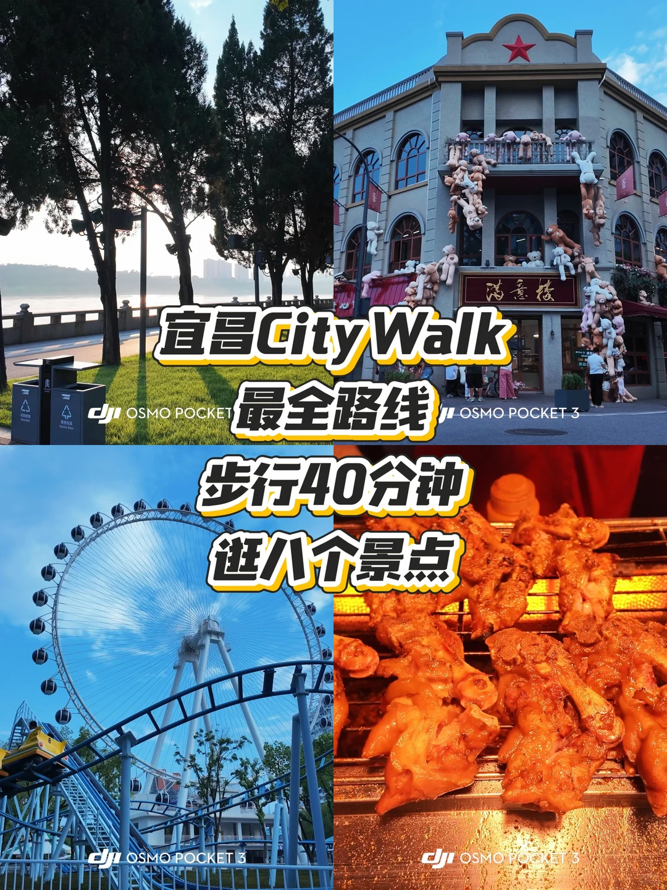
> [OCR] 宜昌City Walk
最全路线
步行40分钟
逛八个景点

DJI OSMO POCKET 3
OSMO POCKET 3
DJI OSMO POCKET 3
DJI OSMO POCKET 3
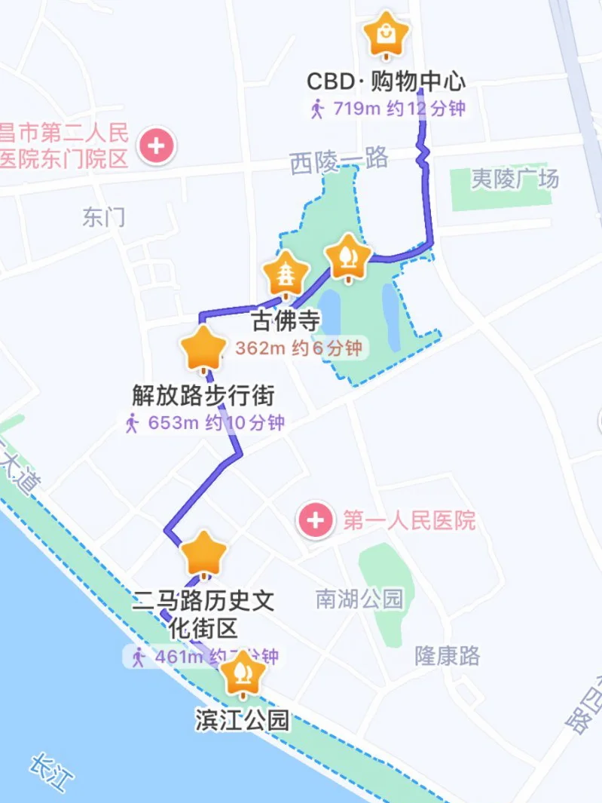
> [OCR] 昌市第二人民医院东门院区
东门
CBD·购物中心
719m 约12分钟
西陵一路
夷陵广场
古佛寺
362m 约6分钟
解放路步行街
653m 约10分钟
第一人民医院
南湖公园
隆康路
二马路历史文化街区
461m 约7分钟
滨江公园
长江
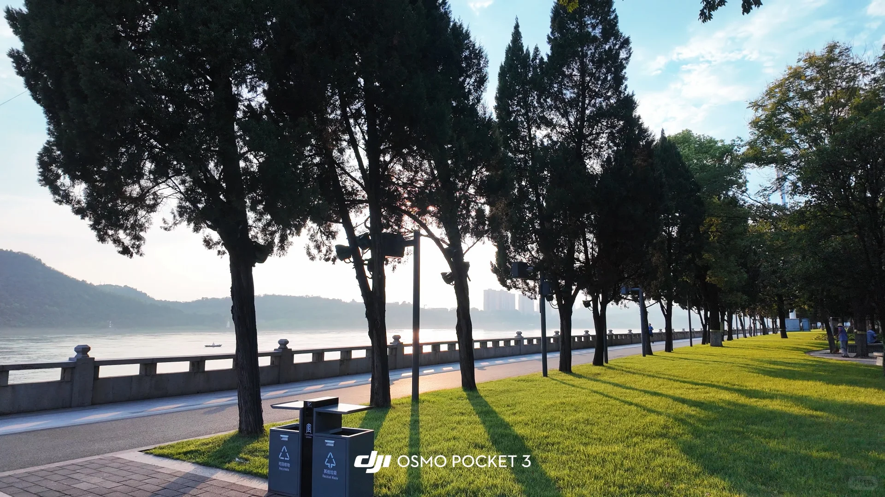
> [OCR] DJI OSMO POCKET 3
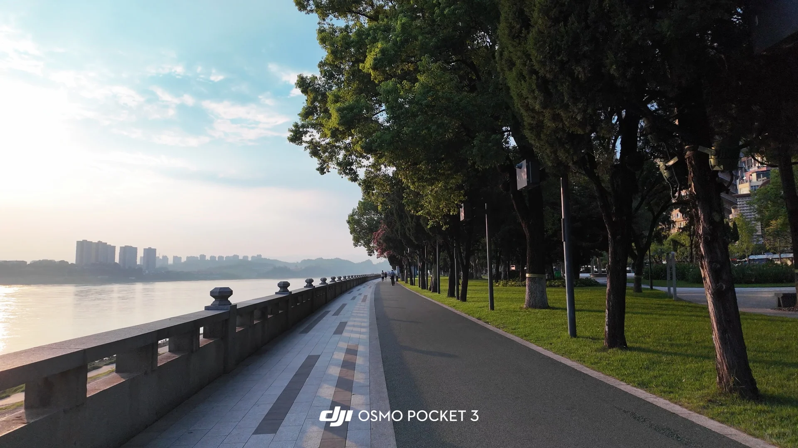
> [OCR] dji OSMO POCKET 3
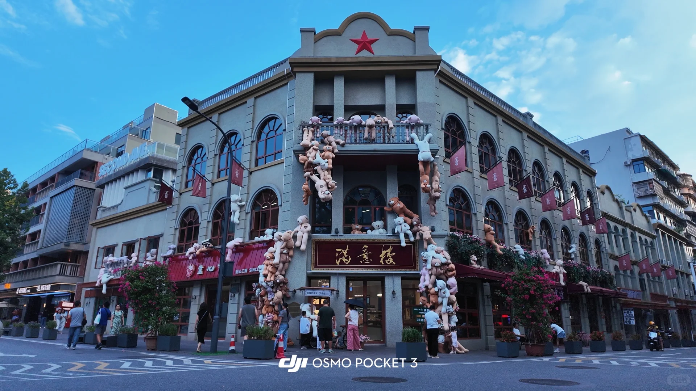
> [OCR] SECOND MILE
满意楼
SINCE
dji OSMO POCKET 3
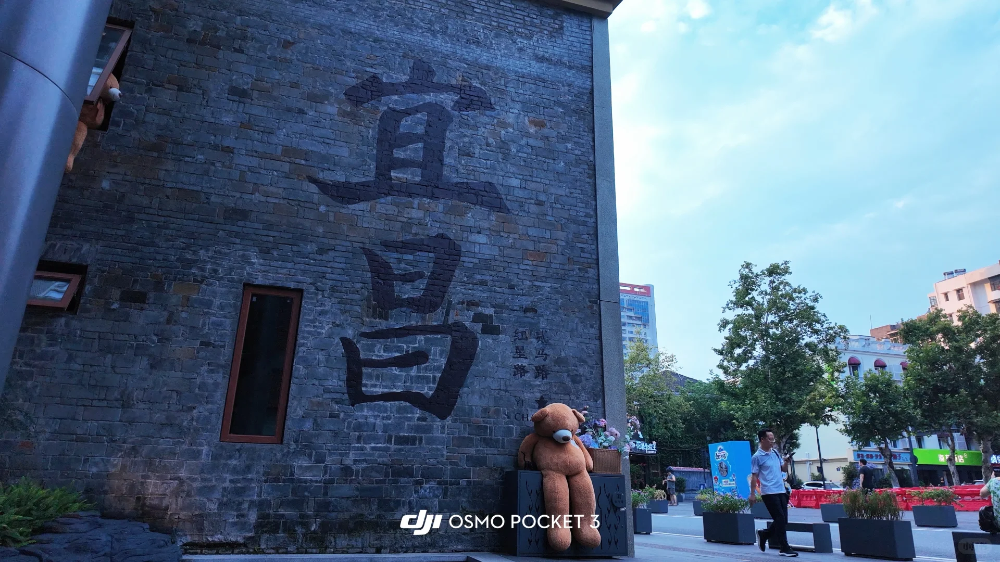
> [OCR] 百尚
DJIOSMOPOCKET3
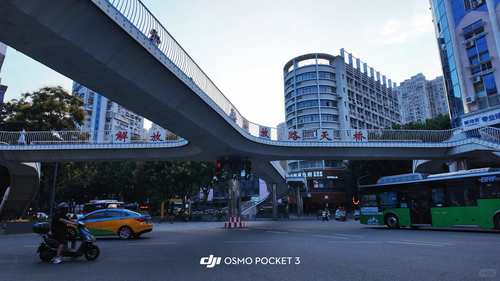
> [OCR] 解放路天桥
DJIOSMOPOCKET3
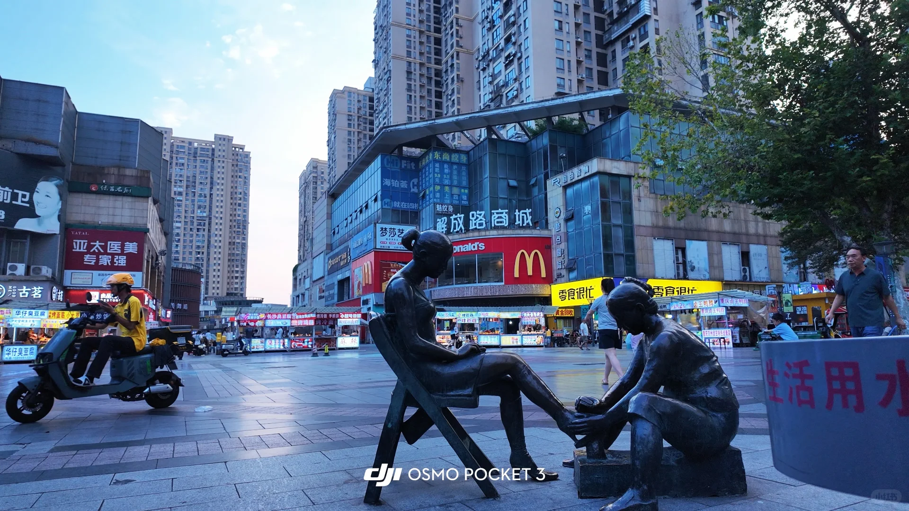
> [OCR] 亚太医美专家强
梦莎艺
解放路商城
McDonald's
零食很忙
生活用水
dji OSMO POCKET 3
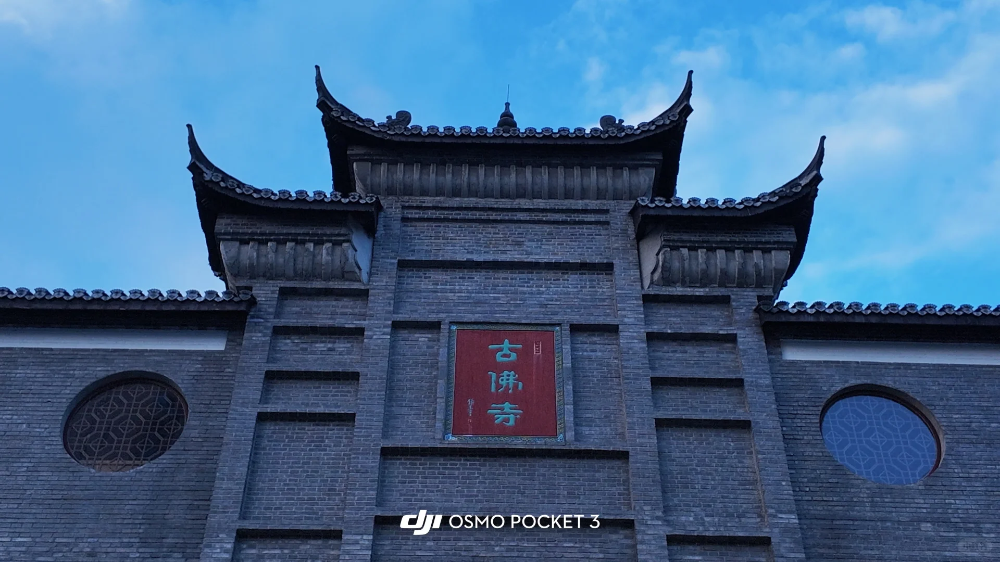
> [OCR] 古佛寺
dji OSMO POCKET 3
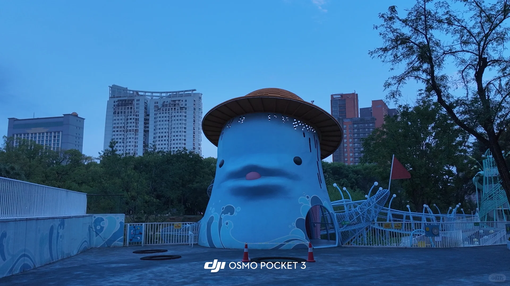
> [OCR] dji OSMO POCKET 3
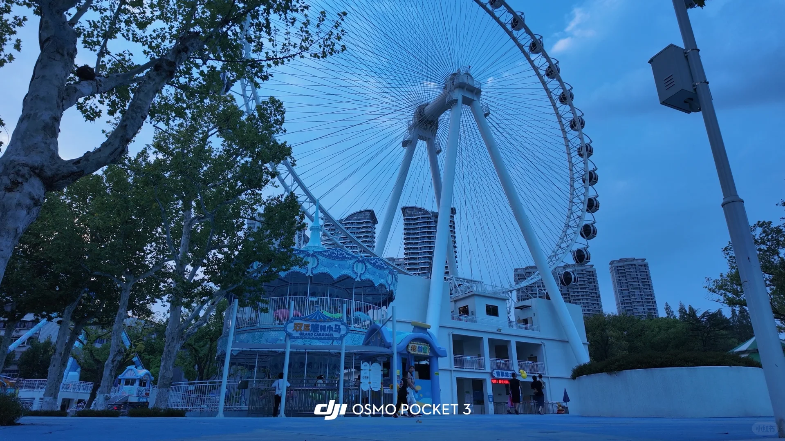
> [OCR] 双层旋转木马
GRAND CAROUSEL
DJI OSMO POCKET 3
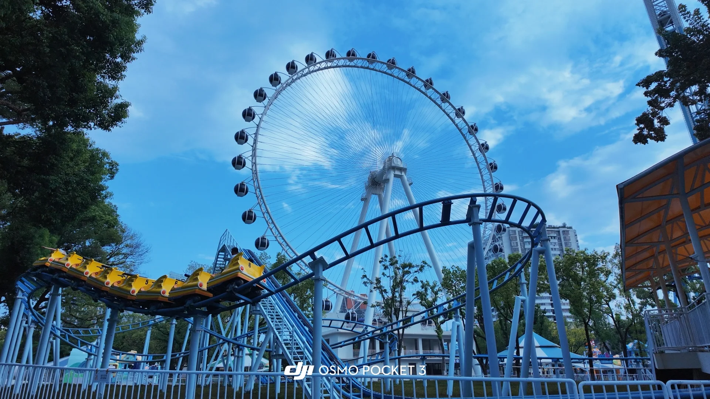
> [OCR] dji OSMO POCKET 3
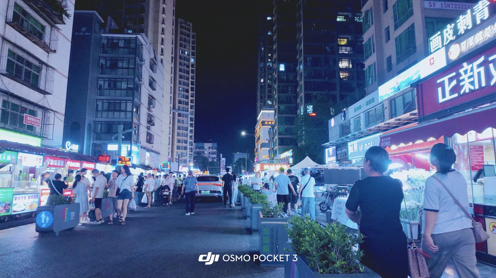
> [OCR] 5F 1587252249
画皮刺青
正新鸡排
dji OSMO POCKET 3
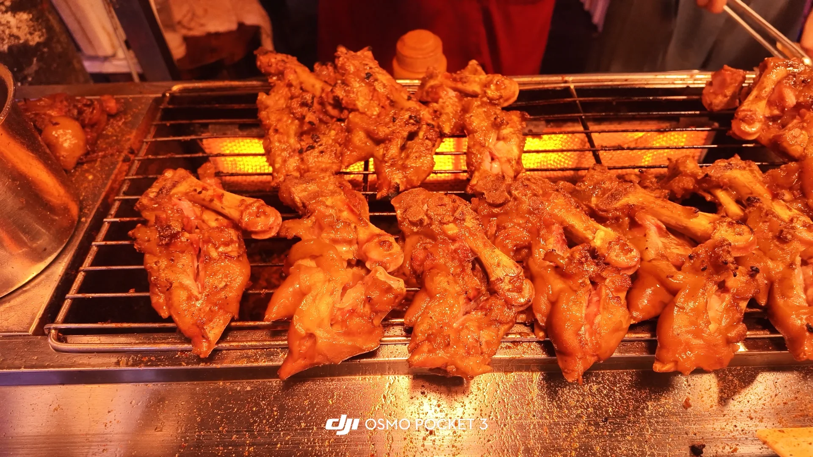
> [OCR] dji OSMO POCKET 3
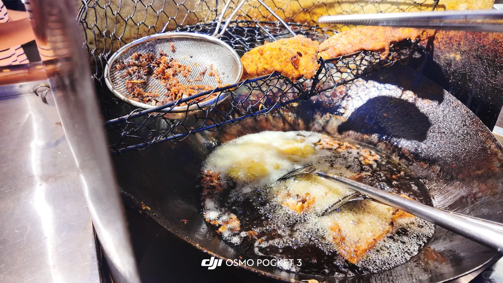
> [OCR] dji OSMO POCKET 3

## 正文
在宜昌市区玩，一定要感受当地人慢节奏的生活状态，吹吹江边的晚风，感受当地人的生活方式，平时工作的劳累都会一扫而散的！！[赞R][赞R][赞R]
路线全程两公里，步行和打卡大约耗时40分钟！夏天建议6点左右到起始点，这个时候比较凉快。觉得路程短的在最后有附加路程！适合体力好的特种兵宝宝[大笑R][大笑R][大笑R]
[一R]滨江公园（P3、P4）：宜昌本地人都在这散步！滨江公园全长24公里[偷笑R][偷笑R][偷笑R]。如果想要在滨江公园多体验的可以扫一辆共享单车，滨江公园有专门的非机动车道，路很平坦，体验很好！如果只是想打卡，可以打车或者坐公交在市政府下车，直接过马路到江边，绿化非常好，嘎嘎出片！可以下步梯到江边，吹吹江边的风[哇R][哇R][哇R]。
[二R]二马路历史文化街区（P5、P6）：导航到满意楼打卡，满意楼始建于民国初期的欧式建筑，在1961年更名为宜昌市满意楼百货商店，现在下面开的是一家甜品店，门口挂了很多毛绒娃娃，非常出片！面对满意楼往左边走，就是P6宜昌地标打卡点，可以在这留下在宜昌的足迹哦[萌萌哒R][萌萌哒R][萌萌哒R]。
[三R]解放路步行街（P7、P8）：解放路步行街是老宜昌最繁华的步行街。到了宜昌解放路步行街如果渴了累了，可以去买一杯王氏凉虾，是很多本地人都会排队喝的健康饮品哦！[派对R][派对R][派对R]
[四R]古佛寺（P9）：是宜昌市内仅存的一座古寺庙建筑。免费对外开放，但是想要进去参观要提前去确认好开门时间哦！好像大多数时候都是不开门的[捂脸R][捂脸R][捂脸R]
[五R]儿童公园（P10、P11、P12）：儿童公园进去是免费的，里面的项目是单独收费的。儿童公园整体配色就是蓝蓝的，拍照片出来直接秒变冷白皮，嘎嘎出片[萌萌哒R][萌萌哒R][萌萌哒R]。
[六R]铁路坝小吃街（P13、P14、P15）：铁路坝小吃街好吃的东西简直太多了！想体验宜昌特色萝卜饺子的推荐易姐萝卜饺子，外面是酥脆的米浆，里面是爆汁的萝卜馅，辣的非常过瘾！周记烤蹄王我宣布是小吃街最好吃的烤猪蹄，外焦里嫩，没有一丝腥味，软软糯糯的，特别好吃！
PS：最后如果觉得行程太短没有走够的高能量宝子们可以在导航到江豚广场，这个时候过去天色也黑了，可以打卡宜昌江边的镇江阁，吹着江边晚风，欣赏宜昌美丽夜景哦！
图片均为大疆Pocket3无滤镜直出！而且相机自带美颜，拍人像也非常合适！宜昌旅游想要租借大疆Pocket3记录生活和拍美美照片到可以联系我哦！[偷笑R][偷笑R][偷笑R]#宜昌旅游攻略[话题]# #citywalk宜昌[话题]# #宜昌美食[话题]# #宜昌旅行[话题]# #你觉得宜昌好玩吗？[PK]#

---