# 宜昌三天两晚详细攻略🌿（非特种兵版）

- 作者: Merryuu
- 👍4703 · 💬191 · ⭐5272 · 图 18
- feed_id: 67f87bb7000000000b01629e

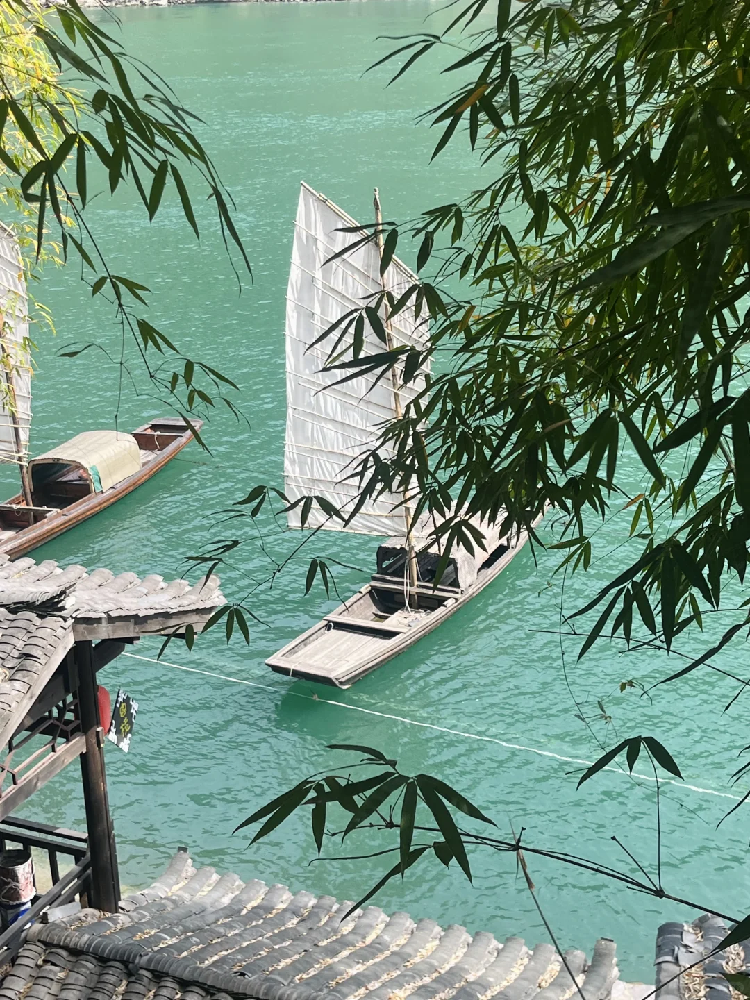
> [OCR] [?]

> [OCR] [?]
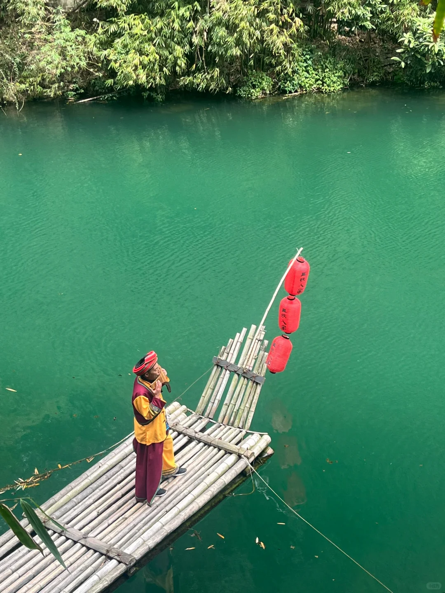
> [OCR] 五溪人家
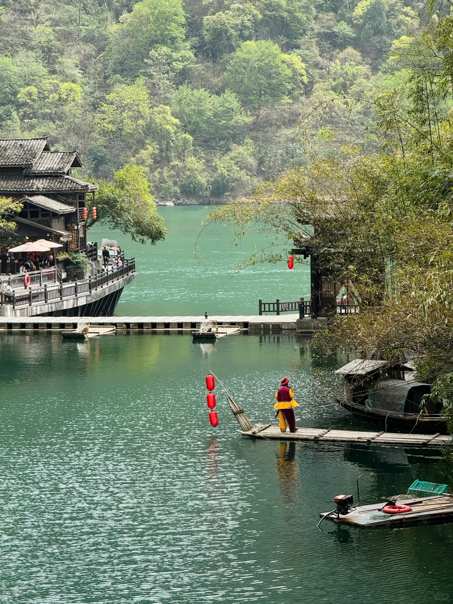
> [OCR] [?]
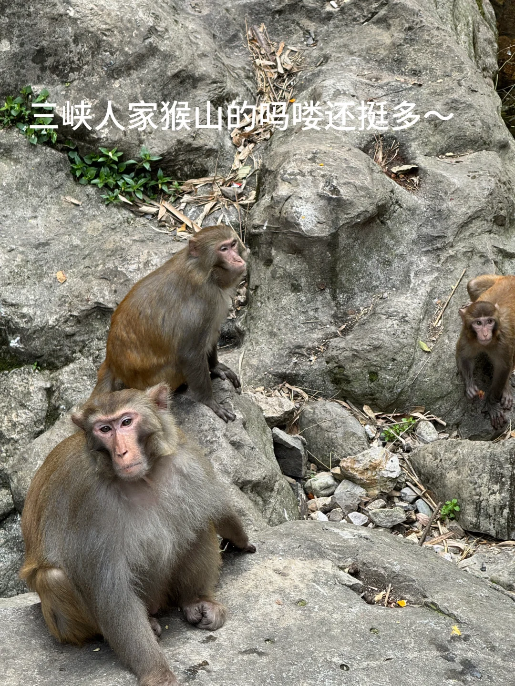
> [OCR] 三峡人家猴山的吗喽还挺多~

> [OCR] [?]

> [OCR] 上?游
下?游
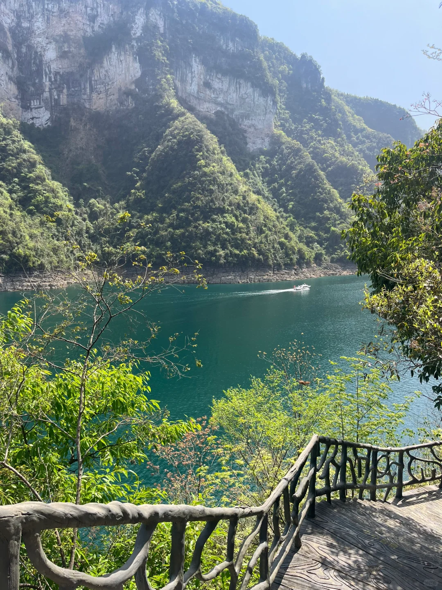
> [OCR] [?]
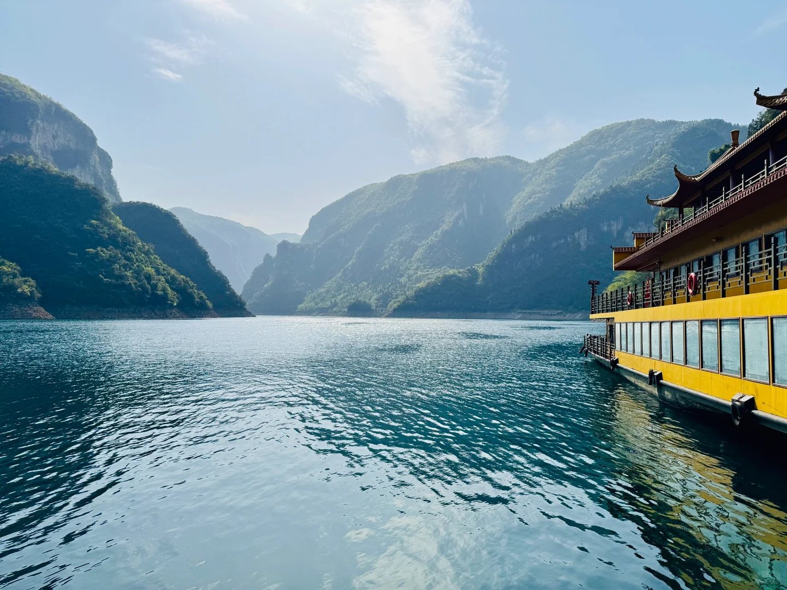
> [OCR] [?]

> [OCR] system
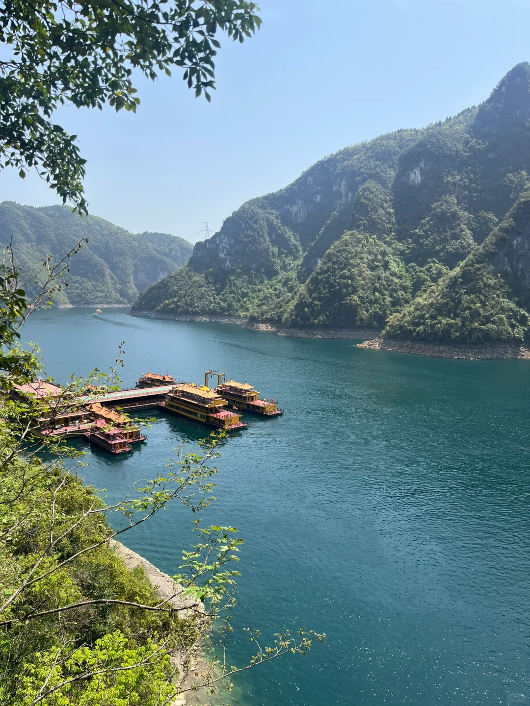
> [OCR] [?]
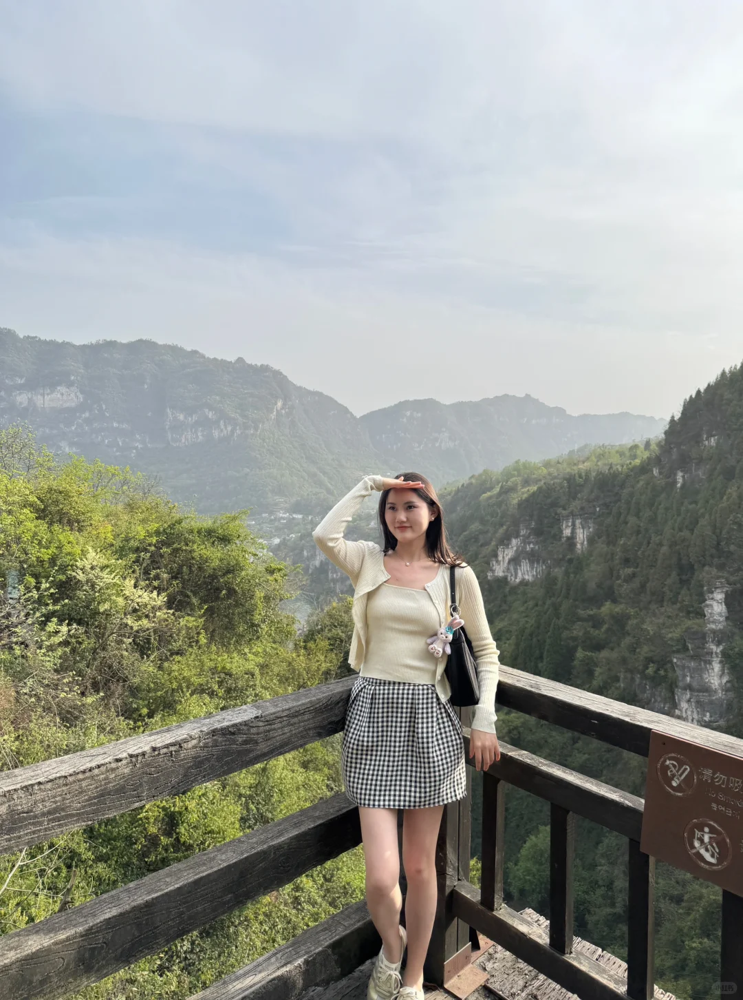
> [OCR] 请勿吸烟
No Smoking
[?]
[?]

> [OCR] [?]

> [OCR] [?]
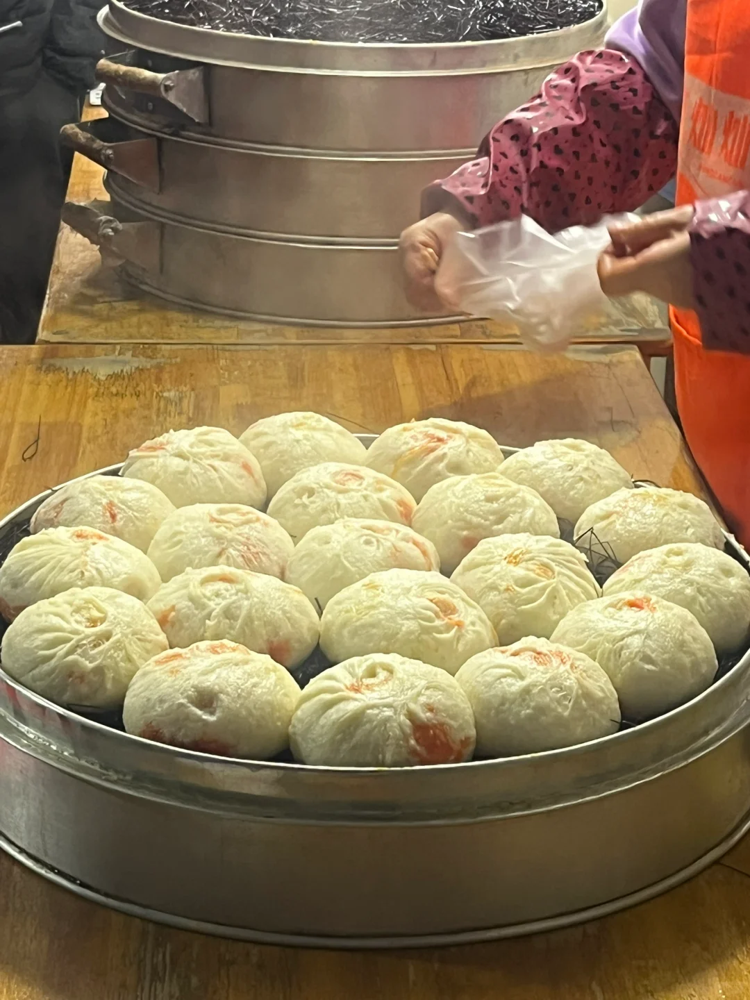
> [OCR] ?[?]
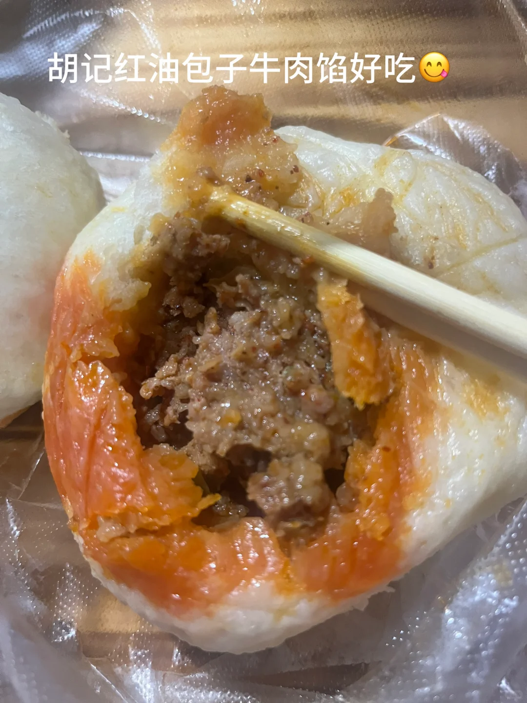
> [OCR] 胡记红油包子牛肉馅好吃😊
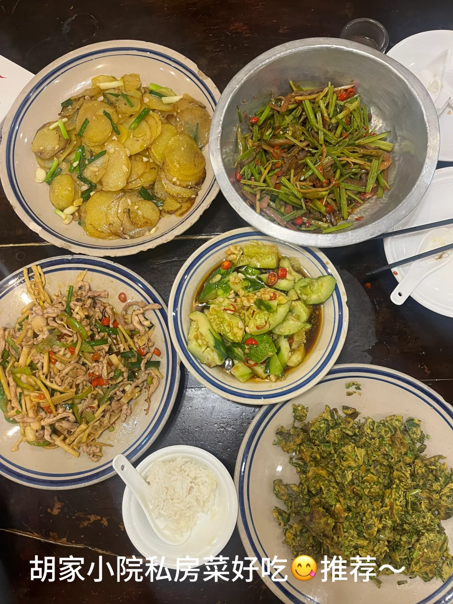
> [OCR] 胡家小院私房菜好吃😊推荐~
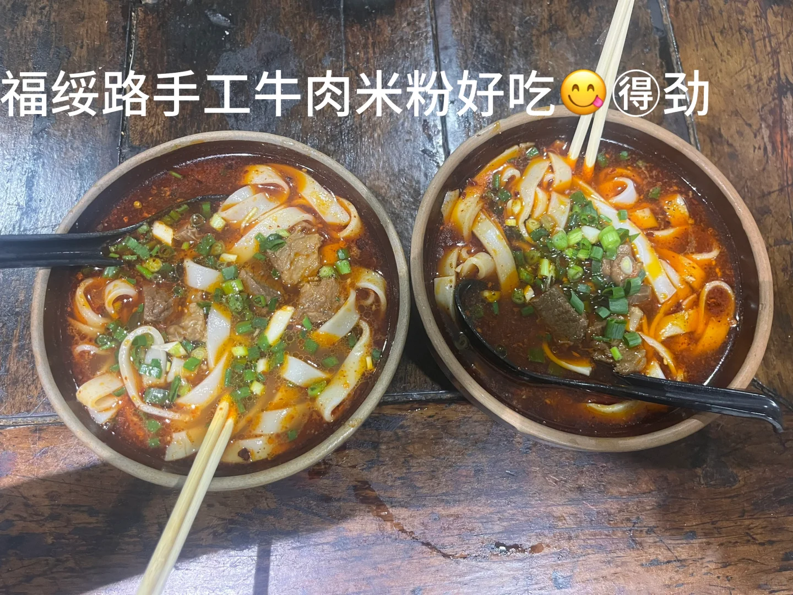
> [OCR] 福绥路手工牛肉米粉好吃😊得劲

## 正文
Day1：市区休闲游～吃吃喝喝逛逛，傍晚滨江公园吹吹风，散散步～体验慢节奏小城生活🎵，因为不想太累，所以市区去的地方不多，主打吃(解放路，福绥路，和滨江边溜达，主要在国贸附近活动～
	
Day2：三峡人家(购票渠道，船进三峡人家，选择船进船出)，早上睡到自然醒，吃饱喝足，打车去黄柏河码头取纸质票(必须带身份证)，登船去往三峡人家景区～三峡人家景区蛮大的，不想累着和特别赶，可以玩一天～景区不走重复路🗺游玩路线：三峡人家—龙进溪—猴山—返回看婚嫁表演—吃午饭—看水上人家表演—坐轮渡去索道码头—索道上山—下山看灯影石—巴王寨—太极猫洞—坐船回黄柏河码头～来回船程分别要1小时左右，个人觉得船内二等座完全够了～
Day3：清江画廊，分为a 线和b 线，a 线基本全程坐船，优点轻松，（适合老人和带小孩子的家庭）缺点容易审美疲劳，b 线先爬山在坐船，缺点需要体力好，优点景色真的很美，可以说是一步一景豪不夸张！此次我们选择的是b线，也就是影画游，喜欢户外且体力不错的朋友们，b线值得，推荐推荐～
三峡人家和清江画廊，如果有时间建议2个都去，时间不够个人更建议清江画廊，觉得清江画廊景色更美！虽然三峡人家也还不错～也挺好看的～清江画廊可能离宜昌市区远，所以人相对少很多，体验感也更好，景区规划也挺nice的～
	
关于住宿：住国贸附近，蛮方便的，吃喝玩乐逛以及去黄柏河码头基本都是不到3公里的距离，除了清江画廊（此景区离宜昌市区1小时左右高速）
关于吃推荐：1.憨哥鱼庄不错(现杀的招牌肥鱼火锅真的不错！) 宜昌必吃红油包子，2.胡记包子，好吃😋(就是买的人太多了[笑哭R]3.方妈面馆，个人感觉还行4.为了不想排队热门网红店浪费时间……高德随机挑选的2家店铺真的有被惊喜到，福绥路手工米粉，他家牛肉米粉真的绝绝子，好吃🉐劲儿～还有一家私房菜馆，估计只有宜昌本地人才知道这家～胡家小院，好吃😋，环境也挺舒适，每道菜都是现做的，家里的味道～价格还相当实惠～喜欢，是以后有机会再去宜昌会再去的两家店！……
宜昌市区好吃好安逸，景区好山好水好废腿～没去过的朋友们天气好值得去～#宜昌[话题]# #三峡人家[话题]# #清江画廊[话题]# #宜昌美食[话题]# #宜昌探店[话题]# #宜昌旅游[话题]# #宜昌旅游攻略[话题]# #宜昌旅行[话题]# #小众旅游景点[话题]# #宜昌红油包子[话题]#

---