# 宜昌只带好朋友去的15家店（无广合集

- 作者: 宜昌开心市民小洁
- 👍2922 · 💬91 · ⭐2657 · 图 16
- feed_id: 68d4eab60000000013028202

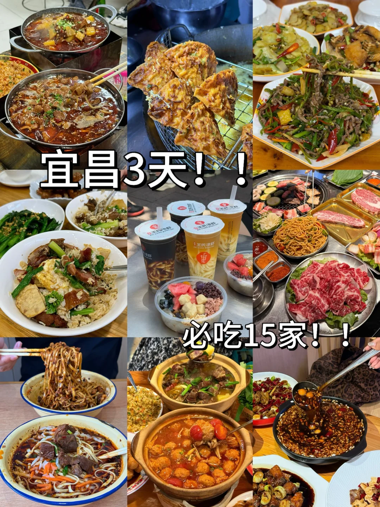
> [OCR] 宜昌3天！
必吃15家！！
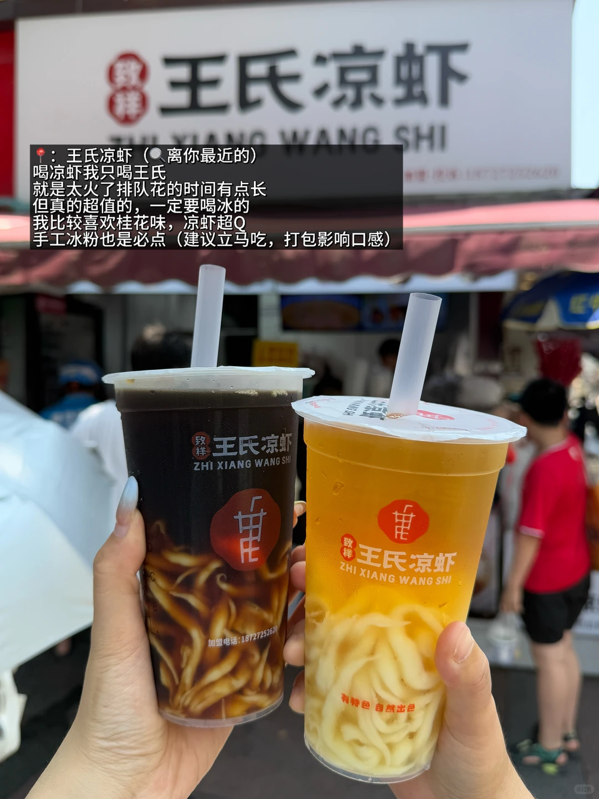
> [OCR] 王氏凉虾
ZHI XIANG WANG SHI

：王氏凉虾（离你最近的）
喝凉虾我只喝王氏
就是太火了排队花的时间有点长
但真的超值的，一定要喝冰的
我比较喜欢桂花味，凉虾超Q
手工冰粉也是必点（建议立马吃，打包影响口感）
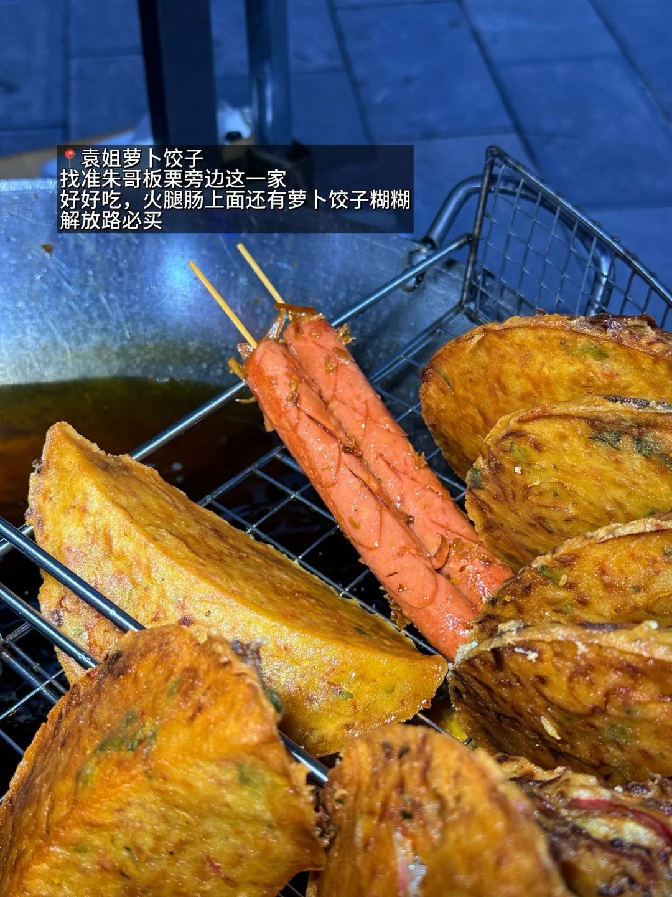
> [OCR] 袁姐萝卜饺子
找准朱哥板栗旁边这一家
好好吃，火腿肠上面还有萝卜饺子糊糊
解放路必买
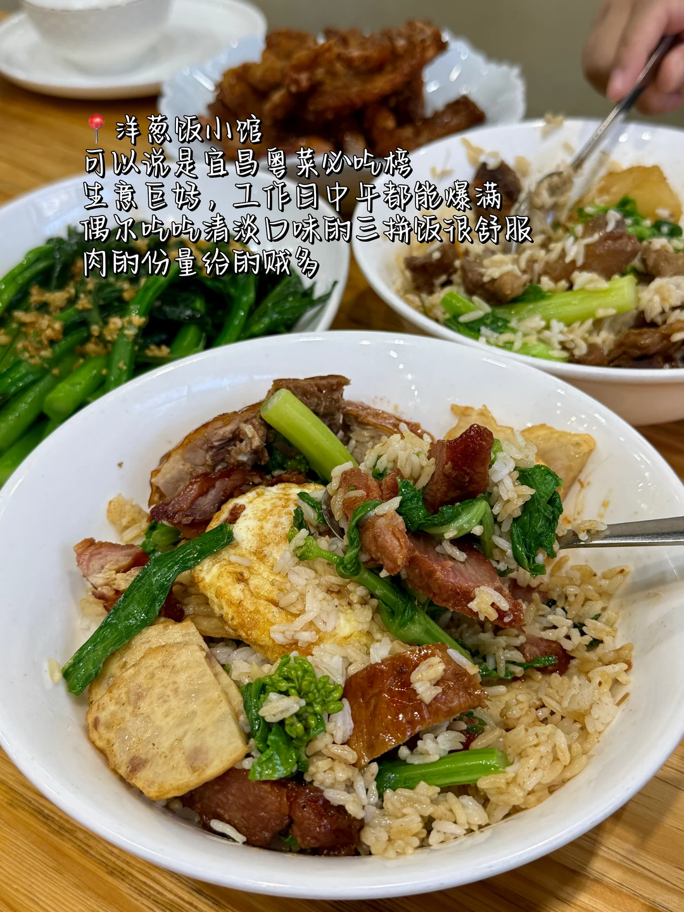
> [OCR] 洋葱饭小馆
可以说是宜昌粤菜必吃榜
生意巨好,工作日中午都能爆满
偶尔吃吃清淡口味的三拼饭很舒服
肉的份量给的贼多
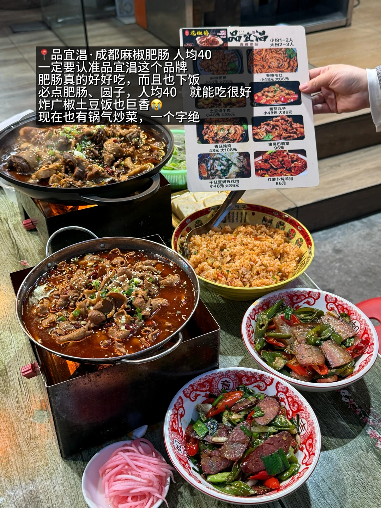
> [OCR] 品宜温·成都麻辣肥肠 人均40
一定要认准品宜温这个品牌
肥肠真的好好吃，而且也下饭
必点肥肠、圆子，人均40 就能吃很好
炸广椒土豆饭也巨香😭
现在也有锅气炒菜，一个字绝
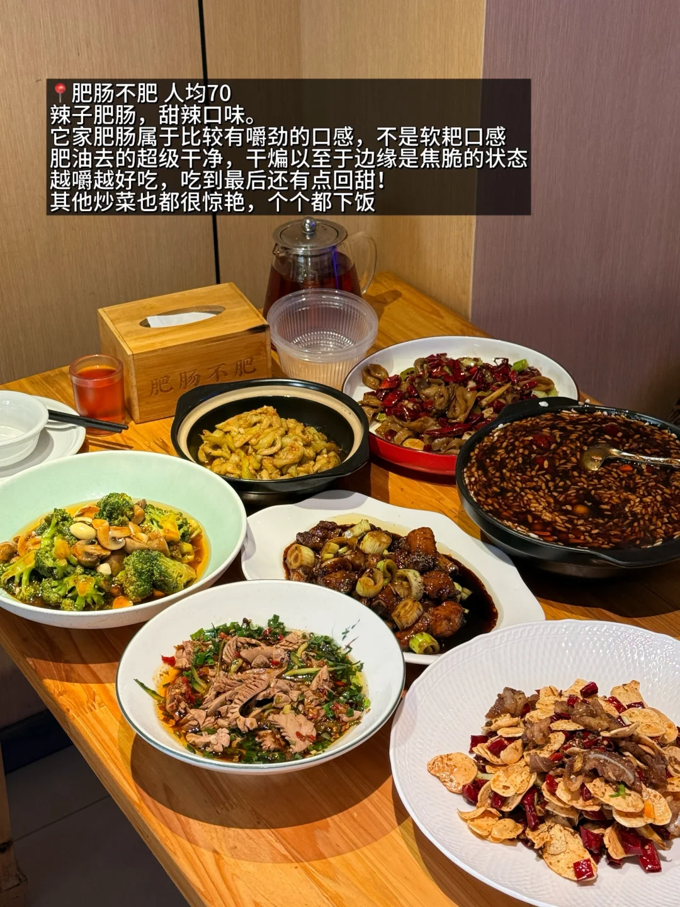
> [OCR] 肥肠不肥 人均70
辣子肥肠,甜辣口味。
它家肥肠属于比较有嚼劲的口感,不是软耙口感
肥油去的超级干净,干煸以至于边缘是焦脆的状态
越嚼越好吃，吃到最后还有点回甜！
其他炒菜也都很惊艳，个个都下饭
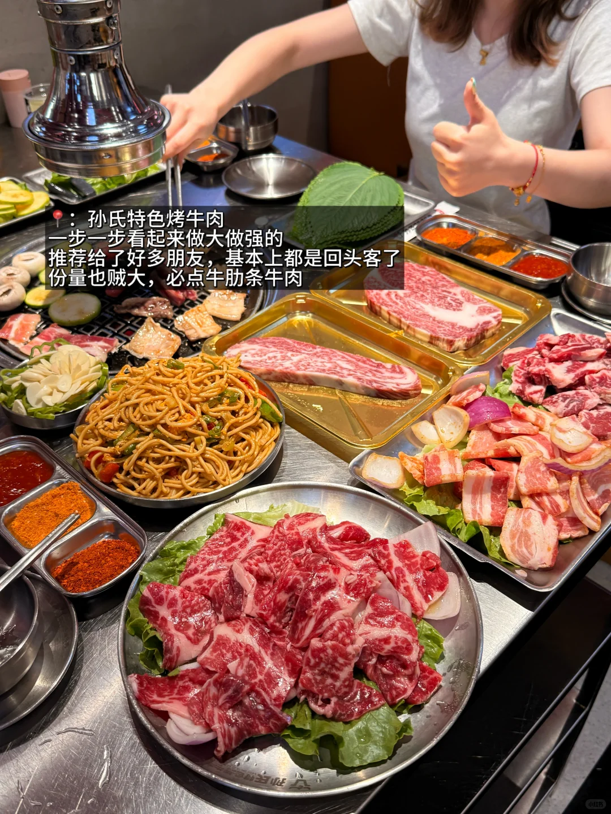
> [OCR] 孙氏特色烤牛肉
一步一步看起来做大做强的
推荐给了好多朋友,基本上都是回头客了
份量也贼大,必点牛肋条牛肉
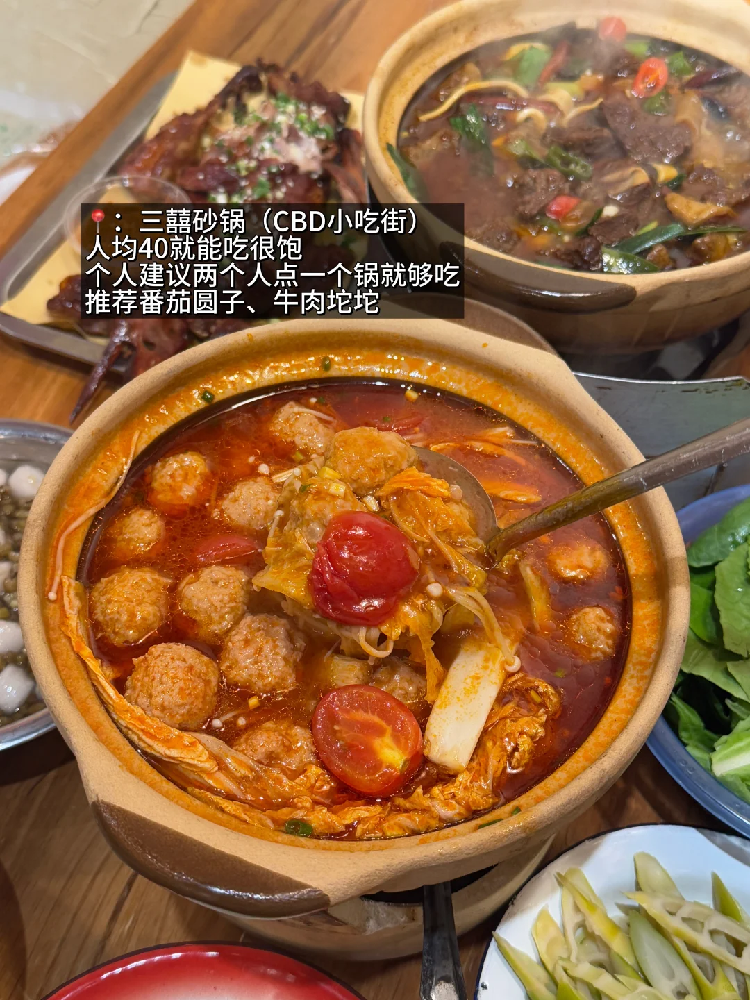
> [OCR] 三囍砂锅（CBD小吃街）
人均40就能吃很饱
个人建议两个人点一个锅就够吃
推荐番茄圆子、牛肉坨坨
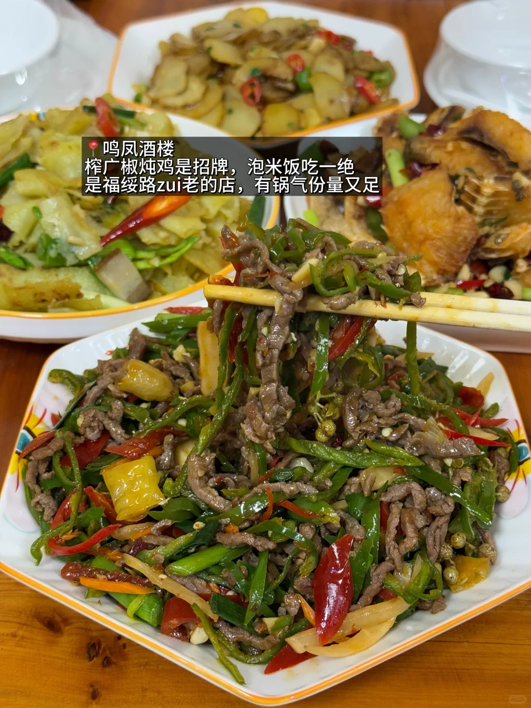
> [OCR] 鸣凤酒楼
榨广椒炖鸡是招牌,泡米饭吃一绝
是福绥路zui老的店,有锅气份量又足
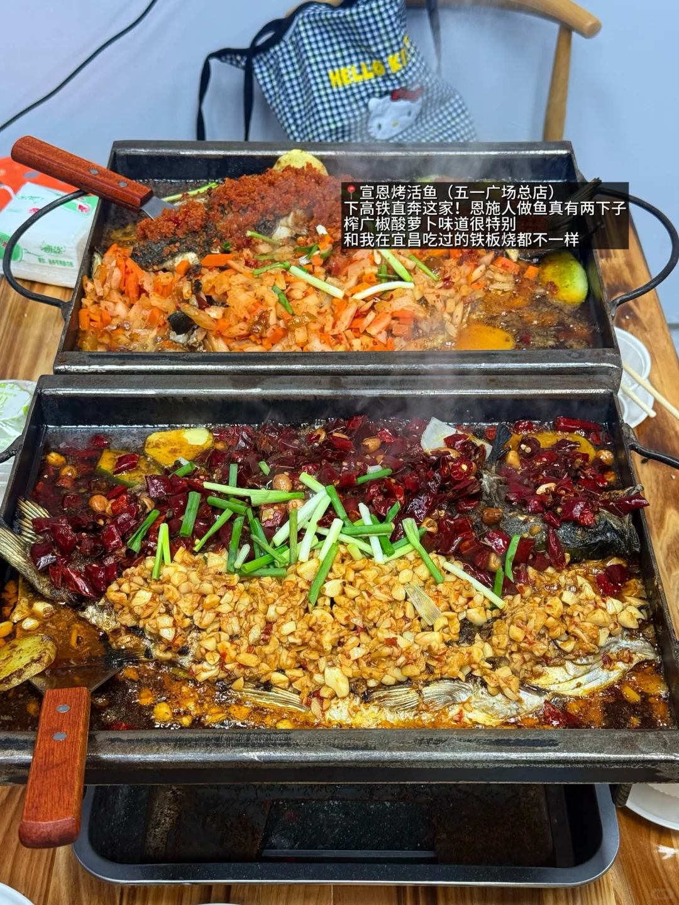
> [OCR] 宣恩烤活鱼（五一广场总店）
下高铁直奔这家！恩施人做鱼真有两下子
榨广椒酸萝卜味道很特别
和我在宜昌吃过的铁板烧都不一样
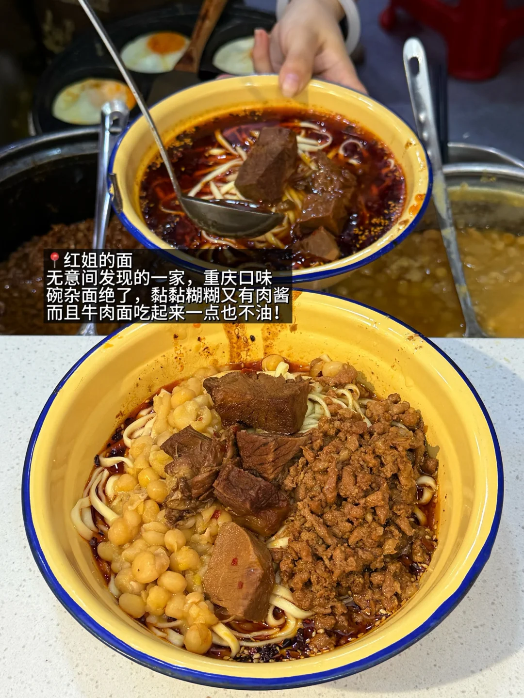
> [OCR] 红姐的面
无意间发现的一家，重庆口味
碗杂面绝了，黏黏糊糊又有肉酱
而且牛肉面吃起来一点也不油！
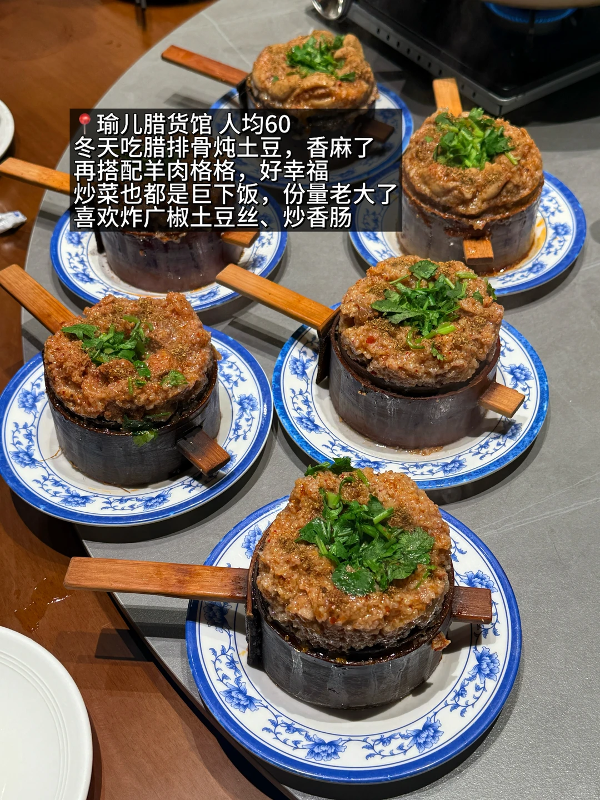
> [OCR] 瑜儿腊货馆 人均60
冬天吃腊排骨炖土豆，香麻了
再搭配羊肉格格，好幸福
炒菜也都是巨下饭，份量老大了
喜欢炸广椒土豆丝、炒香肠
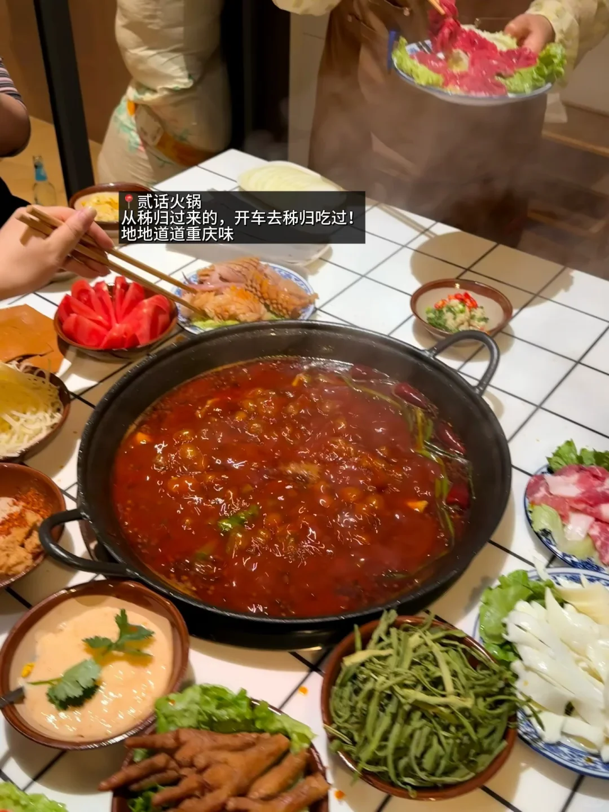
> [OCR] 贰话火锅
从秭归过来的，开车去秭归吃过！
地地道道重庆味

> [OCR] topping coffee
我要带我最好的朋友去喝
topping山楂精酿
安利给每一位来宜的朋友

> [OCR] Fiorita
[?]
斜杠咖啡
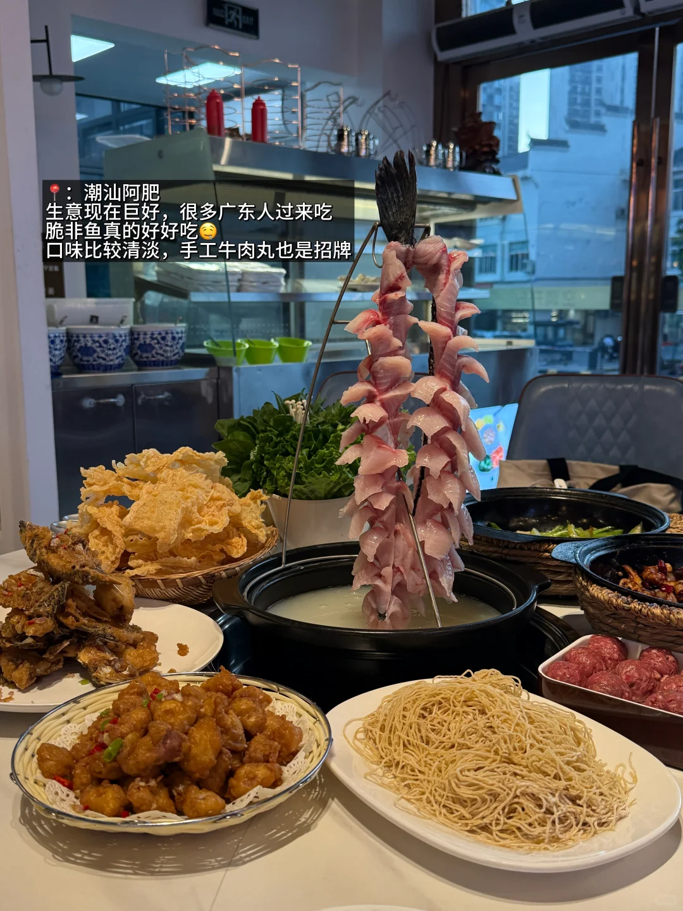
> [OCR] 潮汕阿肥
生意现在巨好，很多广东人过来吃
脆非鱼真的好好吃😋
口味比较清淡，手工牛肉丸也是招牌

## 正文
都是自己经常去滴
	
#宜昌开心市民小洁[话题]# #宜昌吃喝玩乐[话题]# #宜昌美食[话题]# #宜昌探店[话题]# #生活在宜昌[话题]# #大声安利本地美食[话题]# #美食扶持计划[话题]# #值得为吃而去的小城[话题]# #灵感好店出道计划[话题]##宜昌旅游[话题]#

---