# 三峡大坝，免费🆓观景台来啦（含停车）

- 作者: 满眼皆星河
- 👍1950 · 💬236 · ⭐2322 · 图 14
- feed_id: 69997b50000000001d025f98

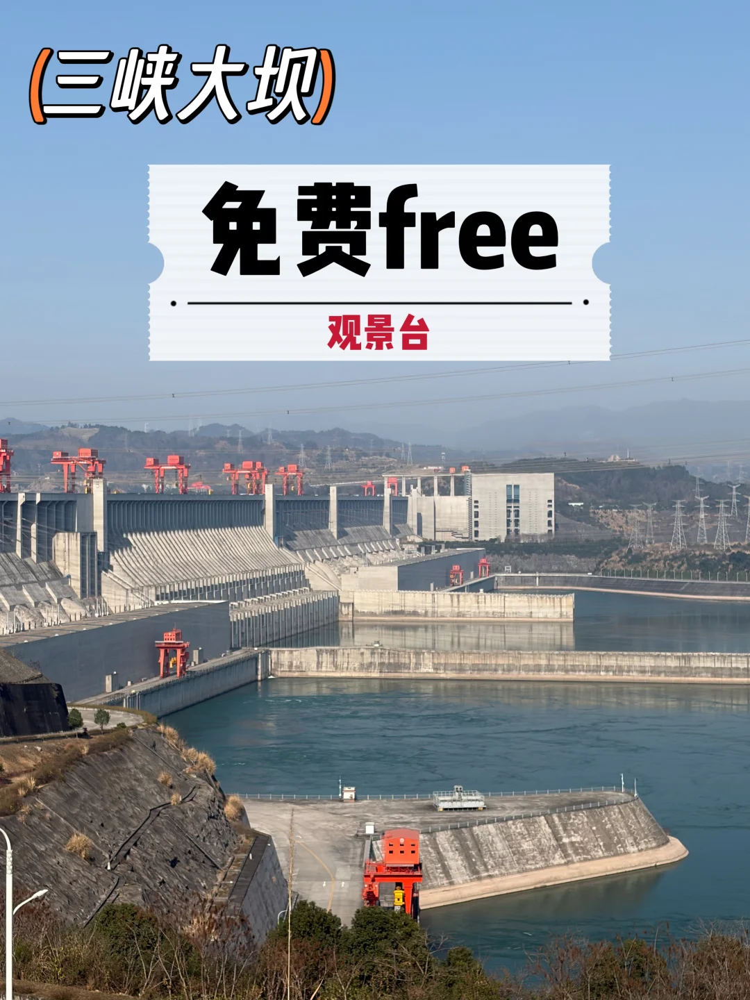
> [OCR] (三峡大坝)
免费free
观景台
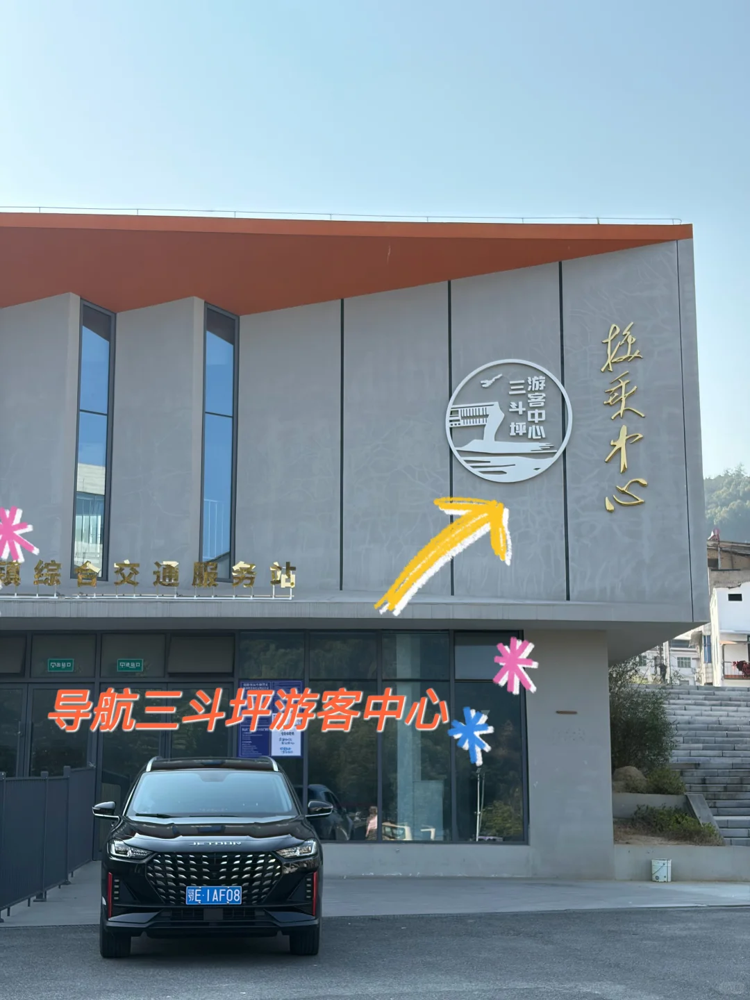
> [OCR] 三斗坪游客中心
导航三斗坪游客中心
镇综合交通服务站
接乘中心
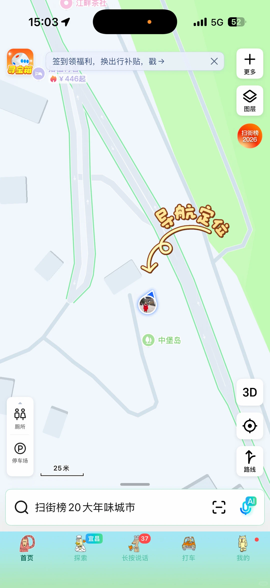
> [OCR] 15:03
签到领福利，换出行补贴，戳→
¥446起
导航定位
中堡岛
25米
扫街榜 20大年味城市
厕所
停车场
3D
路线
AI
首页 探索 长按说话 打车 我的
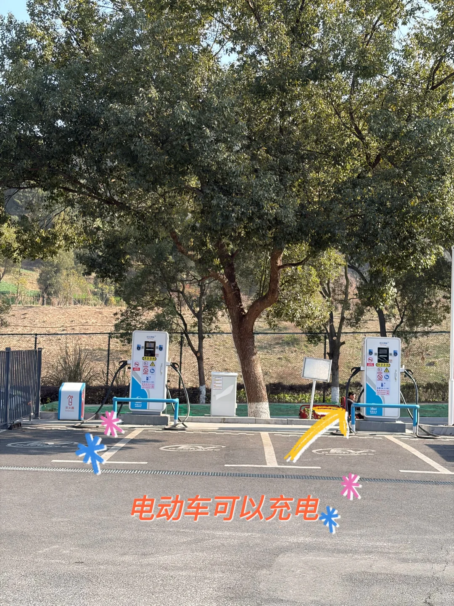
> [OCR] 电动车可以充电
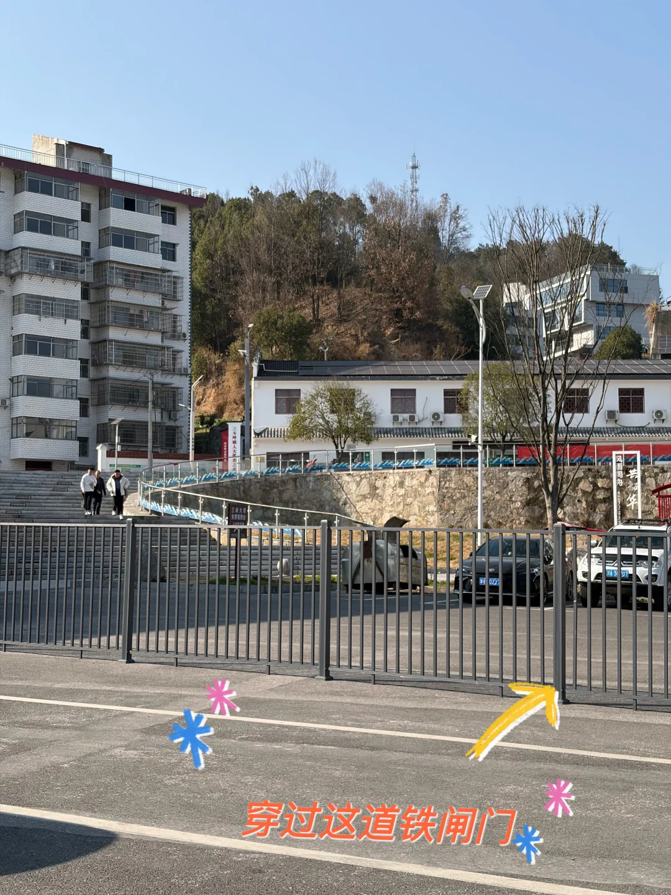
> [OCR] 穿过这道铁闸门
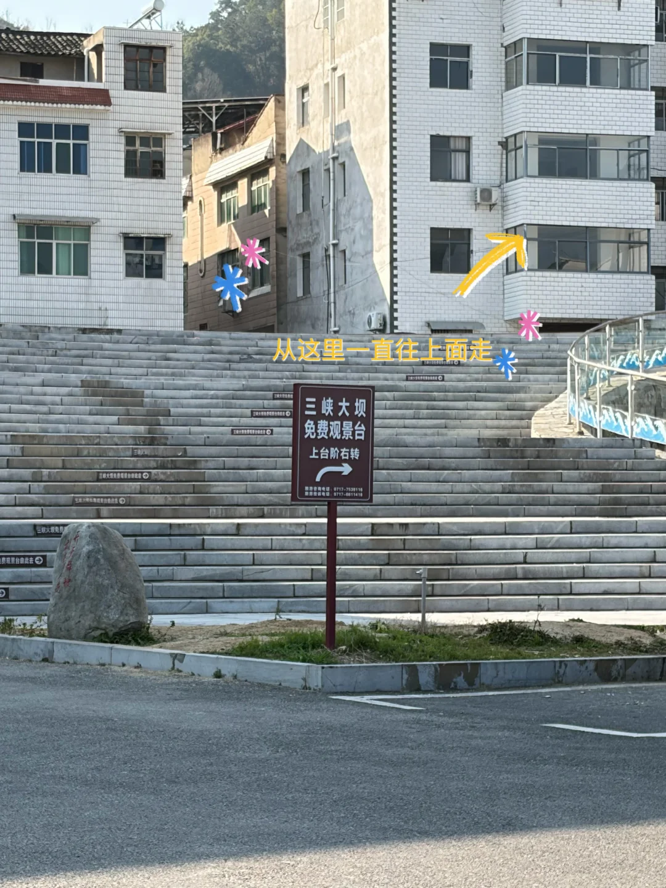
> [OCR] 三峡大坝
免费观景台
上台阶右转
从这里一直往上面走
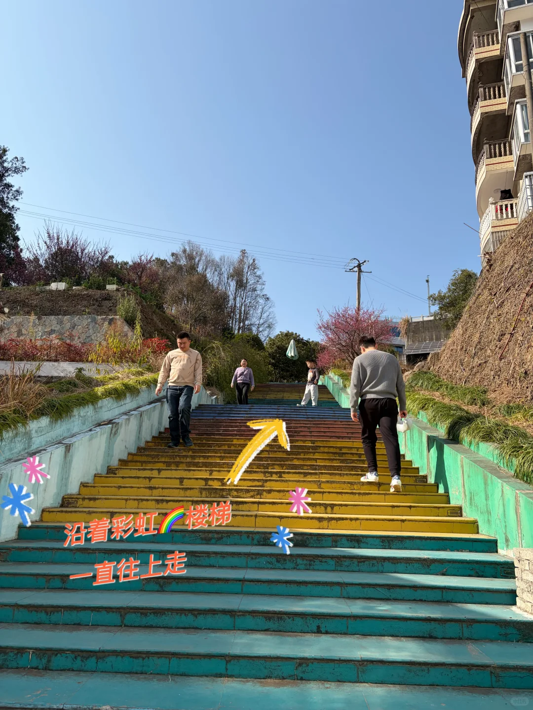
> [OCR] 沿着彩虹楼梯
一直往上走
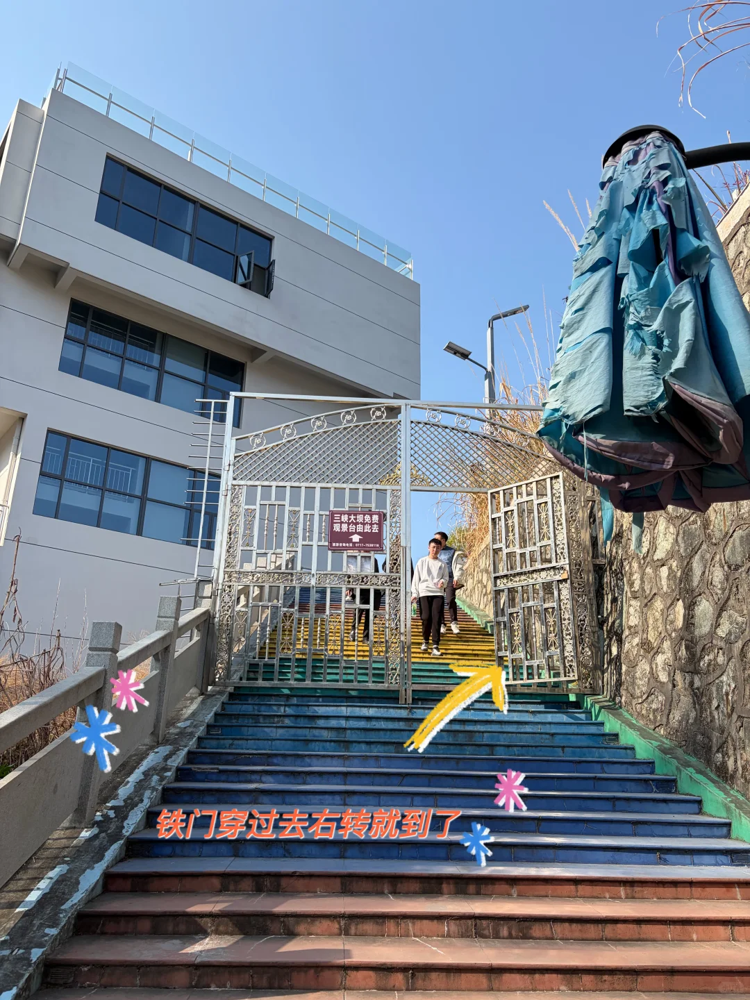
> [OCR] 三峡大坝免费
观景台由此去
铁门穿过去右转就到了
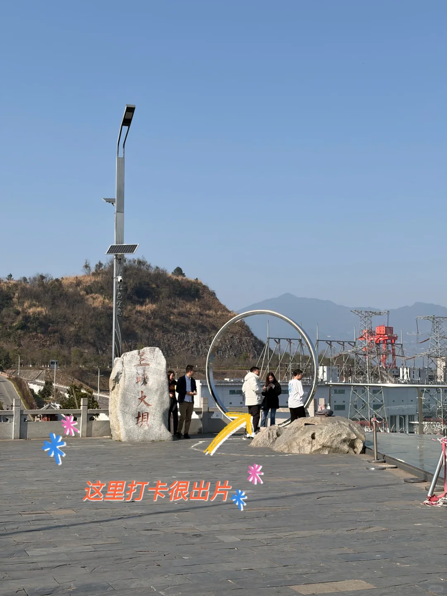
> [OCR] 王坡大坝
这里打卡很出片
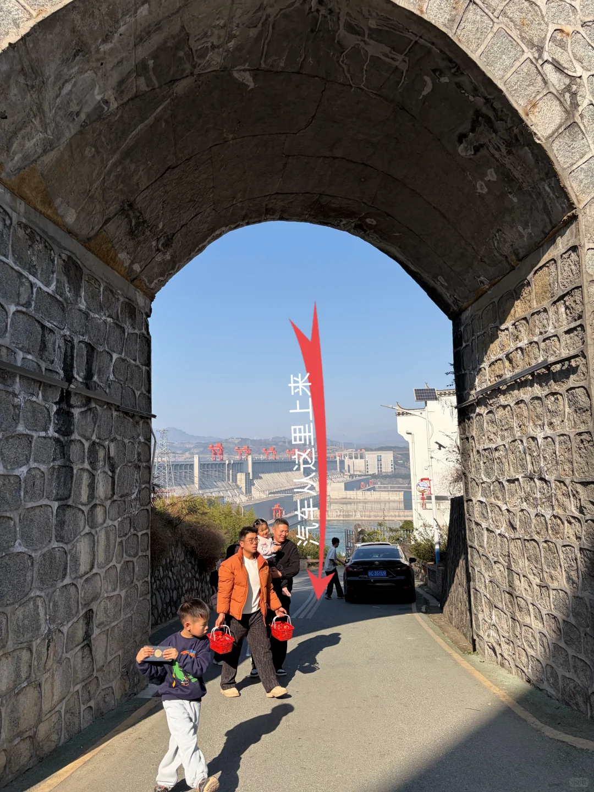
> [OCR] 汽车从这里上来
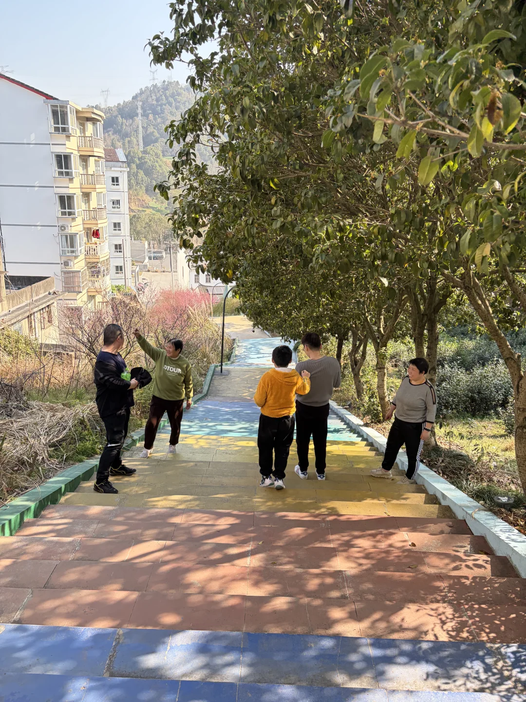
> [OCR] LOTOUR
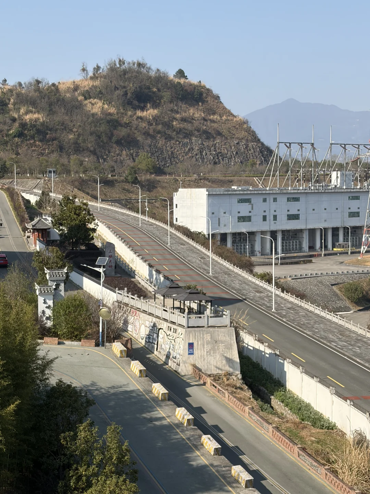
> [OCR] 三峡大坝
美丽宜昌
[?]
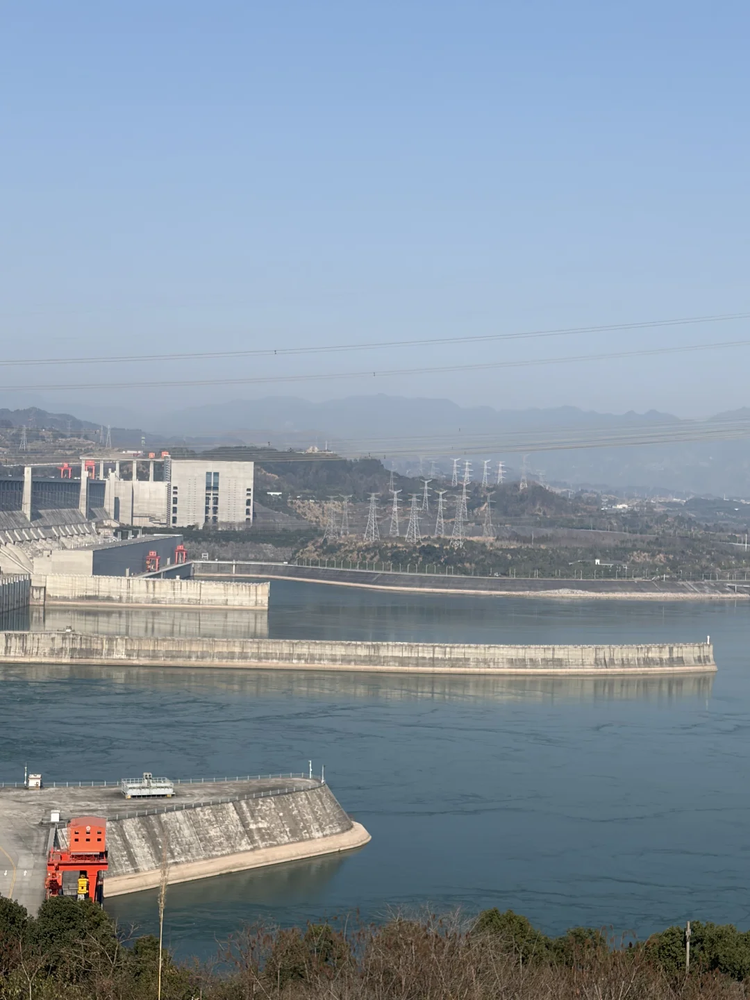
> [OCR] [?]
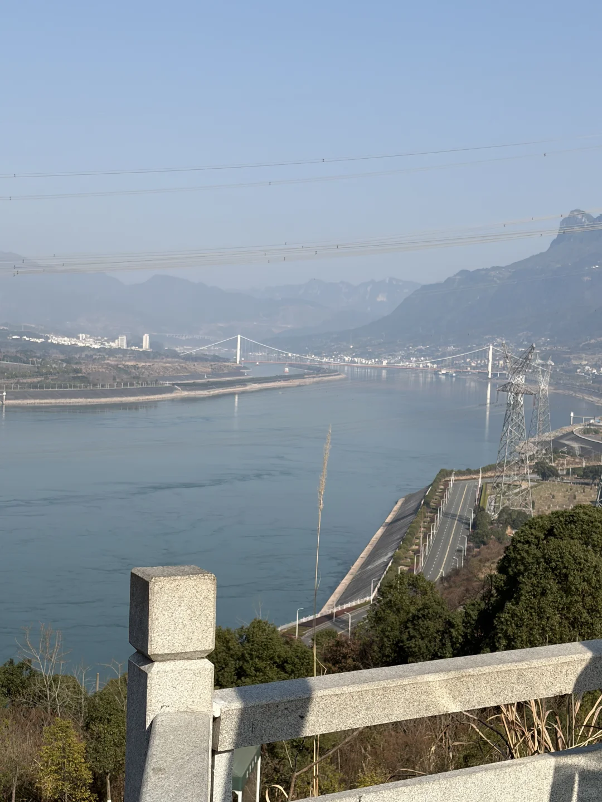
> [OCR] [?]

## 正文
来宜昌想免费拍三峡大坝全景？别再被中堡岛的收费带路党坑了！亲测这条新鲜出炉的免费路线，全程无套路，还有停车场🅿️充电桩，免费公厕🚾快快码住❗
	
🚗 前期准备
1. 办理通行证：先导航到 朱家湾检查站，凭驾驶证和车辆行驶证办理，这是进入核心区域的必备手续。办证很简单，一分钟搞定❗
	
详细路线：
1、导航定位：感谢大家反馈意见，导航“中堡岛”，就可以看到这个换乘中心
2、这是一个很大的正规的官方游客中心，🈶充电桩（图4）、免费🆓公厕🚾，停车收费也不贵，好像是3r一小时❗停好车，会有当地人说帮你们带到免费观景平台，不要轻信，那个是要收费的❗跟着我的路线走，一分钱不要❗
3、停好车后，穿过铁栅栏（图5），会看到一个指示牌（图6） ，然后右转↩️上楼梯，一直往上走。
4、走几分钟，就会看到一道长长的彩虹🌈楼梯（图7）。
5、沿着彩虹楼梯继续往上走，看到一个铁门（图8），大胆的穿过去，右转就会看到观景平台了。观景平台那个圆环处就是最佳打卡机位，拍照很出片（图9）。看到三峡大坝的第一眼，真的无比震撼❗
6、图10是汽车上来路线，也是免费的❗
	
📸 出片技巧
• 时间选择：晴天下午4-6点前往，光线柔和，夕阳洒在大坝上，氛围感直接拉满。
• 构图建议：用手机0.5倍超广角，把大坝、长江和远山框进画面，层次感拉满。
• 穿搭参考：穿浅色系衣服，和灰蓝色的大坝形成对比，拍照更出片。
	
💡 避坑提醒
✅中堡岛主题公园附近常有村民以“带路”为名收费（10-30元不等），直接无视，按我们的路线走完全免费。
✅山路较窄，注意会车，停车时不要阻碍交通。
	
#三峡大坝[话题]# #宜昌旅游[话题]# #免费景点[话题]##小众打卡地[话题]# #最佳观景点[话题]# #三峡大坝[话题]# #三峡大坝旅游[话题]# #三峡大坝自驾游[话题]#
#周末去哪儿[话题]# #伟大的工程[话题]#

---