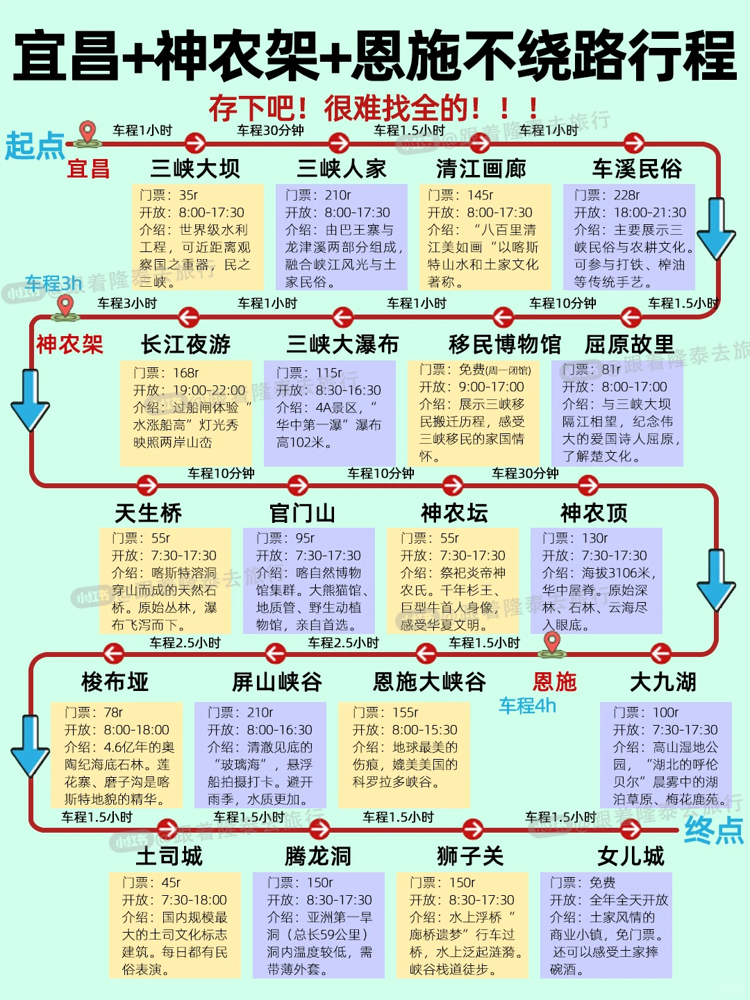
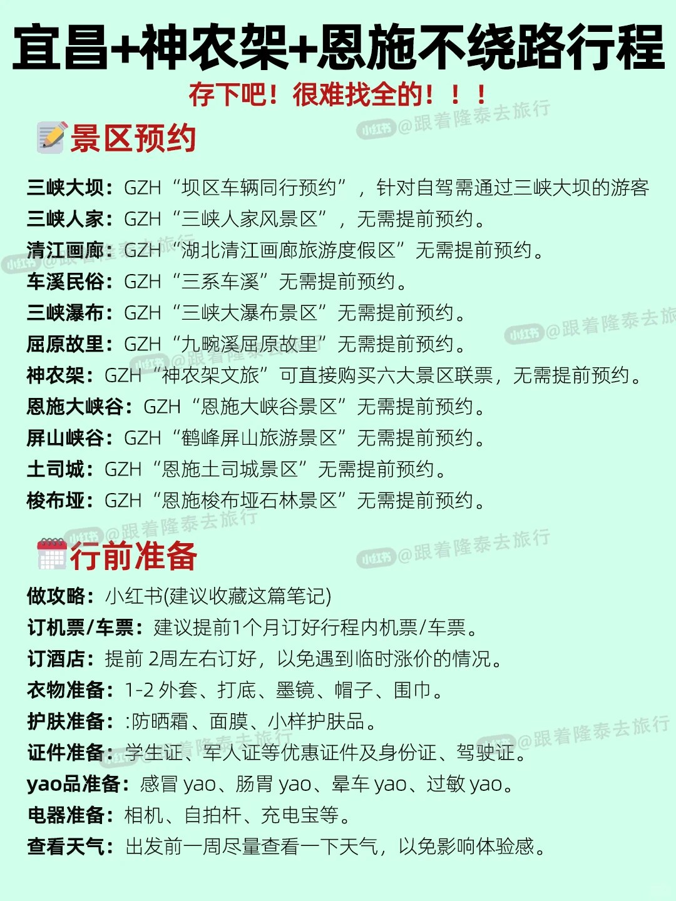
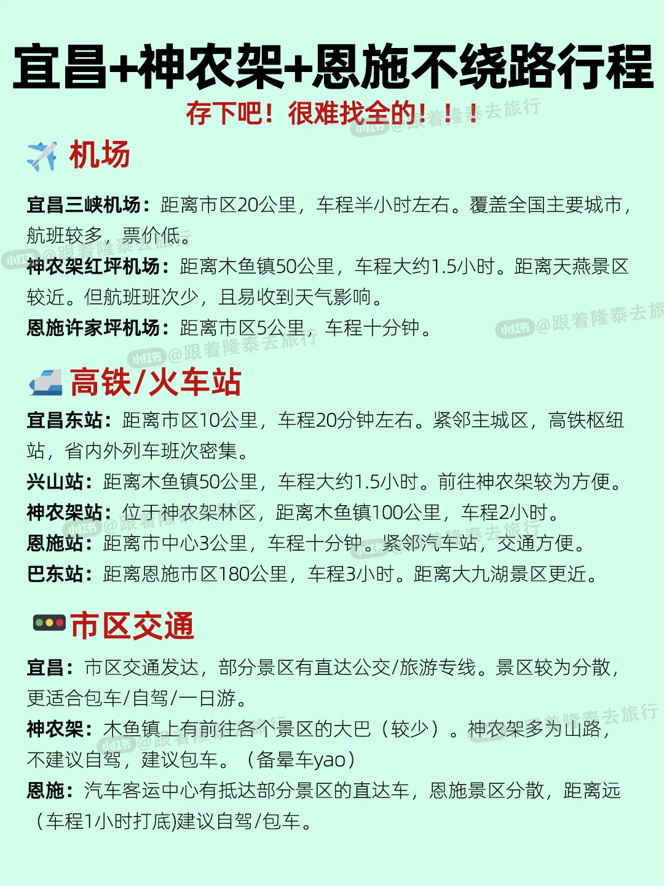
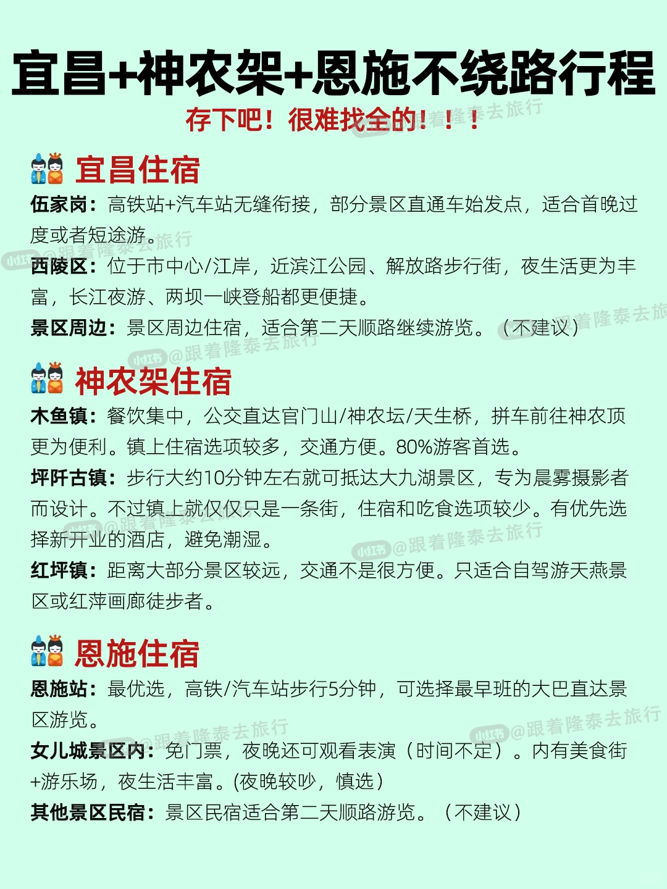
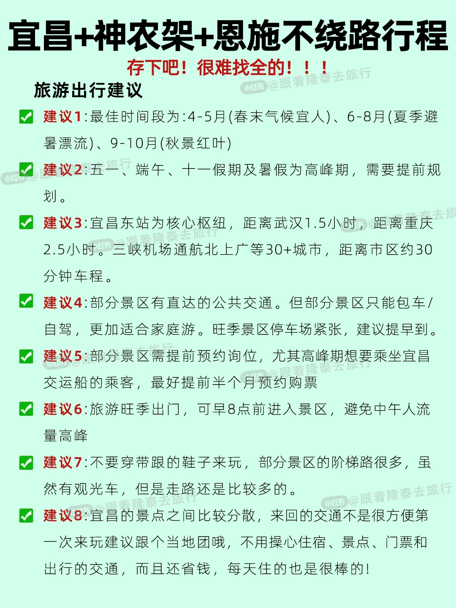
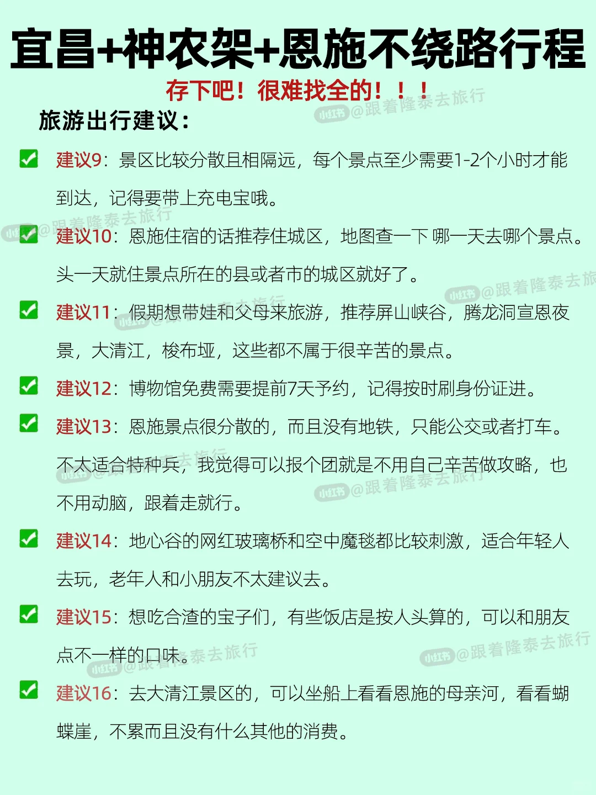

# 宜昌+神农架+恩施精华游！快来抄作业‼️

- 作者: 跟着楚渝行去旅行
- 👍1659 · 💬255 · ⭐3083 · 图 6
- feed_id: 6846ae2f0000000021007c11

> [OCR] 宜昌+神农架+恩施不绕路行程

存下吧！很难找全的！！！

起点 宜昌 车程1小时 三峡大坝 车程30分钟 三峡人家 车程1.5小时 清江画廊 车程1小时 车溪民俗
门票：35r 开放：8:00-17:30 介绍：世界级水利工程，可近距离观察国之重器，民之三峽。
门票：210r 开放：8:00-17:30 介绍：由巴王寨与龙津溪两部分组成，融合峡江风光与土家民俗。
门票：145r 开放：8:00-17:30 介绍：“八百里清江美如画”以喀斯特山水和土家文化著称。
门票：228r 开放：18:00-21:30 介绍：主要展示三峡民俗与农耕文化。可参与打铁、榨油等传统手艺。

神农架 车程3h 长江夜游 三峡大瀑布 移民博物馆 屈原故里
车程3小时 车程1小时 车程1小时 车程10分钟 车程1.5小时
门票：168r 开放：19:00-22:00 介绍：过船闸体验“水涨船高”灯光秀映照两岸山峦
门票：115r 开放：8:30-16:30 介绍：4A景区，“华中第一瀑”瀑布高102米。
门票：免费(周一团馆)开放：9:00-17:00 介绍：展示三峡移民搬迁历程，感受三峡移民的家国情怀。
门票：81r 开放：8:00-17:00 介绍：与三峡大坝隔江相望，纪念伟大的爱国诗人屈原，了解楚文化。

天生桥 官门山 神农坛 神农顶
车程10分钟 车程10分钟 车程30分钟
门票：55r 开放：7:30-17:30 介绍：喀斯特溶洞穿山而成的天然石桥。原始丛林，瀑布飞泻而下。
门票：95r 开放：7:30-17:30 介绍：喀自然博物馆集群。大熊猫馆、地质管、野生动植物馆，亲自首选。
门票：55r 开放：7:30-17:30 介绍：祭祀炎帝神农氏。千年杉王、巨型牛首人身像，感受华夏文明。
门票：130r 开放：7:30-17:30 介绍：海拔3106米，华中屋脊。原始森林、石林、云海尽入眼底。

梭布垭 屏山峡谷 恩施大峡谷 恩施 大九湖
车程2.5小时 车程2.5小时 车程1.5小时 车程4h 车程1.5小时
门票：78r 开放：8:00-18:00 介绍：4.6亿年的奥陶纪海底石林。莲花寨、磨子沟是喀斯特地貌的精华。
门票：210r 开放：8:00-16:30 介绍：清澈见底的“玻璃海”，悬浮船拍摄打卡。避开雨季，水质更加。
门票：155r 开放：8:00-15:30 介绍：地球最美的伤痕，媲美美国的科罗拉多峡谷。
门票：100r 开放：7:30-17:30 介绍：高山湿地公园，“湖北的呼伦贝尔”晨雾中的湖泊草原、梅花鹿苑。

土司城 腾龙洞 狮子关 女儿城
车程1.5小时 车程1.5小时 车程1.5小时 车程1.5小时
门票：45r 开放：7:30-18:00 介绍：国内规模最大的土司文化标志建筑。每日都有民俗表演。
门票：150r 开放：8:30-17:30 介绍：亚洲第一旱洞（总长59公里）洞内温度较低，需带薄外套。
门票：150r 开放：8:30-17:30 介绍：水上浮桥“廊桥遗梦”行车过桥，水上泛起涟漪。峡谷栈道徒步。
门票：免费 开放：全年全天开放 介绍：土家风情的商业小镇，免门票。还可以感受土家摔碗酒。

终点

> [OCR] 宜昌+神农架+恩施不绕路行程

存下吧！很难找全的！！！

景区预约

三峡大坝：GZH “坝区车辆同行预约”，针对自驾需通过三峡大坝的游客
三峡人家：GZH“三峡人家风景区”无需提前预约。
清江画廊：GZH“湖北清江画廊旅游度假区”无需提前预约。
车溪民俗：GZH“三系车溪”无需提前预约。
三峡瀑布：GZH“三峡大瀑布景区”无需提前预约。
屈原故里：GZH“九畹溪屈原故里”无需提前预约。
神农架：GZH“神农架文旅”可直接购买六大景区联票，无需提前预约。
恩施大峡谷：GZH“恩施大峡谷景区”无需提前预约。
屏山峡谷：GZH“鹤峰屏山旅游景区”无需提前预约。
土司城：GZH“恩施土司城景区”无需提前预约。
梭布垭：GZH“恩施梭布垭石林景区”无需提前预约。

行前准备

做攻略：小红书(建议收藏这篇笔记)
订机票/车票：建议提前1个月订好行程内机票/车票。
订酒店：提前2周左右订好，以免遇到临时涨价的情况。
衣物准备：1-2外套、打底、墨镜、帽子、围巾。
护肤准备：防晒霜、面膜、小样护肤品。
证件准备：学生证、军人证等优惠证件及身份证、驾驶证。
yao品准备：感冒yao、肠胃yao、晕车yao、过敏yao。
电器准备：相机、自拍杆、充电宝等。
查看天气：出发前一周尽量查看一下天气，以免影响体验感。

> [OCR] 宜昌+神农架+恩施不绕路行程
存下吧！很难找全的！！！

机场

宜昌三峡机场：距离市区20公里，车程半小时左右。覆盖全国主要城市，航班较多，票价低。
[?]农架红坪机场：距离木鱼镇50公里，车程大约1.5小时。距离天燕景区较近。但航班班次少，且易收到天气影响。
恩施许家坪机场：距离市区5公里，车程十分钟。

高铁/火车站

宜昌东站：距离市区10公里，车程20分钟左右。紧邻主城区，高铁枢纽站，省内外列车班次密集。
兴山站：距离木鱼镇50公里，车程大约1.5小时。前往神农架较为方便。
[?]农架站：位于神农架林区，距离木鱼镇100公里，车程2小时。
恩施站：距离市中心3公里，车程十分钟。紧邻汽车站，交通方便。
巴东站：距离恩施市区180公里，车程3小时。距离大九湖景区更近。

市区交通

宜昌：市区交通发达，部分景区有直达公交/旅游专线。景区较为分散，更适合包车/自驾/一日游。
[?]农架：木鱼镇上有前往各个景区的大巴（较少）。神农架多为山路，不建议自驾，建议包车。（备晕车yao）
恩施：汽车客运中心有抵达部分景区的直达车，恩施景区分散，距离远(车程1小时打底)建议自驾/包车。

> [OCR] 宜昌+神农架+恩施不绕路行程
存下吧！很难找全的！！！

宜昌住宿
伍家岗：高铁站+汽车站无缝衔接，部分景区直通车始发点，适合首晚过度或者短途游。
西陵区：位于市中心/江岸，近滨江公园、解放路步行街，夜生活更为丰富，长江夜游、两坝一峡登船都更便捷。
景区周边：景区周边住宿，适合第二天顺路继续游览。（不建议）

神农架住宿
木鱼镇：餐饮集中，公交直达官门山/神农坛/天生桥，拼车前往神农顶更为便利。镇上住宿选项较多，交通方便。80%游客首选。
坪阡古镇：步行大约10分钟左右就可抵达大九湖景区，专为晨雾摄影者而设计。不过镇上就仅仅只是一条街，住宿和吃食选项较少。有优先选择新开业的酒店，避免潮湿。
红坪镇：距离大部分景区较远，交通不是很方便。只适合自驾游天燕景区或红萍画廊徒步者。

恩施住宿
恩施站：最优选，高铁/汽车站步行5分钟，可选择最早班的大巴直达景区游览。
女儿城景区内：免门票，夜晚还可观看表演（时间不定）。内有美食街+游乐场，夜生活丰富。（夜晚较吵，慎选）
其他景区民宿：景区民宿适合第二天顺路游览。（不建议）

> [OCR] 宜昌+神农架+恩施不绕路行程

存下吧！很难找全的！！！

旅游出行建议

建议1:最佳时间段为：4-5月(春末气候宜人)、6-8月(夏季避暑漂流)、9-10月(秋景红叶)

建议2:五一、端午、十一假期及暑假为高峰期，需要提前规划。

建议3:宜昌东站为核心枢纽，距离武汉1.5小时，距离重庆2.5小时。三峡机场通航北上广等30+城市，距离市区约30分钟车程。

建议4:部分景区有直达的公共交通。但部分景区只能包车/自驾，更加适合家庭游。旺季景区停车场紧张，建议提早到。

建议5:部分景区需提前预约询位，尤其高峰期想要乘坐宜昌交运船的乘客，最好提前半个月预约购票

建议6:旅游旺季出门，可早8点前进入景区，避免中午人流量高峰

建议7:不要穿带跟的鞋子来玩，部分景区的阶梯路很多，虽然有观光车，但是走路还是比较多的。

建议8:宜昌的景点之间比较分散，来回的交通不是很方便第一次来玩建议跟个当地团哦，不用操心住宿、景点、门票和出行的交通，而且还省钱，每天住的也是很棒的！

> [OCR] 宜昌+神农架+恩施不绕路行程

存下吧！很难找全的！！！

旅游出行建议：

建议9：景区比较分散且相隔远，每个景点至少需要1-2个小时才能到达，记得要带上充电宝哦。

建议10：恩施住宿的话推荐住城区，地图查一下哪一天去哪个景点。头一天就住景点所在的县或者市的城区就好了。

建议11：假期想带娃和父母来旅游，推荐屏山峡谷、腾龙洞宣恩夜景、大清江、梭布垭，这些都不属于很辛苦的景点。

建议12：博物馆免费需要提前7天预约，记得按时刷身份证进。

建议13：恩施景点很分散的，而且没有地铁，只能公交或者打车。不太适合特种兵，我觉得可以报个团就是不用自己辛苦做攻略，也不用动脑，跟着走就行。

建议14：地心谷的网红玻璃桥和空中魔毯都比较刺激，适合年轻人去玩，老年人和小朋友不太建议去。

建议15：想吃合渣的宝子们，有些饭店是按人头算的，可以和朋友点不一样的口味。

建议16：去大清江景区的，可以坐船上看看恩施的母亲河，看看蝴蝶崖，不累而且没有什么其他的消费。

## 正文
送给6-10月避暑探秘的宝子们！
抄对作业省心50%～
.
🚩 行程路线（7天6晚不回头）
Day1-2：宜昌·三峡魂
✅ Day1：抵宜昌东站→酒店放行李→夜游长江（过葛洲坝船闸，赏灯光秀）🌉
✅ Day2：三峡大坝（上午）→三峡瀑布（下午）→宿宜昌（推荐伍家岗区酒店）
.
Day3-5：神农架·秘境森呼吸
✅ Day3：宜昌→木鱼镇（3h）→玩天生桥+官门山→宿木鱼镇
✅ Day4：包车游神农顶（金猴岭/板壁岩）→下午抵大九湖→宿坪阡古镇
✅ Day5：大九湖晨雾📸→午饭后大巴至巴东站→高铁赴恩施（1.5h）
.
Day6-7：恩施·地心探险
✅ Day6：恩施大峡谷（七星寨+云龙地缝，徒步5h）→傍晚女儿城摔碗酒→宿火车站周边
✅ Day7：屏山峡谷悬浮船打卡→返程（恩施许家坪机场/恩施站）
.
⚠️ 避坑指南（血泪总结）
1️⃣ 交通雷区：
❌ 神农架站≠神农架景区！去木鱼镇务必选兴山站，否则多绕2小时山路！
❌ 屏山峡谷返程巴士仅14:00-15:00，错过拼车¥400/辆！
✅ 恩施各景点分散，优先住火车站旁，早班巴士直达景区！
.
2️⃣ 住宿陷阱：
📍 神农架旺季（7-10月）民宿¥600+，提前1个月订！
📍 恩施别盲目住女儿城，夜晚歌舞吵到23点，浅眠选火车站静音酒店！
.
3️⃣ 景区预警：
⛰️ 神农顶海拔3106m，带防风外套+氧气瓶（山下¥20），别剧烈跑跳！
💦 屏山峡谷雨后易浑浊，出发前查鹤峰县天气，晴天才能拍出玻璃海！
.
🏡 住宿选址秘籍
- 宜昌：选伍家岗区（近东站+景区直通车）
- 神农架：玩西线住木鱼镇（云涧栖舍民宿），玩大九湖住坪阡古镇
- 恩施：效率选火车站全季酒店，风情选女儿城艺术酒店（吊脚楼体验）
.
💎 精华总结
1. 交通口诀：
> 宜昌靠BRT🚌，神农架拼车走🚐，恩施大巴+高铁联动🚄！
.
2. 行李必带：
✅ 防滑运动鞋（日均1.5w步）、冲锋衣（神农顶10℃）、晴雨伞🌂
.
> 🌈 鄂西山水是写给大地的情诗，按此攻略走，不踩坑不绕路，只管尖叫吧！
> 👉 关注我，解锁更多深度游干货 👈
#宜昌旅游[话题]# #恩施旅游[话题]# #神农架旅游[话题]# #旅游攻略[话题]# #三峡大坝[话题]# #神农架[话题]# #宜昌[话题]# #恩施[话题]# #恩施大峡谷[话题]# #景点推荐[话题]#

---