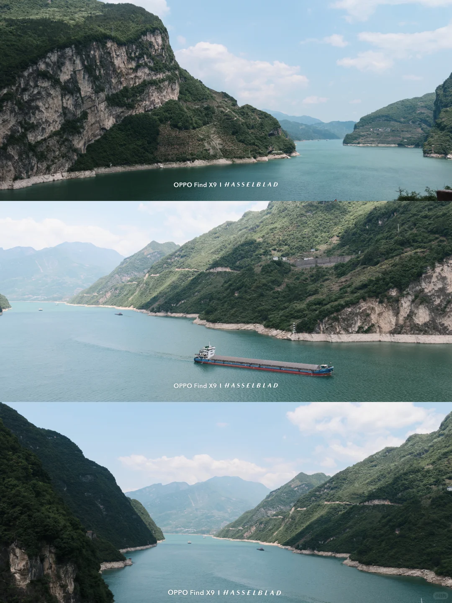
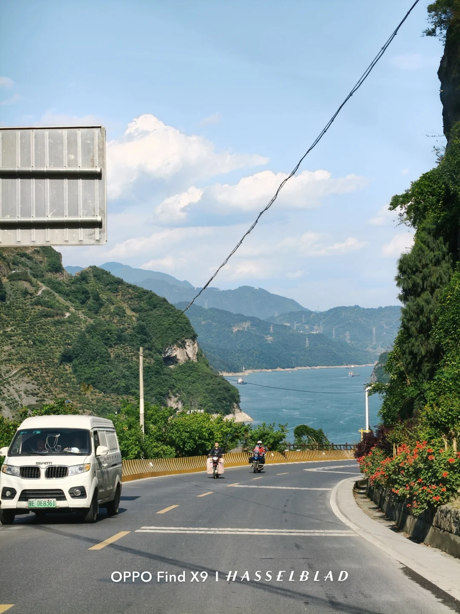
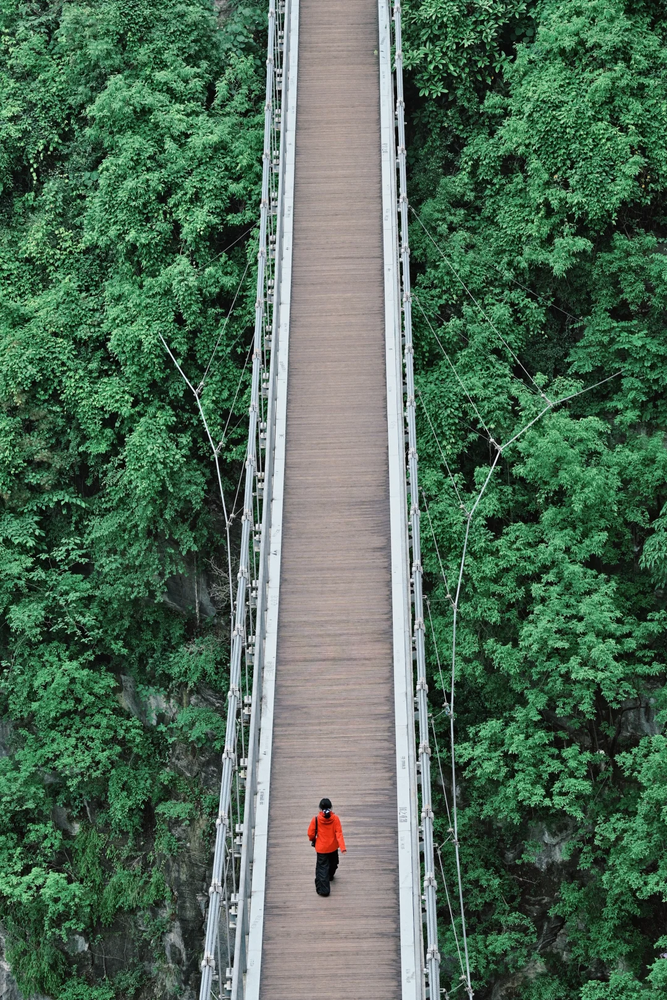
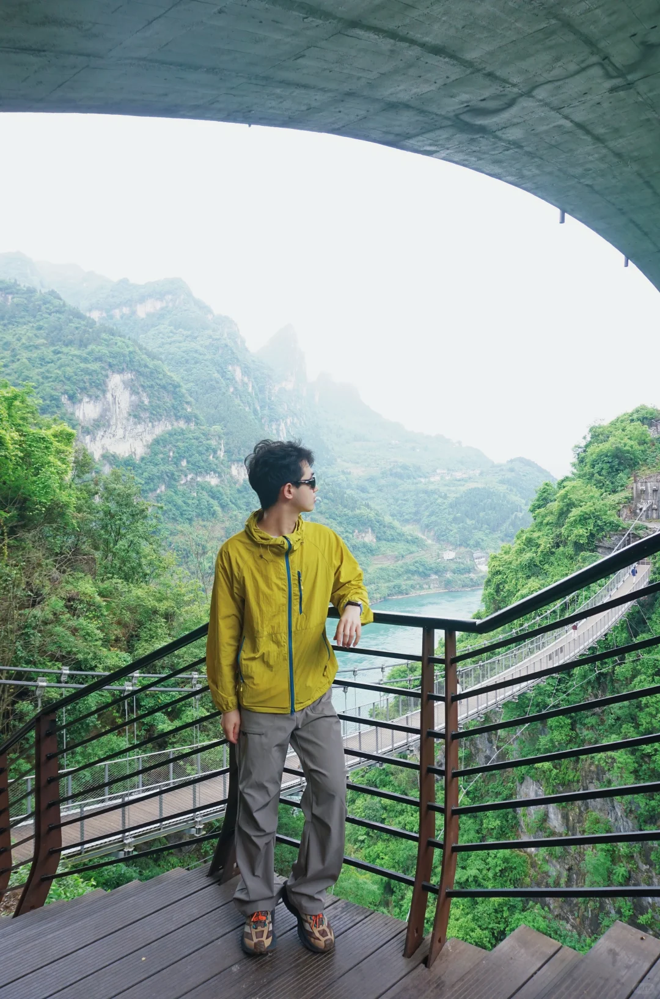
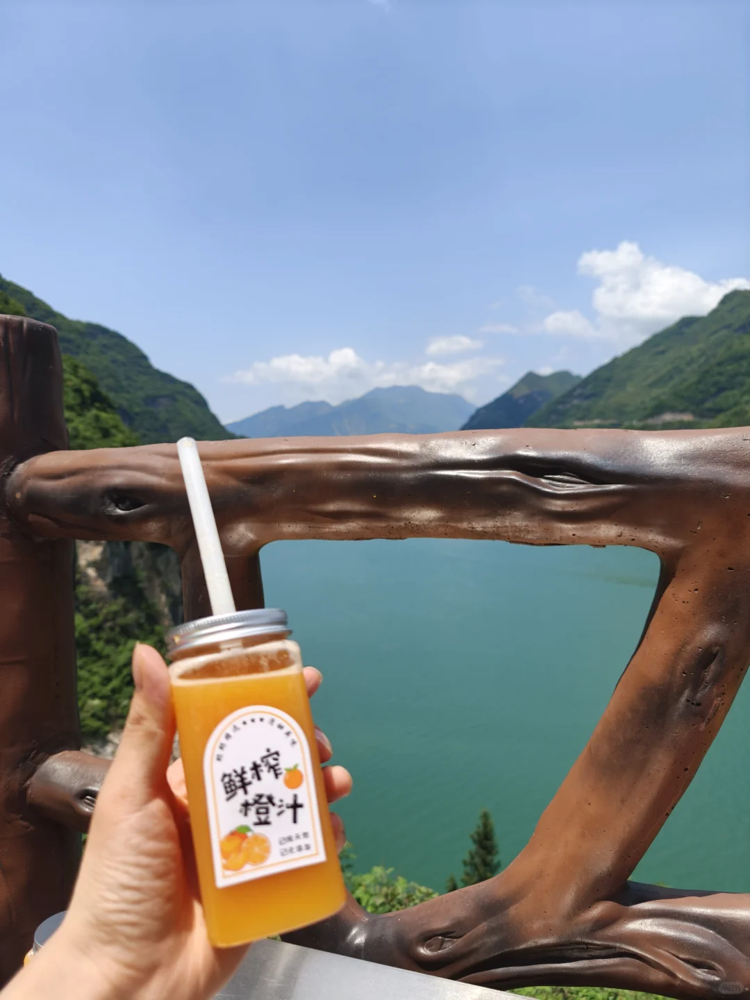
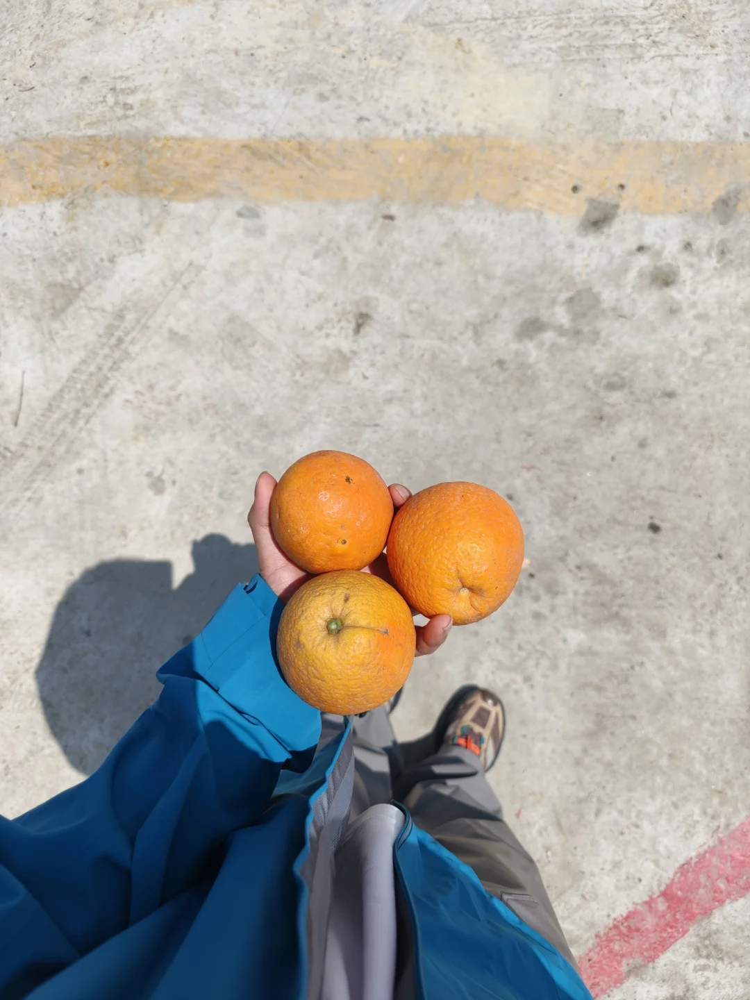
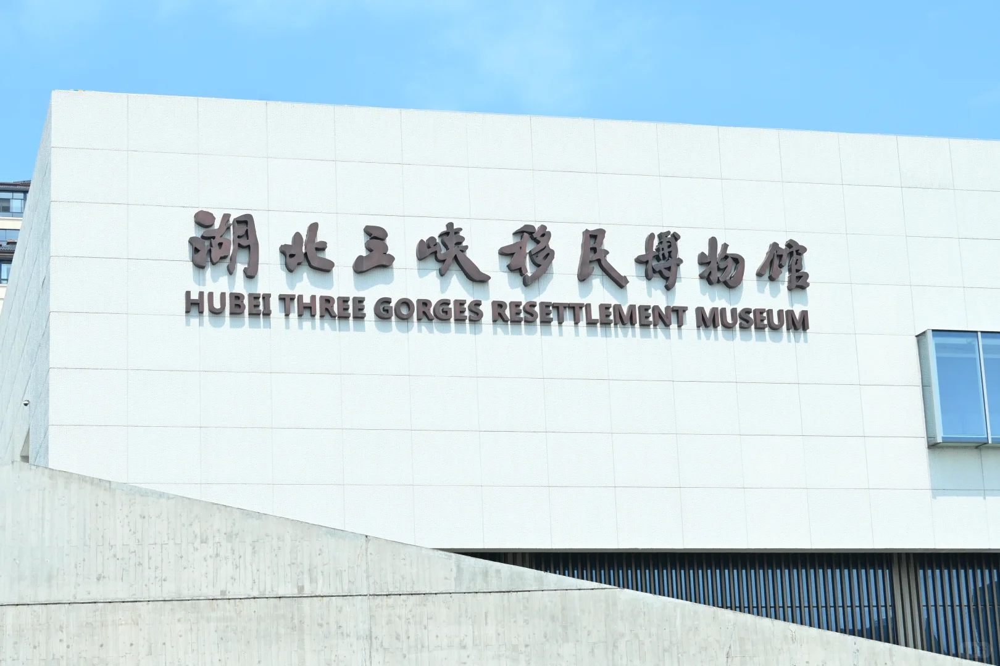
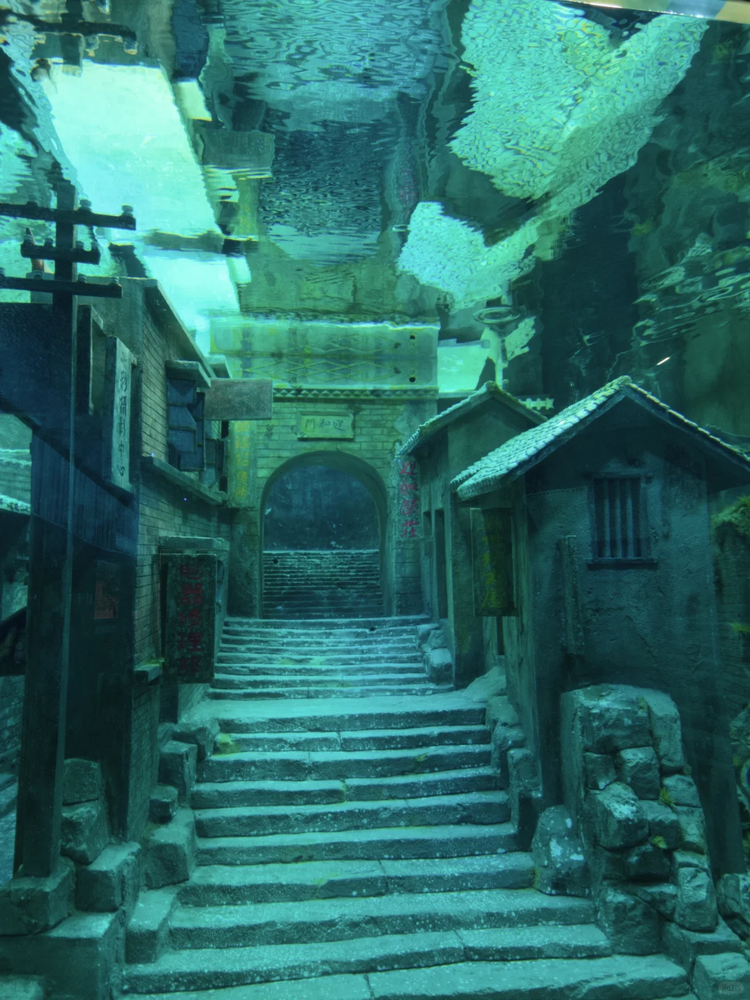

# 宜昌的最美公路G348夯爆了

- 作者: 小李不头秃
- 👍1500 · 💬129 · ⭐1347 · 图 14
- feed_id: 69f346390000000035028762

> [OCR] OPPO Find X9 | HASSELBLAD
OPPO Find X9 | HASSELBLAD
OPPO Find X9 | HASSELBLAD

> [OCR] OPPO Find X9 | HASSELBLAD

> [OCR] SRM
E-DE8361
OPPO Find X9 | HASSELBLAD

> [OCR] [?]

> [OCR] [?]

> [OCR] system

> [OCR] [?]

> [OCR] system

> [OCR] 磁吸亿万年的

> [OCR] 鲜榨橙汁

> [OCR] 鲜榨橙汁
鲜榨橙汁

> [OCR] [?]

> [OCR] 湖北三峡移民博物馆
HUBEI THREE GORGES RESETTLEMENT MUSEUM

> [OCR] [?]

## 正文
这次五一来提前打卡宜昌G348最美沿江公路
一整天沿江自驾，免费的山水风光景点可以直接给到夯！
🚗精简路线
市区8:30出发→听风谷→明月台→干沟子大桥→莲沱畔→西陵长江大桥→三峡大坝观景台→水下移民博物馆→牛肝马肺峡→鹰嘴岩→返程市区
中午1点多到鹰嘴岩，下午3点走高速轻松回城
一路江景相伴，青山夹长江，随处都是打卡点
最爱牛肝马肺峡观景台
俯瞰长江视野超震撼，风景巨壮观
路边5元的鲜榨橙汁超好喝！
景区阿姨特别热情，蛋炒饭分量超足还送我们送了小菜
最后到鹰嘴岩那边，当地的老爷爷还主动给我们送了橙子，橙子很甜，1.5元一斤的橙子也果断买了一点回去
宜昌人的温柔真的太加分❤️
💡出行小贴士
▪️山路弯道多，晕车宝记得备晕车药💊
▪️晴天去视野最好，拍照超级出片
▪️沿途景点可停车观景，图中的景点都是不收费的打卡点，五一车肯定会很多，注意提前安排好时间
来宜昌，一定要走一次G348沿江公路！
#宜昌[话题]# #宜昌旅游[话题]# #G348[话题]# #G348最美公路[话题]# #宜昌自驾[话题]# #五一出行[话题]##三峡[话题]# #宜昌长江三峡[话题]# #宜昌五一游[话题]#

---