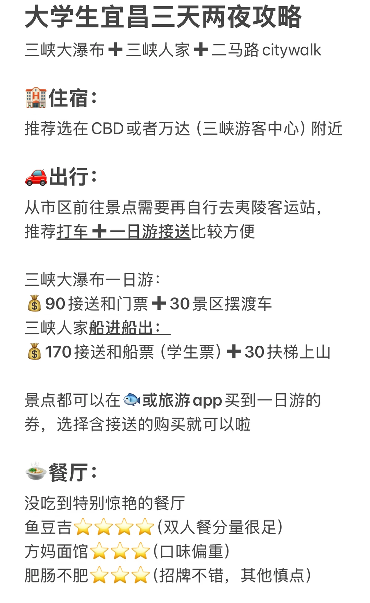
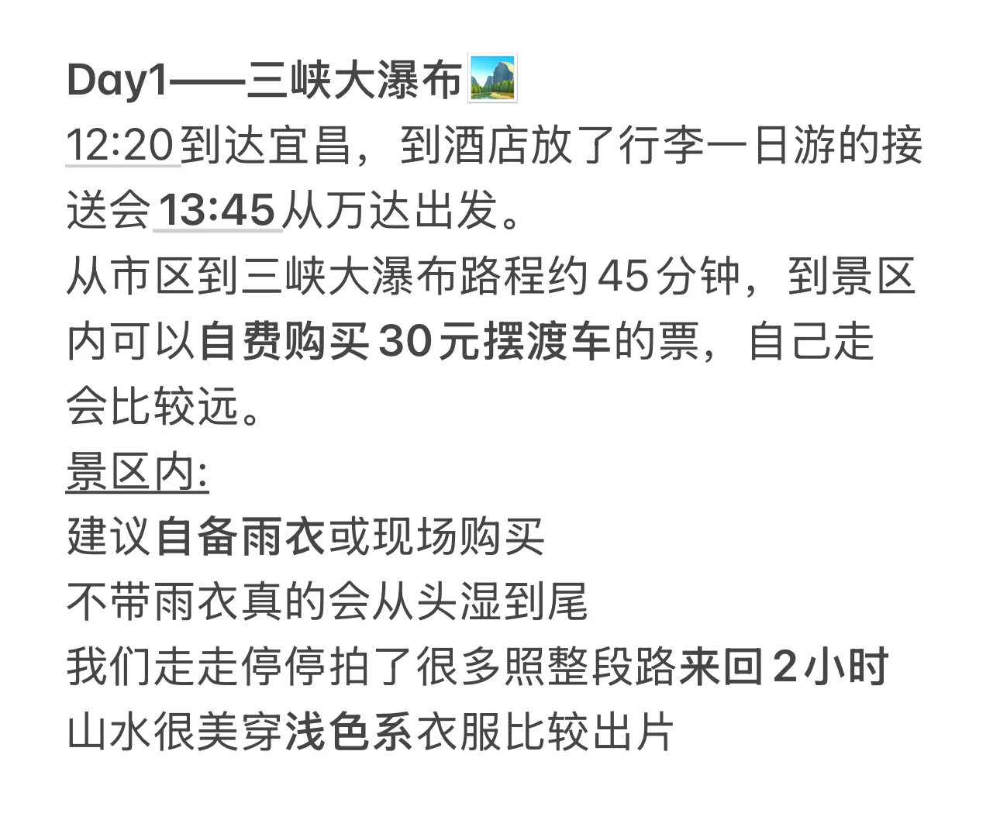
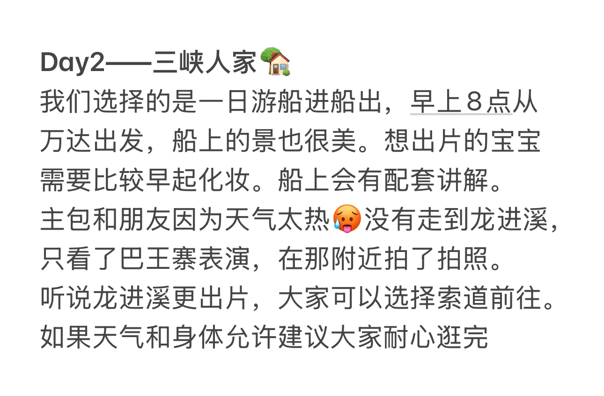
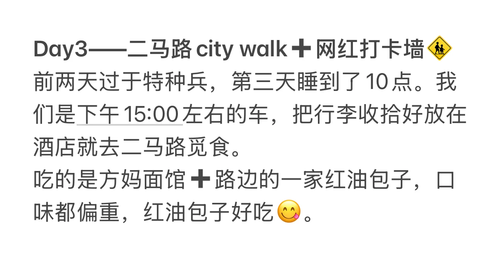
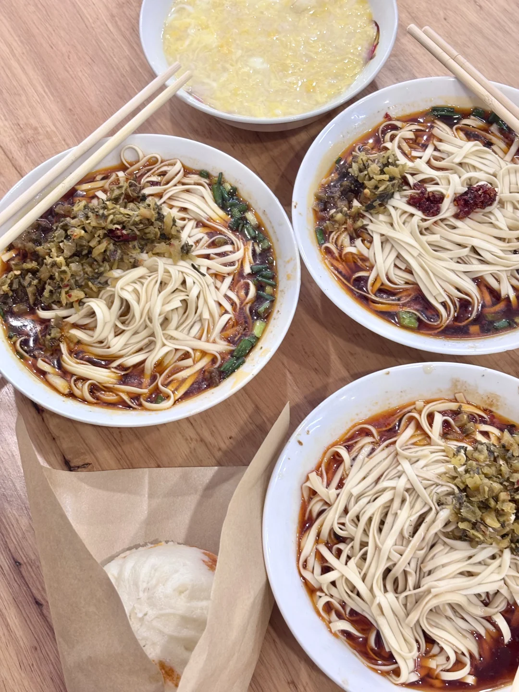
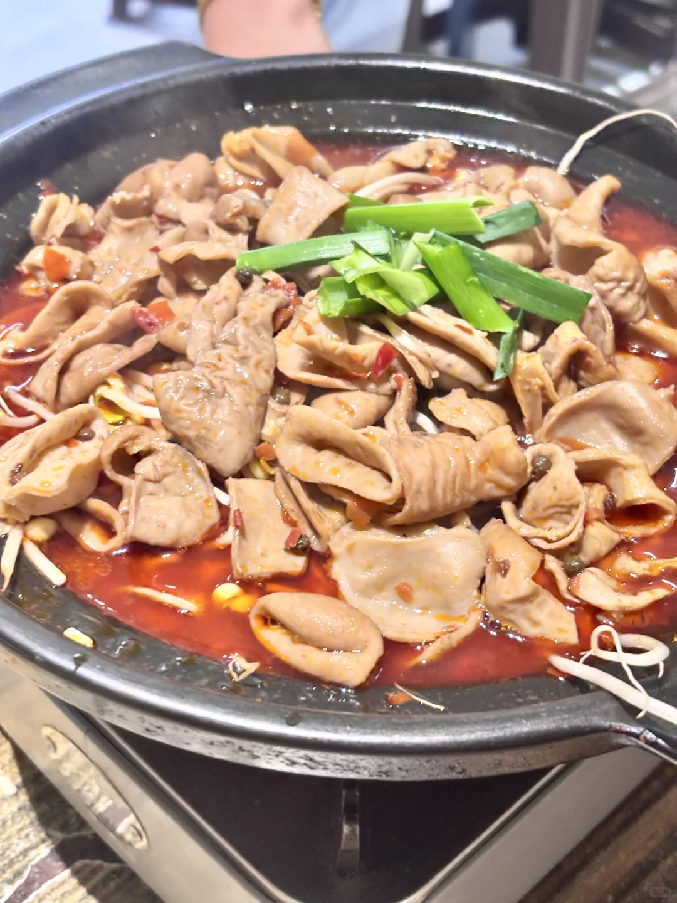
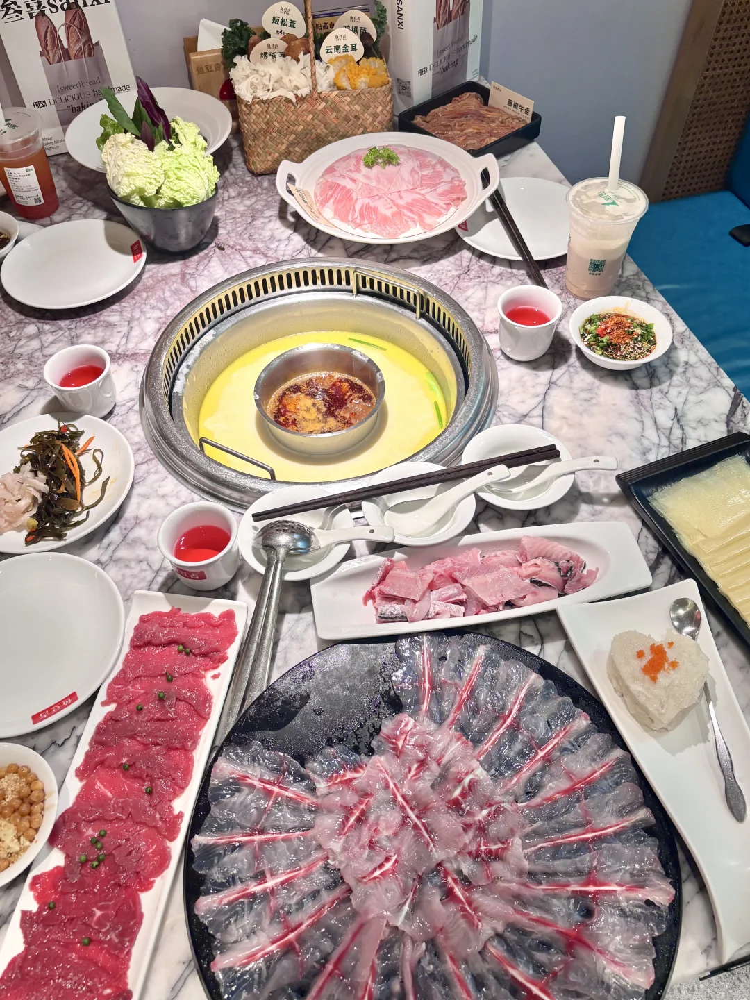
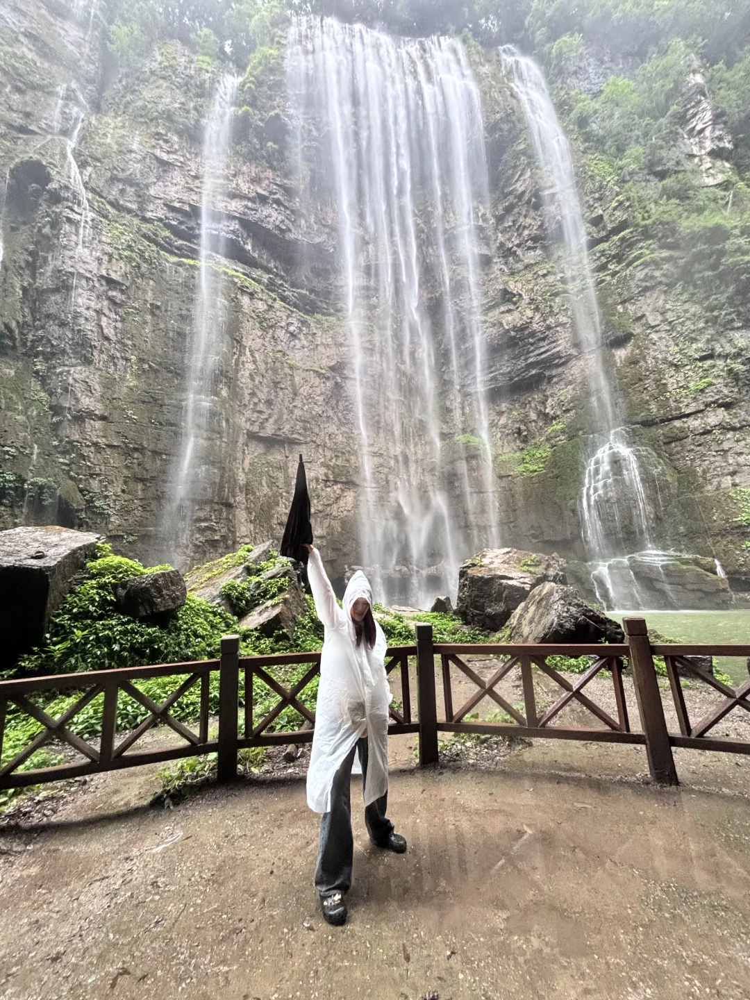
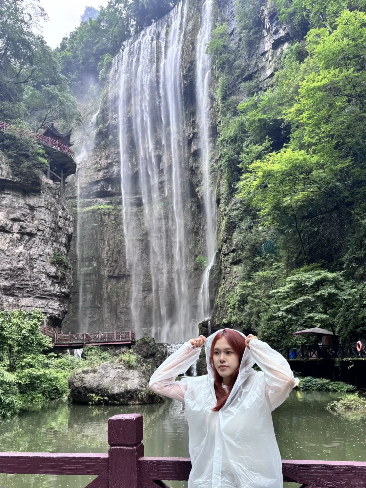

# 武汉➡️宜昌 三天两晚旅游攻略

- 作者: 虾仁猪心
- 👍1329 · 💬35 · ⭐955 · 图 11
- feed_id: 6891ec2b0000000022039731

> [OCR] 宜昌
武汉大学生
宜昌3天2晚旅游攻略

> [OCR] 大学生宜昌三天两夜攻略

三峡大瀑布 + 三峡人家 + 二马路 citywalk

🏡住宿：
推荐选在 CBD 或者万达（三峡游客中心）附近

🚗出行：
从市区前往景点需要再自行去夷陵客运站，
推荐打车 + 一日游接送比较方便

三峡大瀑布一日游：
💰90 接送和门票 + 30 景区摆渡车
三峡人家船进船出：
💰170 接送和船票（学生票）+ 30 扶梯上山

景点都可以在 鱼 或旅游 app 买到一日游的
券，选择含接送的购买就可以啦

🍜餐厅：
没吃到特别惊艳的餐厅
鱼豆吉 ★★★★☆ (双人餐分量很足)
方妈面馆 ★★★★☆ (口味偏重)
肥肠不肥 ★★★★☆ (招牌不错，其他慎点)

> [OCR] Day1——三峡大瀑布
12:20到达宜昌，到酒店放了行李一日游的接送会 13:45从万达出发。
从市区到三峡大瀑布路程约 45 分钟，到景区内可以自费购买 30 元摆渡车的票，自己走会比较远。
景区内:
建议自备雨衣或现场购买
不带雨衣真的会从头湿到尾
我们走走停停拍了很多照整段路来回 2 小时
山水很美穿浅色系衣服比较出片

> [OCR] Day2——三峡人家🏡
我们选择的是一日游船进船出，早上8点从万达出发，船上的景也很美。想出片的宝宝需要比较早起化妆。船上会有配套讲解。
主包和朋友因为天气太热💦没有走到龙进溪，
只看了巴王寨表演，在那附近拍了拍照。
听说龙进溪更出片，大家可以选择索道前往。
如果天气和身体允许建议大家耐心逛完

> [OCR] Day3——二马路 city walk+网红打卡墙👣
前两天过于特种兵，第三天睡到了10点。我们是下午15:00左右的车，把行李收拾好放在酒店就去二马路觅食。
吃的是方妈面馆+路边的一家红油包子，口味都偏重，红油包子好吃😊

> [OCR] [?]

> [OCR] OYEN G

> [OCR] 叁喜sanxi
sweet[bread]
FRESH DELICIOUS handmade
bakin
SANXI
三
藤椒牛舌
星宫妈
星宫妈
星宫妈
星宫妈
星宫妈
星宫妈
星宫妈
星宫妈

> [OCR] HOLA
宜昌
红星路
宜昌

> [OCR] system

> [OCR] [?]

## 正文
Day1三峡大瀑布➕Day2三峡人家➕Day3二马路citywalk
	
🏨住宿：
推荐选在CBD或者万达（三峡游客中心）附近
我们住的是九州方园大酒店(宜昌万达滨江店)，江景好看，非常推荐！
	
🚗出行：
从市区前往景点需要再自行去夷陵客运站，推荐打车➕一日游接送比较方便
三峡大瀑布一日游：
💰90接送和门票➕30景区摆渡车
三峡人家船进船出：
💰170接送和船票（学生票）➕30扶梯上山
景点都可以在🐟或旅游app买到一日游的券，选择含接送的购买就可以啦。
	
🍲餐厅：
没吃到特别惊艳的餐厅，有点遗憾，欢迎大家补充[皱眉R]
鱼豆吉⭐⭐⭐⭐（双人餐分量很足）
方妈面馆⭐⭐⭐（口味偏重）
肥肠不肥⭐⭐⭐（招牌不错，其他慎点）
	
#宜昌[话题]# #旅游攻略[话题]# #大学生特种兵旅游[话题]# #三天两夜[话题]# #三峡大瀑布[话题]# #三峡人家[话题]#

---