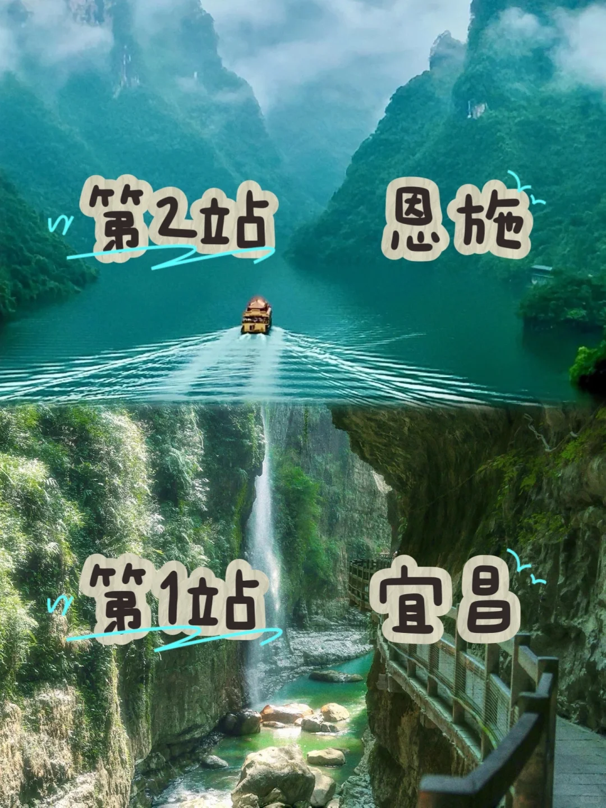
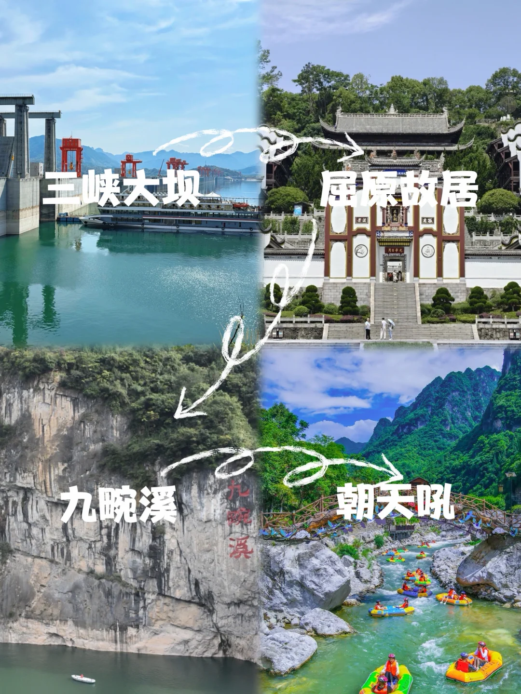
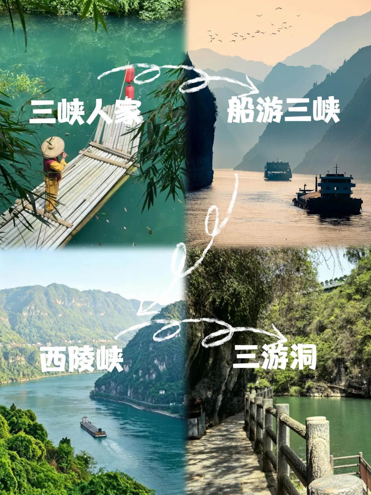
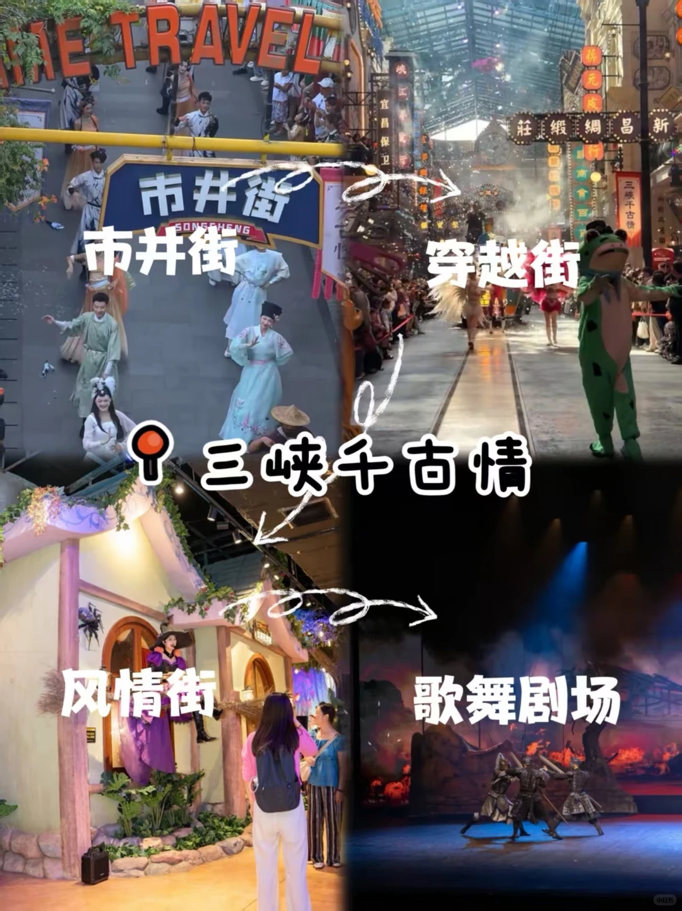
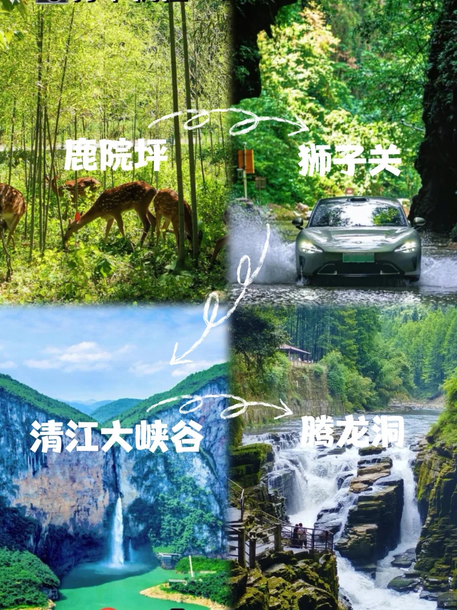
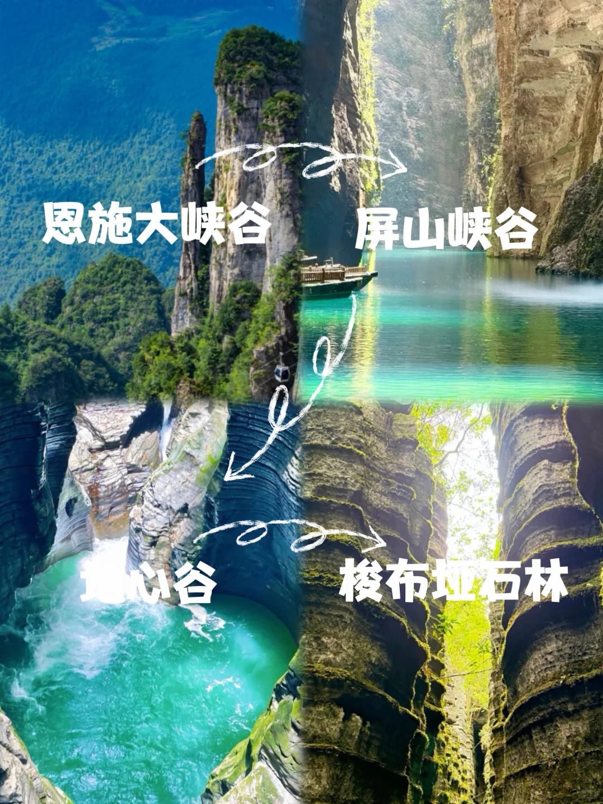

# 中国避暑胜地 宜昌+恩施

- 作者: 冯CC
- 👍1197 · 💬20 · ⭐932 · 图 6
- feed_id: 6a3a3de40000000011012745

> [OCR] 第2站 恩施
第1站 宜昌

> [OCR] 三峡大坝
屈原故居
九畹溪
朝天吼

> [OCR] 三峡人家
船游三峡

西陵峡
三游洞

> [OCR] THE TRAVEL
市井街
穿越街
三峡千古情
风情街
歌舞剧场

> [OCR] 鹿院坪
狮子关
清江大峡谷
腾龙洞

> [OCR] 恩施大峡谷
屏山峡谷
黄心谷
梭布娅石林

## 正文
恩施：
恩施必玩：恩施大峡谷、屏山峡谷、鹿院坪、狮子关、清江大峡谷、腾龙洞
💧 体感： 薄外套必备！ 常年22℃左右，晚上盖被！
✨ 爆点：
“中国坠美小地方”：万亩森林+云海☁️，推开窗就是水墨画！
悬崖梯田古村寨：土家吊脚楼错落山间，比油画还治愈！
野花山谷溯溪：沿着冰凉溪水找野百合，秒变森系少女！
宜昌必玩：三峡大坝 三峡人家 西陵峡 朝天吼 三峡千古情
宜昌朝天吼漂流，
漂流分三种：日漂、夜漂和洞漂
1⃣️日漂：全长6.5 公里，在感受落差带来的冲击感外，还能沿途欣赏峡谷风光，中途可上岸休息
2⃣️夜漂：跟日票是一条道，沿途会有美轮美奂的灯光秀，怕晒的可以选夜漂
3⃣️洞漂：全程约4.7公里，包含3.3公里的峽谷漂流和 1.4 公里的光影隧洞漂流，落差小，对新手小白很友好，这次我们还是选择了洞漂，洞漂会经过两个溶洞：乾元洞和坤元洞，洞中光影流转很奇幻。
三峡千古情这点必须夸❗️天棚+全域“空调”：室内20度逛园，头发丝都没湿！棚顶遮太阳，转角就有空调风，完全不用“烤串式”暴走✅有电音泼水节 非常的清凉
多带衣服：民国装（穿越街）、度假裙（波西米亚街）、换洗衣物（泼水必湿）
#避暑[话题]# #宜昌旅游[话题]# #恩施旅游[话题]# #恩施和宜昌旅游[话题]# #武汉避暑去哪[话题]# #武汉周边[话题]# #恩施避暑[话题]# #宜昌避暑[话题]# #宜昌三峡千古情[话题]#

---