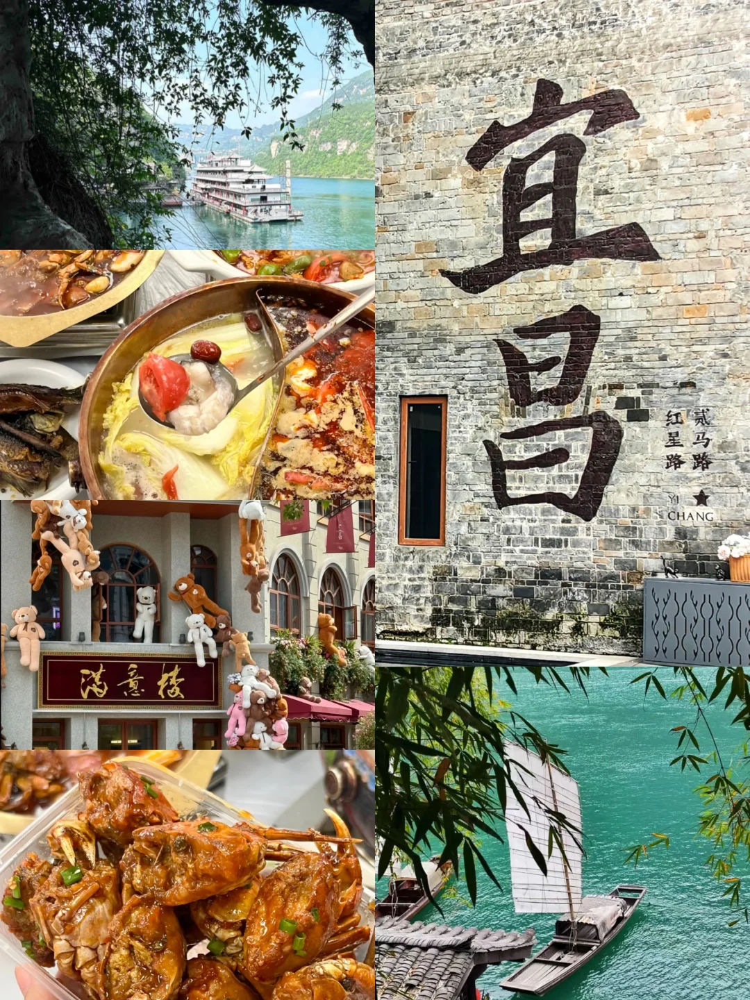
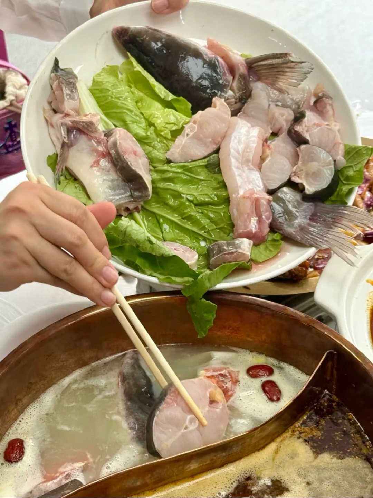
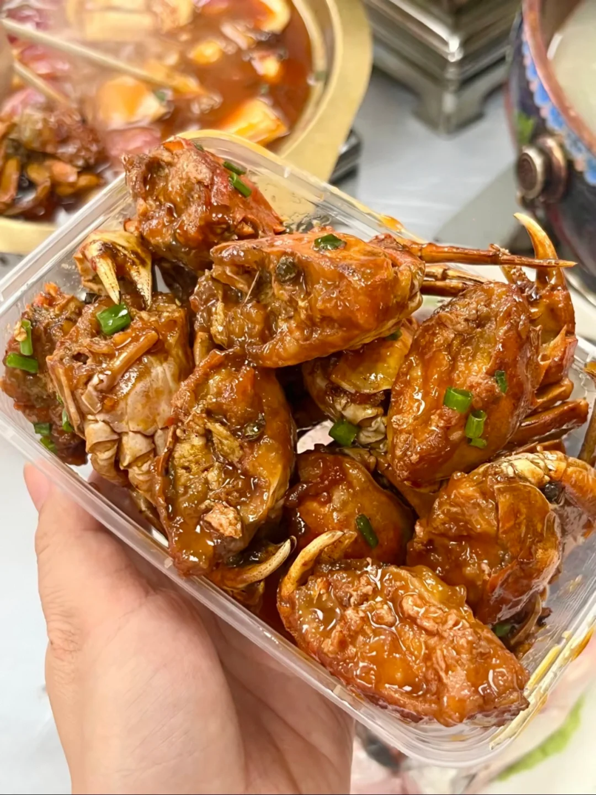
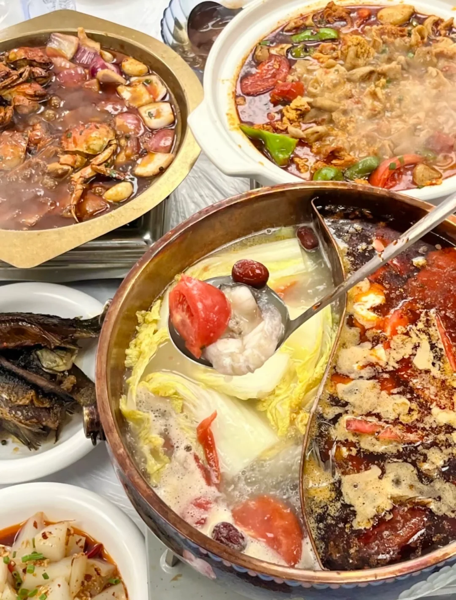
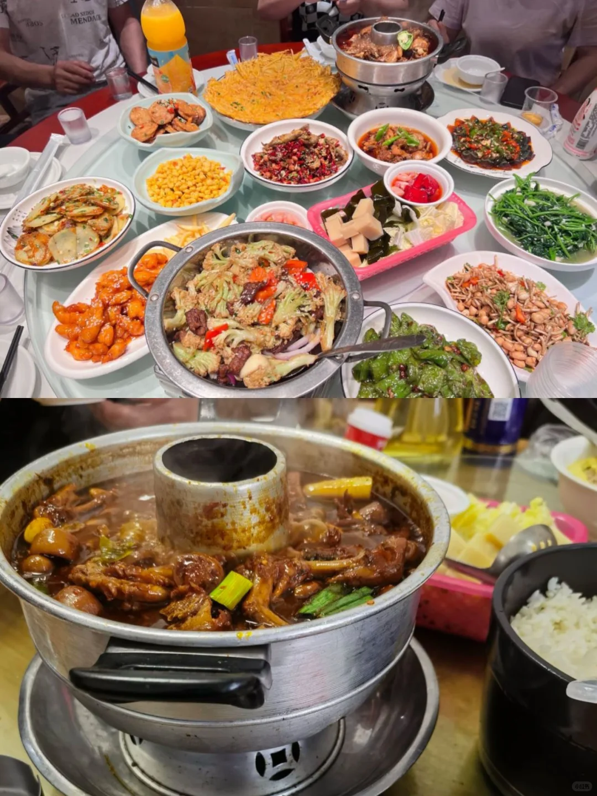
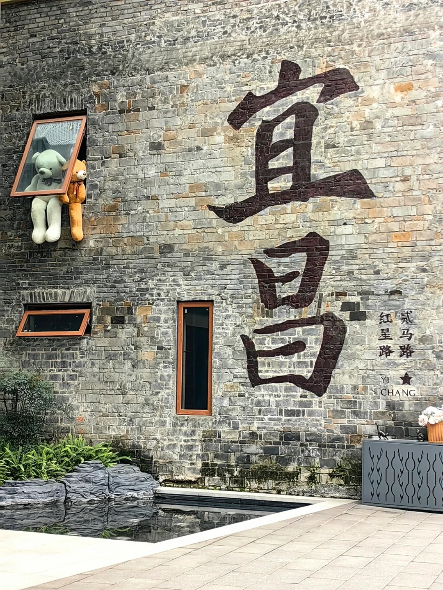

# 闪现宜昌！速交出我的2天1夜攻略！

- 作者: 小由笔记📒
- 👍1040 · 💬24 · ⭐539 · 图 9
- feed_id: 68dbbbc500000000070039af

> [OCR] 宜昌
满意楼
?[?]路
红星路
YI CHANG

> [OCR] [?]

> [OCR] [?]

> [OCR] [?]

> [OCR] 走进央视的
宜昌土菜代表

小雨天
xiaoyutian
CCTV2 CCTV4
上榜品牌

宜昌肥鱼美食地标餐厅

> [OCR] [?]

> [OCR] MENDAI
4305
ROAD SIDGE

> [OCR] 宜昌
红星路
贰马路
YI CHANG

## 正文
Day1️⃣ 三峡人家
需提前一天购票（船进119元/车进80元）
推荐船进路线，可欣赏西陵峡风光！！
景区内有巴王寨表演、悬棺等亮点
建议预留全天时间，注意最后一班船 17:30发船
	
Day2️⃣ 市区逛吃
📍二马路历史街区
复古建筑超好拍 民国风情拉满
	
重点来了！美食打卡清单👇
🍲小雨天和平土菜馆（陶珠路总店）
必点招牌肥鱼！汤底奶白巨鲜美
鱼肉嫩到入口即化 人均80吃到撑
本地人认证的老字号 饭点要排队
🐔又一村正宗郭场火锅鸡
藏在巷子里的宝藏店 鸡肉炖得超入味
配菜推荐加粉条和海带 蘸料是灵魂
人均60性价比天花板
	
Tips：两家店相距远 建议打车移动
住宿推荐地铁口附近，交通便利且景区直通车集中发车
	
#宜昌旅游[话题]# #三峡人家[话题]# #武汉周边游[话题]# #湖北美食[话题]# #旅游攻略[话题]#

---