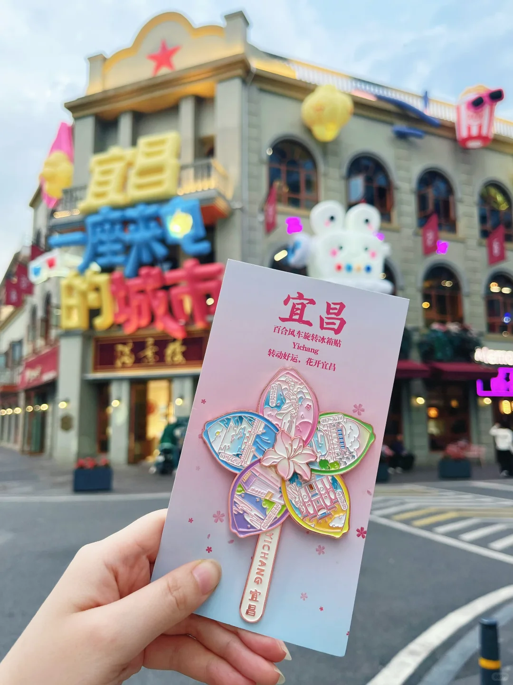
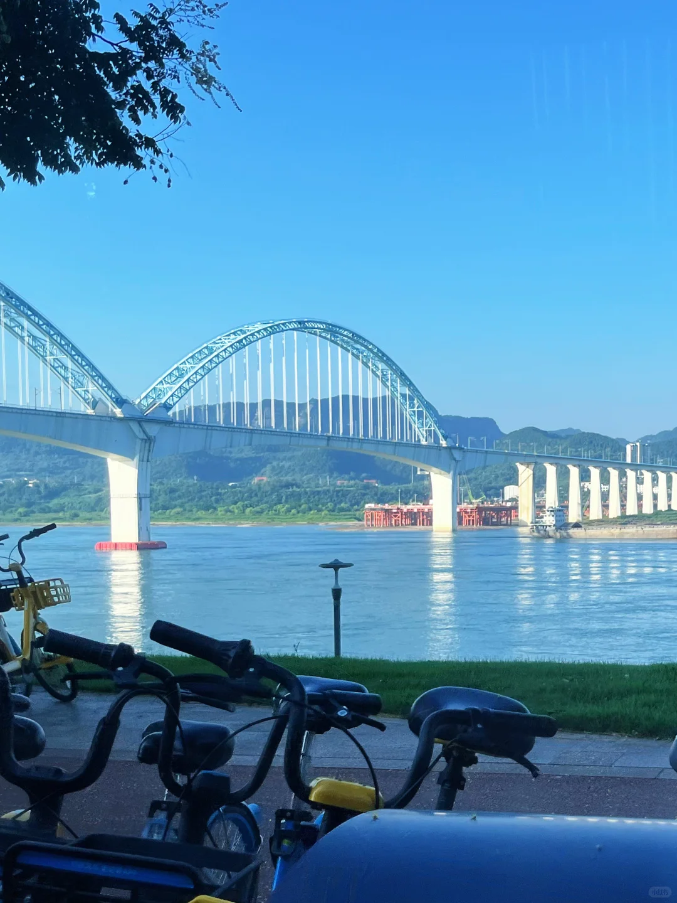
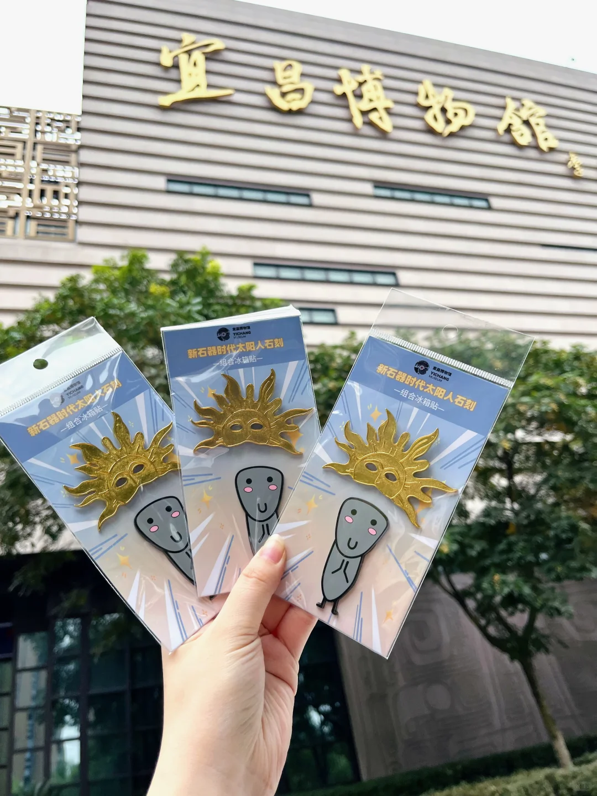
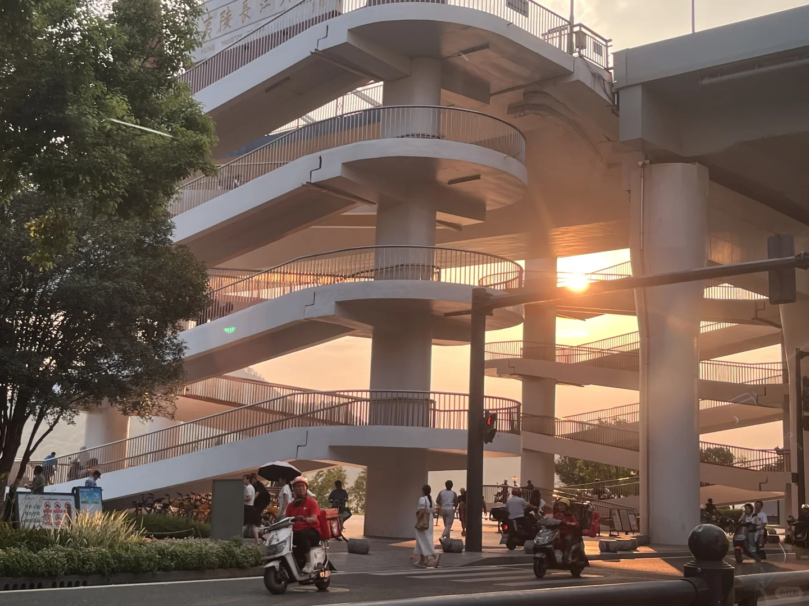
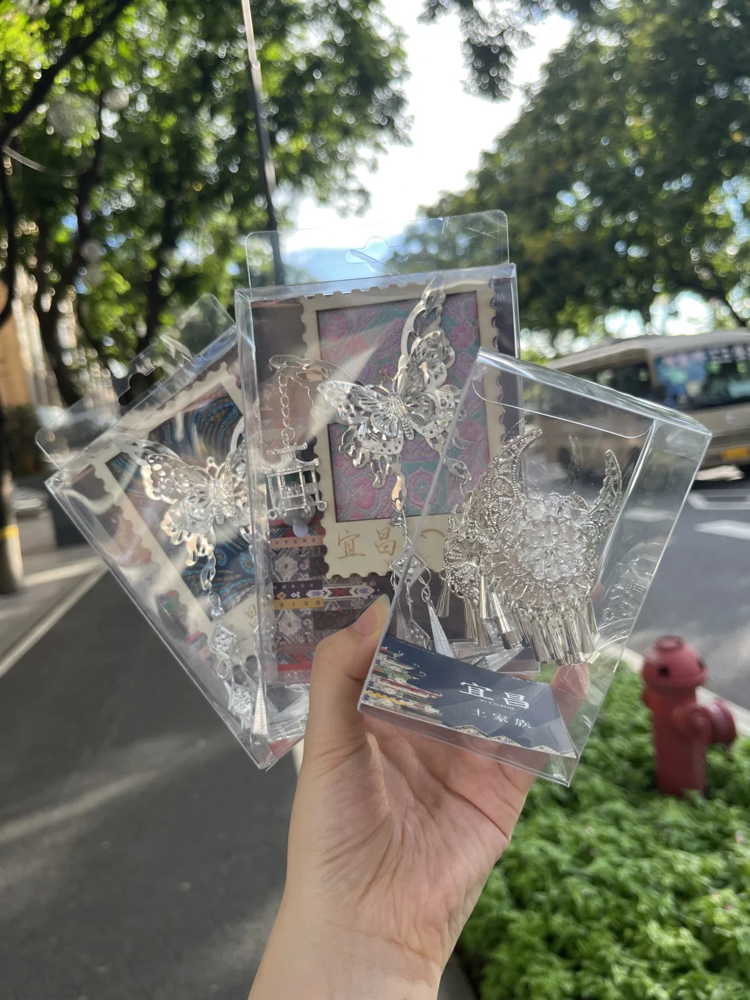
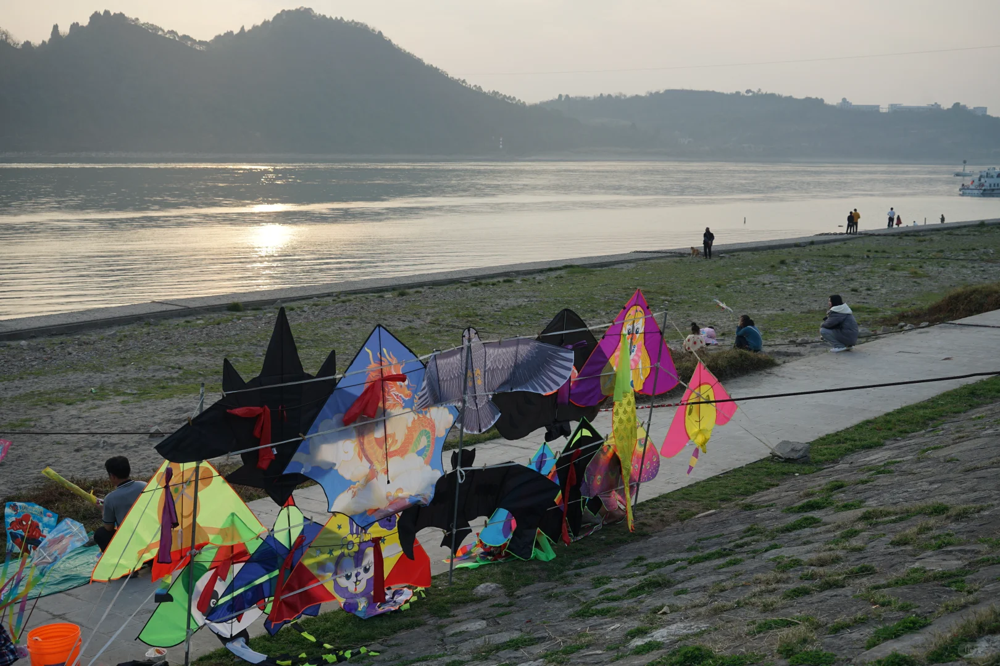
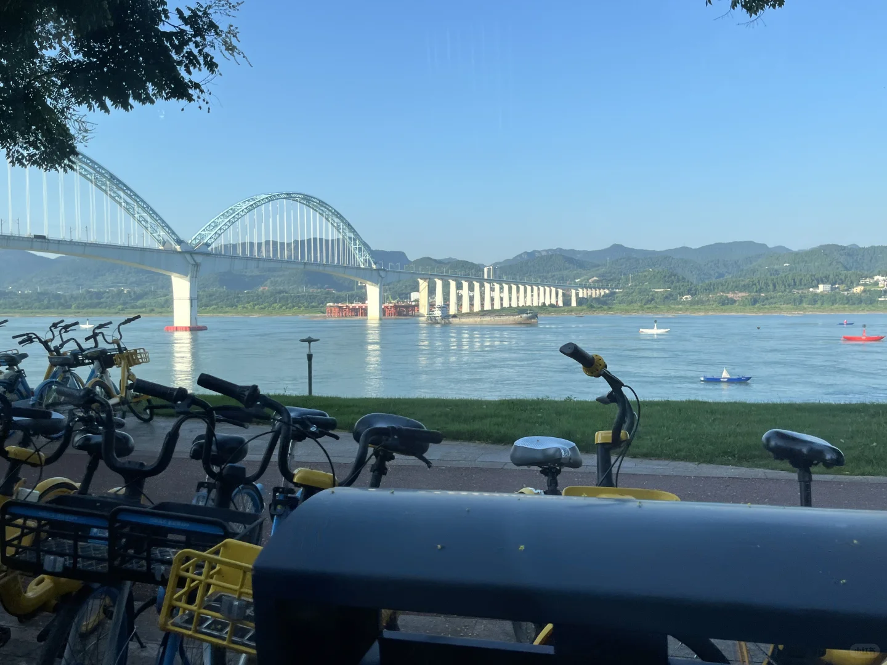
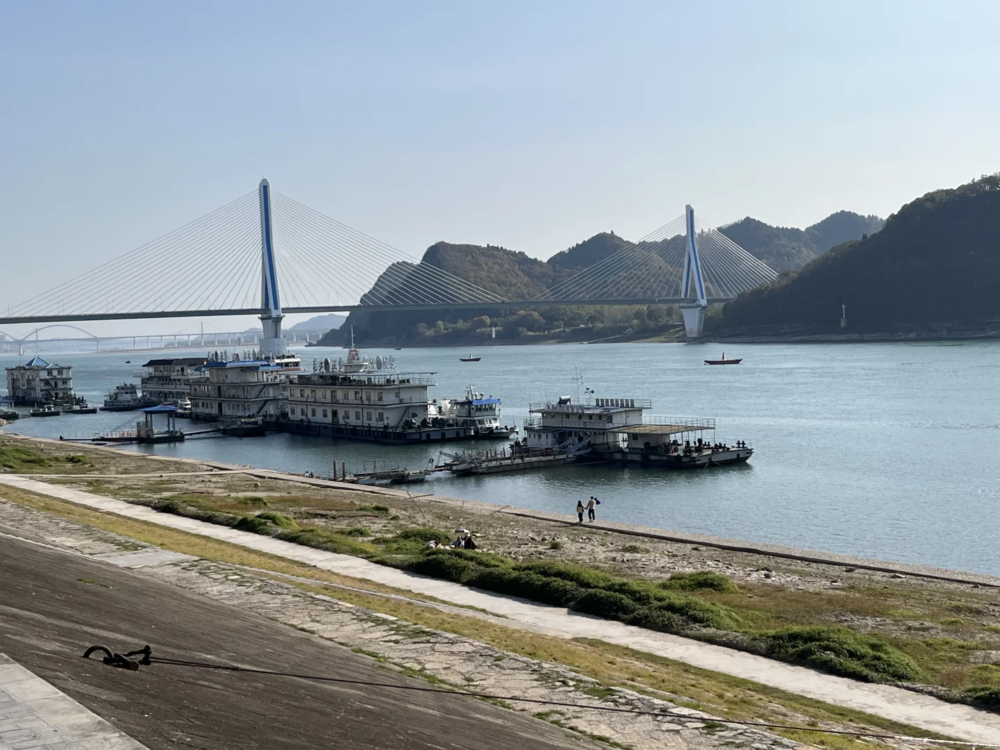

# 宜昌绝对是性价比天堂！最好的风景免费的

- 作者: momo
- 👍1030 · 💬114 · ⭐801 · 图 8
- feed_id: 6904b55e000000000302e2dc

> [OCR] 宜昌
一座来吧的城市
Yichang
转动好运，花开宜昌
宜昌
百合风车旋转冰箱贴
YICHANG 宜昌

> [OCR] 小红书

> [OCR] 宜昌博物館
新石器時代太陽人石刻
組合冰箱貼

> [OCR] 夷陵长江大桥
YING YANGTZE BRIDGE

> [OCR] 宜昌
[?]
宜昌

> [OCR] 蜘蛛侠

> [OCR] [?]

> [OCR] 长江三峡游船码头

## 正文
在宜昌进行了一场完美的Citywalk！这座江边小城，真的太值得了！✨
	
最好的风景，真的免费！
▪️ 二马路：从满意楼的老建筑开始逛起，在里面淘到了一个超可爱的百合风车旋转冰箱贴！粉粉嫩嫩，风车还能转，少女心直接满格！💖好吃的都在这附近！
▪️ 滨江公园：顺着二马路就走到了这里，看江水、看群山、等日落，长江的美景一览无余，完全免费！
▪️ 宜昌博物馆：宝藏博物馆！场馆又大又新，讲透了宜昌的前世今生，四楼是露天古镇，关键是——免预约！买了几个销冠冰箱贴，太抽象了，最适合当我诡秘的伴手礼，
▪️ G348国道：不愧是中国顶美的公路！自驾其中，车在画中行，也是完全不收费的绝美风景线！
	
🍜 最好的美食，10元封顶！
▪️ 3元的桂花大饼：满满的肉香和油香，太扎实了，一个就饱了
▪️10元4条的魔鬼小黄鱼：好吃哭了，不能吃辣的一定要点不辣，相当于别处的中辣[石化R]
▪️3 元一块豆腐的胡子婆婆：放满了折耳根泡菜辣椒，一口下去太满足了
▪️8元的泰哥洋芋拌面：来自本地人的肯定，非常美味！真材实料，年轻老板，干净卫生。
▪️ 7元的厕所米线：真的好好吃，非常浓郁的味道，宜昌最好吃的米线！
▪️ 6r的萝卜饺子：外酥里糯，一口下去全是满足感！
▪️ 2r的红油包子：松软包子浸满红油，香迷糊了！
▪️ 5r的红油小面：本地人的早餐灵魂
▪️ 3r的凉虾：逛吃一天后喝一杯，冰冰凉凉，解渴又解腻！
	
总结：玩得充实，吃得酣畅。免费的山川江河与人间烟火，才是这座城市的顶级魅力吧！
#宜昌性价比之王[话题]# #宜昌免费景点打卡[话题]# #宜昌美食攻略[话题]#
#宜昌太值得了[话题]# #citywalk[话题]# #宜昌[话题]# #宜昌博物馆[话题]##演唱会[话题]##宜昌演唱会[话题]# #宜昌旅游攻略[话题]#

---