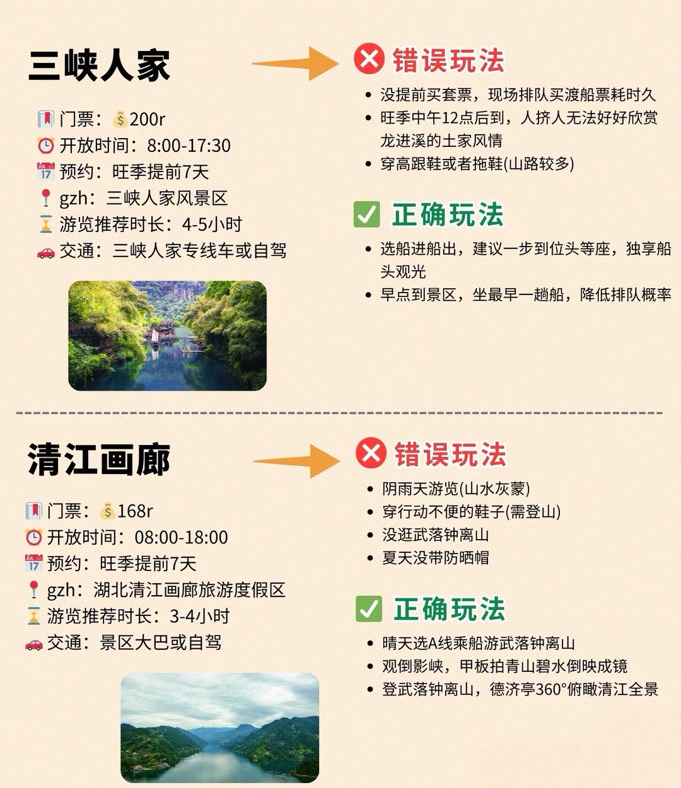
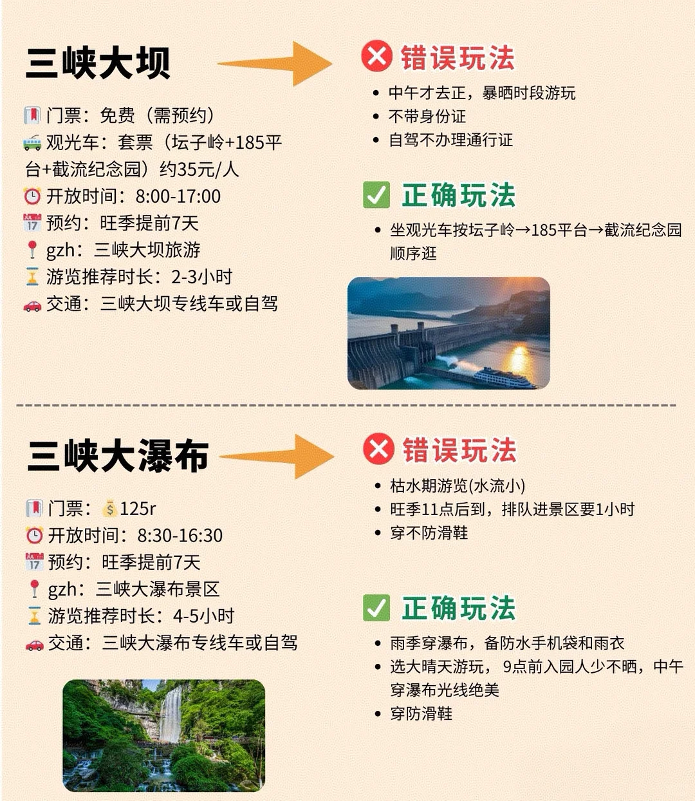
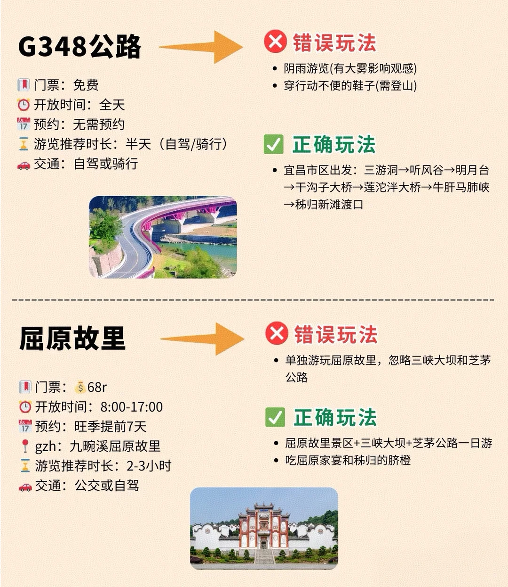
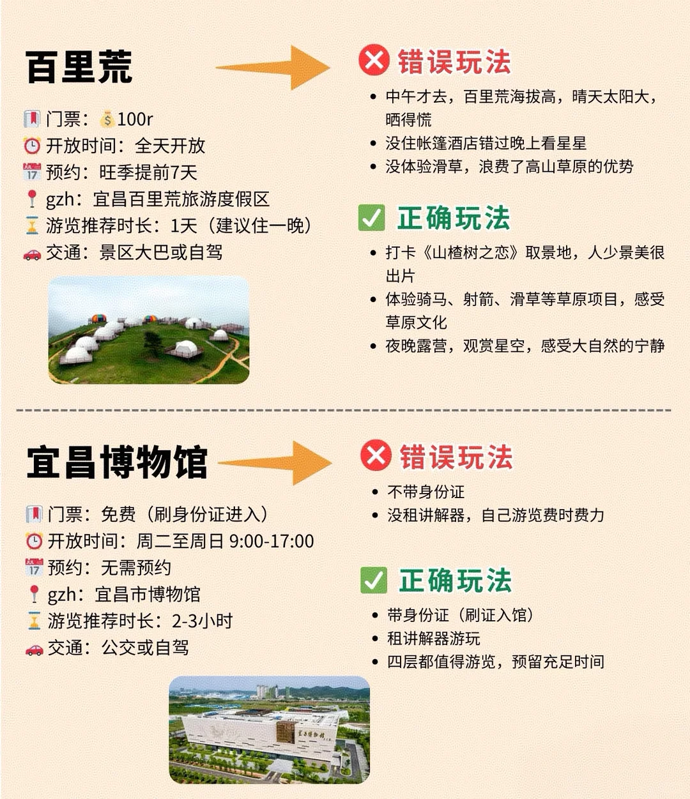
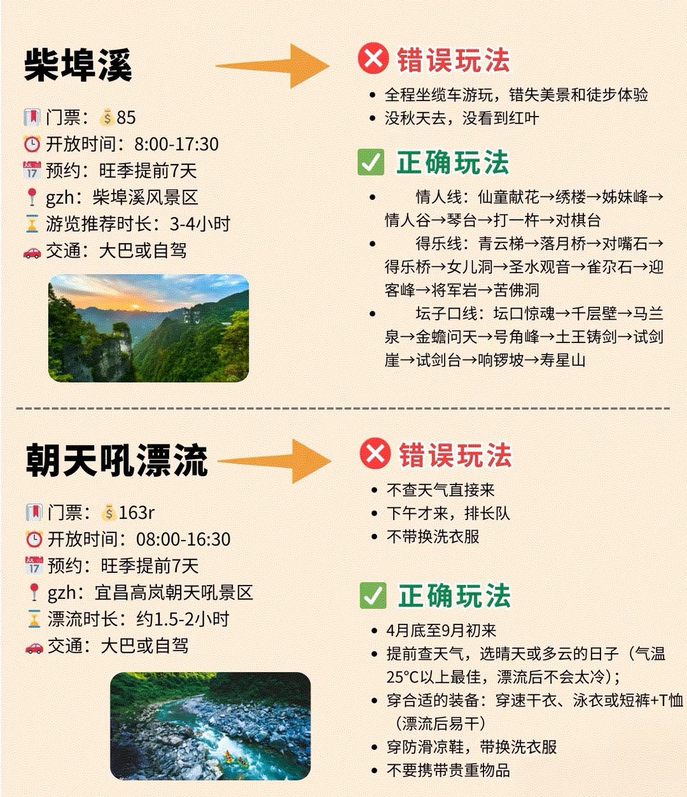

# 宜昌超省事玩法，get起来

- 作者: momo
- 👍941 · 💬16 · ⭐978 · 图 5
- feed_id: 68f9ab39000000000301a3de

> [OCR] 三峡人家

门票：$200r
开放时间：8:00-17:30
预约：旺季提前7天
gzh：三峡人家风景区
游览推荐时长：4-5小时
交通：三峡人家专线车或自驾

错误玩法
• 没提前买套票，现场排队买渡船票耗时久
• 旺季中午12点后到，人挤人无法好好欣赏龙进溪的土家风情
• 穿高跟鞋或者拖鞋(山路较多)

正确玩法
• 选船进船出，建议一步到位头等座，独享船头观光
• 早点到景区，坐最早一趟船，降低排队概率

清江画廊

门票：$168r
开放时间：08:00-18:00
预约：旺季提前7天
gzh：湖北清江画廊旅游度假区
游览推荐时长：3-4小时
交通：景区大巴或自驾

错误玩法
• 阴雨天游览(山水灰蒙)
• 穿行动不便的鞋子(需登山)
• 没逛武落钟离山
• 夏天没带防晒帽

正确玩法
• 晴天选A线乘船游武落钟离山
• 观倒影峡，甲板拍青山碧水倒映成镜
• 登武落钟离山，德济亭360°俯瞰清江全景

> [OCR] 三峡大坝

门票：免费（需预约）
观光车：套票（坛子岭+185平台+截流纪念园）约35元/人
开放时间：8:00-17:00
预约：旺季提前7天
gzh：三峡大坝旅游
游览推荐时长：2-3小时
交通：三峡大坝专线车或自驾

错误玩法
• 中午才去正，暴晒时段游玩
• 不带身份证
• 自驾不办理通行证

正确玩法
• 坐观光车按坛子岭→185平台→截流纪念园顺序逛

三峡大瀑布

门票：$ 125r
开放时间：8:30-16:30
预约：旺季提前7天
gzh：三峡大瀑布景区
游览推荐时长：4-5小时
交通：三峡大瀑布专线车或自驾

错误玩法
• 枯水期游览(水流小)
• 旺季11点后到，排队进景区要1小时
• 穿不防滑鞋

正确玩法
• 雨季穿瀑布，备防水手机袋和雨衣
• 选大晴天游玩，9点前入园人少不晒，中午穿瀑布光线绝美
• 穿防滑鞋

> [OCR] G348公路

门票：免费
开放时间：全天
预约：无需预约
游览推荐时长：半天（自驾/骑行）
交通：自驾或骑行

错误玩法
- 阴雨游览(有大雾影响观感)
- 穿行动不便的鞋子(需登山)

正确玩法
- 宜昌市区出发：三游洞→听风谷→明月台
→干沟子大桥→莲沱洋大桥→牛肝马肺峡
→秭归新滩渡口

屈原故里

门票：$68r
开放时间：8:00-17:00
预约：旺季提前7天
gzh：九畹溪屈原故里
游览推荐时长：2-3小时
交通：公交或自驾

错误玩法
- 单独游玩屈原故里，忽略三峡大坝和芝茅公路

正确玩法
- 屈原故里景区+三峡大坝+芝茅公路一日游
- 吃屈原家宴和秭归的脐橙

> [OCR] 百里荒

门票：100r
开放时间：全天开放
预约：旺季提前7天
gzh：宜昌百里荒旅游度假区
游览推荐时长：1天（建议住一晚）
交通：景区大巴或自驾

错误玩法
- 中午才去，百里荒海拔高，晴天太阳大，
晒得慌
- 没住帐篷酒店错过晚上看星星
- 没体验滑草，浪费了高山草原的优势

正确玩法
- 打卡《山楂树之恋》取景地，人少景美很出片
- 体验骑马、射箭、滑草等草原项目，感受草原文化
- 夜晚露营，观赏星空，感受大自然的宁静

宜昌博物馆

门票：免费（刷身份证进入）
开放时间：周二至周日9:00-17:00
预约：无需预约
gzh：宜昌市博物馆
游览推荐时长：2-3小时
交通：公交或自驾

错误玩法
- 不带身份证
- 没租讲解器，自己游览费时费力

正确玩法
- 带身份证（刷证入馆）
- 租讲解器游玩
- 四层都值得游览，预留充足时间

> [OCR] 柴埠溪

门票：$85
开放时间：8:00-17:30
预约：旺季提前7天
gzh：柴埠溪风景区
游览推荐时长：3-4小时
交通：大巴或自驾

朝天吼漂流

门票：$163r
开放时间：08:00-16:30
预约：旺季提前7天
gzh：宜昌高岚朝天吼景区
漂流时长：约1.5-2小时
交通：大巴或自驾

错误玩法
• 全程坐缆车游玩，错失美景和徒步体验
• 没秋天去，没看到红叶

正确玩法
• 情人线：仙童献花→绣楼→姊妹峰→情人谷→琴台→打一杵→对棋台
• 得乐线：青云梯→落月桥→对嘴石→得乐桥→女儿洞→圣水观音→雀尕石→迎客峰→将军岩→苦佛洞
• 坛子口线：坛口惊魂→千层壁→马兰泉→金蟾问天→号角峰→土王铸剑→试剑崖→试剑台→响锣坡→寿星山

错误玩法
• 不查天气直接来
• 下午才来，排长队
• 不带换洗衣服

正确玩法
• 4月底至9月初来
• 提前查天气，选晴天或多云的日子（气温25℃以上最佳，漂流后不会太冷）；
• 穿合适的装备：穿速干衣、泳衣或短裤+T恤（漂流后易干）
• 穿防滑凉鞋，带换洗衣服
• 不要携带贵重物品

## 正文
第一次来宜昌 正确玩法✅错误玩法❌
宝子们，宜昌这座被长江"抱在怀里"的城市，一半是三峡的壮阔底色（大坝、漂流、清江画廊），一半是市井的温情脉络（过早、夜市、老街）。但第一次来玩，要是没搞懂正确打开方式，很容易踩坑。这篇"不踩雷指南"，手把手教你玩对宜昌，快码住#宜昌旅游[话题]#

---