# 周末48小时宜昌自驾游攻略（超详细）

- 作者: 周末出逃NPC
- 👍871 · 💬38 · ⭐793 · 图 17
- feed_id: 68888094000000000403e61b

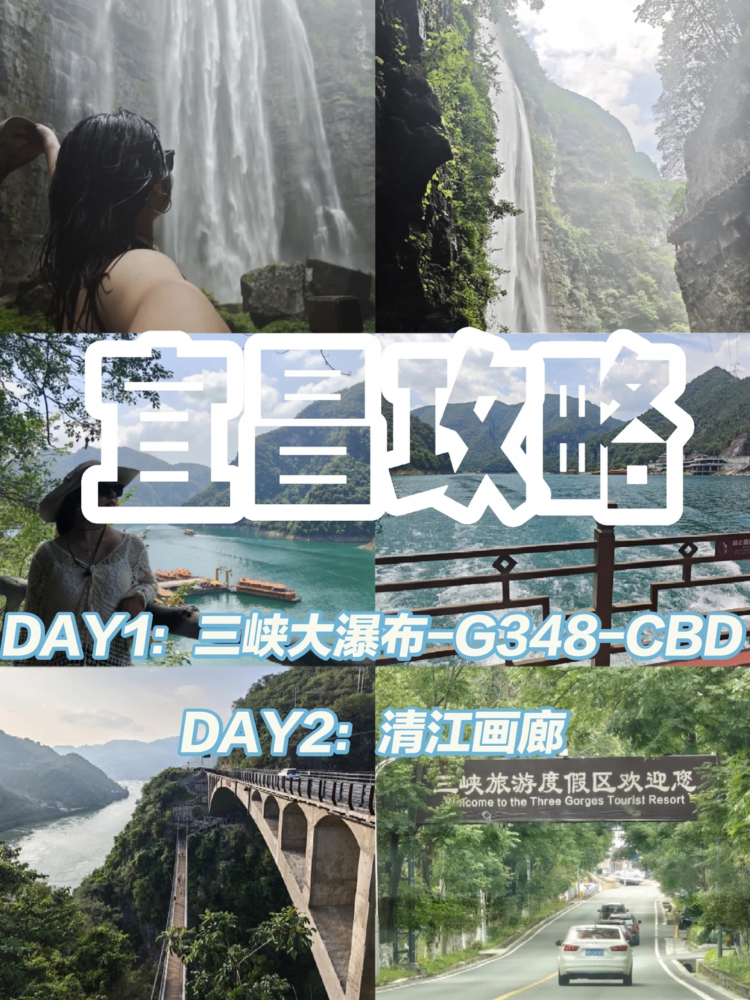
> [OCR] 宜昌攻略
DAY1: 三峡大瀑布-G348-CBD
DAY2: 清江画廊
欢迎来到三峡旅游度假区
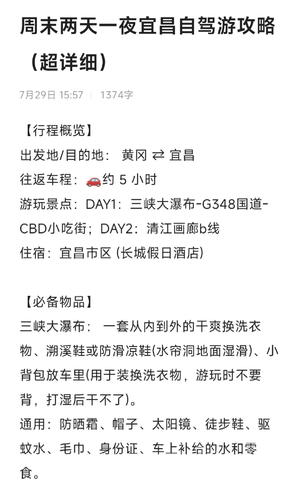
> [OCR] 周末两天一夜宜昌自驾游攻略
(超详细)

7月29日 15:57 | 1374字

【行程概览】
出发地/目的地：黄冈 ⇄ 宜昌
往返车程：🚗 约 5 小时
游玩景点：DAY1：三峡大瀑布-G348国道-CBD小吃街；DAY2：清江画廊b线
住宿：宜昌市区 (长城假日酒店)

【必备物品】
三峡大瀑布：一套从内到外的干爽换洗衣物、溯溪鞋或防滑凉鞋(水帘洞地面湿滑)、小背包放车里(用于装换洗衣物，游玩时不要背，打湿后干不了)。
通用：防晒霜、帽子、太阳镜、徒步鞋、驱蚊水、毛巾、身份证、车上补给的水和零食。
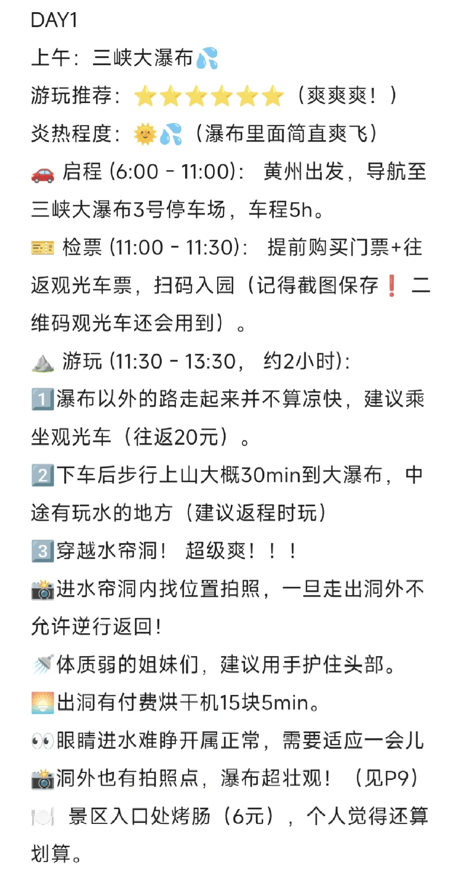
> [OCR] DAY1

上午：三峡大瀑布💦

游玩推荐：★★★★★爽爽爽！

炎热程度：☀️💦（瀑布里面简直爽飞）

🚗启程(6:00-11:00)：黄州出发，导航至三峡大瀑布3号停车场，车程5h。

🎫检票(11:00-11:30)：提前购买门票+往返观光车票，扫码入园（记得截图保存！二维码观光车还会用到）。

🏞️游玩(11:30-13:30，约2小时)：

①瀑布以外的路走起来并不算凉快，建议乘坐观光车（往返20元）。

②下车后步行上山大概30min到大瀑布，中途有玩水的地方（建议返程时玩）

③穿越水帘洞！超级爽！！！

📸进水帘洞内找位置拍照，一旦走出洞外不允许逆行返回！

💦体质弱的姐妹们，建议用手护住头部。

🌞出洞有付费烘干机15块5min。

👀眼睛进水难睁开属正常，需要适应一会儿

📷洞外也有拍照点，瀑布超壮观！（见P9）

🍖景区入口处烤肠(6元)，个人觉得还算划算。
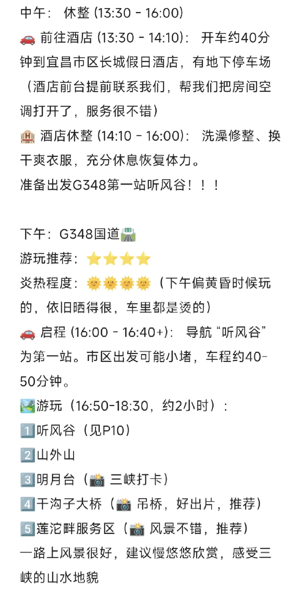
> [OCR] 中午： 休整 (13:30 - 16:00)

🚗 前往酒店 (13:30 - 14:10)： 开车约40分钟到宜昌市区长城假日酒店，有地下停车场（酒店前台提前联系我们，帮我们把房间空调打开了，服务很不错）

🏨 酒店休整 (14:10 - 16:00)： 洗澡修整、换干爽衣服，充分休息恢复体力。

准备出发G348第一站听风谷！！！

下午： G348国道 🚙

游玩推荐： ★★★★☆

☀️☀️☀️☀️☀️（下午偏黄昏时候玩的，依旧晒得很，车里都是烫的）

🚗 启程 (16:00 - 16:40+)： 导航“听风谷”为第一站。市区出发可能小堵，车程约40-50分钟。

🏞️ 游玩（16:50-18:30，约2小时）：

① 听风谷 (见P10)

② 山外山

③ 明月台 (📸 三峡打卡)

④ 干沟子大桥 (📸 吊桥，好出片，推荐)

⑤ 莲沱畔服务区 (📸 风景不错，推荐)

一路上风景很好，建议慢悠悠欣赏，感受三峡的山水地貌
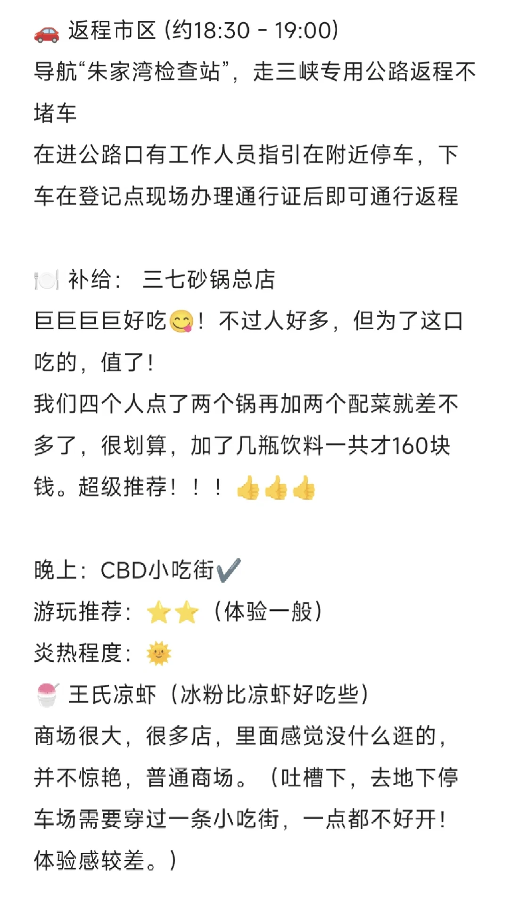
> [OCR] 返程市区 (约18:30 - 19:00)
导航“朱家湾检查站”，走三峡专用公路返程不堵车
在进公路口有工作人员指引在附近停车，下车在登记点现场办理通行证后即可通行返程

补给：三七砂锅总店
巨巨巨巨好吃😊！不过人好多，但为了这口吃的，值了！
我们四个人点了两个锅再加两个配菜就差不多了，很划算，加了几瓶饮料一共才160块钱。超级推荐！！！👍👍👍

晚上：CBD小吃街✅
游玩推荐：⭐⭐（体验一般）
炎热程度：🌞

王氏凉虾（冰粉比凉虾好吃些）
商场很大，很多店，里面感觉没什么逛的，并不惊艳，普通商场。（吐槽下，去地下停车场需要穿过一条小吃街，一点都不好开！体验感较差。）
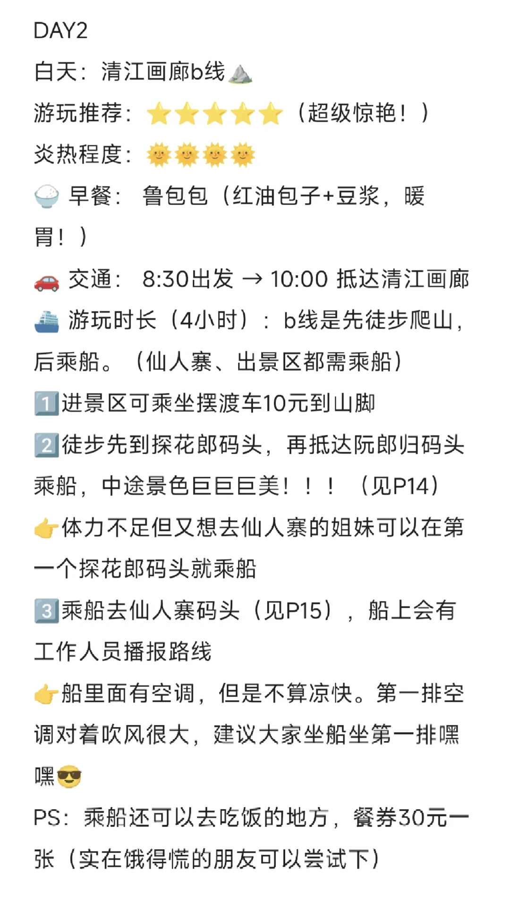
> [OCR] DAY2

白天：清江画廊b线⛰️
游玩推荐：★★★★★（超级惊艳！）
炎热程度：🌞🌞🌞🌞🌞

🍚早餐：鲁包包（红油包子+豆浆，暖胃！）

🚗交通：8:30出发→10:00抵达清江画廊
🚢游玩时长（4小时）：b线是先徒步爬山，
后乘船。（仙人寨、出景区都需乘船）
1进景区可乘坐摆渡车10元到山脚
2徒步先到探花郎码头，再抵达阮郎归码头乘船，中途景色巨巨巨美！！！（见P14）
👍体力不足但又想去仙人寨的姐妹可以在第一个探花郎码头就乘船
3乘船去仙人寨码头（见P15），船上会有工作人员播报路线
👍船里面有空调，但是不算凉快。第一排空调对着吹风很大，建议大家坐船坐第一排嘿嘿😎
PS：乘船还可以去吃饭的地方，餐券30元一张（实在饿得慌的朋友可以尝试下）
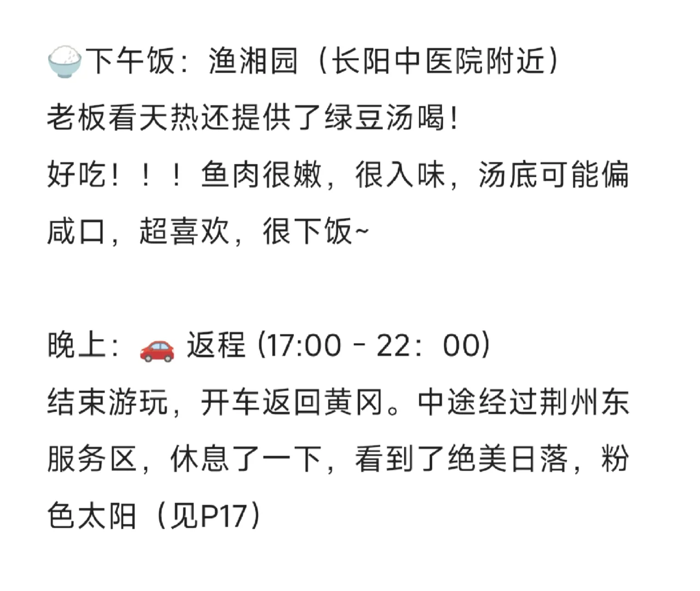
> [OCR] 🍚下午饭：渔湘园（长阳中医院附近）
老板看天热还提供了绿豆汤喝！
好吃！！！鱼肉很嫩，很入味，汤底可能偏咸口，超喜欢，很下饭~

🚗晚上返程(17:00-22:00)
结束游玩，开车返回黄冈。中途经过荆州东服务区，休息了一下，看到了绝美日落，粉色太阳（见P17）
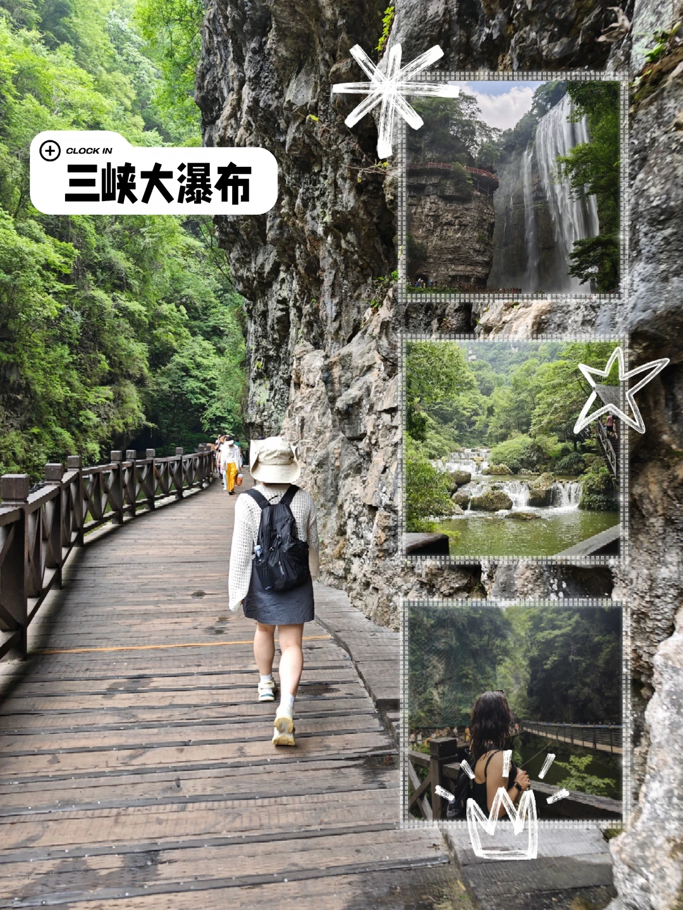
> [OCR] + CLOCK IN
三峡大瀑布
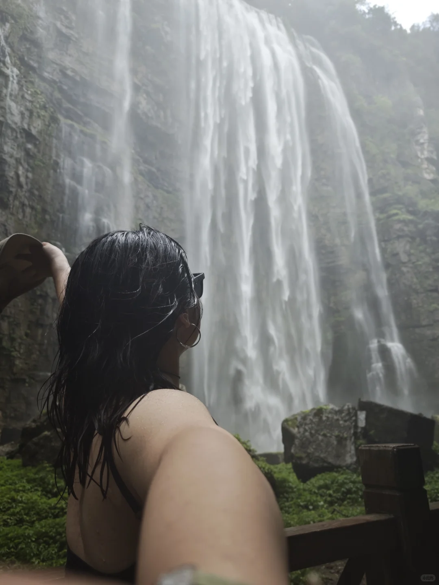
> [OCR] 0425
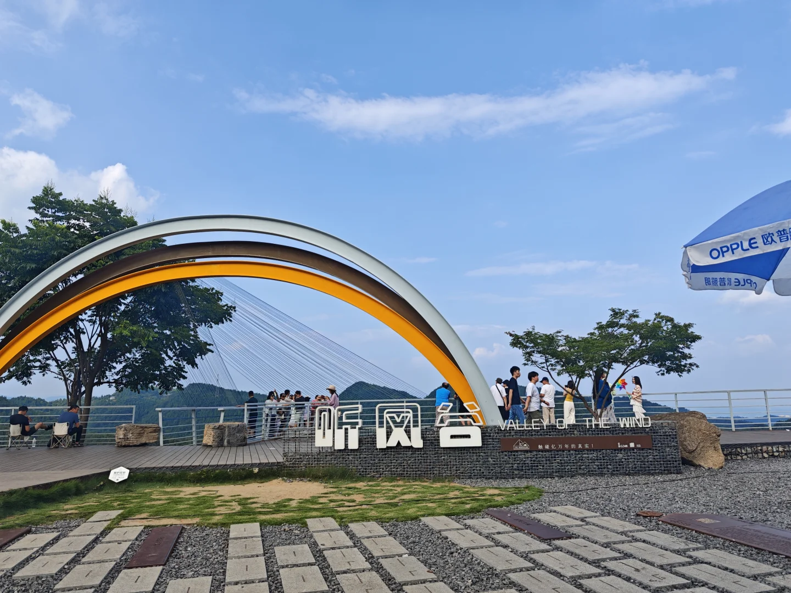
> [OCR] 听风台
VALLEY OF THE WIND
触碰亿万年的[?]
OPPLE 欧普
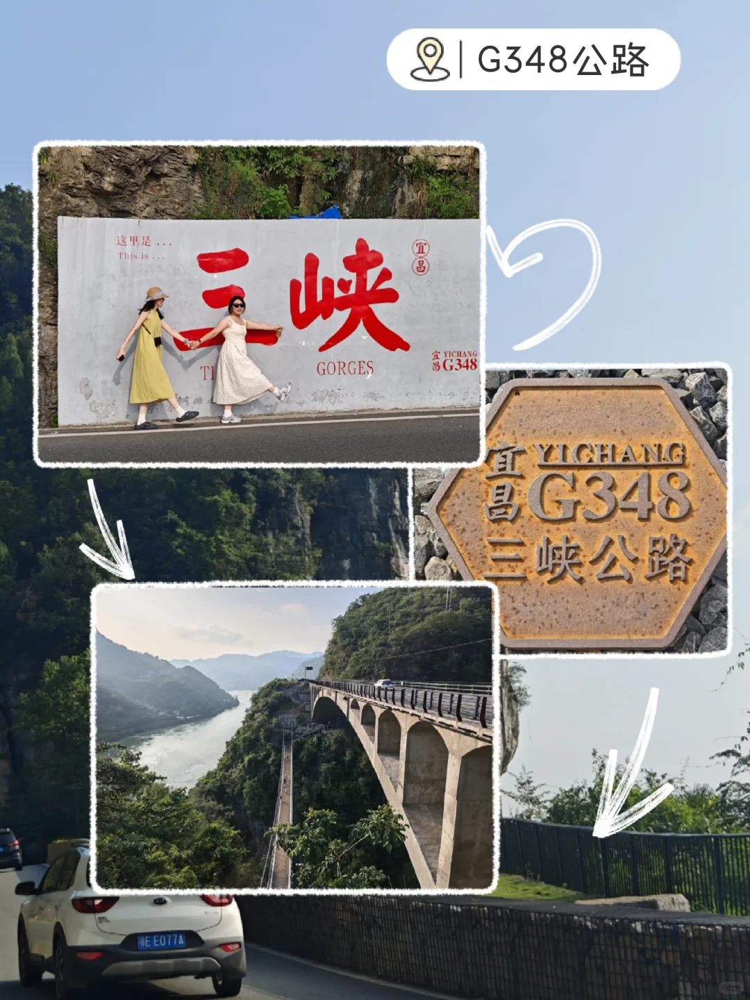
> [OCR] 这里是...
This is ...
三峡
GORGES
宜昌 G348
YICHANG
宜昌 G348
三峡公路
E E077A
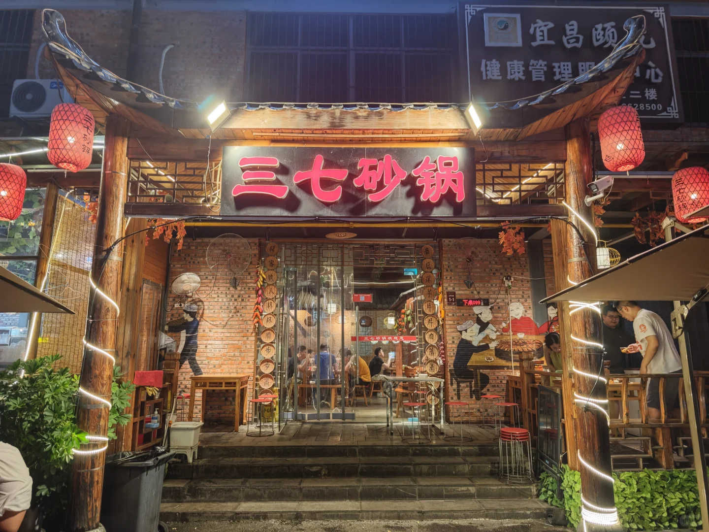
> [OCR] 三七砂锅
三七砂锅
健康管理中心
二楼
628500
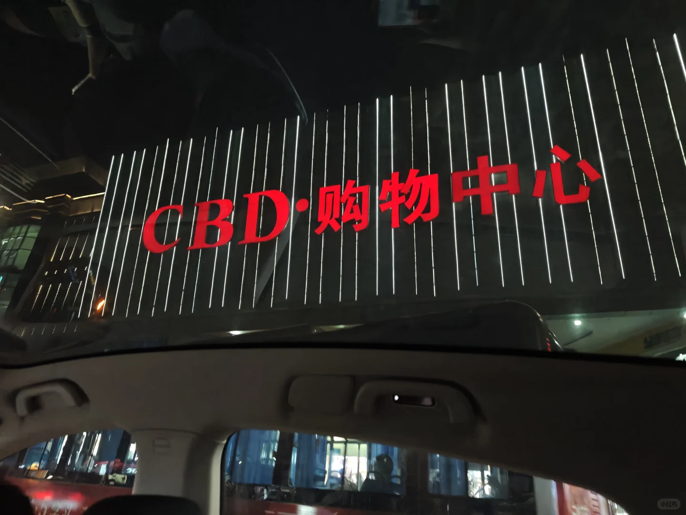
> [OCR] CBD·购物中心
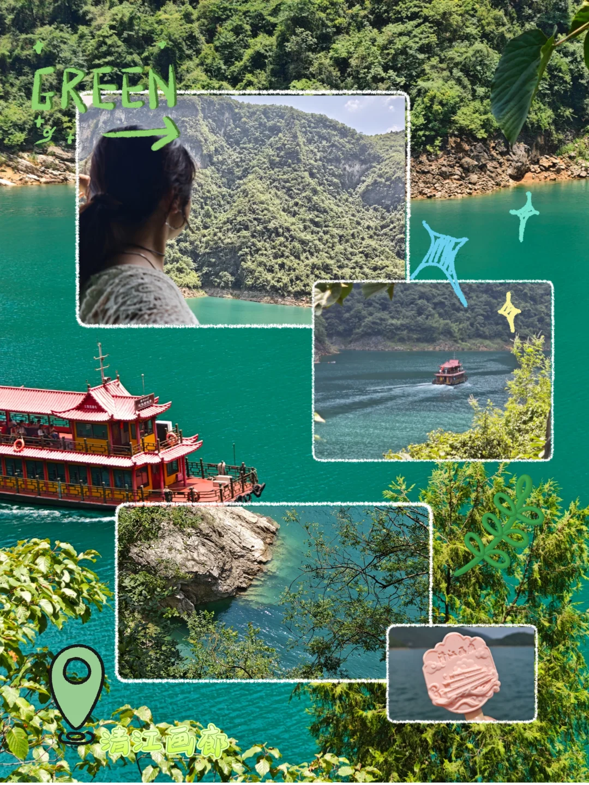
> [OCR] GREEN
清江画廊
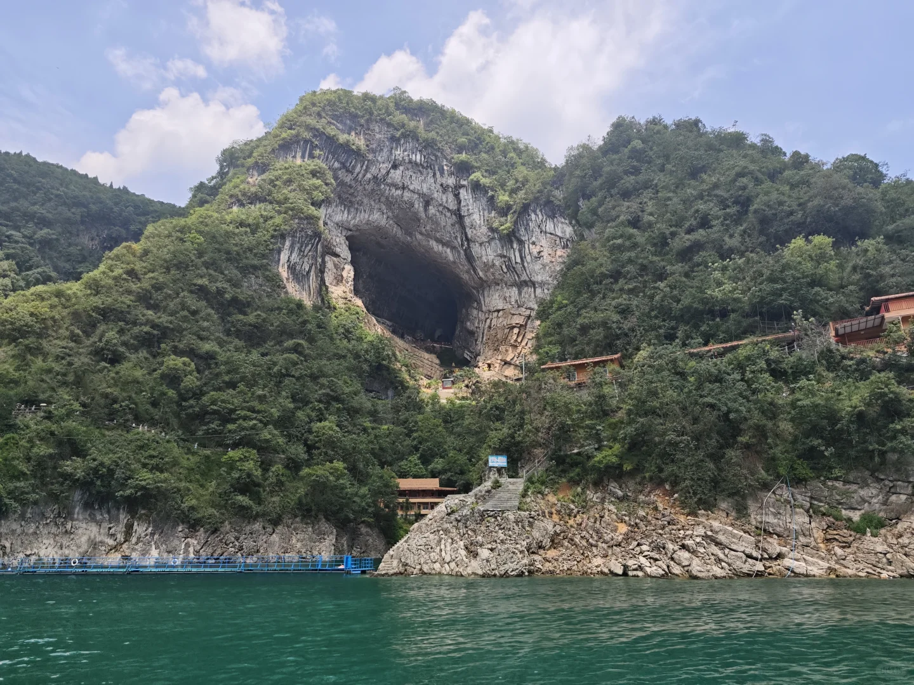
> [OCR] [?]

> [OCR] Hi
Have Fun
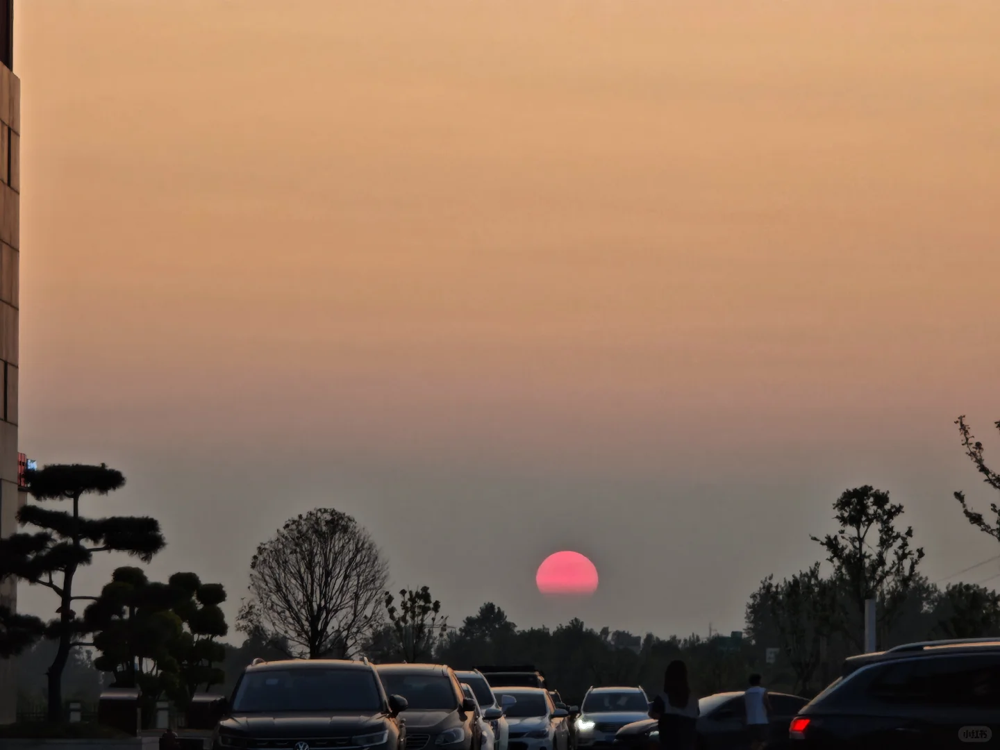
> [OCR] 小红书

## 正文
【行程概览】
出发地/目的地： 黄冈 ⇄ 宜昌
往返车程：🚗约 5 小时
游玩景点：DAY1：三峡大瀑布-G348国道-CBD小吃街；DAY2：清江画廊b线
住宿：宜昌市区 (长城假日酒店)
	
【必备物品】
三峡大瀑布： 一套从内到外的干爽换洗衣物、溯溪鞋或防滑凉鞋(水帘洞地面湿滑)、小背包放车里(用于装换洗衣物，游玩时不要背，打湿后干不了)。
通用：防晒霜、帽子、太阳镜、徒步鞋、驱蚊水、毛巾、身份证、车上补给的水和零食。
	
DAY1
上午：三峡大瀑布💦
游玩推荐：⭐⭐⭐⭐⭐⭐（爽爽爽！）
炎热程度：🌞💦（瀑布里面简直爽飞）
	
🚗 启程 (6:00 - 11:00)： 黄州出发，导航至 三峡大瀑布3号停车场，车程5h。
🎫 检票 (11:00 - 11:30)： 提前购买门票+往返观光车票，扫码入园（记得截图保存❗ 二维码观光车还会用到）。
⛰️ 游玩 (11:30 - 13:30， 约2小时)：
1️⃣瀑布以外的路走起来并不算凉快，建议乘坐观光车（往返20元）。
2️⃣下车后步行上山大概30min到大瀑布，中途有玩水的地方（建议返程时玩）
3️⃣穿越水帘洞！ 超级爽！！！
📸进水帘洞内找位置拍照，一旦走出洞外不允许逆行返回！
🚿体质弱的姐妹们，建议用手护住头部。
🌅出洞有付费烘干机15块5min。
👀眼睛进水难睁开属正常，需要适应一会儿
📸洞外也有拍照点，瀑布超壮观！（见P9）
🍽️  景区入口处烤肠（6元），个人觉得还算划算。
	
中午： 休整 (13:30 - 16:00)
🚗 前往酒店 (13:30 - 14:10)： 开车约40分钟到宜昌市区长城假日酒店，有地下停车场（酒店前台提前联系我们，帮我们把房间空调打开了，服务很不错）
🏨 酒店休整 (14:10 - 16:00)： 洗澡修整、换干爽衣服，充分休息恢复体力。
准备出发G348第一站听风谷！！！
	
字太多放不下，完整攻略见P2-P7
#自驾游[话题]# #周边游说走就走[话题]# #周末去哪儿[话题]# #宜昌[话题]# #宜昌旅游[话题]# #小红书兴趣季[话题]# #游玩攻略[话题]#

---