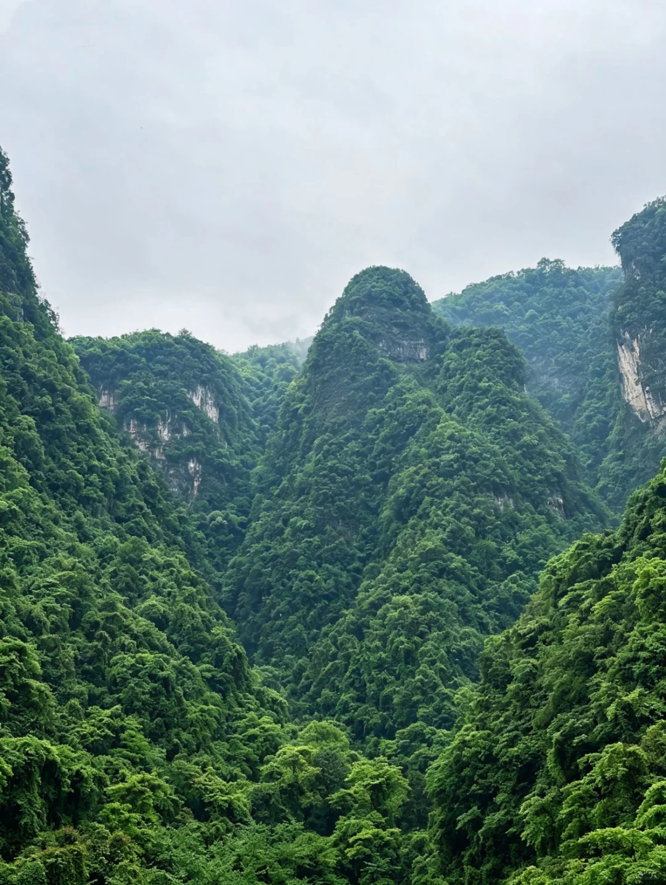

# 清江画廊游玩攻略（湖北宜昌长阳·5A）

- 作者: 李代棠📷
- 👍779 · 💬54 · ⭐625 · 图 10
- feed_id: 69f7726a0000000036001d6d

> [OCR] [?]

> [OCR] [?][?][?]

> [OCR] [?]

> [OCR] 小红书

> [OCR] 中红书

> [OCR] 小红书

> [OCR] 小红书

> [OCR] 小红书

> [OCR] system

## 正文
“八百里清江美如画，三百里画廊在长阳”
核心是船游清江+登岛观景+土家风情，适合一日游。
一、基础信息
• ⏰开放：8:00–17:30（15:30后入园为精简线）
• 🎫门票（一票制，含门票+班船）：
◦ 全票：145元（门票90+船票55）
◦ 半票：100元（学生/60–69岁老人）
◦ 免票：70岁以上、军人、残疾人（仅付船票55元）
湖北惠民卡需补55元船票🎫
◦ 15:00后入园：门票半价
• ☎️咨询：0717-5418888
	
二、交通指南🚗
• ✅自驾：导航“清江画廊游客中心”，有大型生态停车场
• ✅公共交通：
◦ 宜昌→长阳：汽车客运站大巴，约1小时
◦ 长阳县城→景区：旅游专线公交（标有“清江画廊”）
三、核心游玩线路（2选1）
A线｜圣境游（少走路）🚢
1. 游客中心→土家风雨廊桥→时光隧道→土家街
2. 码头登船→船观倒影峡（江水碧绿，喀斯特峰林）
3. 船观仙人寨（峭壁古寨，可远观）
4. 登武落钟离山（巴人圣山，登顶俯瞰清江全景）
5. 乘船返程→码头
B线｜影画游（徒步+船游）🚶
徒步、摄影、近距离看山水
1. 同A线至土家街→徒步倒影峡栈道（2km，贺新郎、灵运道、燕归来等打卡点）
2. 分码头乘船→船观仙人寨→远眺北纬30°岛→平洛湖观光
3. 乘船返回码头
• 15:30后入园：直接船游倒影峡、仙人寨、北纬30°岛，无徒步
#清江[话题]# #倒影峡[话题]# #清江[话题]##清江画廊[话题]# #清江画廊旅游[话题]#

---