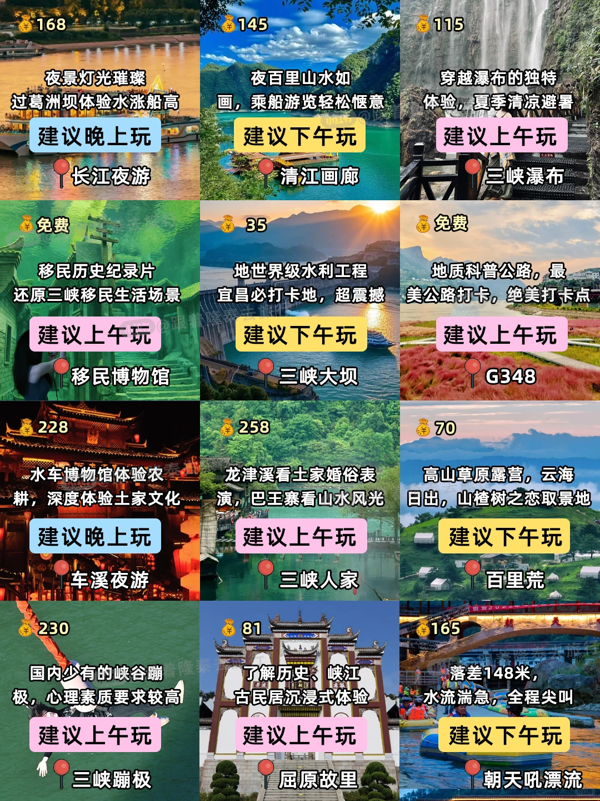
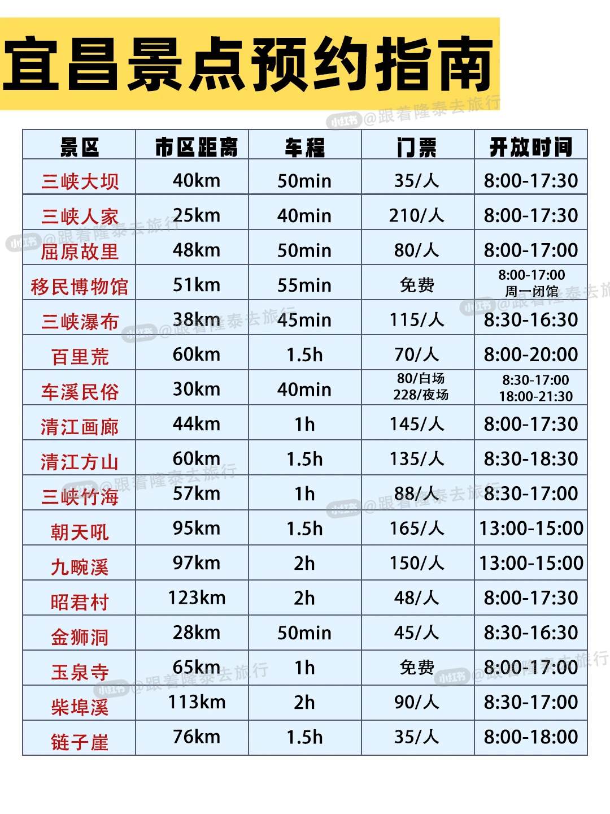
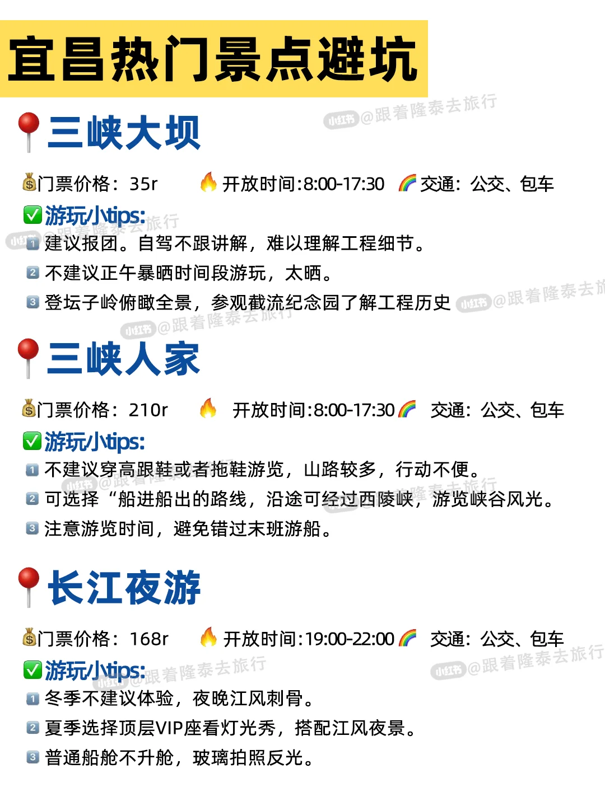
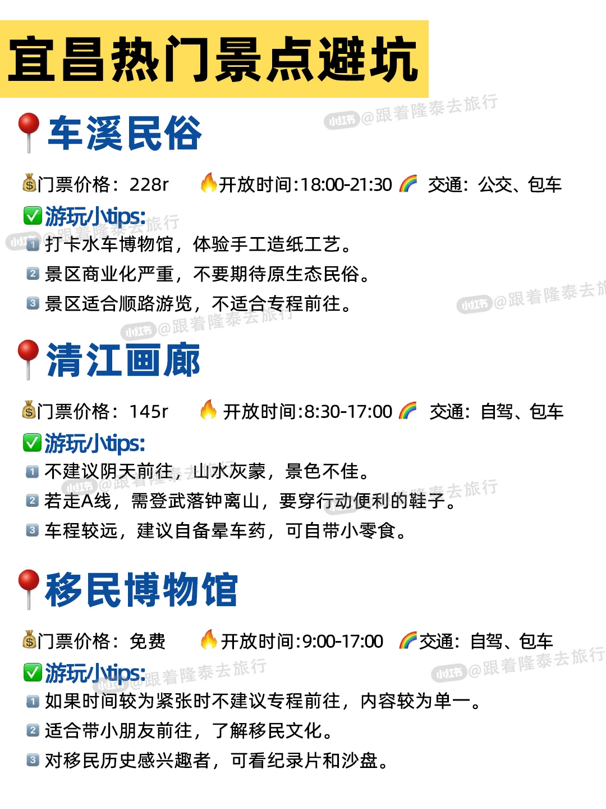
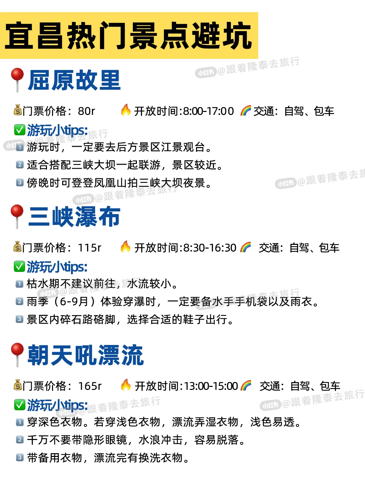
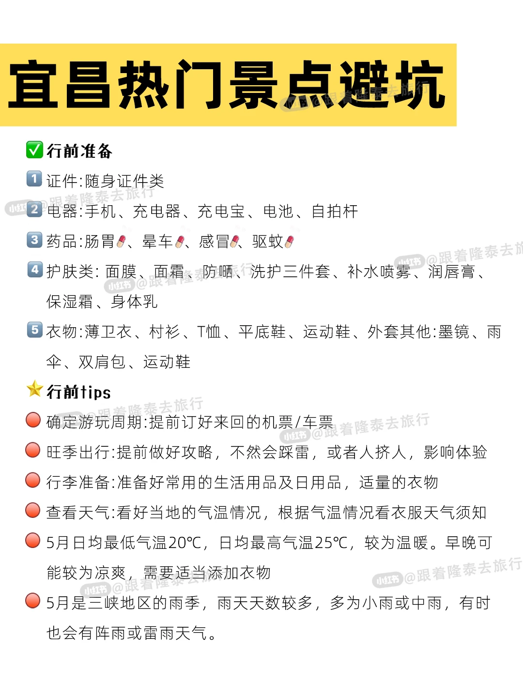
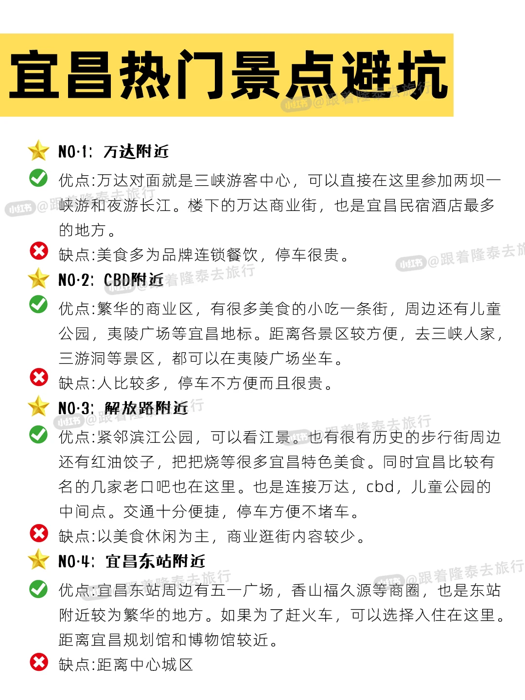
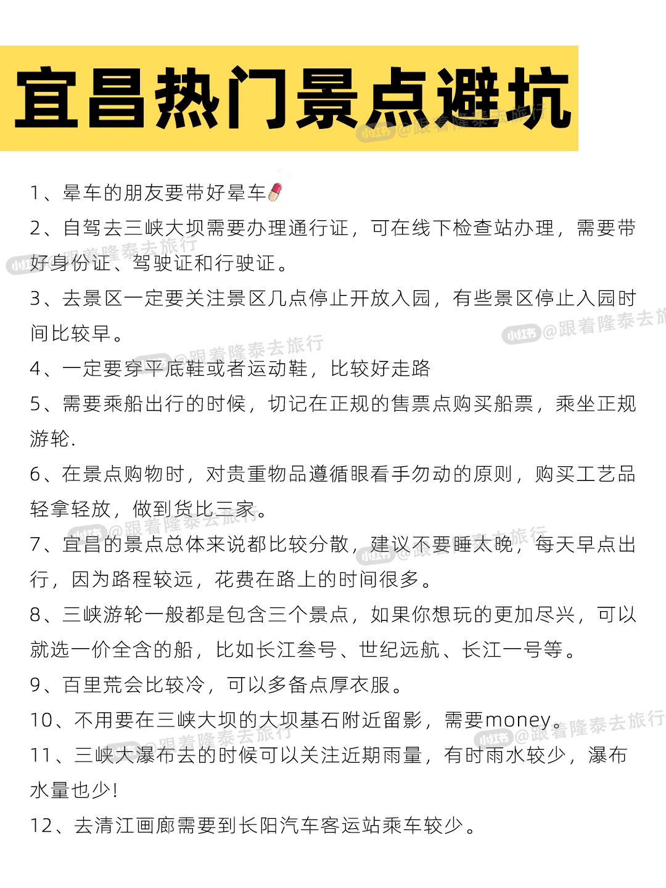
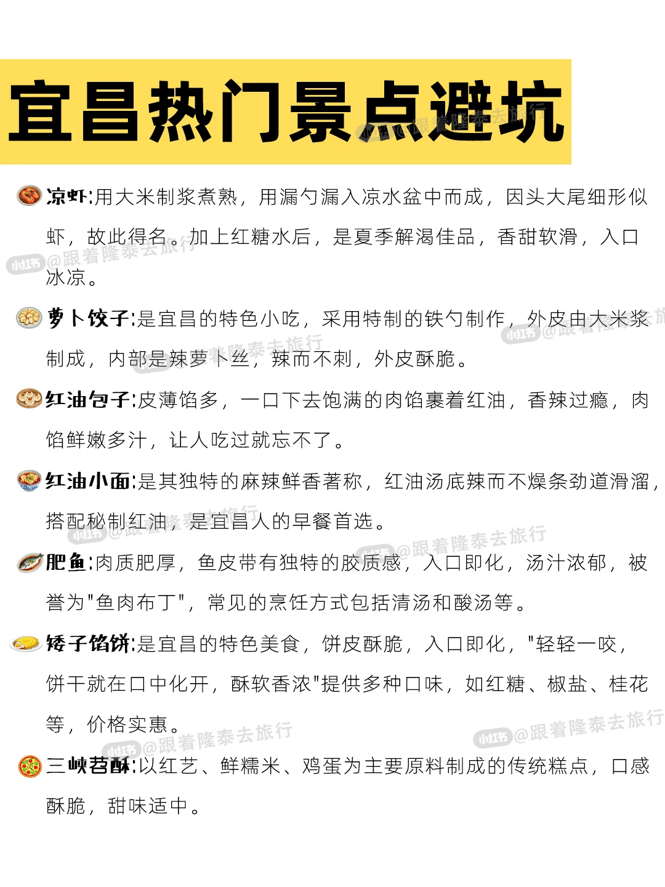

# 🌊宜昌📍避坑指南｜三峡游玩前必看‼

- 作者: 跟着楚渝行去旅行
- 👍758 · 💬33 · ⭐603 · 图 9
- feed_id: 684010d2000000001101d5f9

> [OCR] 168
夜景灯光璀璨
过葛洲坝体验水涨船高
建议晚上玩

长江夜游

145
夜百里山水如
画，乘船游览轻松惬意
建议下午玩

清江画廊

115
穿越瀑布的独特
体验，夏季清凉避暑
建议上午玩

三峡瀑布

免费
移民历史纪录片
还原三峡移民生活场景
建议上午玩

移民博物馆

35
地世界级水利工程
宜昌必打卡地，超震撼
建议下午玩

三峡大坝

免费
地质科普公路，最美公路打卡，绝美打卡点
建议上午玩

G348

228
水车博物馆体验农
耕，深度体验土家文化
建议晚上玩

车溪夜游

258
龙津溪看土家婚俗表
演，巴王寨看山水风光
建议上午玩

三峡人家

70
高山草原露营，云海
日出，山楂树之恋取景地
建议下午玩

百里荒

230
国内少有的峡谷蹦极，心理素质要求较高
建议上午玩

三峡蹦极

81
了解历史、峡江
古民居沉浸式体验
建议上午玩

屈原故里

165
落差148米，
水流湍急，全程尖叫
建议下午玩

朝天吼漂流

> [OCR] 宜昌景点预约指南

景区 | 市区距离 | 车程 | 门票 | 开放时间
三峡大坝 | 40km | 50min | 35/人 | 8:00-17:30
三峡人家 | 25km | 40min | 210/人 | 8:00-17:30
屈原故里 | 48km | 50min | 80/人 | 8:00-17:00
移民博物馆 | 51km | 55min | 免费 | 8:00-17:00 周一闭馆
三峡瀑布 | 38km | 45min | 115/人 | 8:30-16:30
百里荒 | 60km | 1.5h | 70/人 | 8:00-20:00
车溪民俗 | 30km | 40min | 80/白场 228/夜场 | 8:30-17:00 18:00-21:30
清江画廊 | 44km | 1h | 145/人 | 8:00-17:30
清江方山 | 60km | 1.5h | 135/人 | 8:30-18:30
三峡竹海 | 57km | 1h | 88/人 | 8:30-17:00
朝天吼 | 95km | 1.5h | 165/人 | 13:00-15:00
九畹溪 | 97km | 2h | 150/人 | 13:00-15:00
昭君村 | 123km | 2h | 48/人 | 8:00-17:30
金狮洞 | 28km | 50min | 45/人 | 8:30-16:30
玉泉寺 | 65km | 1h | 免费 | 8:00-17:00
柴埠溪 | 113km | 2h | 90/人 | 8:30-17:00
链子崖 | 76km | 1.5h | 35/人 | 8:00-18:00

> [OCR] 宜昌热门景点避坑

三峡大坝
门票价格：35r 开放时间:8:00-17:30 交通：公交、包车
游玩小tips:
建议报团。自驾不跟讲解，难以理解工程细节。
2. 不建议正午暴晒时间段游玩，太晒。
3. 登坛子岭俯瞰全景，参观截流纪念园了解工程历史

三峡人家
门票价格：210r 开放时间:8:00-17:30 交通：公交、包车
游玩小tips:
1. 不建议穿高跟鞋或者拖鞋游览，山路较多，行动不便。
2. 可选择“船进船出”的路线，沿途可经过西陵峡，游览峡谷风光。
3. 注意游览时间，避免错过末班游船。

长江夜游
门票价格：168r 开放时间:19:00-22:00 交通：公交、包车
游玩小tips:
1. 冬季不建议体验，夜晚江风刺骨。
2. 夏季选择顶层VIP座看灯光秀，搭配江风夜景。
3. 普通船舱不升舱，玻璃拍照反光。

> [OCR] 宜昌热门景点避坑

车溪民俗
门票价格：228r 开放时间:18:00-21:30 交通：公交、包车
游玩小tips:
打卡水车博物馆，体验手工造纸工艺。
景区商业化严重，不要期待原生态民俗。
景区适合顺路游览，不适合专程前往。

清江画廊
门票价格：145r 开放时间:8:30-17:00 交通：自驾、包车
游玩小tips:
不建议阴天前往，山水灰蒙，景色不佳。
若走A线，需登武落钟离山，要穿行动便利的鞋子。
车程较远，建议自备晕车药，可自带小零食。

移民博物馆
门票价格：免费 开放时间:9:00-17:00 交通：自驾、包车
游玩小tips:
如果时间较为紧张时不建议专程前往，内容较为单一。
适合带小朋友前往，了解移民文化。
对移民历史感兴趣者，可看纪录片和沙盘。

> [OCR] 宜昌热门景点避坑

屈原故里
门票价格：80r 开放时间:8:00-17:00 交通：自驾、包车
游玩小tips:
1. 游玩时，一定要去后方景区江景观台。
2. 适合搭配三峡大坝一起联游，景区较近。
3. 傍晚时可登凤凰山拍三峡大坝夜景。

三峡瀑布
门票价格：115r 开放时间:8:30-16:30 交通：自驾、包车
游玩小tips:
1. 枯水期不建议前往，水流较小。
2. 雨季（6-9月）体验穿瀑时，一定要备水手手机袋以及雨衣。
3. 景区内碎石路硌脚，选择合适的鞋子出行。

朝天吼漂流
门票价格：165r 开放时间:13:00-15:00 交通：自驾、包车
游玩小tips:
1. 穿深色衣物。若穿浅色衣物，漂流弄湿衣物，浅色易透。
2. 千万不要带隐形眼镜，水浪冲击，容易脱落。
3. 带备用衣物，漂流完有换洗衣物。

> [OCR] 宜昌热门景点避坑

✅ 行前准备
1. 证件:随身证件类
2. 电器:手机、充电器、充电宝、电池、自拍杆
3. 药品:肠胃[?]、晕车[?]、感冒[?]、驱蚊[?]
4. 护肤类:面膜、面霜、防晒、洗护三件套、补水喷雾、润唇膏、保湿霜、身体乳
5. 衣物:薄卫衣、衬衫、T恤、平底鞋、运动鞋、外套其他:墨镜、雨伞、双肩包、运动鞋

⭐ 行前tips
确定游玩周期:提前订好来回的机票/车票
旺季出行:提前做好攻略，不然会踩雷，或者人挤人，影响体验
行李准备:准备好常用的生活用品及日用品，适量的衣物
查看天气:看好当地的气温情况，根据气温情况看衣服天气须知
5月日均最低气温20℃，日均最高气温25℃，较为温暖。早晚可能较为凉爽，需要适当添加衣物
5月是三峡地区的雨季，雨天天数较多，多为小雨或中雨，有时也会有阵雨或雷雨天气。

> [OCR] 宜昌热门景点避坑

NO.1: 万达附近
优点: 万达对面就是三峡游客中心，可以直接在这里参加两坝一峡游和夜游长江。楼下的万达商业街，也是宜昌民宿酒店最多的地方。
缺点: 美食多为品牌连锁餐饮，停车很贵。

NO.2: CBD附近
优点: 繁华的商业区，有很多美食的小吃一条街，周边还有儿童公园、夷陵广场等宜昌地标。距离各景区较方便，去三峡人家、三游洞等景区，都可以在夷陵广场坐车。
缺点: 人比较多，停车不方便而且很贵。

NO.3: 解放路附近
优点: 紧邻滨江公园，可以看江景。也有很有历史的步行街周边还有红油饺子，把把烧等很多宜昌特色美食。同时宜昌比较有名的几家老口吧也在这里。也是连接万达、CBD、儿童公园的中间点。交通十分便捷，停车方便不堵车。
缺点: 以美食休闲为主，商业逛街内容较少。

NO.4: 宜昌东站附近
优点: 宜昌东站周边有五一广场、香山福久源等商圈，也是东站附近较为繁华的地方。如果为了赶火车，可以选择住在这里。距离宜昌规划馆和博物馆较近。
缺点: 距离中心城区

> [OCR] 宜昌热门景点避坑

1. 晕车的朋友要带好晕车?[?]胶囊
2. 自驾去三峡大坝需要办理通行证,可在线下检查站办理,需要带好身份证、驾驶证和行驶证。
3. 去景区一定要关注景区几点停止开放入园，有些景区停止入园时间比较早。
4. 一定要穿平底鞋或者运动鞋，比较好走路
5. 需要乘船出行的时候，切记在正规的售票点购买船票，乘坐正规游轮.
6. 在景点购物时，对贵重物品遵循眼看手勿动的原则，购买工艺品轻拿轻放，做到货比三家。
7. 宜昌的景点总体来说都比较分散,建议不要睡太晚，每天早点出行，因为路程较远，花费在路上的时间很多。
8. 三峡游轮一般都是包含三个景点，如果你想玩的更加尽兴，可以就选一价全含的船，比如长江叁号、世纪远航、长江一号等。
9. 百里荒会比较冷,可以多备点厚衣服。
10. 不用要在三峡大坝的大坝基石附近留影，需要money。
11. 三峡大瀑布去的时候可以关注近期雨量，有时雨水较少，瀑布水量也少!
12. 去清江画廊需要到长阳汽车客运站乘车较少。

> [OCR] 宜昌热门景点避坑

凉虾: 用大米制浆煮熟, 用漏勺漏入凉水盆中而成, 因头大尾细形似虾, 故此得名。加上红糖水后, 是夏季解渴佳品, 香甜软滑, 入口冰凉。

萝卜饺子: 是宜昌的特色小吃，采用特制的铁勺制作，外皮由大米浆制成，内部是辣萝卜丝，辣而不刺，外皮酥脆。

红油包子: 皮薄馅多，一口下去饱满的肉馅裹着红油, 香辣过瘾, 肉馅鲜嫩多汁, 让人吃过就忘不了。

红油小面: 是其独特的麻辣鲜香著称, 红油汤底辣而不燥条劲道滑溜, 搭配秘制红油，是宜昌人的早餐首选。

肥鱼: 肉质肥厚, 鱼皮带有独特的胶质感, 入口即化, 汤汁浓郁, 被誉为“鱼肉布丁”, 常见的烹饪方式包括清汤和酸汤等。

矮子馅饼: 是宜昌的特色美食，饼皮酥脆，入口即化，“轻轻一咬，饼干就在口中化开，酥软香浓”提供多种口味, 如红糖、椒盐、桂花等, 价格实惠。

三峡茗酥: 以红艺、鲜糯米、鸡蛋为主要原料制成的传统糕点，口感酥脆，甜味适中。

## 正文
初次来宜昌的宝子们，
这篇攻略能帮你避开90%的坑！
本地人真心整理，速存💡
.
📚行程规划：按天数抄作业！
⭐一日游暴走版
三峡大坝（坛子岭→185观景台）→长江夜游（过葛洲坝船闸，体验水涨船高）→返程吃江边肥鱼
> ✅重点：游船项目，景区门票提前2天订！
.
⭐两日游深度版
D1：三峡大坝→屈原故里→夜宿三斗坪镇
D2：清江画廊（A线登武落钟离山）→返回市区逛解放路小吃街
> 🌟贴士：清江游船选10点前班次，下午光线拍照绝美
.
⭐三日游全景版
D1：三峡人家→车溪夜游（体验民俗）
D2：两坝一峡游轮（过船闸超震撼！）→三峡大坝（还可体验升船机）
D3：柴埠溪大峡谷（喀斯特秘境）或三峡大瀑布（体验穿瀑）
> 💥避雷：猴溪只坐缆车，步行路段耗时长景色一般
.
🥯❗血泪经验：
> 1️⃣ "长江肥鱼"认准背鳍透明！低于80元/斤慎点
> 2️⃣ 凉虾喝郑信记，彭桂花齁甜
> 3️⃣ 景区旁的"土家菜"慎入，市区馆子更靠谱
.
💡防坑硬核Tips：
⚠️ 两坝一峡游船
▶️ 选"过船闸"线路！过葛洲坝水涨船高超震撼
▶️ 一楼免费观闸，升舱去三楼纯属智商税
.
☀️ 防晒三件套
江边紫外线MAX！墨镜+冰袖+帽子，物理防晒yyds
.
🚗 交通雷区
▶️ 的士不打表？直接打12328投诉
▶️ 去景区首选"旅游直通车"，黑车报价翻倍
.
🛍️ 购物避坑
❌ 景区药材/玉器别碰！
✅ 伴手礼带矮子馅饼（解放路总店）或凉虾粉
.
> 🌈小众玩法安利：
> 夜游三游洞：激光秀+悬崖光影，秒穿千年
> 下牢溪露营：市区驱车40min，玻璃水溯溪超清凉
.
📣本地人私藏建议：
🔹 三峡大坝免门票！只需35元观光车费
🔹 清江画廊早去！14点后停售A线票
.
宜昌的山水是立体的诗，
但坑也藏在转角处——
这份攻略是你行走的避雷针⚡"
#宜昌[话题]# #旅游攻略[话题]# #宜昌旅游[话题]# #三峡大坝[话题]# #旅游避坑[话题]# #旅行推荐[话题]# #小众旅行[话题]# #三峡人家[话题]# #湖北周边游[话题]#

---