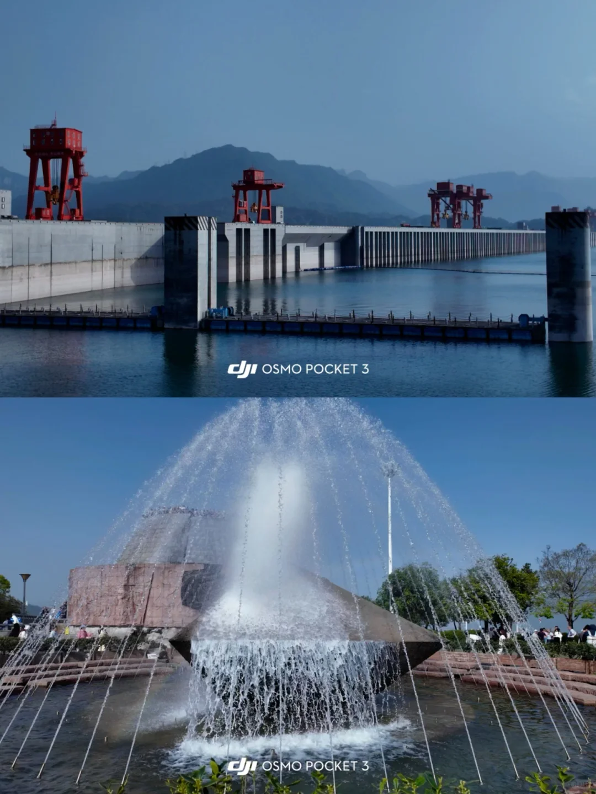
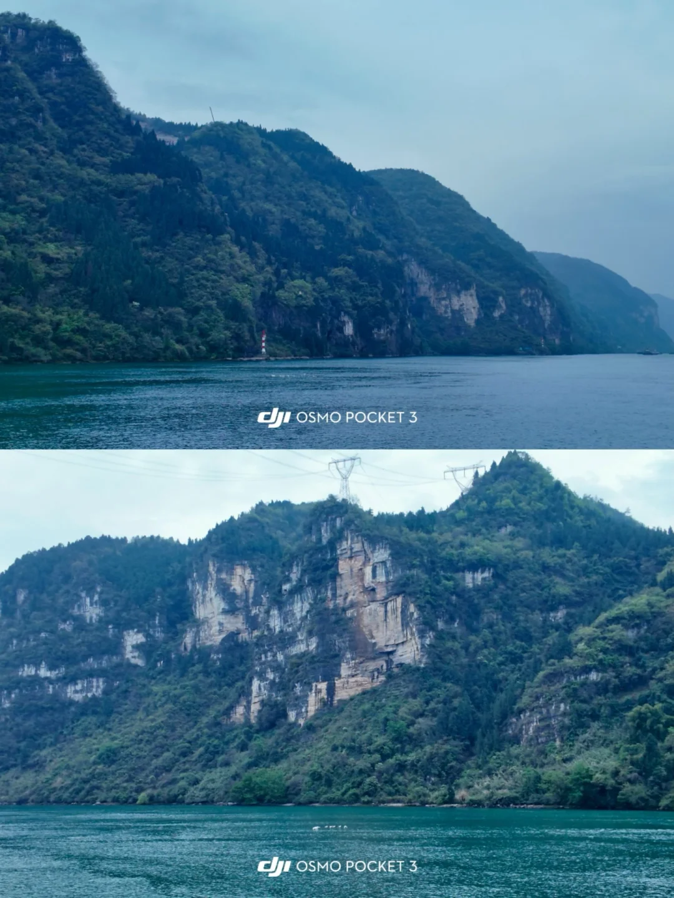
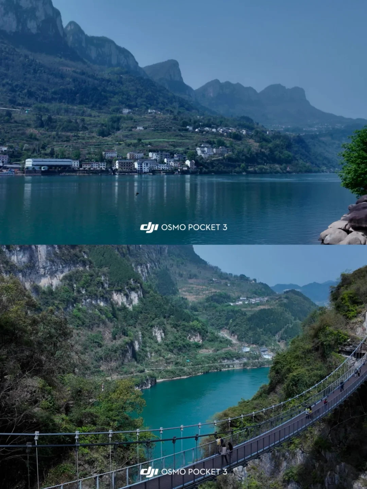
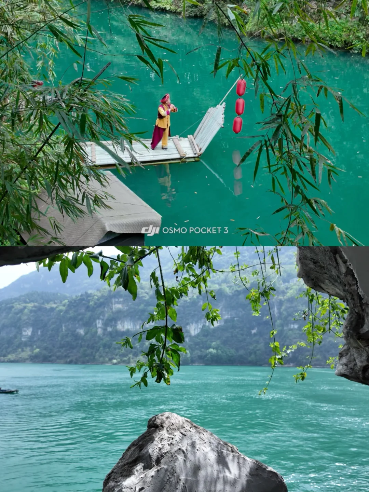
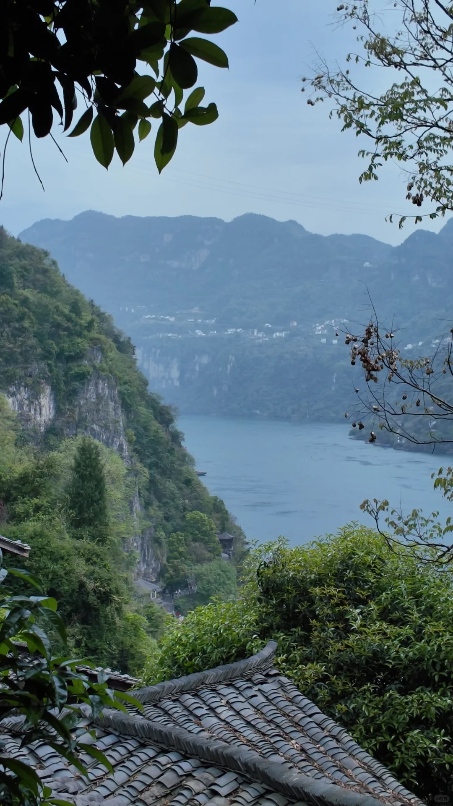
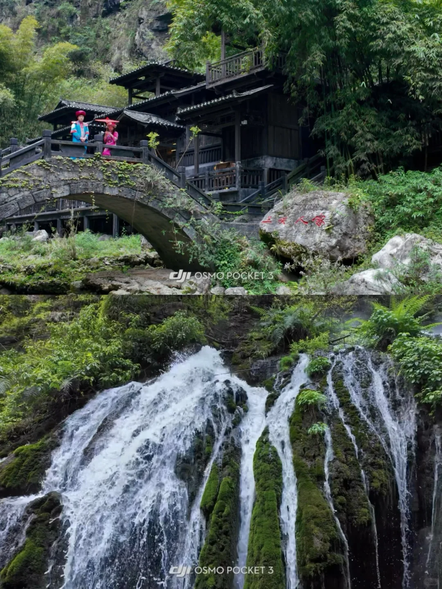
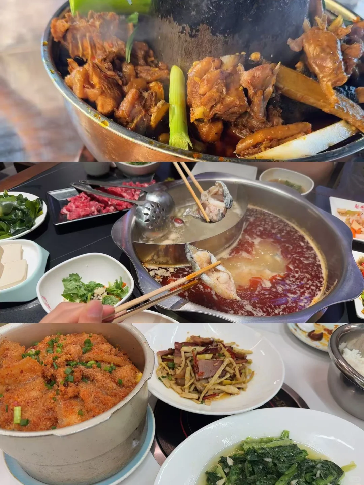

# 不愧是蓝战非推荐的宜昌，体验感满分！

- 作者: 汉宝宝不是汉堡包🍔
- 👍724 · 💬70 · ⭐995 · 图 8
- feed_id: 69d771c6000000002103a464

> [OCR] 宜昌G348
三峡公路
#宜昌3天2夜攻略
玩吃路线一条龙
兆吉坪桥

> [OCR] dji OSMO POCKET 3
dji OSMO POCKET 3

> [OCR] dji OSMO POCKET 3
dji OSMO POCKET 3

> [OCR] dji OSMO POCKET 3
dji OSMO POCKET 3

> [OCR] dji OSMO POCKET 3

> [OCR] [?]

> [OCR] 三生[?]人[?]
dji OSMO POCKET 3

> [OCR] [?]

## 正文
Day1：
G348国道，一条沿着西陵峡蜿蜒的“中国地质科普公路”，沿途免费观景台一个接一个，云雾绕峰、山水相依，开车就像驶入流动的水墨画。
🚗出行：租车自驾
📍路线：宜昌东站出发（走G348，不走高速）——三游洞——听风谷观景台——山外山观景台——明月台观景台——西陵峡0.618服务区（上厕所休息拍照）——干沟子大桥（网红S弯）——莲沱畔观景台——秭归县城（吃午餐）——三峡屈原故里（逛的快1h）——三峡移民博物馆——三峡大坝——游客换乘中心——游览三峡大坝(坛子岭-185-博物馆-截流园)——返程
🥣吃饭：秭归县的渔乐圈铁板烧（分量很大，如果人不多建议少点一点，后续可以在加，现炒，很新鲜，老板还会送一盘血橙，很好吃！缺点就是油太多了）
易师傅郭场鸡（非常非常好吃！！一整只鸡，煮的特别软烂，特别入味，千张海带鸡杂都是免费送的）
注意：
1. 如果自驾/租车，需要提前在“三峡坝区车辆通行预约系统”预约一下你的车辆，或者现场预约也可以。
2. 进去的摆渡车要35米，记得提前购买。
	
Day2：
三峡人家，西陵峡畔的巴楚秘境。龙进溪水绿如翡翠，吊脚楼依山临水，像走进了活着的山水画。
🚗出行：某携*报的一日团（245米，包含进出船票和接送回市区的车程）
观光电梯门票需要单独购买30米
📍路线：葛洲坝码头乘船——“三峡人家”专线邮轮（昨天在山上看水，今天在水上看山）——三峡人家景区——看灯影石、石令牌、——巴王寨——山寨风情/女书演出——午餐——逛龙进溪——黄龙瀑——看猴群——观看婚嫁表演——龙溪桥——返程
🥣吃饭：午餐自己带了点东西吃
憨哥鱼庄中南路店（吃的肥鱼，鱼如其名是真的肥，也是真的好吃）
注意：
1. 最好穿舒适的鞋子游玩，步行多，上山下山的
2. 景区表演提前一点时间去，抢占最佳观赏位置
3. 选择船出的友友一定要关注最晚乘船时间，不要玩过头，耽误了行程！
	
Day3：
上班的牛马不能连续早起三天之后接着上班，必须有一天要睡到自然醒😭
睡醒后去滨江公园溜达了一圈，就当收心了。
🚗出行：滴滴打车
📍路线：滨江公园，看船，吹风，发呆
🥣吃饭：吃的农家小院，味道还行~还去买了宜昌的吴傅记回味萝卜，很好吃！满意！！
#武汉周边游[话题]# #武汉[话题]# #值得N刷的宝藏出游地[话题]# #体验感极佳[话题]# #除却巫山不是云[话题]# #自然风光[话题]#

---