# 为了三峡大瀑布，自驾3h来趟宜昌，值得吗❓

- 作者: 羊角女孩
- 👍709 · 💬17 · ⭐454 · 图 14
- feed_id: 6a69ff25000000000f02ab48

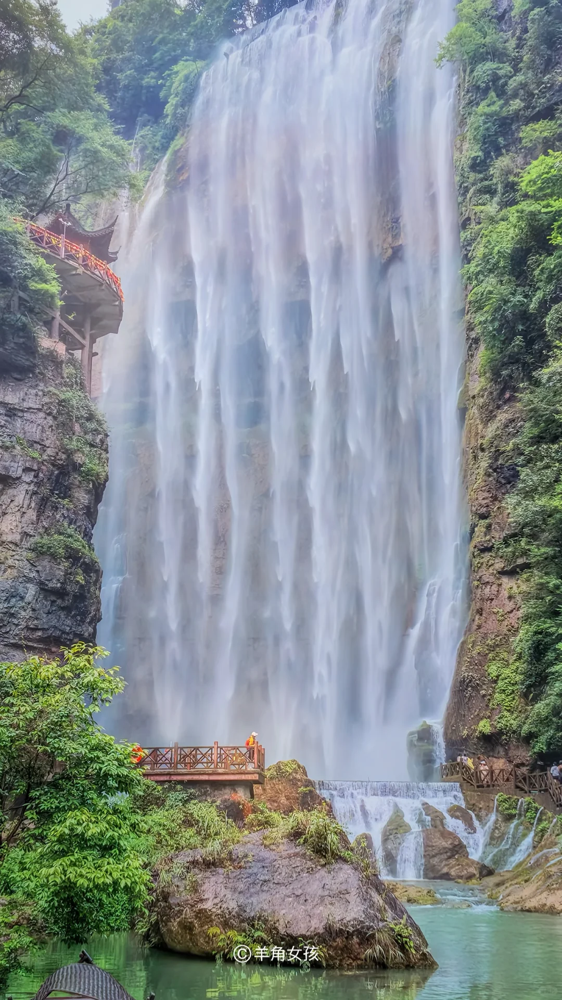
> [OCR] ©羊角女孩
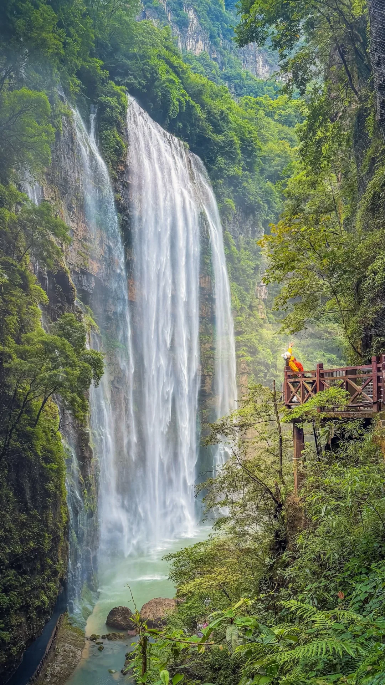
> [OCR] [?]
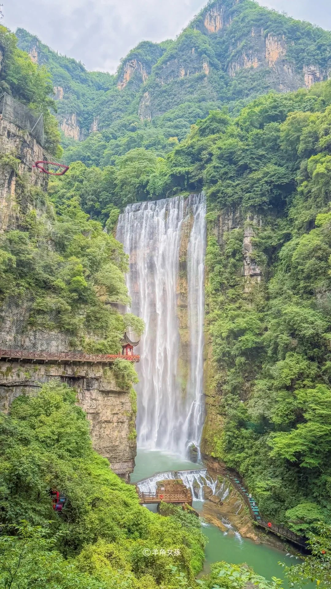
> [OCR] 羊角女孩
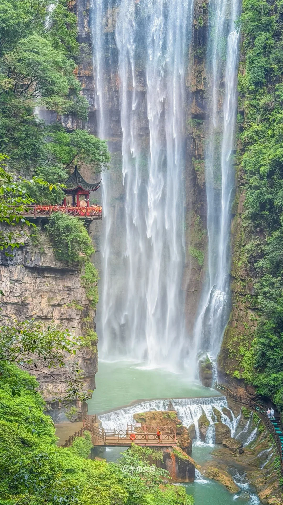
> [OCR] 羊角女孩
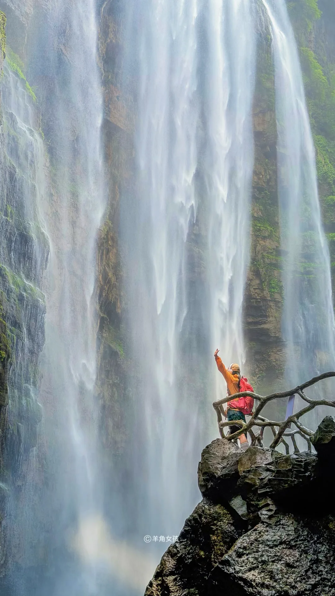
> [OCR] ©羊角女孩
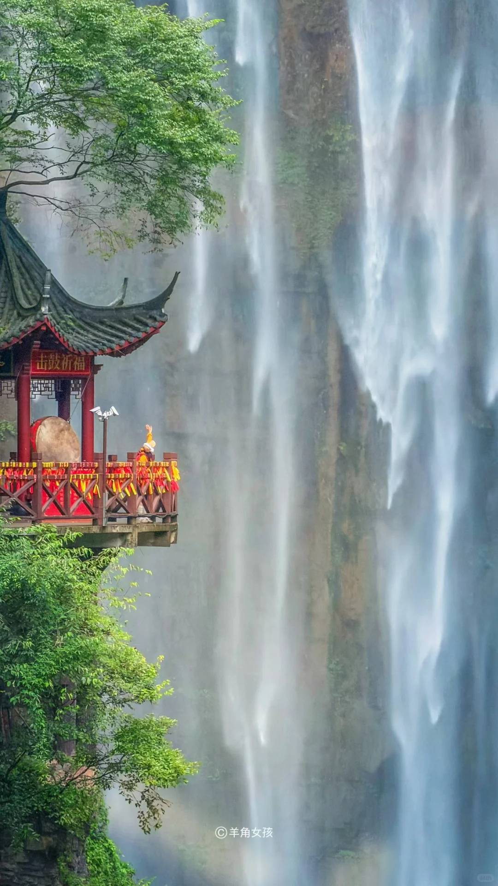
> [OCR] 击鼓祈福
羊角女孩
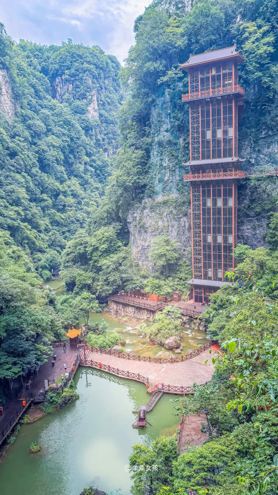
> [OCR] 羊角女孩
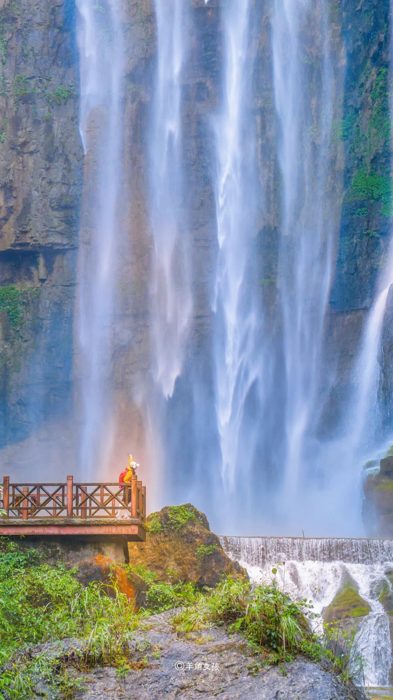
> [OCR] 羊角女孩
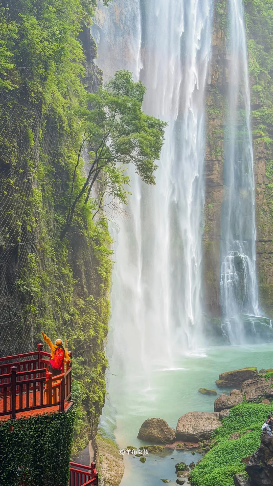
> [OCR] 羊角女孩
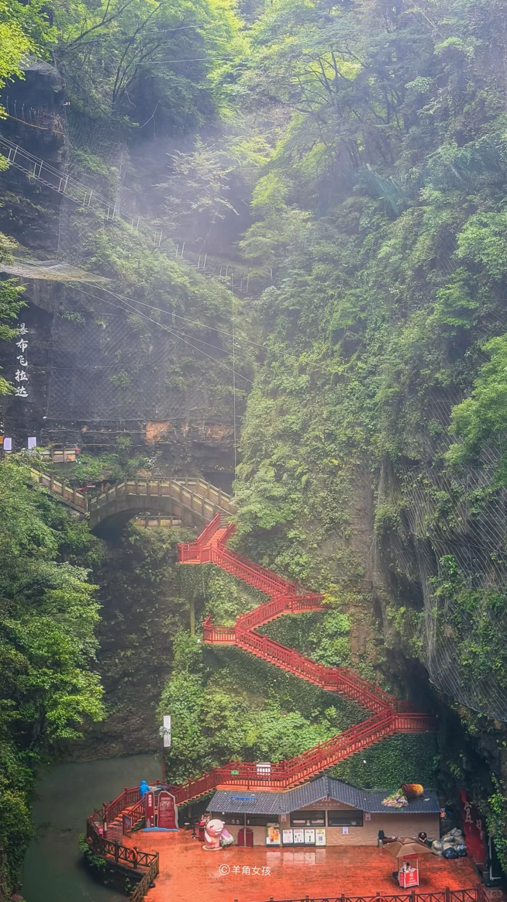
> [OCR] 瀑布飞檐达
羊角女孩
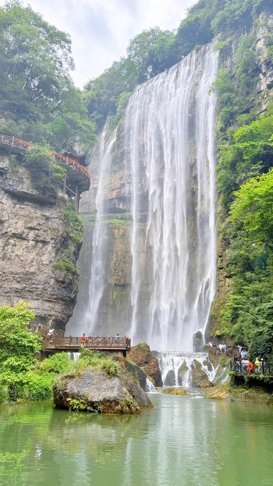
> [OCR] [?]
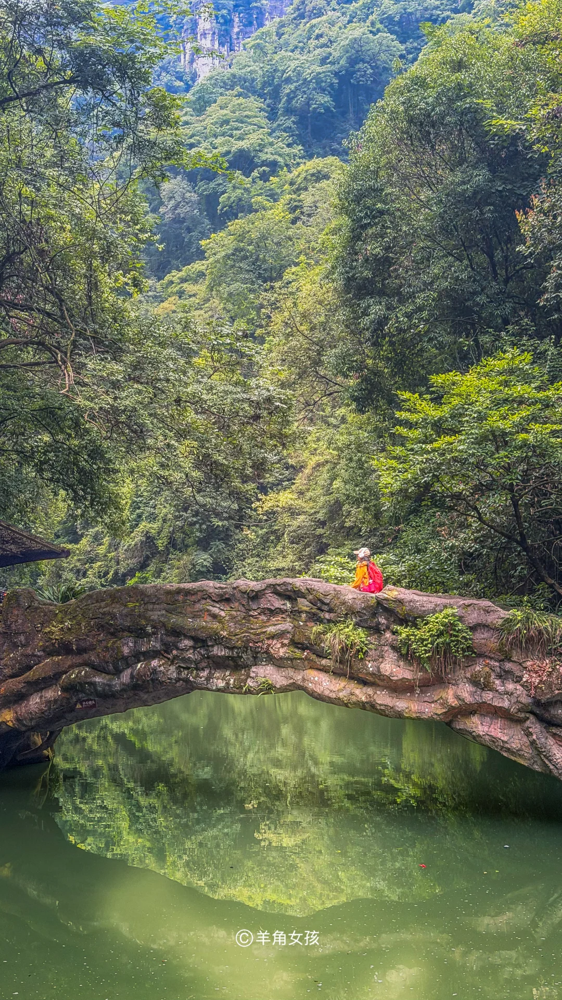
> [OCR] ©羊角女孩
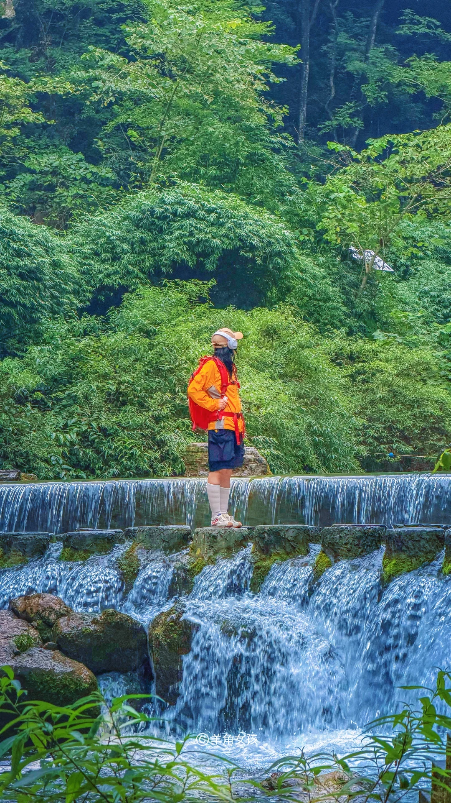
> [OCR] 羊角女孩
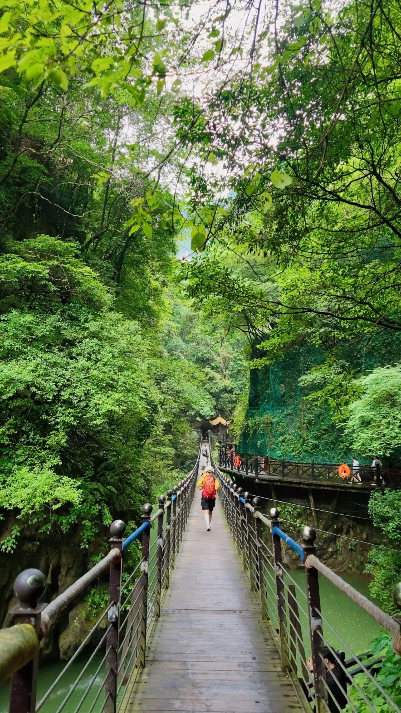
> [OCR] [?]

## 正文
#点亮户外新地图[话题]#
“飞流直下三千尺，疑是银河落九天。”
倘若当年李白来到三峡大瀑布，
想必又会挥笔写下流传千古的绝美诗篇。
这里虽不是诗中描绘的庐山瀑布💦
壮阔震撼毫不逊色!
羊角自驾刚回,详细游玩攻略来了!
	
✅热门打卡机位
[一R]水帘洞｜可穿行瀑布内部，晴天午后极易遇见彩虹
[二R]悬索吊桥｜溪谷森系大片机位
[三R]正面观景台｜长焦拍摄百米飞瀑全景
[四R]电梯观景台｜飞流直下三千尺既视感!
	
📸拍照顺序：先拍外景，再穿水帘洞（避免衣服湿透）
⚠️必备：加厚雨衣、手机防水袋、防滑鞋、一套换洗衣物
	
🔥热门游玩项目
[一R]悬崖高空咖啡☕️-价格和外面差不多,🉑看到瀑布
[二R]高空电梯🛗-体验升空的感觉,个人绝对不刺激,不是很建议
[三R]游船-门口可体验游船,需额外收费
[四R]飞拉大-高空瀑布合影,惊险刺激
[五R]穿瀑-这个一定要体验,🉑穿雨衣穿越瀑布,免费
	
🎫门票：年卡免费🆓
⏰营业时间：08:00-17:00（17:00停止入园）
建议游玩：纯游玩 1-2小时,拍摄+游玩建议预留 3h
	
🚗自驾路线参考
武汉→沪渝高速（约4h）→三峡大瀑布
游玩结束反穿G348西陵峡景观公路，
一路江景机位，不走回头路
	
🏨住宿
▪️两日游｜景区周边农庄，吃饭住宿一体，次日方便早起入园
▪️一日游｜不住，游玩G348之后直接返程武汉
	
🍲必吃美食
腊蹄子火锅、榨广椒土豆片、清江小鱼、土鸡蛋、懒豆花
	
⚠️自驾避坑贴士
1.尽量上午抵达景区，避开午后人流高峰
2.G348弯道较多，观景台短暂停车务必靠边，注意行车安全
3.景区内部价格适中，🉑体验高空咖啡☕️和冷饮🍹
4.穿瀑水雾巨大，薄款雨衣极易破损，优先自备加厚款
5.建议坐景交车,步行30分钟就到了大瀑布
6.不建议坐电梯🛗,走瀑布旁边的台阶也能上到天梯的那一层
#武汉周末去哪儿[话题]# #武汉周边自驾游[话题]# #武汉旅游攻略[话题]# #飞流直下三千尺[话题]# #避暑好地方[话题]# #我拍到的瀑布[话题]# #宜昌旅游[话题]# #三峡大瀑布[话题]# #徒步丈量世界[话题]#

---