# 宜昌！！超详细反复去吃老店地图…（合集附📍）

- 作者: 小小布丁
- 👍678 · 💬73 · ⭐750 · 图 13
- feed_id: 69dc34be00000000230241c5

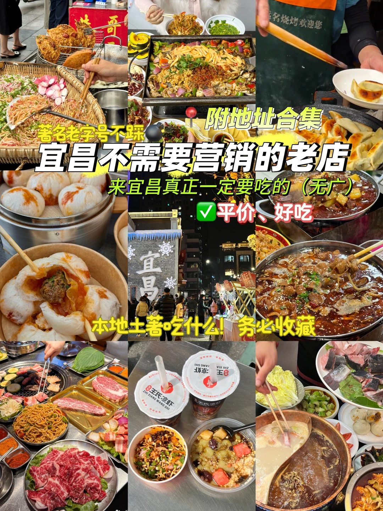
> [OCR] 著名老字号不踩
宜昌不需要营销的老店
来宜昌真正一定要吃的（无广）
平价、好吃
本地土著吃什么！务必收藏
附地址合集
宜昌
ZHI XIANG WANG SHI
王氏凉虾
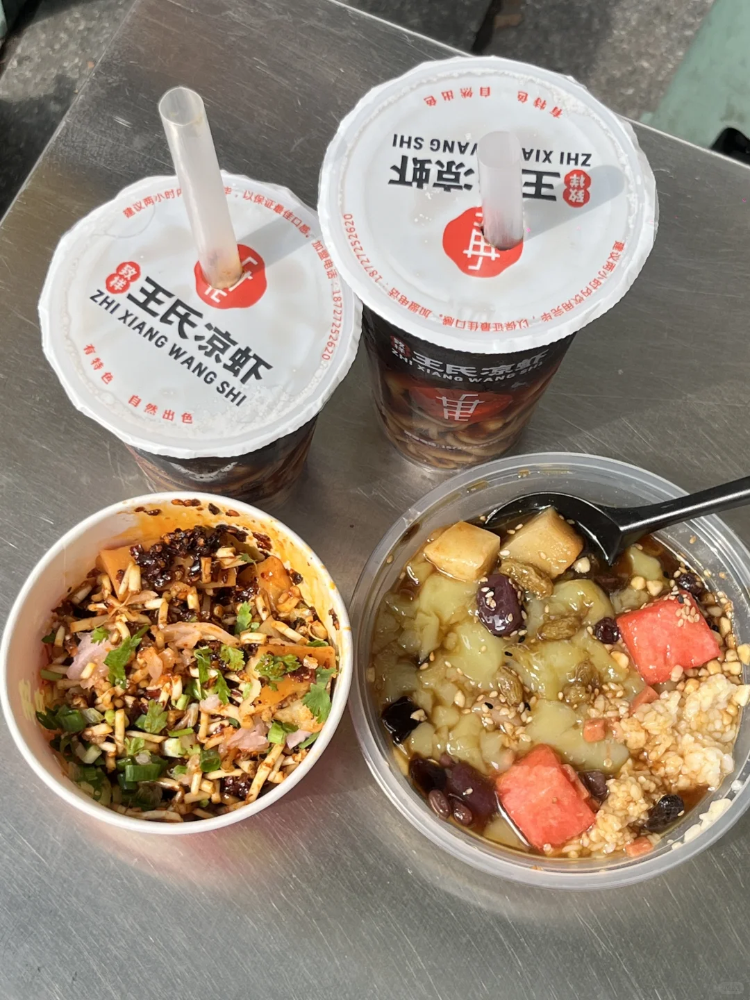
> [OCR] 王氏凉虾
ZHI XIANG WANG SHI
有特色 自然出色

王氏凉虾
ZHI XIANG WANG SHI
有特色 自然出色
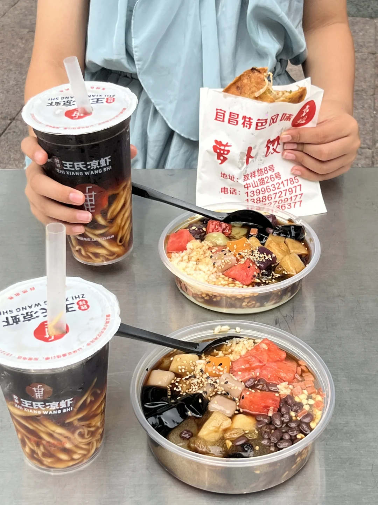
> [OCR] 王氏凉虾
ZHI XIANG WANG SHI

王氏凉虾
ZHI XIANG WANG SHI

宜昌特色风味
萝卜饺
地址：致祥路8号
中山路26号
电话：13996321785
13886727977
13402709177
1387136377
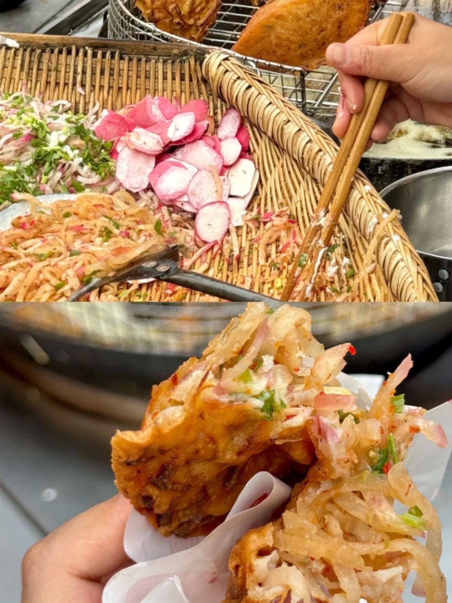
> [OCR] [?]
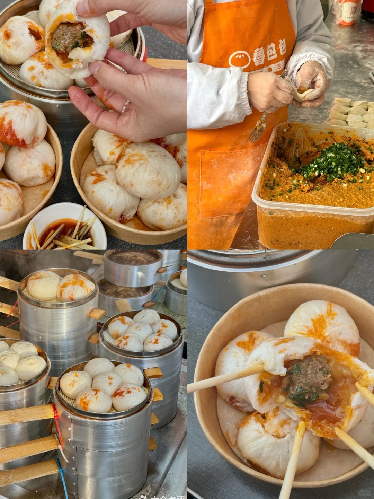
> [OCR] 鲁包包
?????
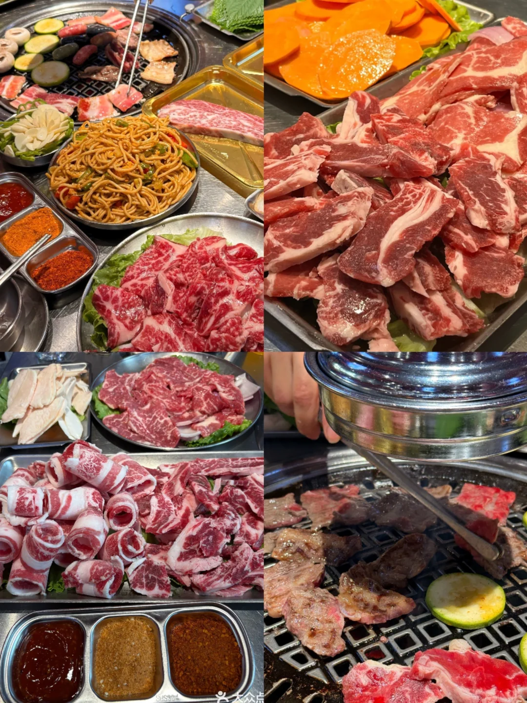
> [OCR] 大众点
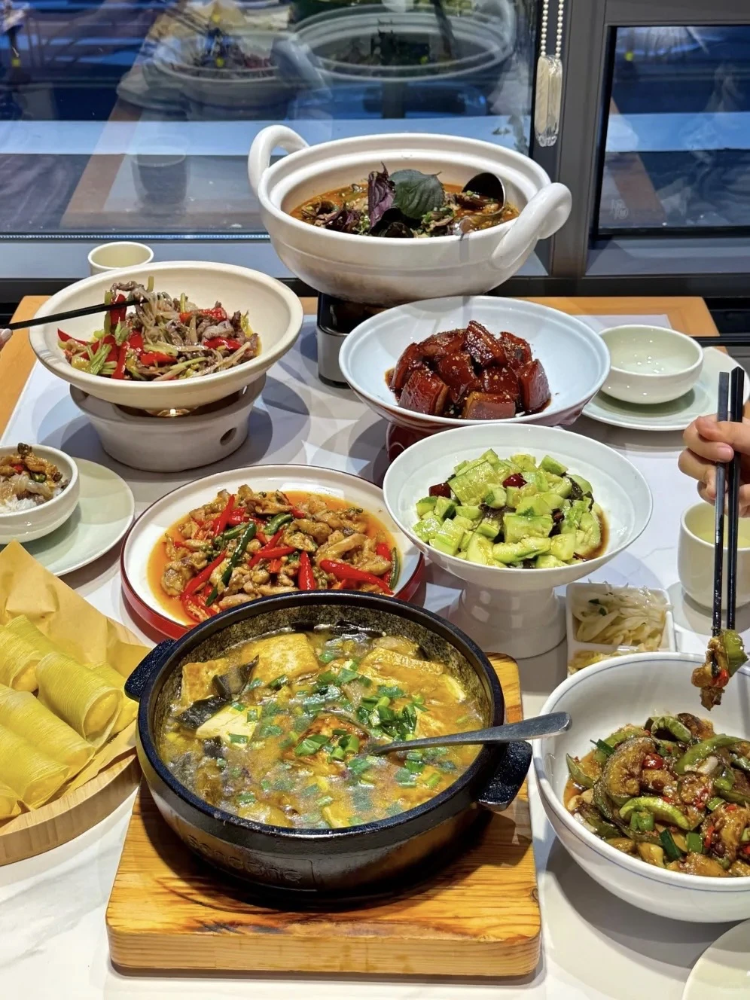
> [OCR] [?]
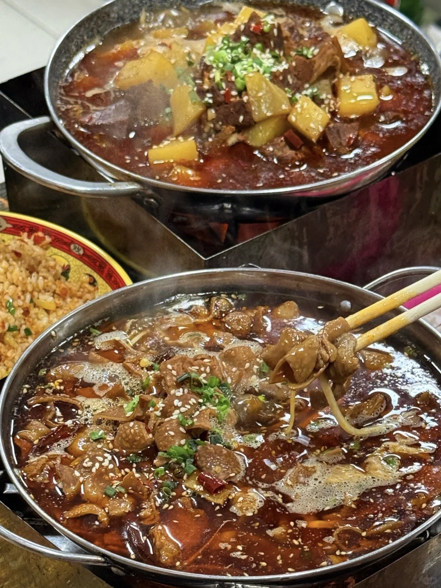
> [OCR] ?[?]
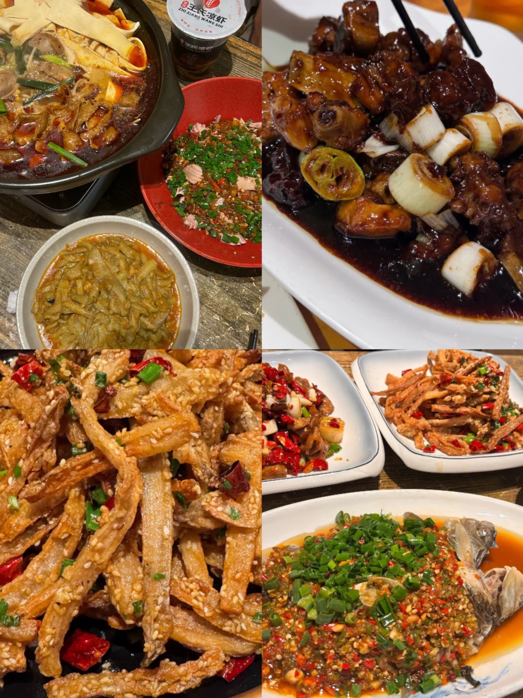
> [OCR] 王氏凉虾
ZHI XIANG WANG SHI
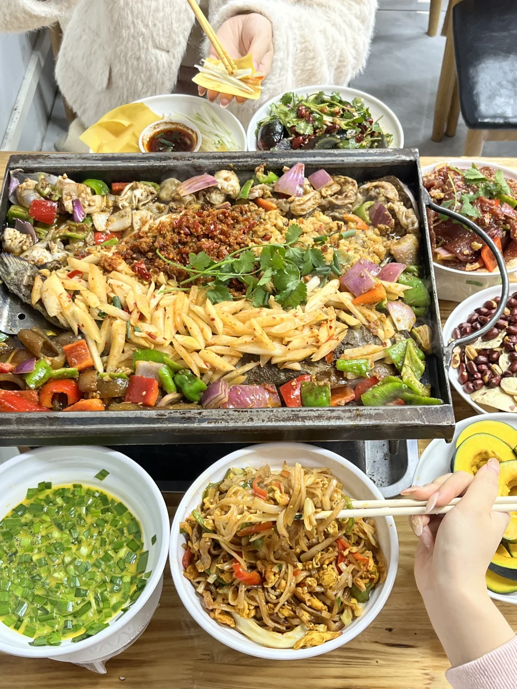
> [OCR] [?]
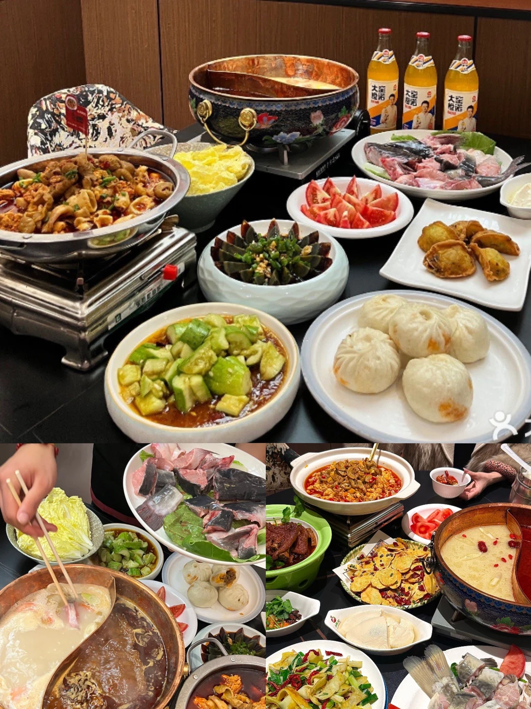
> [OCR] 大宝
大宝
大宝
大宝
大宝
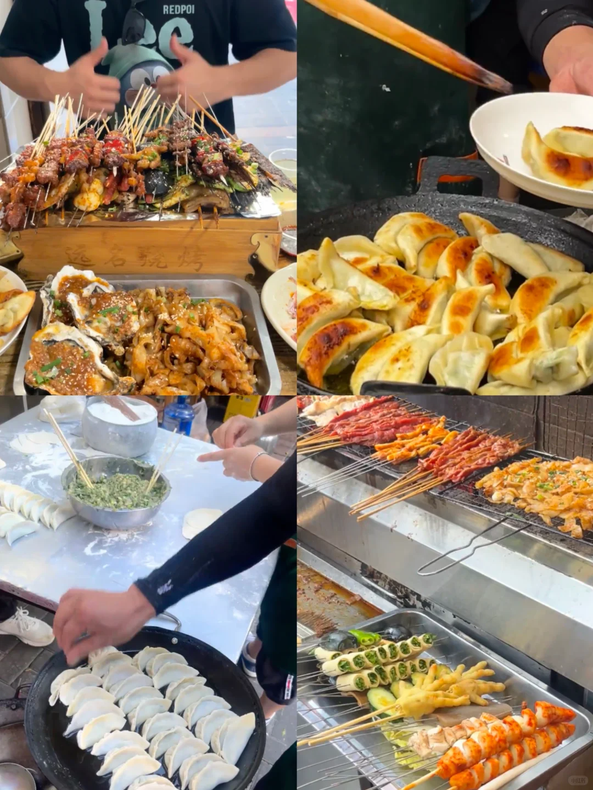
> [OCR] 远名烧烤
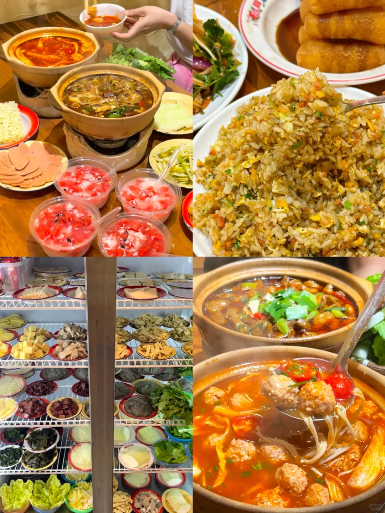
> [OCR] dutch

## 正文
作为土生土长的宜昌🍊
从早餐到夜宵
从小吃到正餐
都是老字号
1️⃣王氏凉虾  宜昌特色饮品
2️⃣袁姐萝卜饺子 宜昌代表特色小吃
3️⃣鲁包包 宜昌文旅推荐红油包子
4️⃣孙氏烤肉 宜昌顶顶好吃的烤肉
5️⃣怡合家味 宜昌老字号菜馆老好吃了
6️⃣品宜淐·成都麻椒肥肠 宜昌超便宜好吃的肥餐
7️⃣肥肠不肥 宜昌著名排队王只有一家
8️⃣宣恩烤活鱼 却别于宜昌所有烤鱼
大名鼎鼎宣恩烤活鱼
9️⃣远名烧烤 纯碳烤二十年老字号烧烤 煎饺一绝
🔟三囍砂锅 宜昌CBD穷鬼干饭食堂
1️⃣1️⃣小雨天 宜昌著名活鱼、土菜馆
宜昌本地土著整理
都是私藏老店…
真正和朋友反反复复去吃的
欢迎👏补充…
#宜昌美食[话题]##宜昌美食攻略[话题]##宜昌吃喝玩乐[话题]##跟本地人吃就对了[话题]# #宜昌旅游攻略[话题]##美食特种兵[话题]# #宜昌美食地图[话题]# #宜昌小吃[话题]##宜昌特产[话题]##本地人推荐美食[话题]#

---