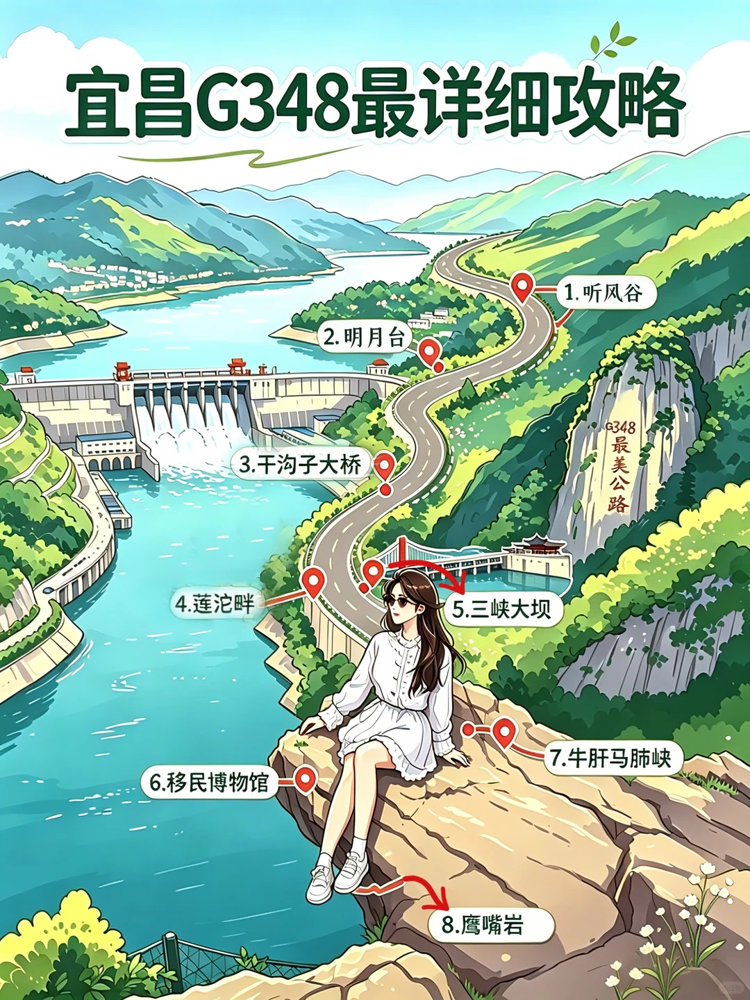
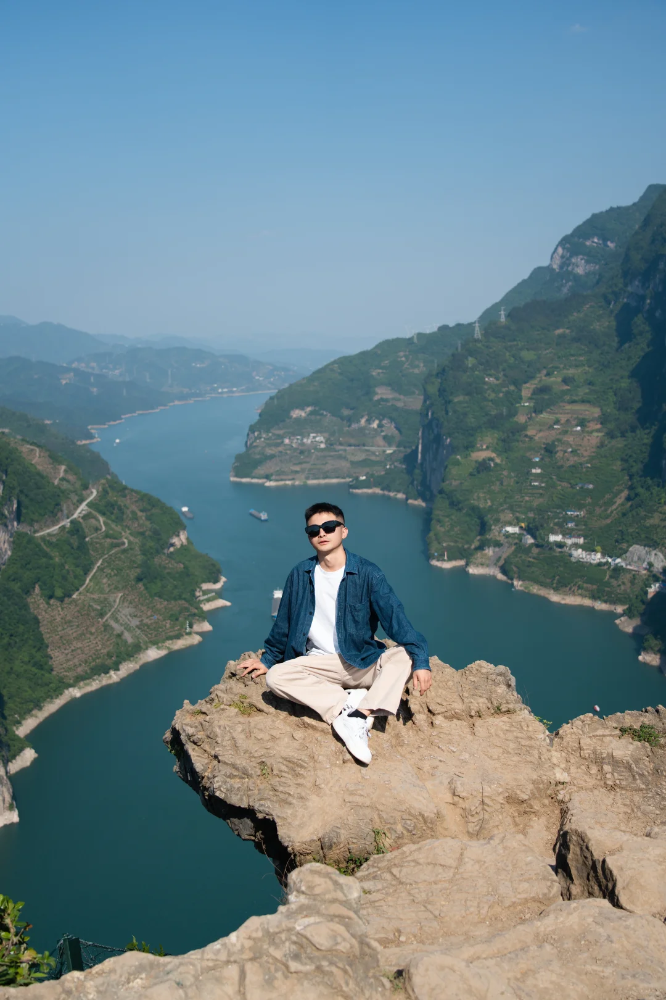

# 🚗 宜昌g348自驾游路线攻略

- 作者: 青野三峡包车旅拍
- 👍668 · 💬32 · ⭐934 · 图 6
- feed_id: 6a02effa0000000006037ea5

> [OCR] 宜昌G348最详细攻略

1. 听风谷
2. 明月台
3. 干沟子大桥
4. 莲沱畔
5. 三峡大坝
6. 移民博物馆
7. 牛肝马肺峡
8. 鹰嘴岩

> [OCR] system

> [OCR] [?]

> [OCR] system

> [OCR] + +

## 正文
🚗 宜昌G348「最详细攻略」打卡清单#宜昌包车游[话题]#
（按路线顺序整理，附游玩时长&打卡亮点）
⚠️游玩需要6-8小时，建议九点钟之前出发，随身带零食和水，吃饭多处选择，推荐莲坨畔服务区吃饭，挨近江水，小吃多饭馆多。
	
📍第一站：听风谷观景台[一R]
⏱️ 建议停留：5分钟
作为行程的起点，这里的视野以山林和峡谷为主，暂时看不到长江主景，整体风格偏清幽。适合下车活动一下、打卡路标，不用做过多停留，快速打卡后就可以继续赶路啦。
	
📍第二站：明月台观景台[二R]
⏱️ 建议停留：15-20分钟
行程的第一个高潮点！站在观景台，能将长江西陵峡的壮阔江景尽收眼底，尤其是江水在此处划出一道优美的月牙形江湾，山水环抱，意境十足。
	
📍第三站：干沟子大桥[三R]
⏱️ 建议停留：10-15分钟
建于1973年的老桥，是西陵峡当之无愧的“新地标”，也被大家称为“星空之眼”。站在桥头就能拍出大桥与大江同框的震撼画面，氛围感直接拉满，是行程里的必打卡点。
	
📍第四站：莲沱畔江滩[四R]
⏱️ 建议停留：30-40分钟
行程里的宝藏小众打卡地！这里既有江滩的野性风光，又有标志性的白色建筑，是两种风格碰撞的绝佳拍照点。轻松就能刷爆朋友圈。
	
📍第五站：三峡大坝[五R]
⏱️ 建议停留：20-30分钟（视是否进景区而定）
终于来到“国之重器”面前！在这里可以近距离感受三峡大坝的宏伟规模，亲眼见证水利工程的震撼，感受祖国基建的强大魅力。
	
📍第六站：秭归移民博物馆[六R]
⏱️ 建议停留：30分钟
藏着三峡记忆的“水下博物馆”。这里用老照片、实物和故事，记录了三峡大坝建设背后的移民历程，能让你更深入地了解这段历史。
	
📍第七站：牛肝马肺峡·小狗山[七R]
⏱️ 建议停留：15-20分钟
大自然的鬼斧神工！山体轮廓酷似一只趴在江边的小狗，呆萌又可爱，是整条路线里最出圈的网红打卡点之一。在这里拍一张和“小狗山”的合影，也算解锁了G348的隐藏彩蛋。
	
📍终点：鹰嘴岩[八R]
⏱️ 建议停留：30-40分钟
整条路线的终极彩蛋，也是大多数人奔赴G348的理由！站在悬崖边的鹰嘴形岩石上，脚下是蜿蜒的长江S弯，眼前是连绵的西陵峡群山，视野开阔到极致。这里的风景无需滤镜，随手一拍都是“人生照片”，氛围感直接封神。⚠️ 拍照一定要注意脚下安全，远离悬崖边缘！#宜昌旅游[话题]# #g348三峡公路[话题]# #宜昌周边游[话题]##包车游[话题]#

---