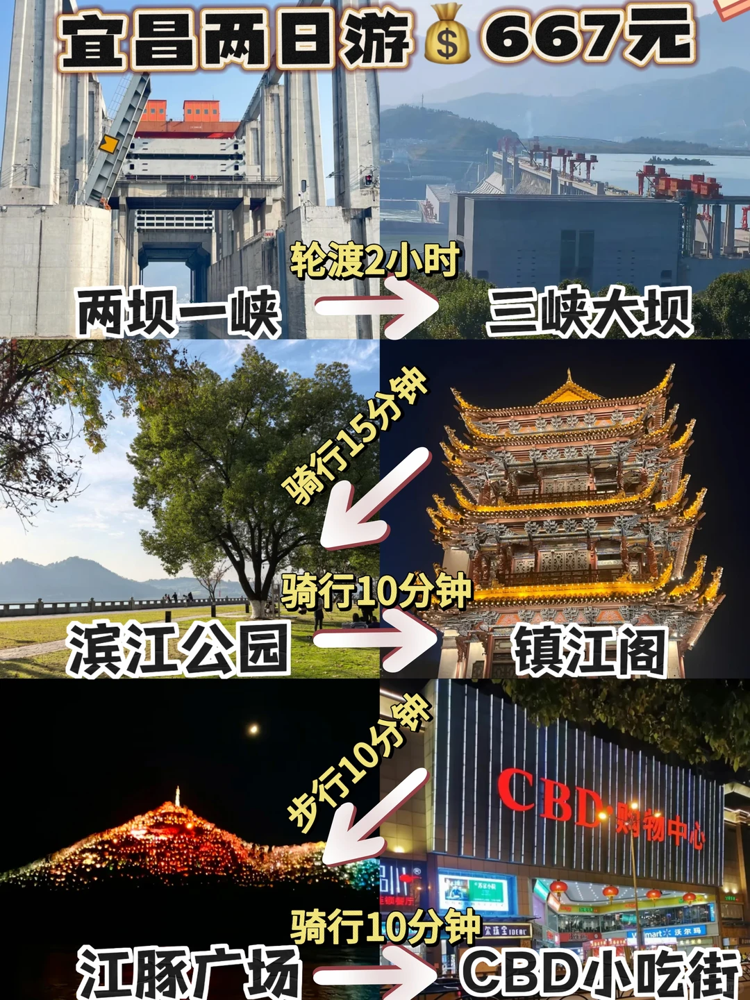
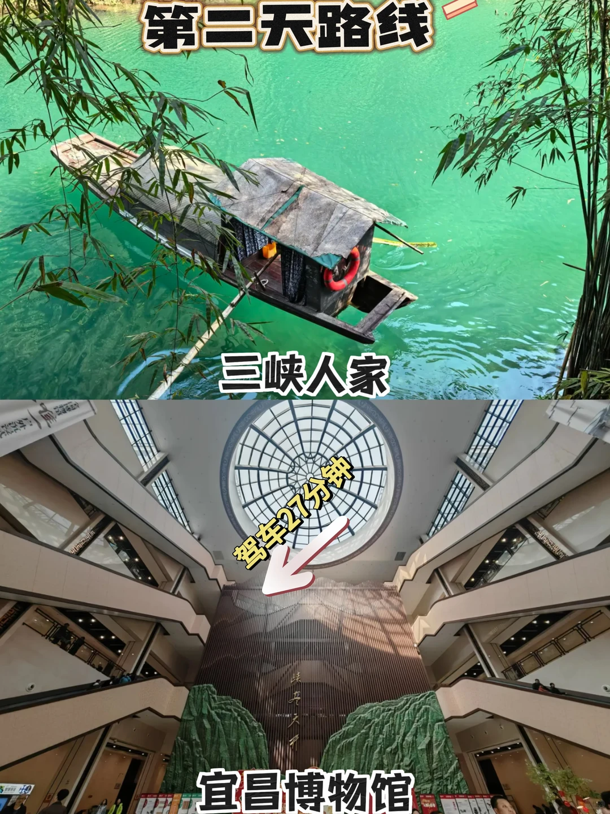
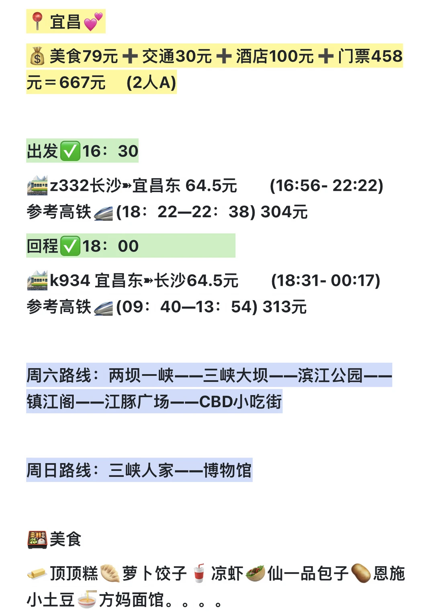
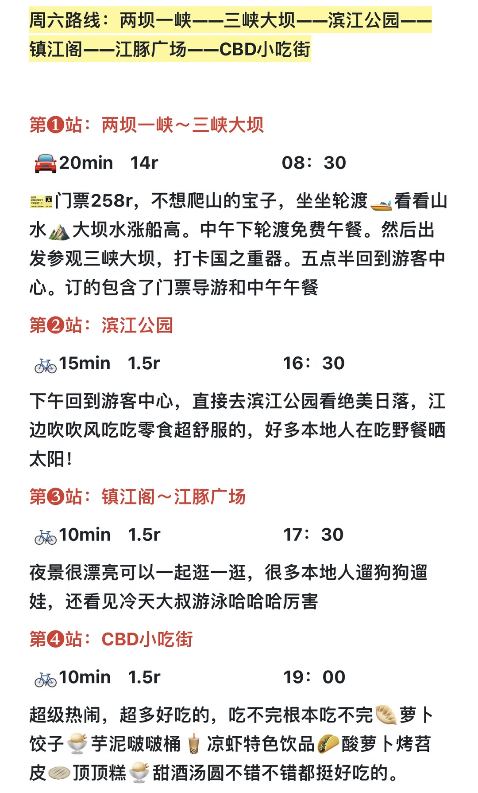
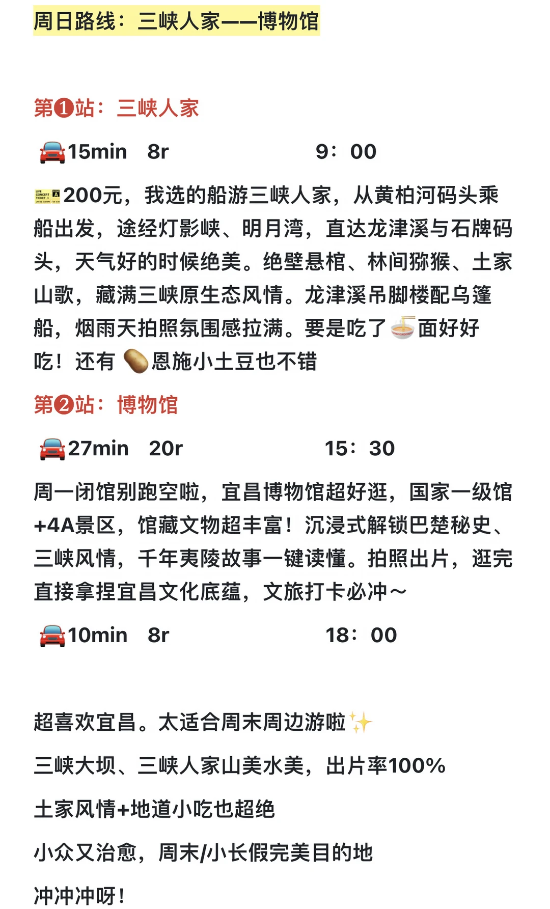
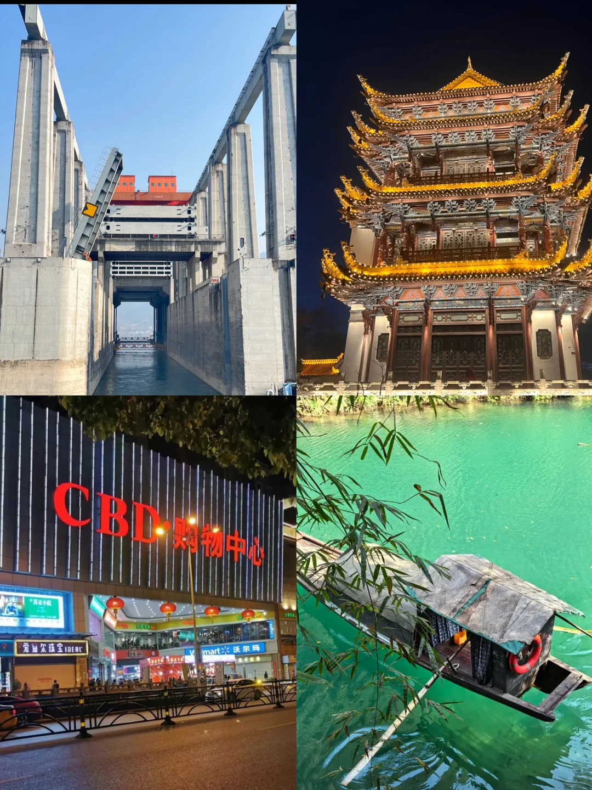
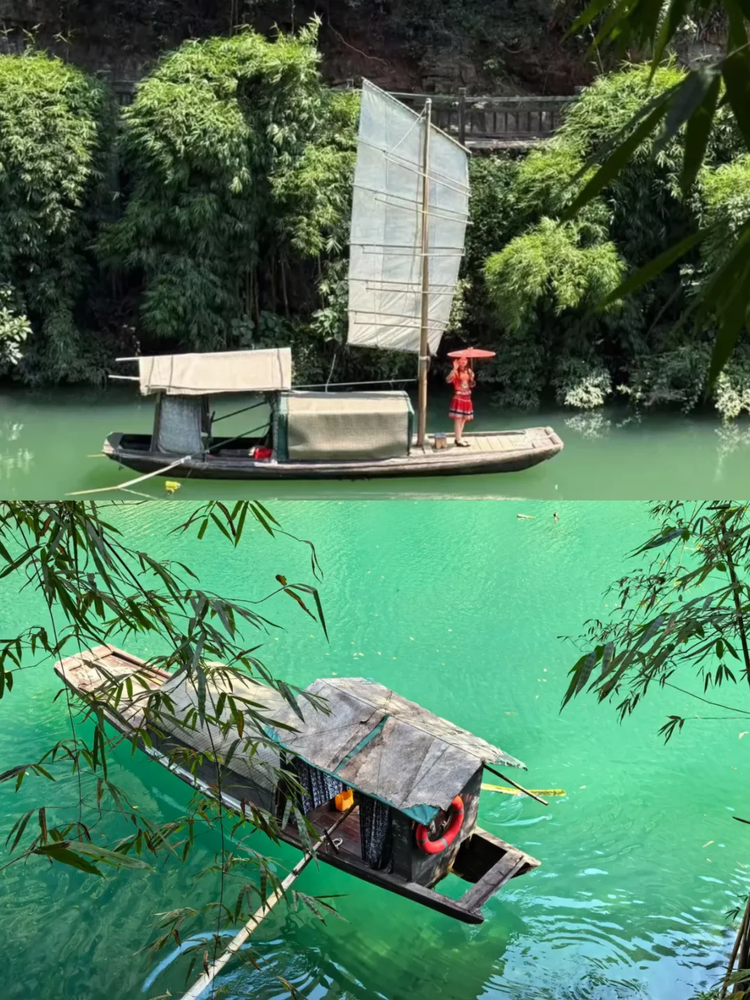
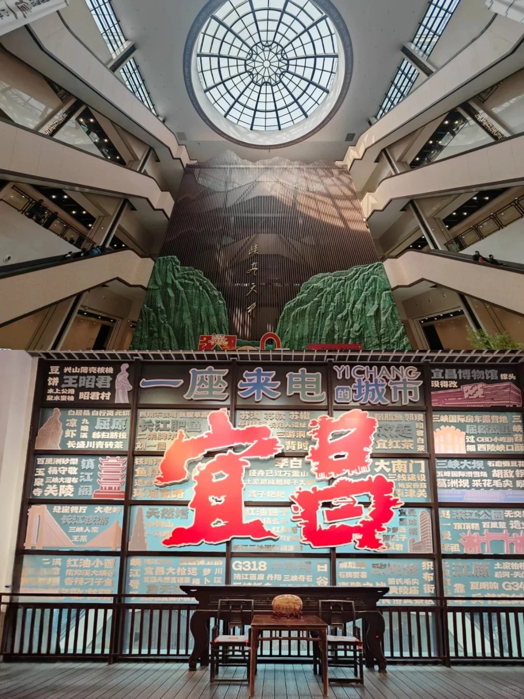

# 宜昌2日citywalk💰667元拿下‼️

- 作者: 李想de旅行日记~
- 👍650 · 💬10 · ⭐582 · 图 9
- feed_id: 69cd32d0000000001a029603

> [OCR] 宜昌两日游 $ 667元
两坝一峡 轮渡2小时 → 三峡大坝
滨江公园 骑行15分钟
镇江阁 骑行10分钟
江豚广场 步行10分钟
CBD购物中心
CBD小吃街

> [OCR] 第二天路线
三峡人家
驾车27分钟
宜昌博物馆

> [OCR] 宜昌💖

💰 美食79元 + 交通30元 + 酒店100元 + 门票458
元 = 667元 (2人A)

📅 出发✅ 16: 30
🚂 z332长沙→宜昌东 64.5元   (16:56- 22:22)
参考高铁🚄(18: 22—22: 38) 304元

📅 回程✅ 18: 00
🚂 k934 宜昌东→长沙64.5元   (18:31- 00:17)
参考高铁🚄(09: 40—13: 54) 313元

周六路线：两坝一峡——三峡大坝——滨江公园——
镇江阁——江豚广场——CBD小吃街

周日路线：三峡人家——博物馆

🍱 美食
🥟顶顶糕 🥟萝卜饺子🥤凉虾🥡仙一品包子🥔恩施小土豆🍜方妈面馆。。。。

> [OCR] 周六路线：两坝一峡——三峡大坝——滨江公园——镇江阁——江豚广场——CBD小吃街

第①站：两坝一峡～三峡大坝
🚗 20min   14r         08:30
门票258r，不想爬山的宝子，坐坐轮渡🚢看看山水⛰️大坝水涨船高。中午下轮渡免费午餐。然后出发参观三峡大坝，打卡国之重器。五点半回到游客中心。订的包含了门票导游和中午午餐

第②站：滨江公园
🚲 15min   1.5r        16:30
下午回到游客中心，直接去滨江公园看绝美日落，江边吹吹风吃吃零食超舒服的，好多本地人在吃野餐晒太阳！

第③站：镇江阁～江豚广场
🚲 10min   1.5r        17:30
夜景很漂亮可以一起逛一逛，很多本地人遛狗狗遛娃，还看见冷天大叔游泳哈哈哈厉害

第④站：CBD小吃街
🚲 10min   1.5r        19:00
超级热闹，超多好吃的，吃不完根本吃不完🥟萝卜饺子🥔芋泥啵啵桶🥤凉虾特色饮品🌮酸萝卜烤苕皮🍠顶顶糕🍡甜酒汤圆不错不错都挺好吃的。

> [OCR] 周日路线：三峡人家——博物馆

第①站：三峡人家
🚗 15min   8r         9:00
200元，我选的船游三峡人家，从黄柏河码头乘船出发，途经灯影峡、明月湾，直达龙津溪与石牌码头，天气好的时候绝美。绝壁悬棺、林间猕猴、土家山歌，藏满三峡原生态风情。龙津溪吊脚楼配乌篷船，烟雨天拍照氛围感拉满。要是吃了🍜面好好吃！还有🥔恩施小土豆也不错

第②站：博物馆
🚗 27min   20r        15:30
周一闭馆别跑空啦，宜昌博物馆超好逛，国家一级馆+4A景区，馆藏文物超丰富！沉浸式解锁巴楚秘史、三峡风情，千年夷陵故事一键读懂。拍照出片，逛完直接拿捏宜昌文化底蕴，文旅打卡必冲～

🚗 10min   8r         18:00

超喜欢宜昌。太适合周末周边游啦✨
三峡大坝、三峡人家山美水美，出片率100%
土家风情+地道小吃也超绝
小众又治愈，周末/小长假完美目的地
冲冲冲呀！

> [OCR] CBD·购物中心
沃尔玛

> [OCR] [?][?]

## 正文
📍宜昌💕
💰美食79元➕交通30元➕酒店100元➕门票458元＝667元     (2人A)
	
周六路线：两坝一峡——三峡大坝——滨江公园——镇江阁——江豚广场——CBD小吃街
	
周日路线：三峡人家——博物馆
	
🍱美食
🧈顶顶糕🥟萝卜饺子🥤凉虾🥙仙一品包子🥔恩施小土豆🍜方妈面馆。。。。
	
第1⃣️站：两坝一峡～三峡大坝
🚘20min    14r                             08：30
🎫门票258r，不想爬山的宝子，坐坐轮渡🚤看看山水⛰大坝水涨船高。中午下轮渡免费午餐。然后出发参观三峡大坝，打卡国之重器。五点半回到游客中心。订的包含了门票导游和中午午餐
第2⃣️站：滨江公园
🚲15min    1.5r                             16：30
下午回到游客中心，直接去滨江公园看绝美日落，江边吹吹风吃吃零食超舒服的，好多本地人在吃野餐晒太阳！
第3⃣️站：镇江阁～江豚广场
夜景很漂亮可以一起逛一逛，很多本地人遛狗狗遛娃，还看见冷天大叔游泳哈哈哈厉害
第4⃣️站：CBD小吃街
超级热闹，超多好吃的，吃不完根本吃不完🥟萝卜饺子🍨芋泥啵啵桶🧋凉虾特色饮品🌮酸萝卜烤苕皮🫓顶顶糕🍨甜酒汤圆不错不错都挺好吃的。
第5⃣️站：三峡人家
🎫200元，我选的船游三峡人家，从黄柏河码头乘船出发，途经灯影峡、明月湾，直达龙津溪与石牌码头，天气好的时候绝美。绝壁悬棺、林间猕猴、土家山歌，藏满三峡原生态风情。龙津溪吊脚楼配乌篷船，烟雨天拍照氛围感拉满。要是吃了🍜面好好吃！还有 🥔恩施小土豆也不错
第6⃣️站：博物馆
周一闭馆别跑空啦，宜昌博物馆超好逛，国家一级馆+4A景区，馆藏文物超丰富！沉浸式解锁巴楚秘史、三峡风情，千年夷陵故事一键读懂。拍照出片，逛完直接拿捏宜昌文化底蕴，文旅打卡必冲～
	
超喜欢宜昌。太适合周末周边游啦✨
三峡大坝、三峡人家山美水美，出片率100%
土家风情+地道小吃也超绝
小众又治愈，周末/小长假完美目的地
冲冲冲呀！
#宜昌旅行攻略[话题]##周末去哪玩[话题]# #长沙周边游[话题]##宜昌旅游攻略[话题]##旅行[话题]##两坝一峡[话题]##三峡大坝[话题]##路线[话题]##周末旅行[话题]##长沙[话题]#

---