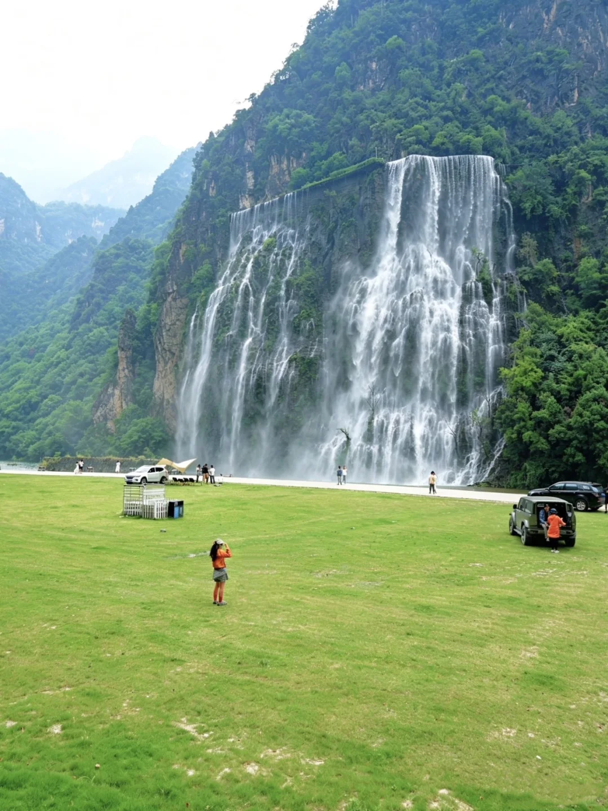
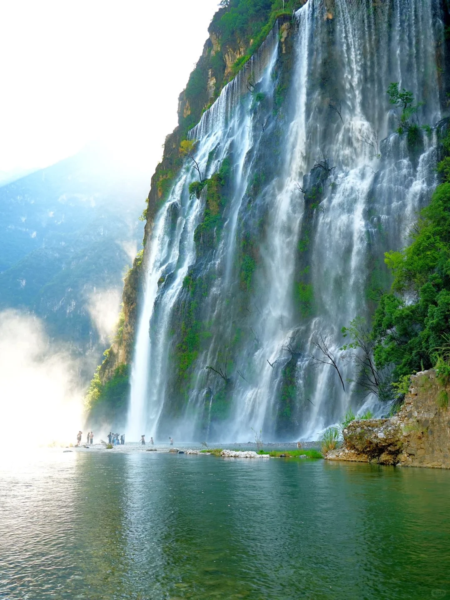
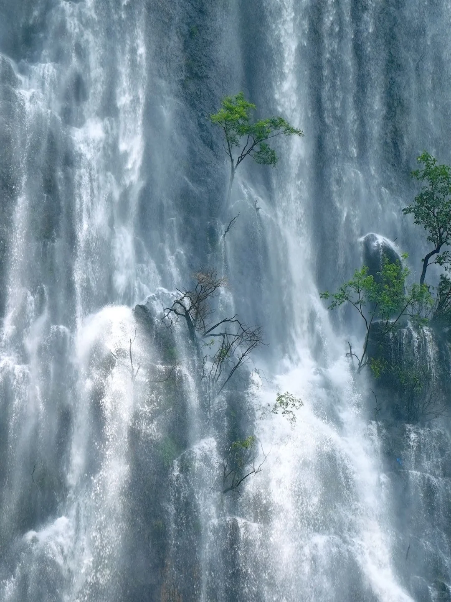
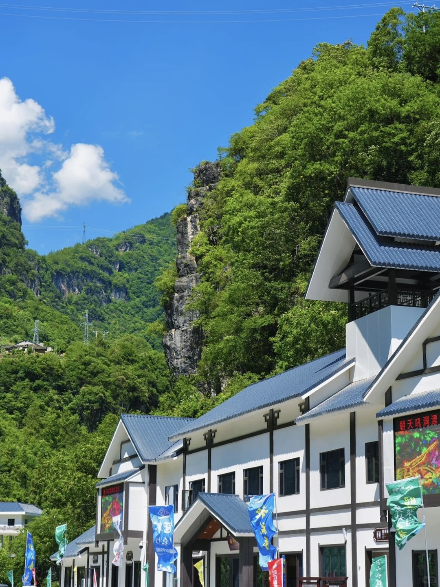
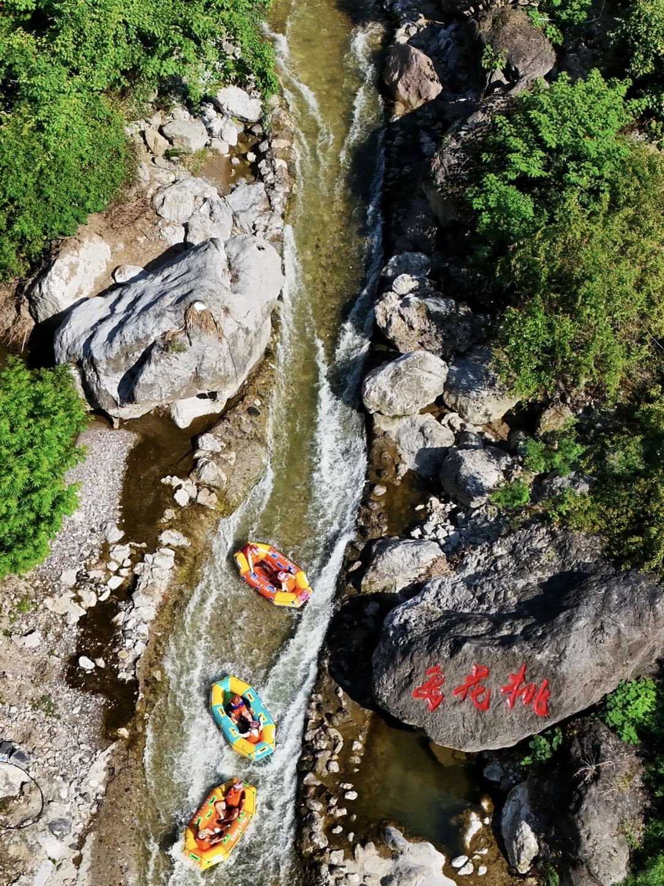
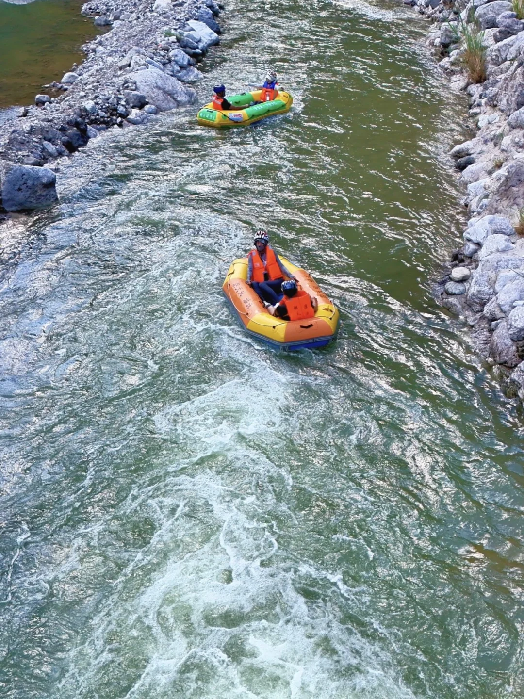
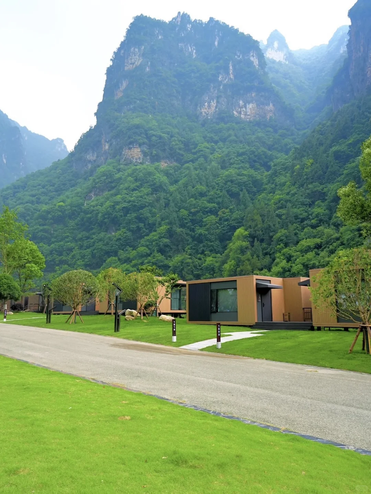
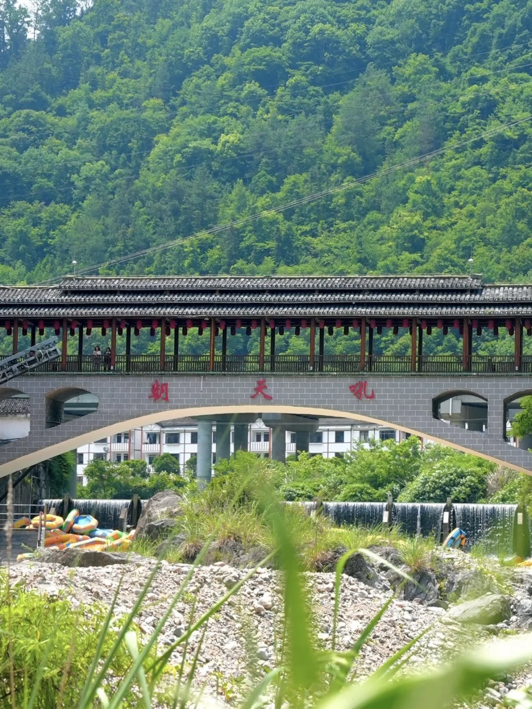

# 宜昌！！小红书跟风zui成功的一次......

- 作者: 森森大王
- 👍647 · 💬61 · ⭐411 · 图 8
- feed_id: 69e8b270000000001a022f6b

> [OCR] system

> [OCR] [?]

> [OCR] system

> [OCR] 朝天吼洞漂
[?]

> [OCR] 西花桃

> [OCR] [?]

> [OCR] 108

> [OCR] 朝天吼

## 正文
不是黄果树去不起
而是朝天吼更有性价比😂😂😂
每年都去朝天吼漂流，结果九成的人直接错过了这个免费的宝藏机位！
给大家安利一个隐藏在朝天吼景区里的“黄果树平替”——朝天吼大瀑布！
·
这个瀑布就在漂流终点前方大概300米的地方，走个五分钟就到了，而且免费！
目测有百米高、120米宽，巨大的水流顺着悬崖奔腾而下，水花四溅，在阳光的折射下还能直接看到彩虹🌈，真的很壮观，站在下面拍照那叫一个震撼
·
瀑布前面还有一大片绿草地
夏日氛围感直接拉满
随手一拍都是电影海报级别的
在这拍完照再去漂流，这波体验才算完整！
不想五一出远门，去热门景点人挤人的姐妹
五一出片圣地已经给你们找好啦
建议穿上亮色的小裙子👗去拍瀑布
再带上速干衣去漂流，这一趟绝对刷爆朋友圈！
	
#朝天吼瀑布[话题]# #宜昌旅游[话题]# #五一小众打卡地[话题]# #湖北周边游[话题]# #拍照穿搭[话题]#

---