# J人超超超详细版｜宜昌两天一夜旅行攻略

- 作者: 一坨脆脆威化饼
- 👍595 · 💬47 · ⭐498 · 图 13
- feed_id: 6a213347000000003501d7bb

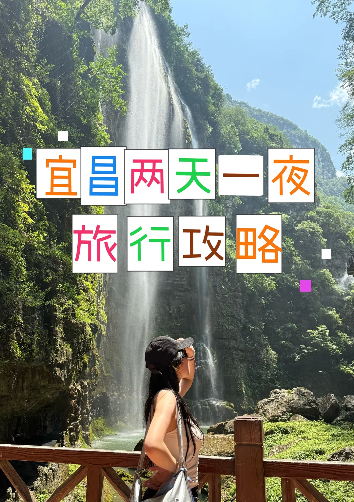
> [OCR] 宜昌两天一夜
旅行攻略
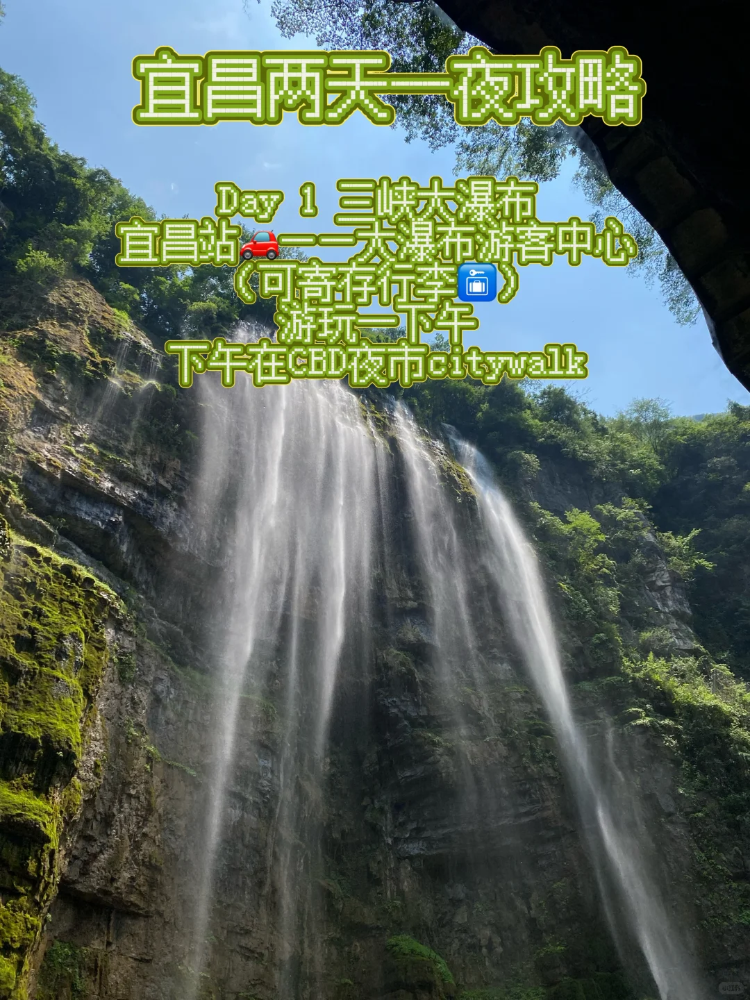
> [OCR] 宜昌两天一夜攻略

Day 1 三峡大瀑布
宜昌站[?]——大瀑布游客中心
(可寄存行李[?] )
游玩一下午
下午在CBD夜市citywalk
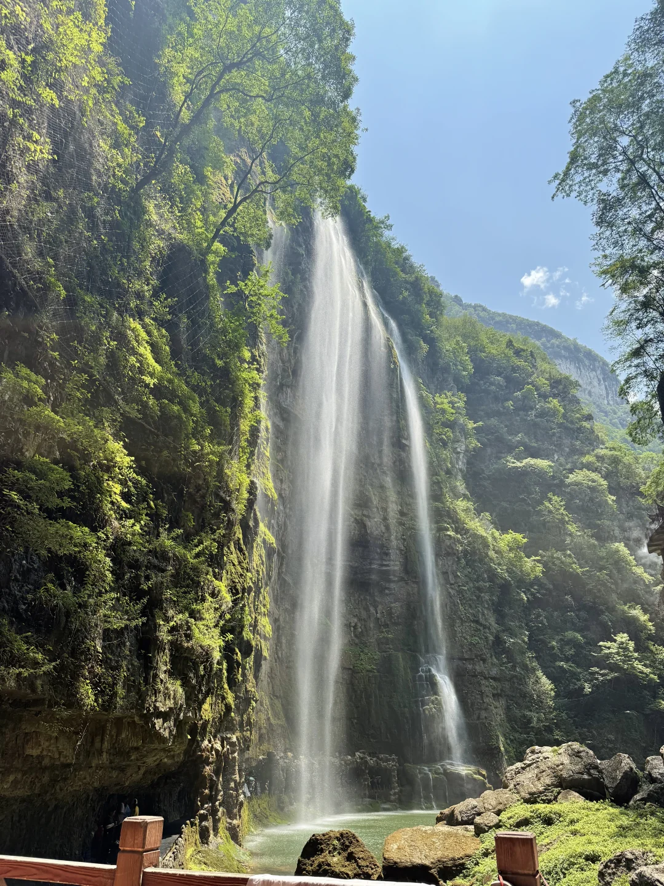
> [OCR] system
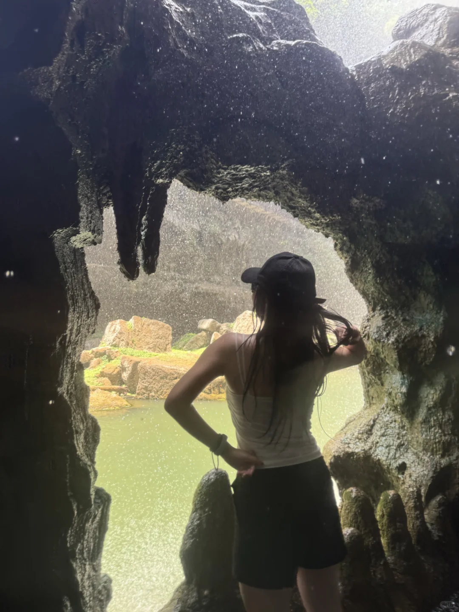
> [OCR] [?]
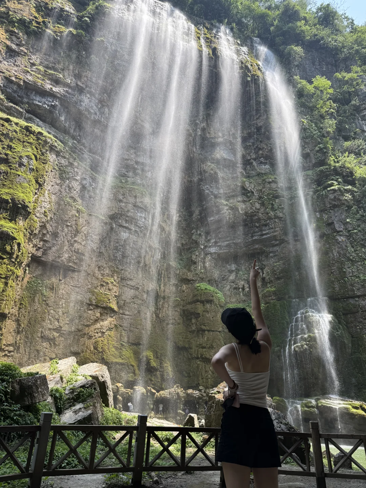
> [OCR] system
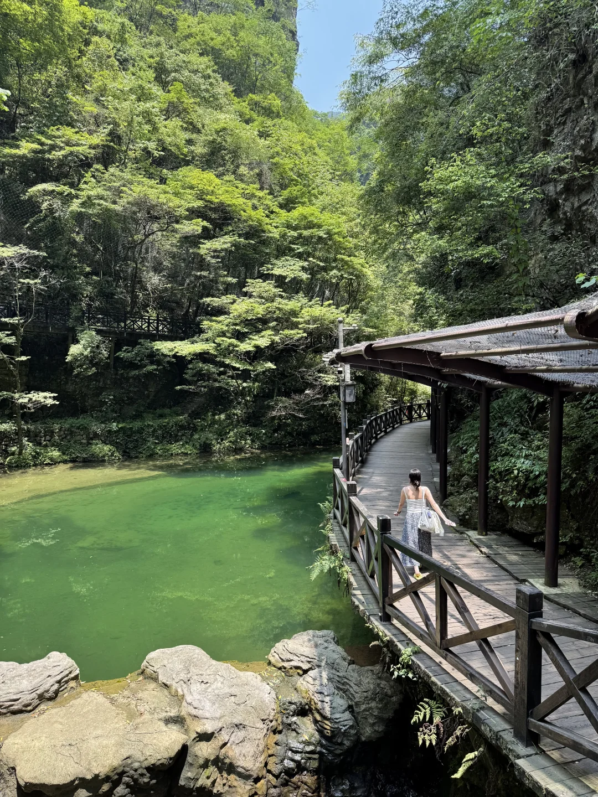
> [OCR] [?]
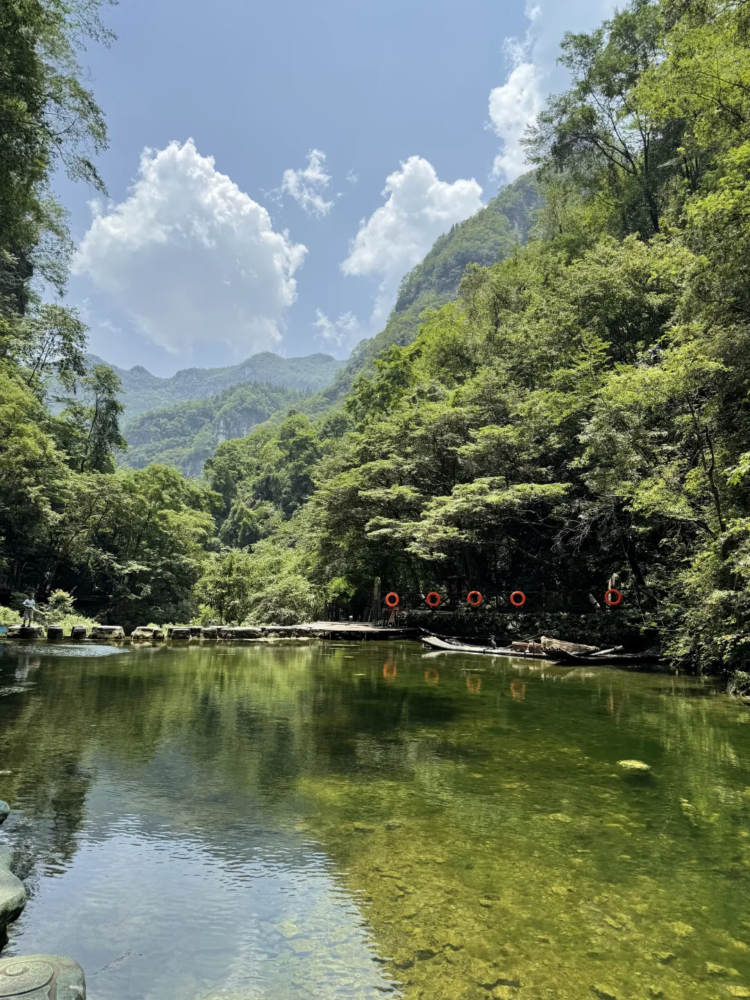
> [OCR] [?]
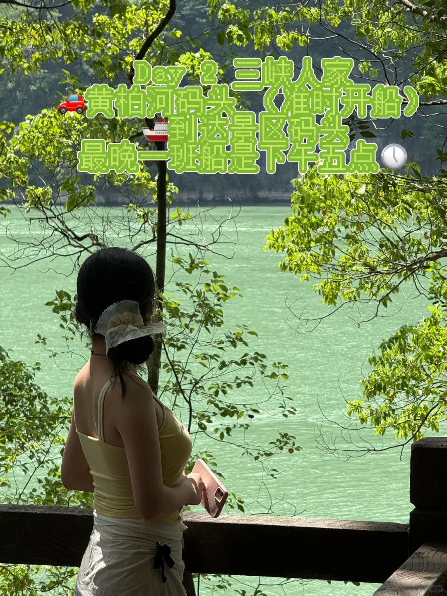
> [OCR] Day 2 三峡人家
黄柏河码头 [准时开船]
最晚二班船是下午五点
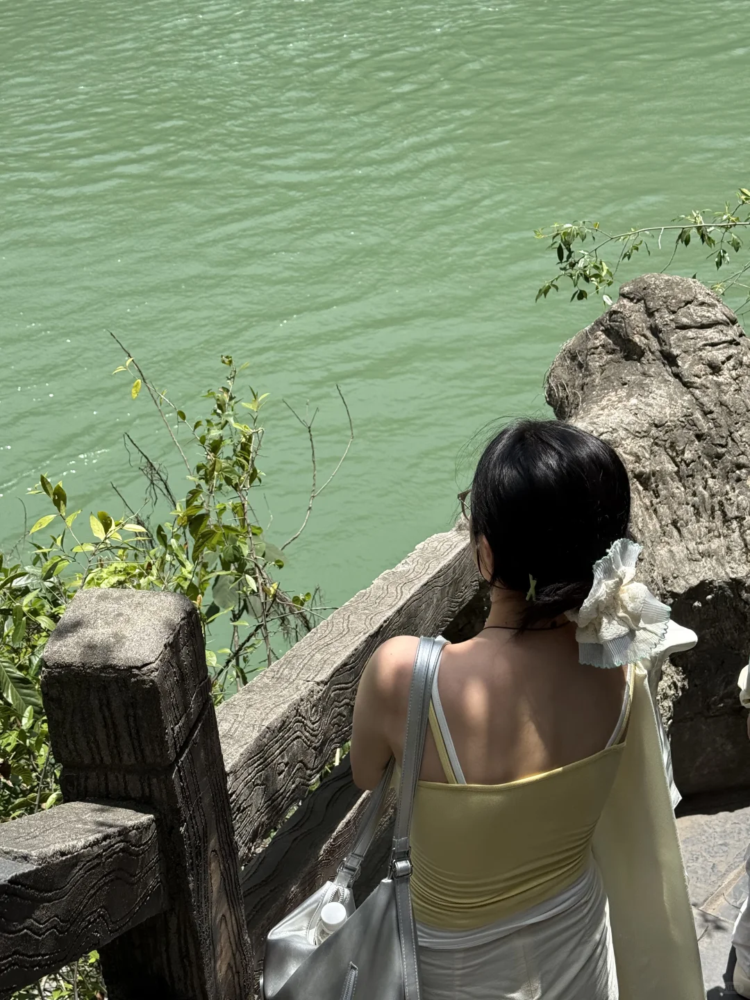
> [OCR] [?]
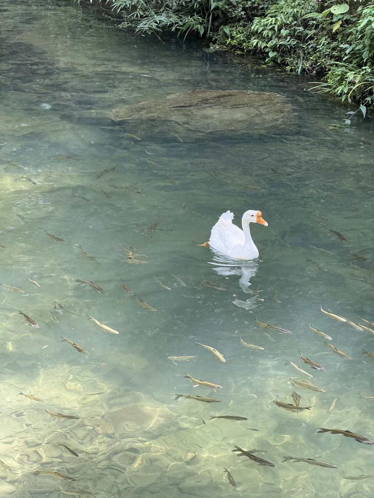
> [OCR] system
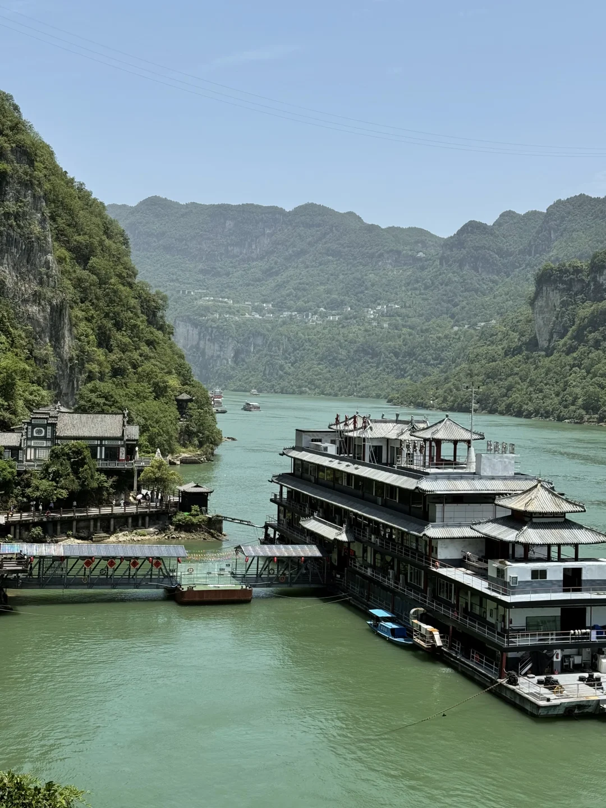
> [OCR] [?]
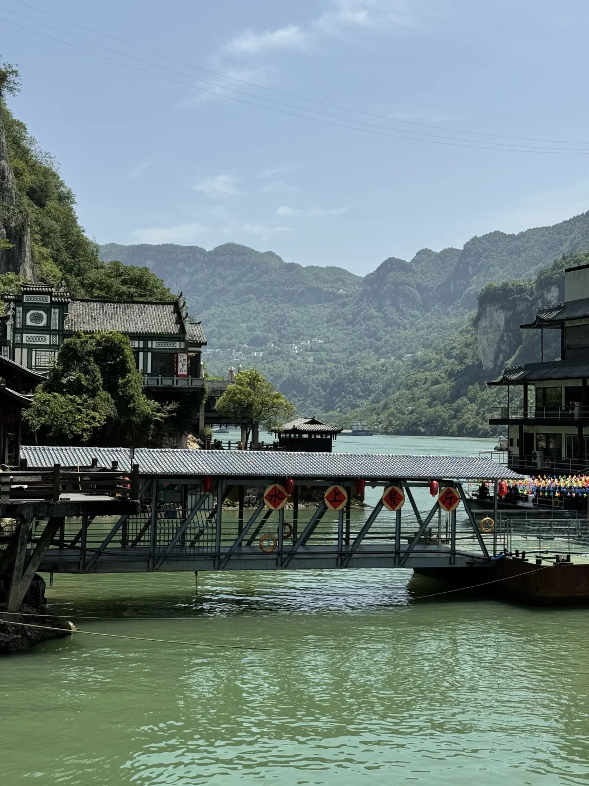
> [OCR] 水上餐厅
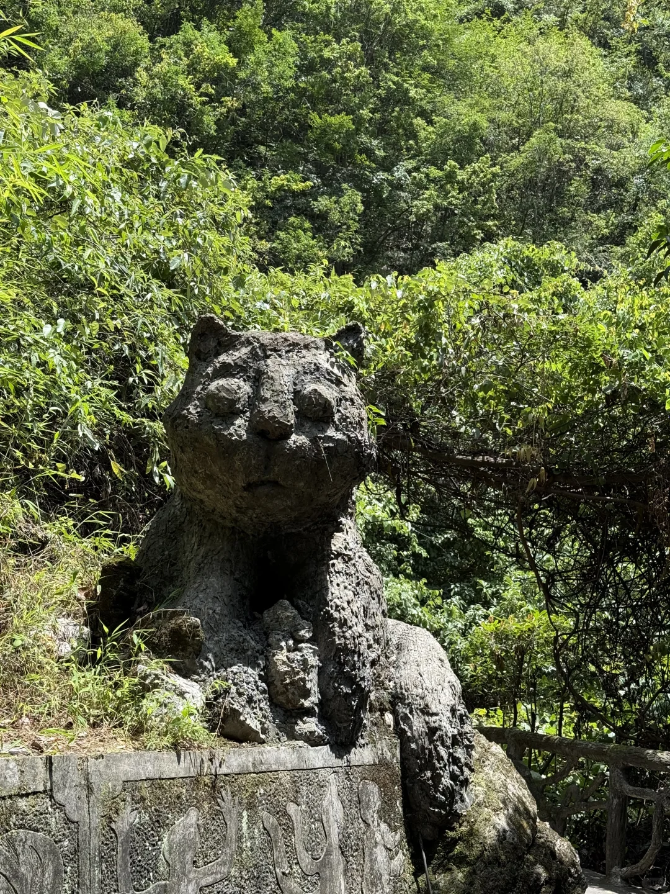
> [OCR] [?]

## 正文
今年的夏天真的热的太离谱了……
宜昌真的是玩水➕避暑胜地！！
	
🫧Day1 【三峡大瀑布】
主煲是从汉口站出发的 ： 汉口——宜昌
（因为第一天已经有行程 如果不想毁坏造型 建议带好帽子🧢➕墨镜🕶️ 和一套衣服可以随身换 还有伞🌂 手机防水套📱）
中午：到达直接打车到大瀑布游客中心（打车🚗40min 大概是40～80r) 游客中心有智能柜可以寄存行李 太大的可能不行蛤！
下午：开始游玩！ 如果不想把造型破坏 建议拍完照以后再穿瀑！！！（忠告！）有勇气的同志可以去蹦极 但是需要付费吼
傍晚：结束啦 打车回酒店 外出city walk 去小吃街买晚饭
	
🫧Day2【三峡人家】
退房➕寄存行李 在各大app（对比便宜）买三峡人家的 船往返➕景区套票
上午：打车到 黄柏河码头 兑换纸质票（我们当时是9:00开船 要提前到哦 船不等人）船上特别凉快特别好拍！
中午11:00左右：到达景区码头 索道/扶梯/步行上山 大家斟酌 走不动的话也有人工轿子抬 除了步行 都需要付费哦 穿运动鞋或者舒服的鞋子！
步行路线：11:30/13:30有演出 其他时间也有很多丰富的活动和景色 大家可以询问景区工作人员哦
景区也有饭馆和小吃
下午：船最晚的一班是下午5点 返回码头 回程
打车回酒店拿行李👉再去宜昌东站 回程啦
	
祝大嘎玩得开心🥳#我的小众旅行攻略[话题]# #避开人挤人[话题]# #避暑胜地[话题]# #宜昌旅游[话题]# #三峡人家[话题]# #三峡大瀑布[话题]# #毕业旅行[话题]# #毕业季[话题]#

---