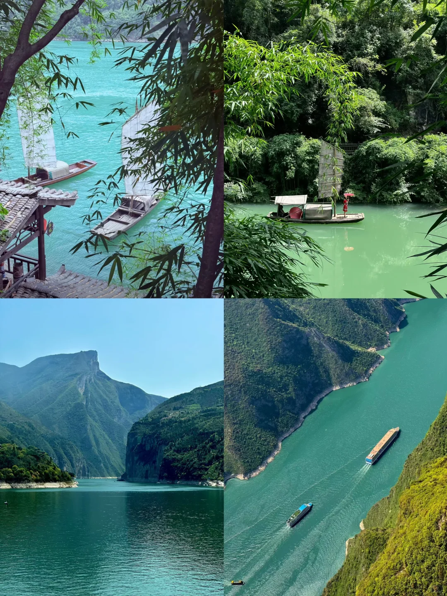
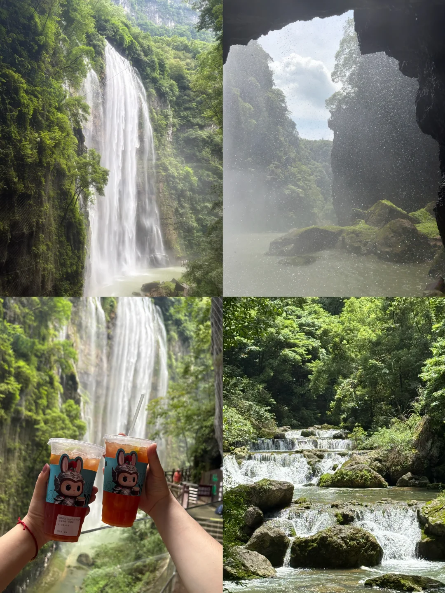
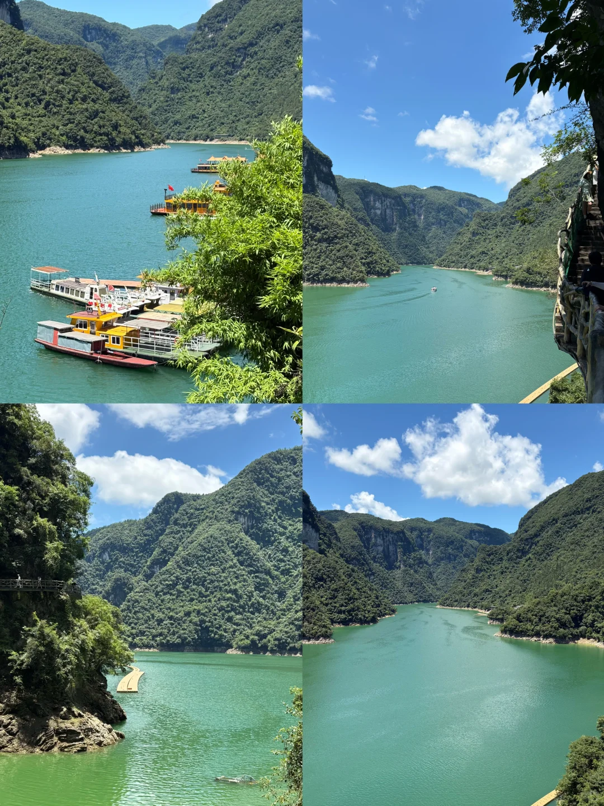
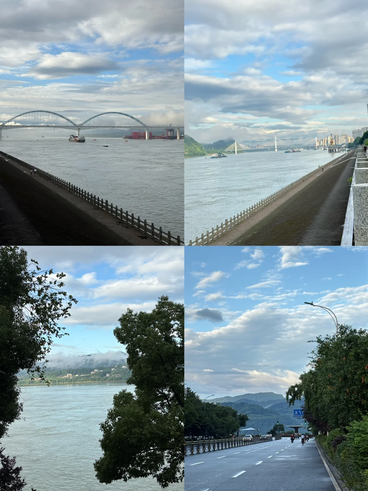
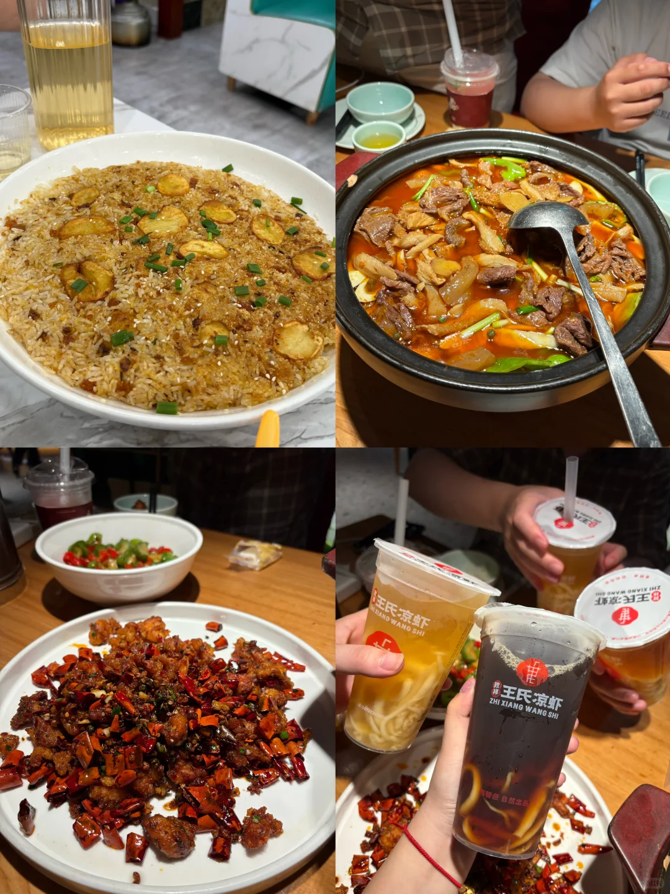
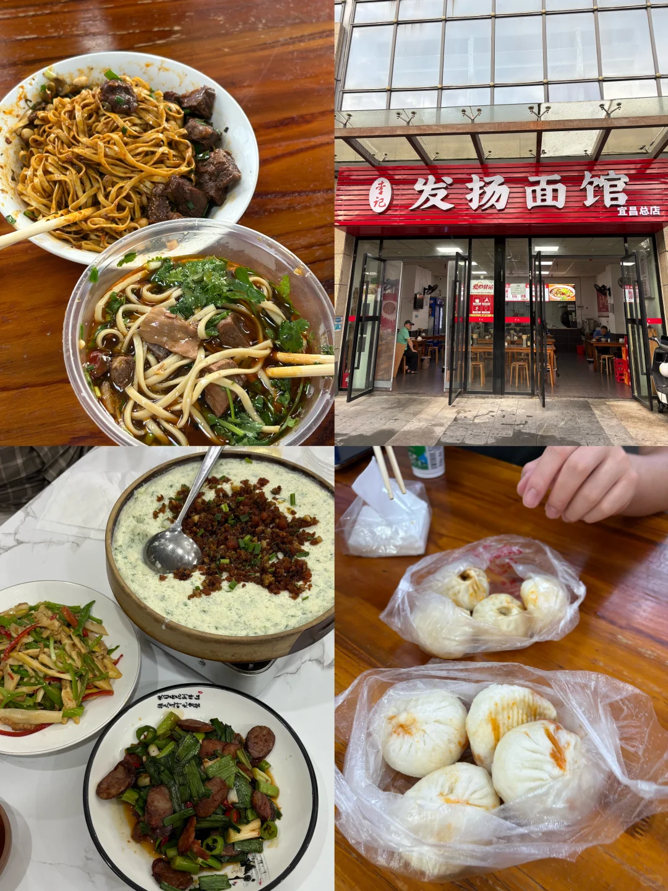

# 宜昌3天2晚自驾攻略（含住宿/ 吃喝推荐）

- 作者: 爱吃麻辣鹅
- 👍486 · 💬28 · ⭐539 · 图 6
- feed_id: 6a38fcc5000000000f01c5fa

> [OCR] [?]
[?]

> [OCR] 0124 29

> [OCR] [?]

> [OCR] [?][?][?]

> [OCR] 王氏凉虾
ZHI XIANG WANG SHI

> [OCR] 发扬面馆
宜昌总店

## 正文
行程参考⬇️👇🚗
day1: 清江画廊 （b线）- 自驾G348
清江画廊：分a线和b线区别，a线全程坐船适合带老人和小孩 ，b线是先徒步＋后坐船返回，年轻人 想要拍照打卡，选了b线！!
走下来不算很累，且栈道大部分时候都有阴凉，所以不算特别热，走走停停可以拍拍照，徒步打卡完返还是坐游船，游船行程30-40分钟的样子。
下午自驾G348：全程免费打卡点，非常推荐自驾的朋友都走一趟G348，绝对不会后悔。盘山公路，全程40公里左右，打卡点为听风谷-山外山观景台-明月台-干沟子大桥-莲沱盼-鹰嘴岩
day2:三峡大瀑布-三峡大坝
三峡大瀑布：穿瀑而行，清凉从刺激，出片贼帅，非常推荐。我们买了雨衣自带，景区也有卖而且不贵，5块钱一件。推荐坐景区观光小火车进景区，因为到景区里面还有一大段路，且路边没什么风景，所以不建议走路，小火车也只要10元/人。
三峡大坝：自驾的朋友需要注意走三峡专用路线需要通行证，可以在入口地方自助办理，很快，几分钟就办好了。到三峡大坝游客中心后买35元的大巴车票，乘坐专线进入大坝景区，我们没有做游轮，只在景区里看了一眼大坝。
day3：市区cbd-滨江公园-解放路步行街（含酒店推荐🏨）
最后一天，走走走逛逛吃吃的一天，准备返程，我们住在城市快捷酒店（长江广场店），酒店性价比很高，干净整洁服务态度也很棒，且地理位置好，周围就有2个商圈及夜市，离宜昌东站也很近。酒店是自费自费的！！！不是广子！放心参考✌️
推荐一大早一定去宜昌的江边看看，晨雾缭绕，青山绿水，美不胜收！！！
🍽️🥣🥩🍺吃喝推荐
1️⃣王氏凉虾：QQ弹弹的特别解腻 便宜又好喝 力推
2️⃣发扬面馆：牛肉面和热干面都很好吃 他家旁边的楚牛香面馆也不错 但是比较重麻重辣
3️⃣自己人·宜昌本地菜 : 这家就是酒店附近的 我们盲选的一家 但是意料之外很好吃 我们点的牛筋牛杂锅＋茄子＋辣子鸡 这三样菜都没有踩雷
4️⃣刘记搓一顿:这家是玩过清江画廊出来后吃的 在景区附近的县里 这家一般般 但是也不难吃 无功无过 不过老板娘态度很热情 而且分量很大 土豆锅巴饭还不错👌
#宜昌美食[话题]# #宜昌旅游[话题]# #宜昌攻略[话题]# #宜昌旅行攻略[话题]# #宜昌自驾游[话题]# #宜昌旅游攻略[话题]# #三峡[话题]# #三峡大瀑布[话题]# #清江画廊[话题]# #G348国道[话题]#

---