# 宜昌最美的景色都是免费的！

- 作者: 门门
- 👍451 · 💬47 · ⭐363 · 图 13
- feed_id: 69fb3f07000000001b021325

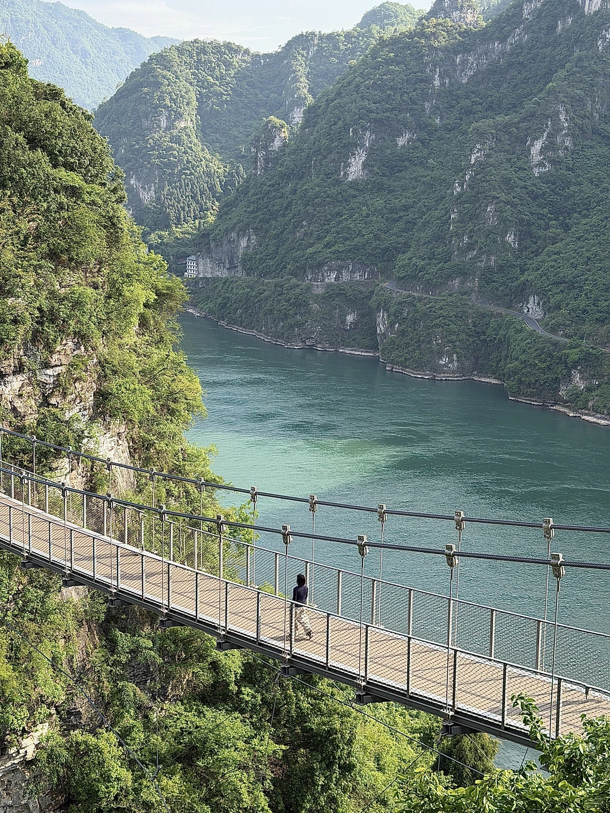
> [OCR] system
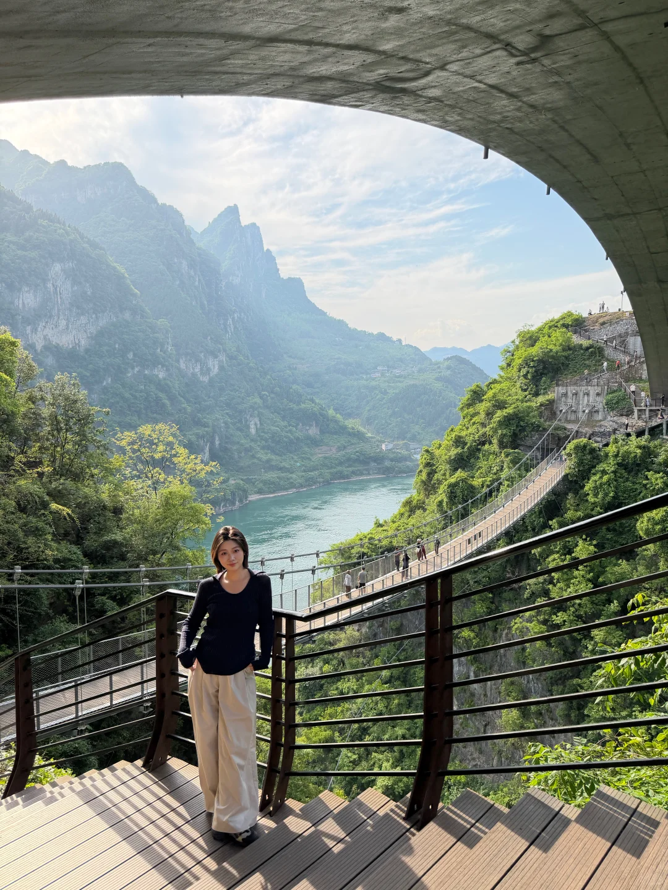
> [OCR] system
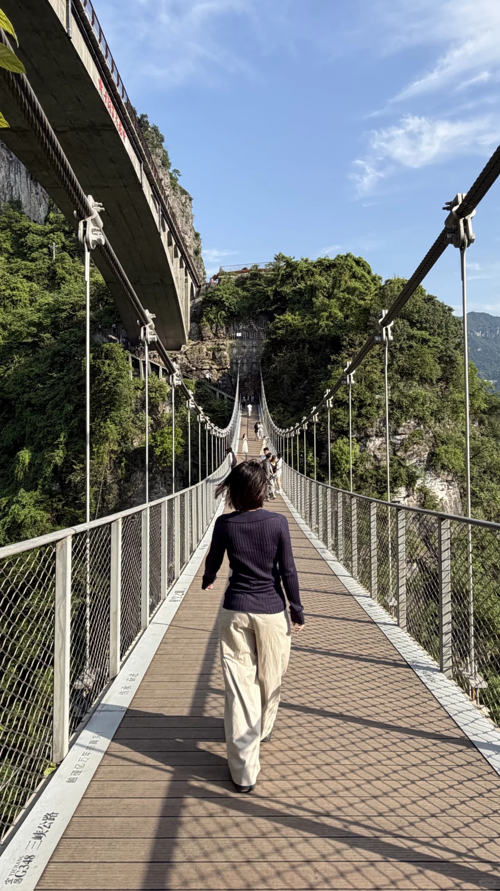
> [OCR] 三?公路
G348
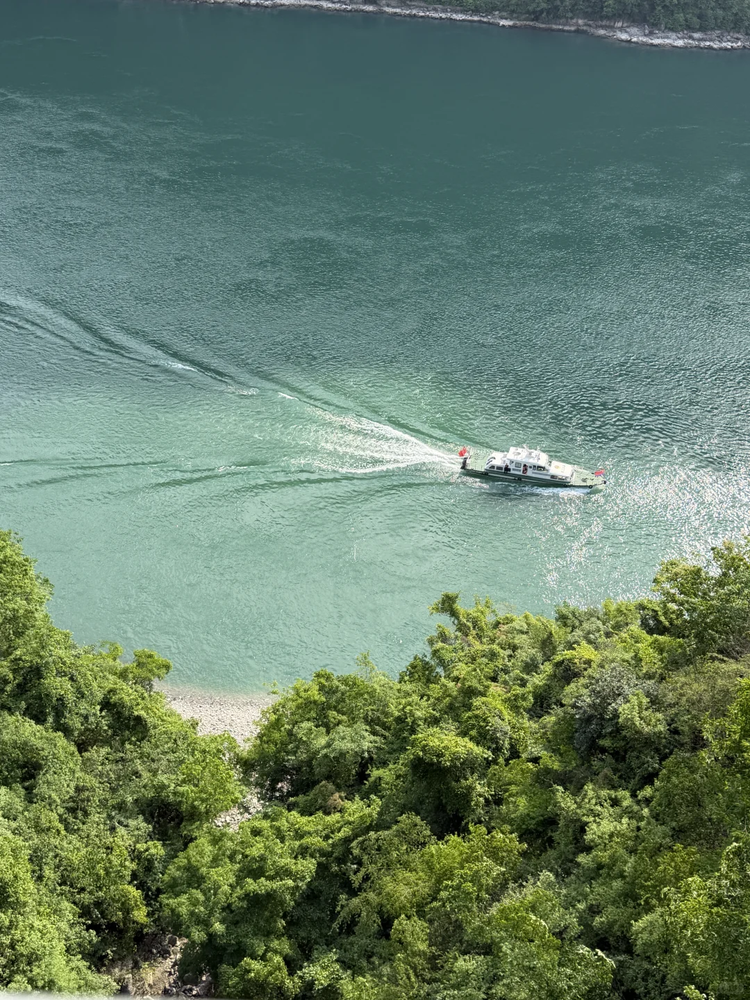
> [OCR] [?]
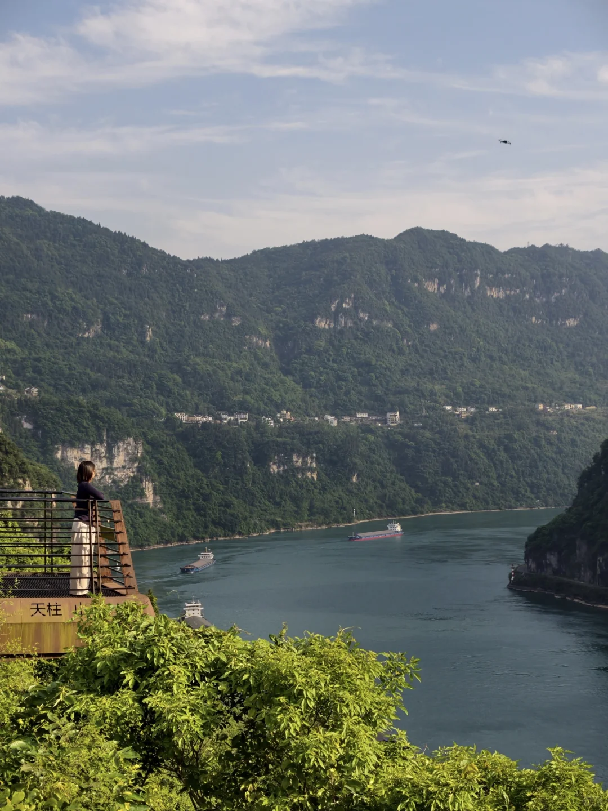
> [OCR] 天柱山
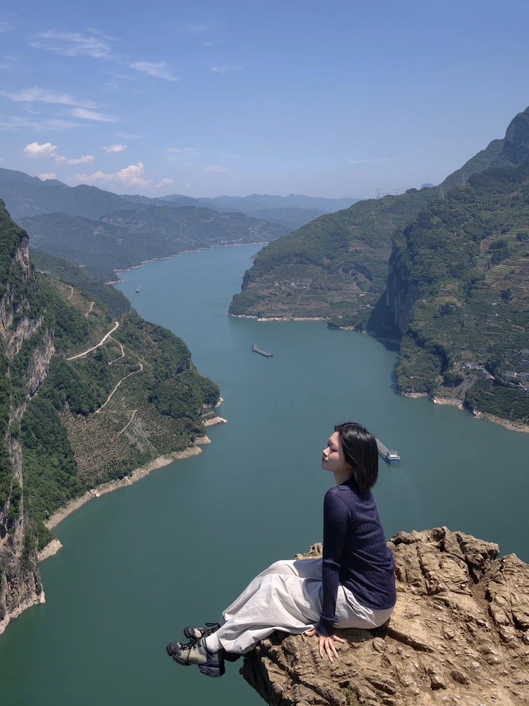
> [OCR] system
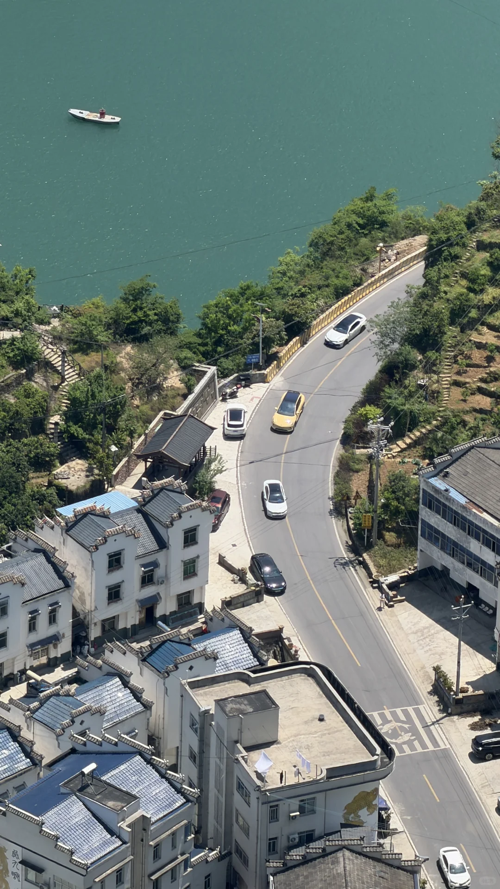
> [OCR] 385
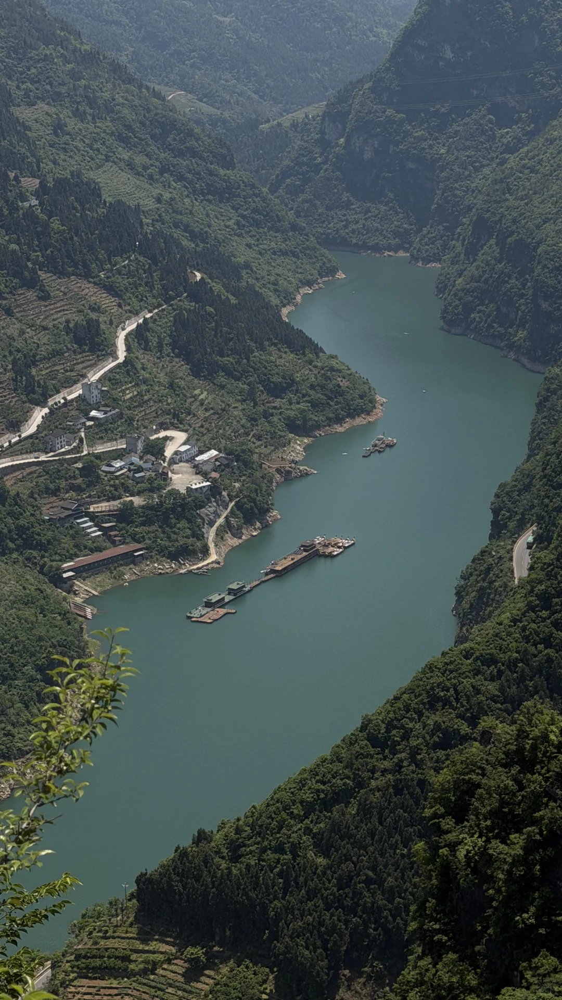
> [OCR] [?]
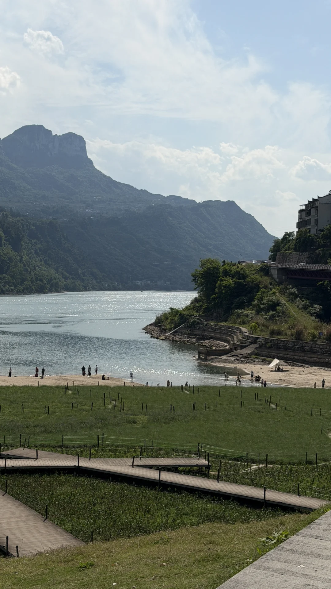
> [OCR] [?]
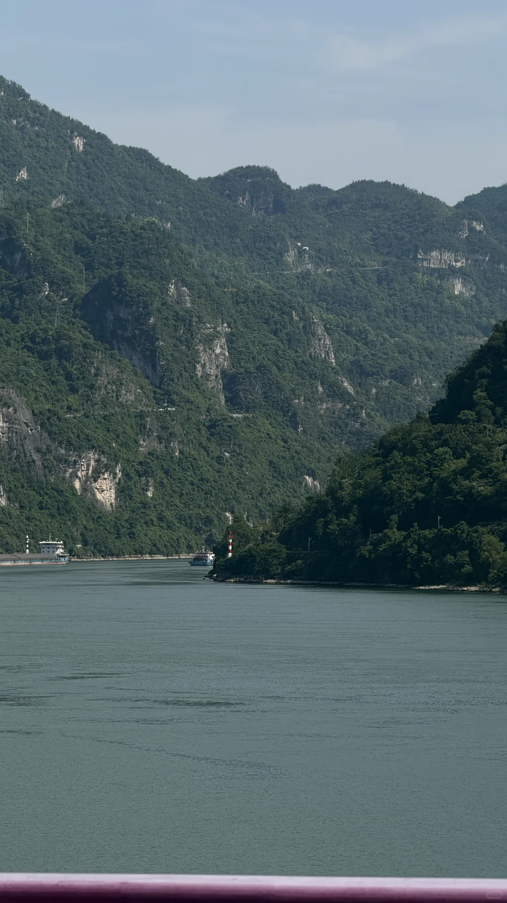
> [OCR] 4415
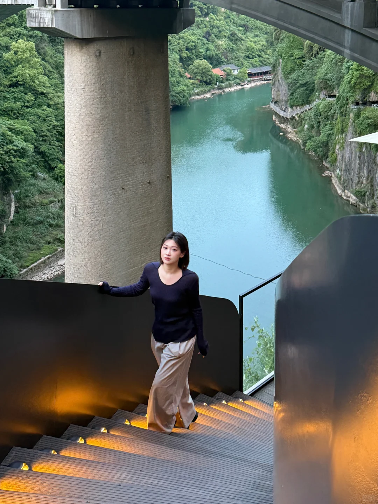
> [OCR] [?]
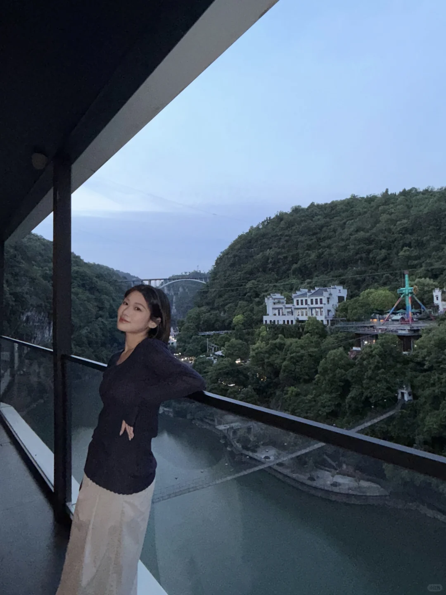
> [OCR] JULIES
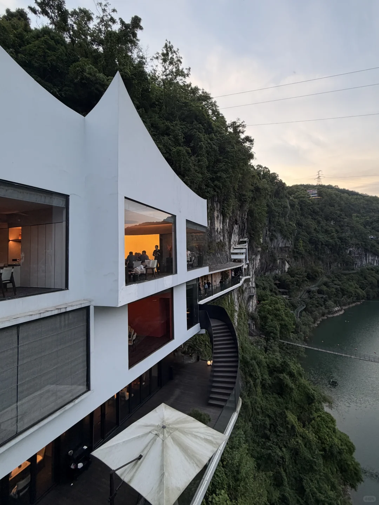
> [OCR] dients

## 正文
五一期间去宜昌，想方设法避开人流，错峰出行，但还是没逃过鹰嘴岩一个半小时的暴晒排队，拍照一分钟就结束[笑哭R]
整体我还是强烈推荐g348国道这条线路上的美景，时间有限我筛选了一下地点着重去❗️鹰嘴岩和❗️干沟子桥，从宜昌反向出发先去最远的【鹰嘴岩】（p6-8），一定要导航到【鹰嘴岩公共停车场】，不然可能会错过路口，停好车之后是步行路途，最后一小段路程比较原始，要小心点走，从上往下拍的风景是很不错，但是为了到p5的位置拍照整整排了一个半小时，还是大中午的太阳[捂脸R]，建议还是错峰去吧。
拍完接着去【干沟子桥】的路上经过【莲沱畔大桥】，趁着堵车拍了几张（p9-10）人不少，适合露营坐着看山水还是蛮舒服的，【干沟子桥】离得很近我们就直接去了（p1-5），实在太出片了，但是车位很少（二十来个吧），节假日根本不够用，我们停在前一个隧道口附近走过去的。
最后推荐放翁（p11-13），三游洞对面，好吃好看～
#被好风景收买的一天[话题]# #节假日小众的旅游景点[话题]# #放翁悬崖餐厅[话题]#  #宜昌[话题]# #g348国道[话题]# #旅游编辑部[话题]# #鹰嘴岩[话题]# #干沟子大桥[话题]# #宜昌旅游[话题]# #武汉周边游[话题]#

---