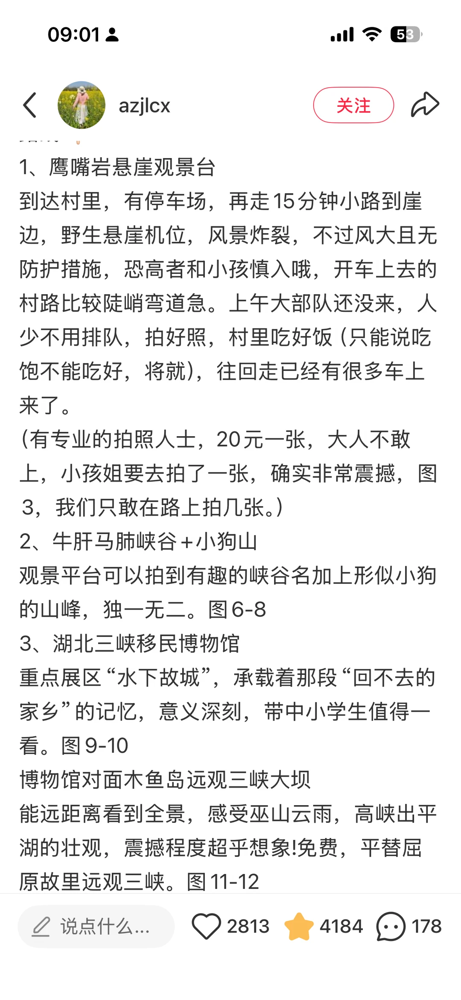
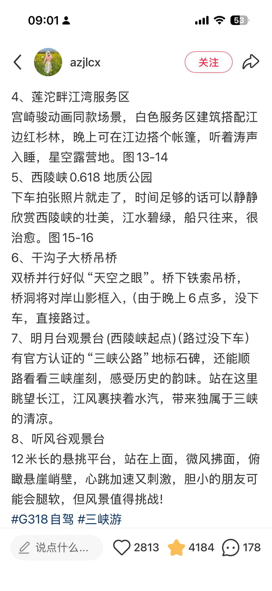

# 宜昌游疑问

- 作者: 且听风吟
- 👍410 · 💬47 · ⭐494 · 图 4
- feed_id: 6a1b8ae100000000350273f1

> [OCR] 宜昌G348公路游玩路线

市区出发-
-听风谷-山外山-明月台-干沟子
山外山
地质公园-莲沱畔服务区-
-0.618地质偶各-
逗市子
三峡大坝观景-三峡移民-
明风子
干沟台
0.618地质公园
莲沱畔服务区
三峡大坝观景
三峡移民博物馆
牛肝马肺峡
鹰嘴岩

小红书
小红书号：49650549459

> [OCR] 1. 鹰嘴岩悬崖观景台
到达村里,有停车场,再走15分钟小路到崖边,野生悬崖机位,风景炸裂,不过风大且无防护措施,恐高者和小孩慎入哦,开车上去的村路比较陡峭弯道急。上午大部队还没来,人少不用排队,拍好照,村里吃好饭(只能说吃饱不能吃好,将就),往回走已经有很多车上来了。
(有专业的拍照人士,20元一张,大人不敢上,小孩姐要去拍了一张,确实非常震撼,图3,我们只敢在路上拍几张。)
2. 牛肝马肺峡谷+小狗山
观景平台可以拍到有趣的峡谷名加上形似小狗的山峰,独一无二。图6-8
3. 湖北三峡移民博物馆
重点展区“水下故城”,承载着那段“回不去的家乡”的记忆,意义深刻,带中小学生值得一看。图9-10
博物馆对面木鱼岛远观三峡大坝
能远距离看到全景,感受巫山云雨,高峡出平湖的壮观,震撼程度超乎想象!免费,平替屈原故里远观三峡。图11-12

说点什么...
❤️ 2813 ★ 4184 🗣️ 178

> [OCR] 4、莲沱畔江湾服务区
宫崎骏动画同款场景,白色服务区建筑搭配江边红杉林,晚上可在江边搭个帐篷,听着涛声入睡,星空露营地。图13-14
5、西陵峡0.618地质公园
下车拍张照片就走了，时间足够的话可以静静欣赏西陵峡的壮美，江水碧绿，船只往来，很治愈。图15-16
6、干沟子大桥吊桥
双桥并行好似“天空之眼”。桥下铁索吊桥,桥洞将对岸山影框入,(由于晚上6点多,没下车,直接路过。
7、明月台观景台(西陵峡起点)(路过没下车)
有官方认证的“三峡公路”地标石碑，还能顺路看看三峡崖刻，感受历史的韵味。站在这里眺望长江，江风裹挟着水汽，带来独属于三峡的清凉。
8、听风谷观景台
12米长的悬挑平台,站在上面,微风拂面,俯瞰悬崖峭壁,心跳加速又刺激,胆小的朋友可能会腿软,但风景值得挑战!
#G318自驾 #三峡游

说点什么...
❤️ 2813 ★ 4184 🗣️ 178

> [OCR] 08:51
<  >  <  >  <  >
封面 景区风光 演出演艺 特色建筑 | 相册 >
车溪民俗旅游区 4A 趣玩捞 宜昌·情侣约会榜·第9名>
4.4 ★★★★☆ 2684 条评价 >
今日开放
日场08:30-17:00,夜场18:10-22:00
优待政策
儿童、老年人等
气温18/30
湖北省宜昌市点军区土城乡车溪村车溪村委...
高铁¥241起 > 飞机¥578起 >
地图 电话
神券 最高膨至80!膨胀
支付红包￥20 领取 100元无 全部>
必玩项目 更多>
TOP1 梦回车溪演出
TOP2 车溪老街
TOP3 土家歌舞演出
巴
预订 周边 评价 须知
订今日 订明日 指定日期 √ 神券 亲子 老人
景点门票 日游门票
累计销量500+
日场表演时间上午10:00 下午14:30
夜游体验
园内项目
亲子2大1小门票
儿童限：身高1.2米（不含）-1.4米（含）
随买随用 随时退·过期退

## 正文
准备下周日（2026.6.7）或者下下周一（2026.6.8）自驾G348，请问是正向游还是反向游？自驾带娃（10岁）。图1️⃣正向，图2️⃣图3️⃣都是反向（从别的博主那借来的，无商业用途），另外请问图4️⃣的车溪游也看到有推荐的，好玩吗？求好心人帮忙解答！

---