# 宜昌美食攻略，看这篇就够了

- 作者: 筑空（你的旅行搭子）
- 👍395 · 💬15 · ⭐303 · 图 14
- feed_id: 69afe181000000000601e1fa

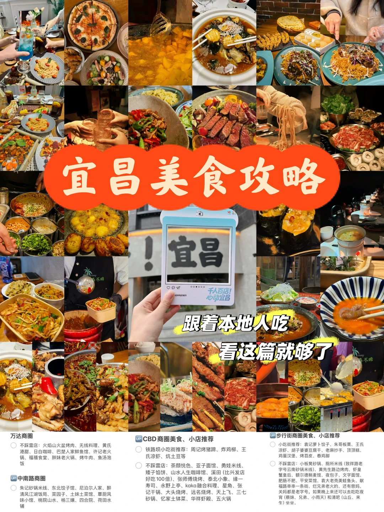
> [OCR] 宜昌美食攻略

跟着本地人吃
看这篇就够了

万达商圈
不踩雷店：火焰山火盆烤肉、无线料理、黄氏港甜、日白咖啡、巴楚人家鲜鱼馆、许记老火锅、福福食堂、胖妹老火锅、烤牛肉、鱼汤泡饭

CBD商圈美食、小店推荐
铁路坝小吃街推荐：周记烤猪蹄、炸鸡柳、王氏凉虾、胡子婆婆豆腐干、老麻抄手、顶顶糕、鸡蛋汉堡、烤苕皮、春鸡脚

中南路商圈
朱记砂锅米线、东北饺子馆、尼泊尔人家、醉清风江湖饭局、菜园子、土妹土菜馆、覃厨风味小馆、桃院山水、杨三娘、四合院、荷田水铺

步行街商圈美食、小店推荐
小吃街推荐：袁记萝卜饺子、朱哥板栗、王氏凉虾、胡子婆婆豆腐干、老麻抄手、顶顶糕、鸡蛋汉堡、烤苕皮、春鸡脚

不踩雷店：小板凳砂锅、厕所米线（致祥路老字号云南砂锅米线）、黄先生路边烤肉、虾皇蟹皇后、额尔德稍麦馆、夜包子、文字面馆、肥肠不肥、平安菜馆、袁大老壳美蛙鱼头、献福路串串一条街、烂兄弟老火的、还有慈妈、关妈都是老字号。如果晚上来还可以去吃吃夜宵（蔡妹、兄弟、小雨天）和清吧（山丘、来生）坐坐。
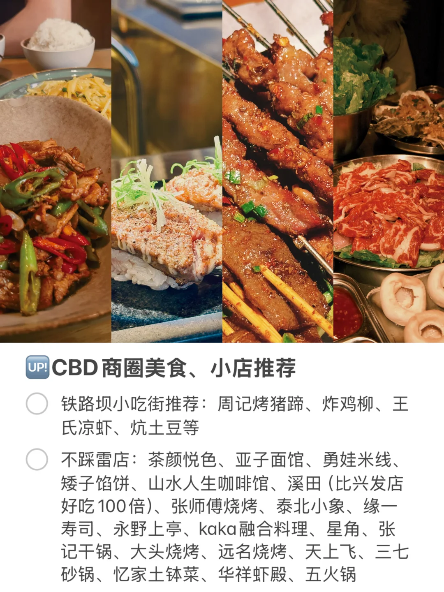
> [OCR] UP! CBD商圈美食、小店推荐

铁路坝小吃街推荐：周记烤猪蹄、炸鸡柳、王氏凉虾、炕土豆等

不踩雷店：茶颜悦色、亚子面馆、勇娃米线、矮子馅饼、山水人生咖啡馆、溪田（比兴发店好吃100倍）、张师傅烧烤、泰北小象、缘一寿司、永野上亭、kaka融合料理、星角、张记干锅、大头烧烤、远名烧烤、天上飞、三七砂锅、忆家土钵菜、华祥虾殿、五火锅

> [OCR] 知道你会来
所以我等
千人百店！
心动宜昌
宜昌，一座美丽的城市
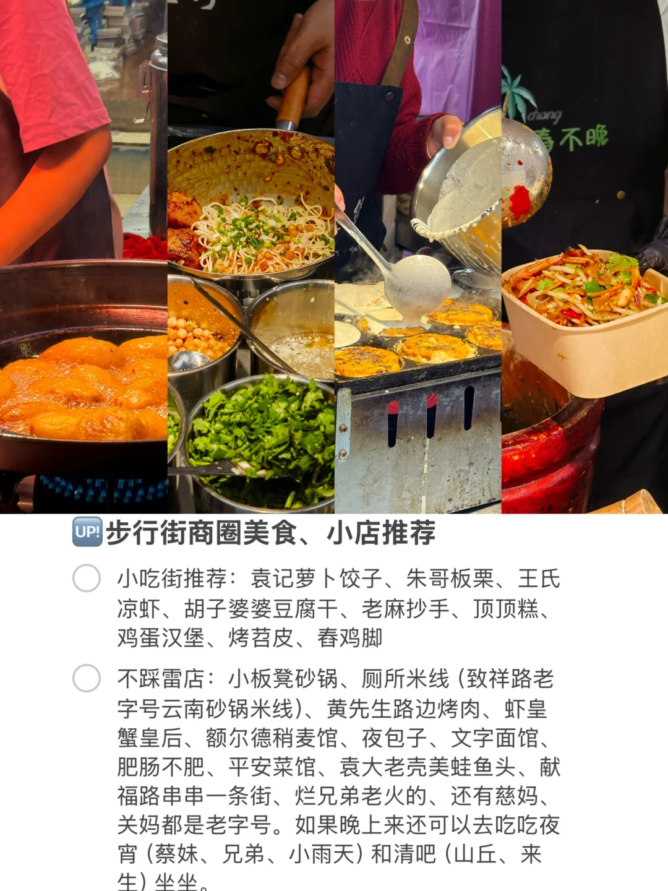
> [OCR] UP!步行街商圈美食、小店推荐

小吃街推荐：袁记萝卜饺子、朱哥板栗、王氏凉虾、胡子婆婆豆腐干、老麻抄手、顶顶糕、鸡蛋汉堡、烤苕皮、春鸡脚

不踩雷店：小板凳砂锅、厕所米线（致祥路老字号云南砂锅米线）、黄先生路边烤肉、虾皇蟹皇后、额尔德稍麦馆、夜包子、文字面馆、肥肠不肥、平安菜馆、袁大老壳美蛙鱼头、献福路串串一条街、烂兄弟老火的、还有慈妈、关妈都是老字号。如果晚上来还可以去吃吃夜宵（蔡妹、兄弟、小雨天）和清吧（山丘、来生）坐坐。
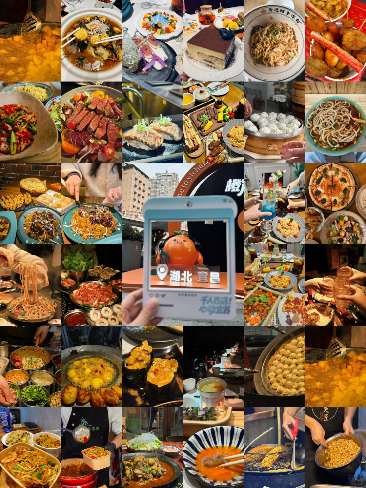
> [OCR] 马迭财手作电
橙
湖北宜昌
千人百店！
心动宜昌
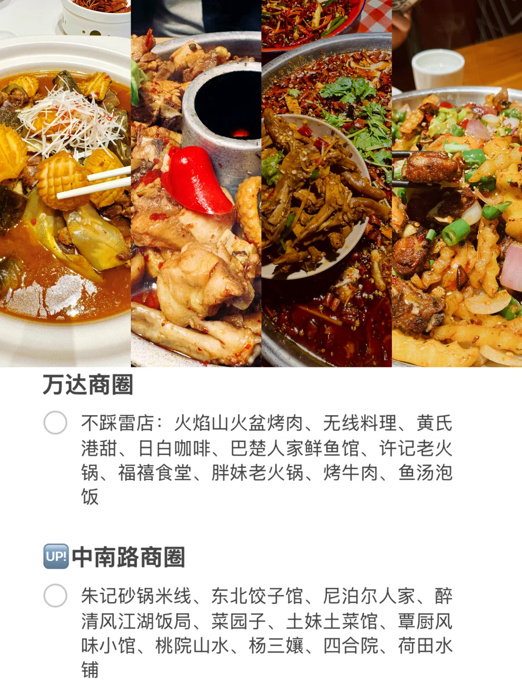
> [OCR] 万达商圈

不踩雷店：火焰山火盆烤肉、无线料理、黄氏港甜、日白咖啡、巴楚人家鲜鱼馆、许记老火锅、福禧食堂、胖妹老火锅、烤牛肉、鱼汤泡饭

中南路商圈

朱记砂锅米线、东北饺子馆、尼泊尔人家、醉清风江湖饭局、菜园子、土妹土菜馆、覃厨风味小馆、桃院山水、杨三孃、四合院、荷田水铺
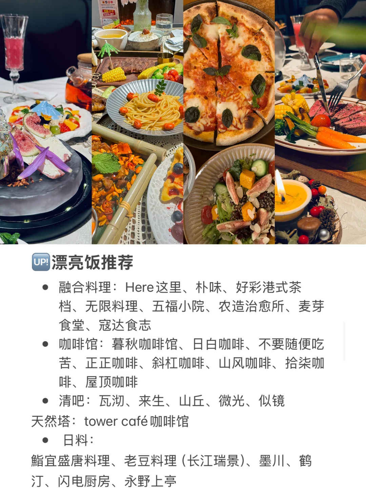
> [OCR] UP!漂亮饭推荐
- 融合料理：Here这里、朴味、好彩港式茶档、无限料理、五福小院、农造治愈所、麦芽食堂、寇达食志
- 咖啡馆：暮秋咖啡馆、日白咖啡、不要随便吃苦、正正咖啡、斜杠咖啡、山风咖啡、拾柒咖啡、屋顶咖啡
- 清吧：瓦沏、来生、山丘、微光、似镜
天然塔：tower café咖啡馆
- 日料：
鮨宜盛唐料理、老豆料理（长江瑞景）、墨川、鹤汀、闪电厨房、永野上亭
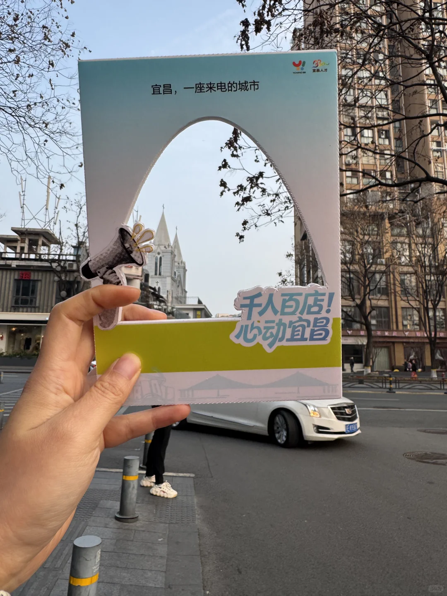
> [OCR] 宜昌,一座来电的城市
千人百店!
心动宜昌
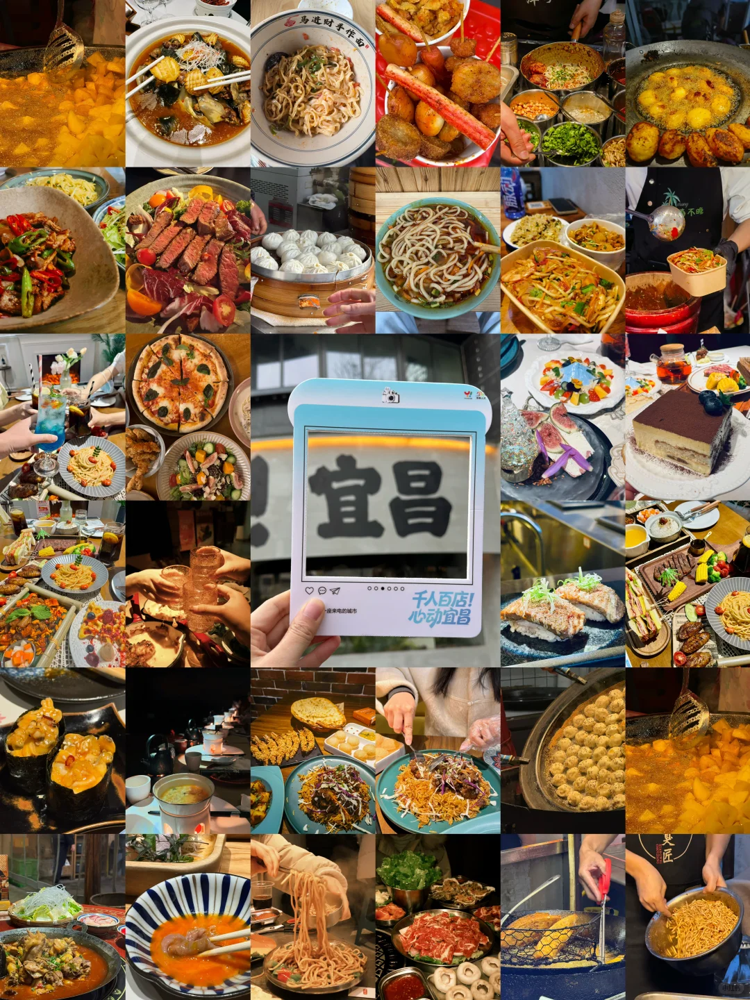
> [OCR] 马进财手作面
宜昌
千人百店!心动宜昌
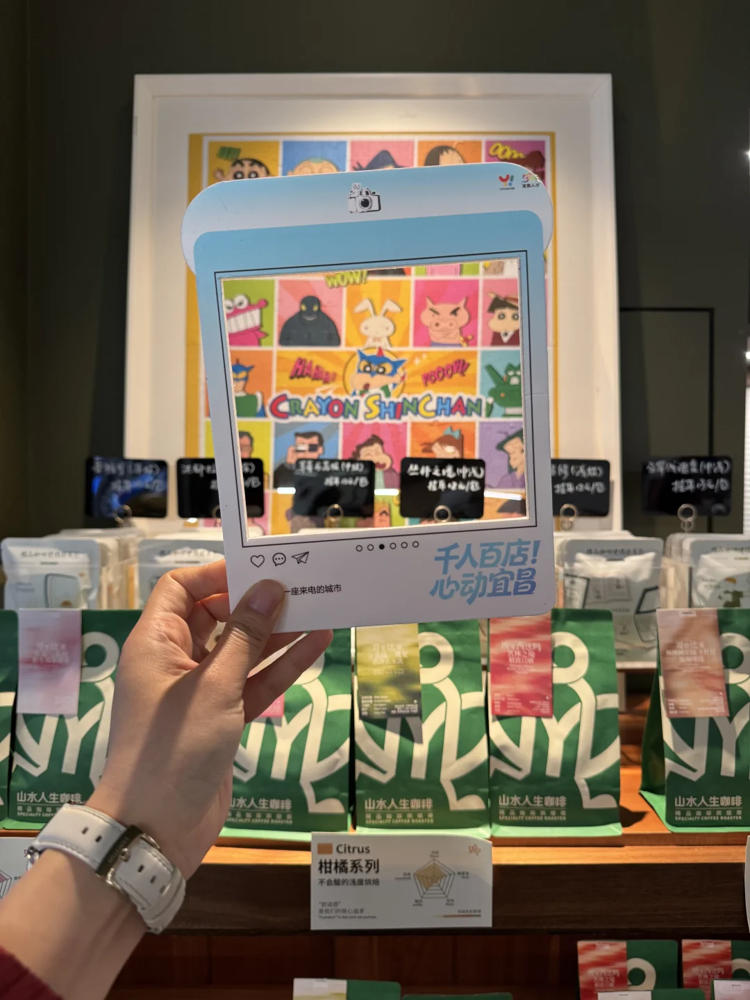
> [OCR] WOW!
HAHA!
YOOOVI!
CRAYON SHINCHAN

千人百店！
心动宜昌

一座来电的城市

山水人生咖啡
SPECIALTY COFFEE ROASTER

柑橘系列
不会酸的浅度烘焙

Citrus
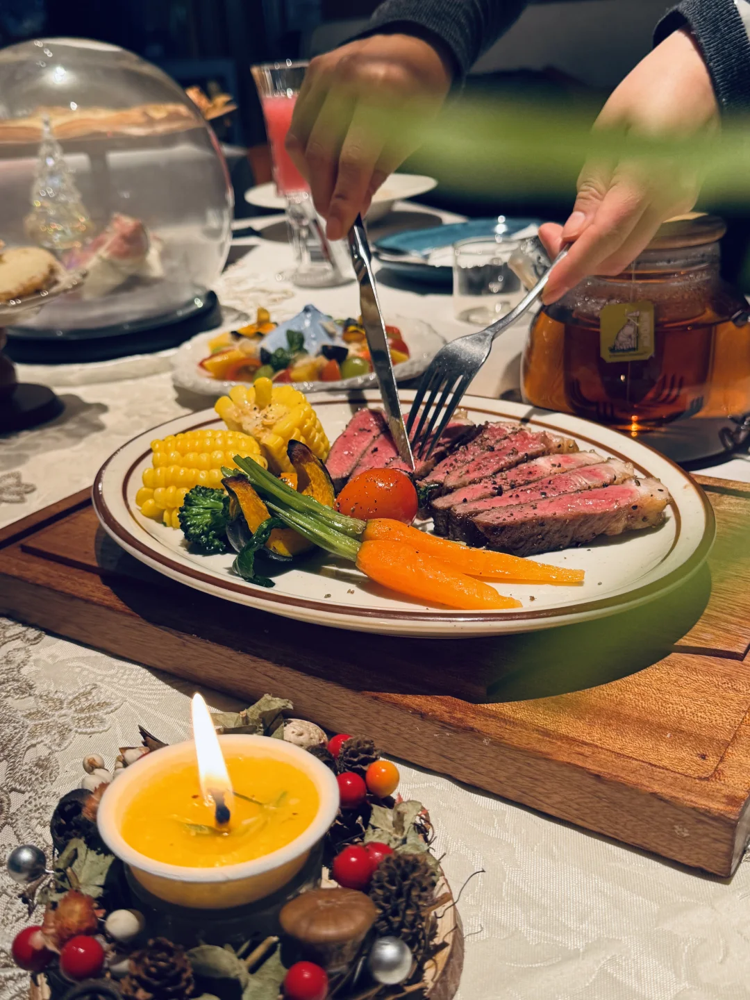
> [OCR] ?[?]
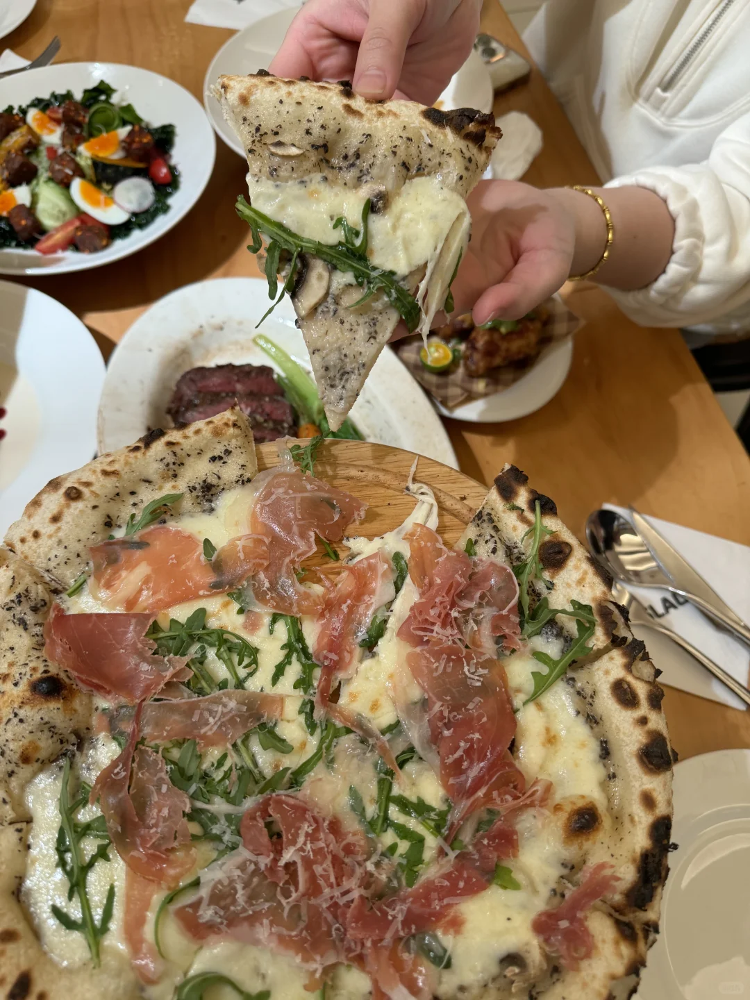
> [OCR] ILAD
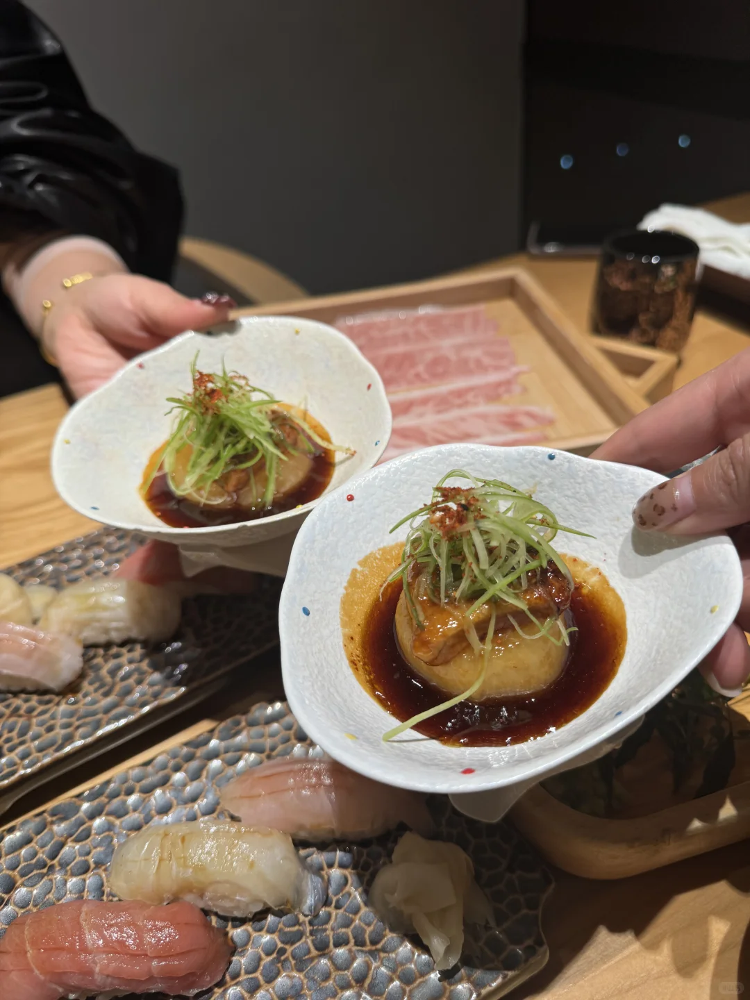
> [OCR] [?]
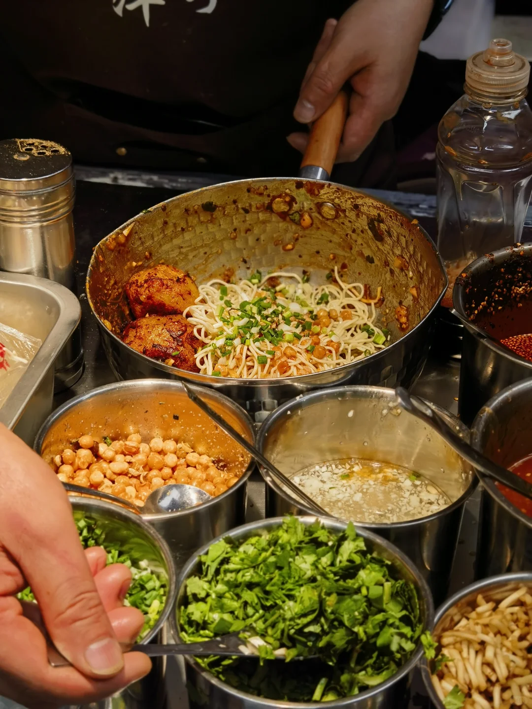

## 正文
出去一趟回来，
你才会懂，
宜昌千金不换的生活。
	
越来越喜欢这座城市了，
谁懂这个动图音乐不是我配的，
就是走在马路上你就能听到…
	
宜昌太适合宜居了
美食，美景，人杰，地灵…
总结这篇美食攻略，
希望你也一样喜欢这座城市
千人千味，尊重不同#宜昌美食[话题]# #宜昌旅游[话题]# #本地人爱吃的店铺[话题]# #最强美食城市安利[话题]# #千人百店来电宜昌[话题]# #千人百店心动宜昌[话题]# #宜悦人才昌达未来[话题]#

---