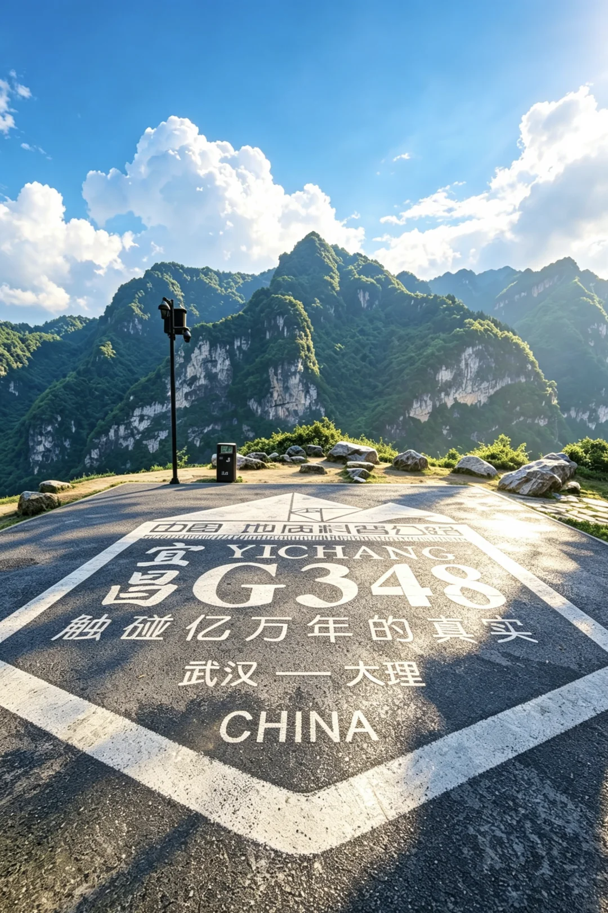
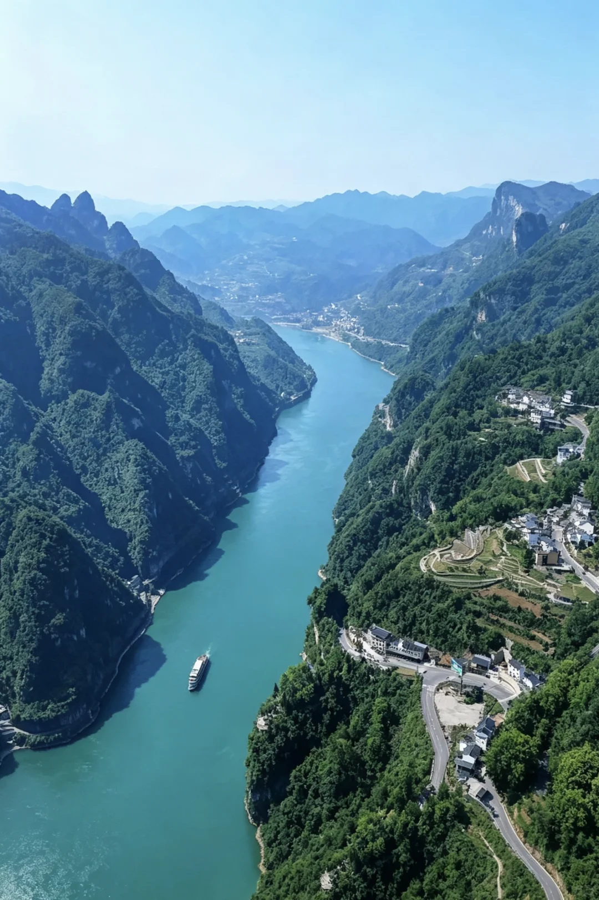
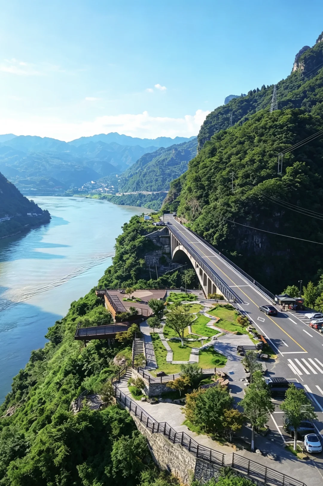
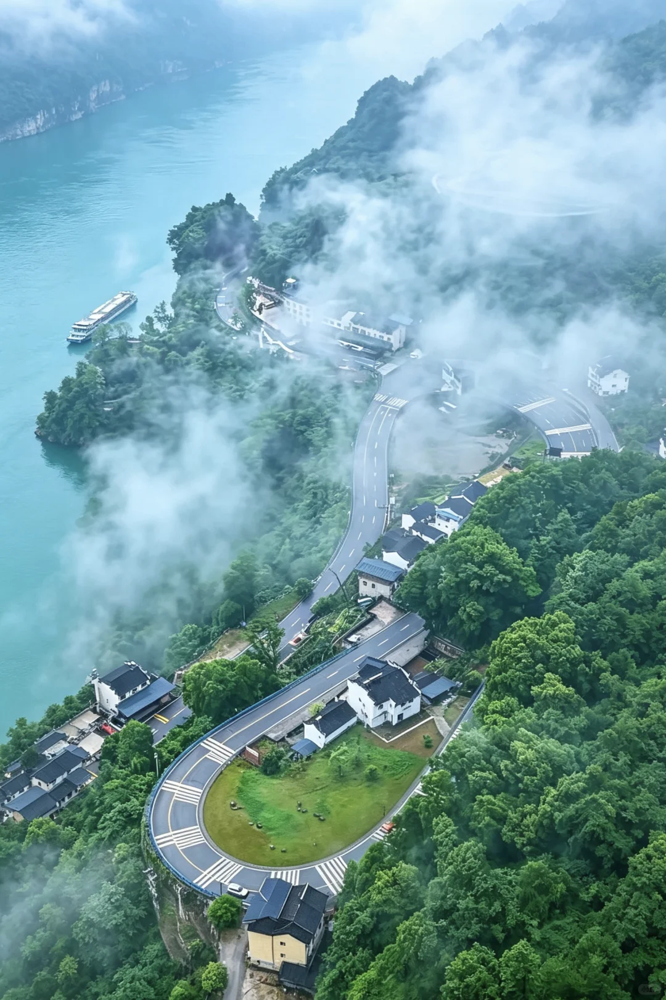
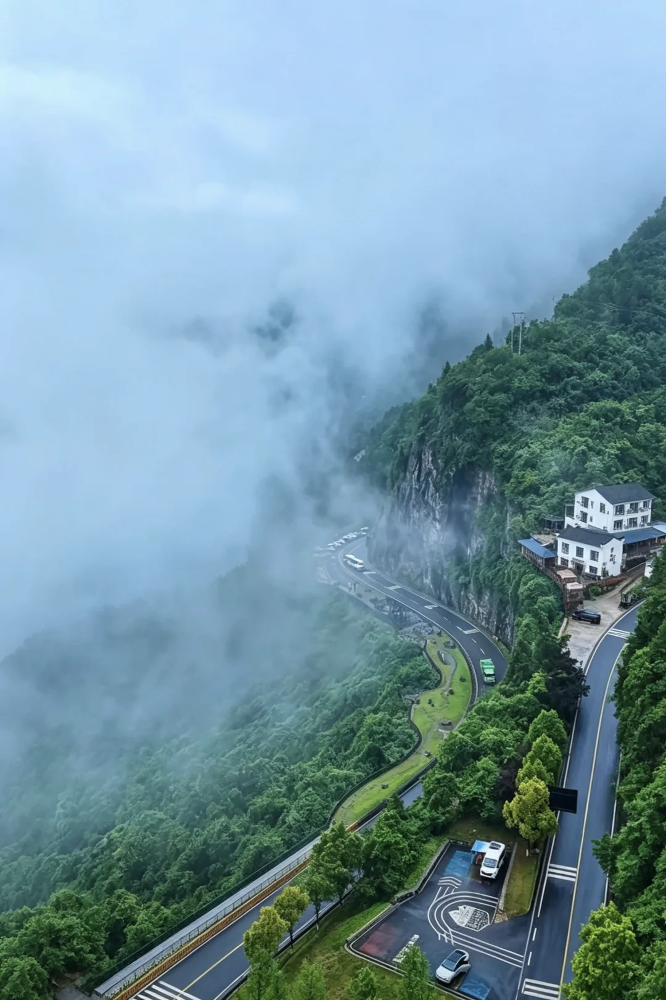
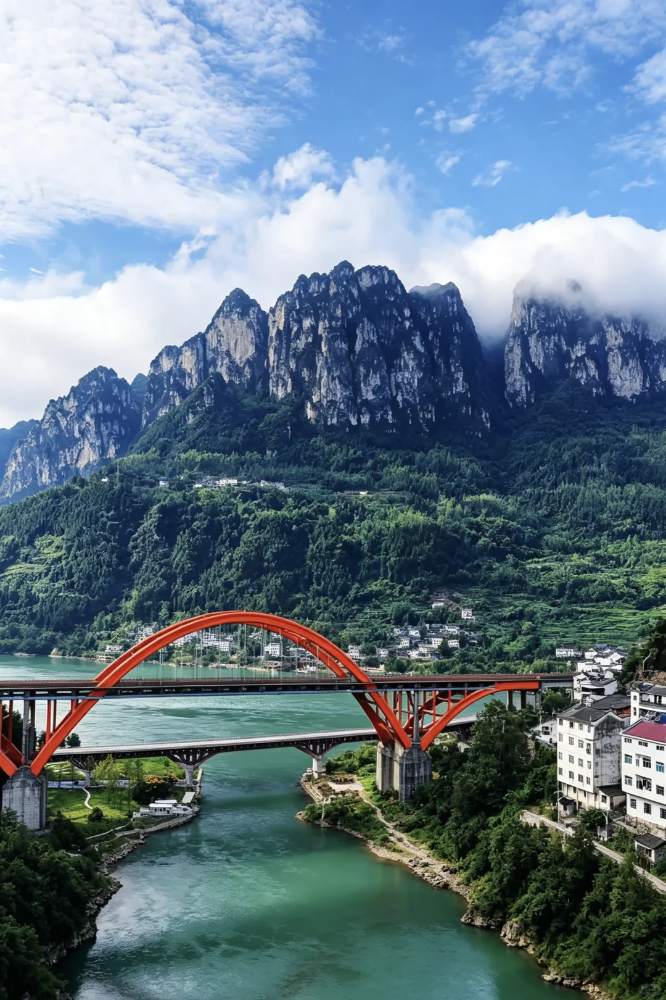
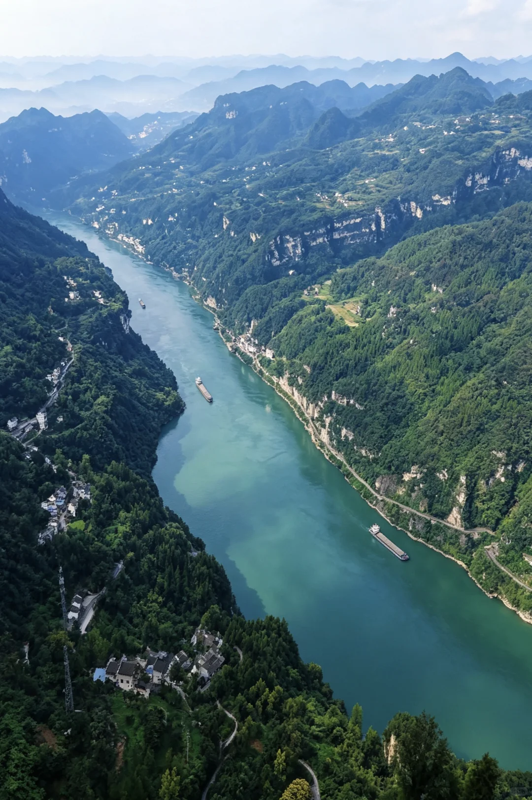
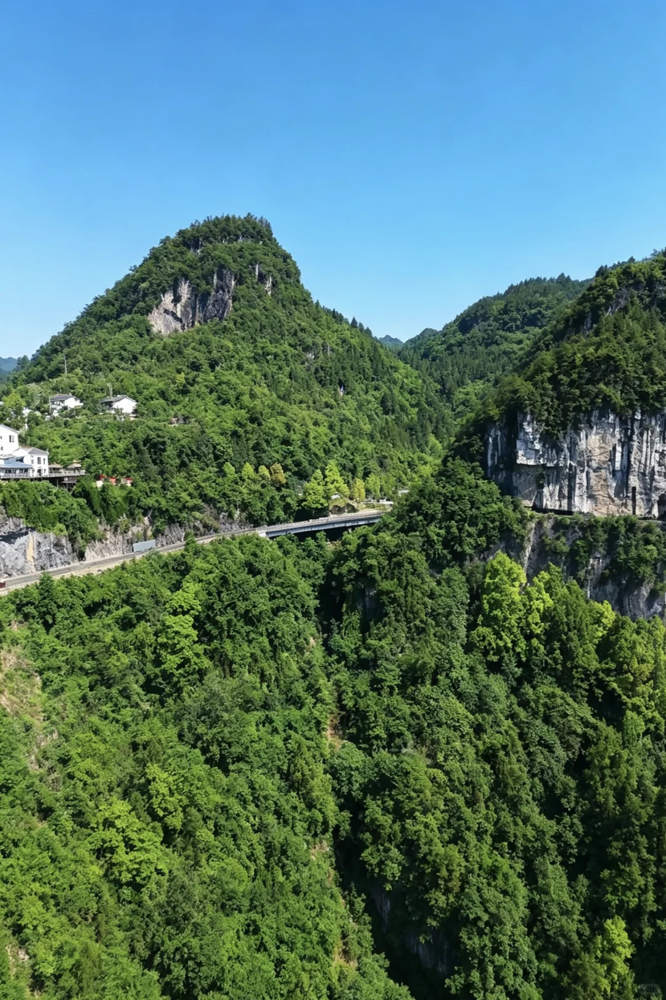
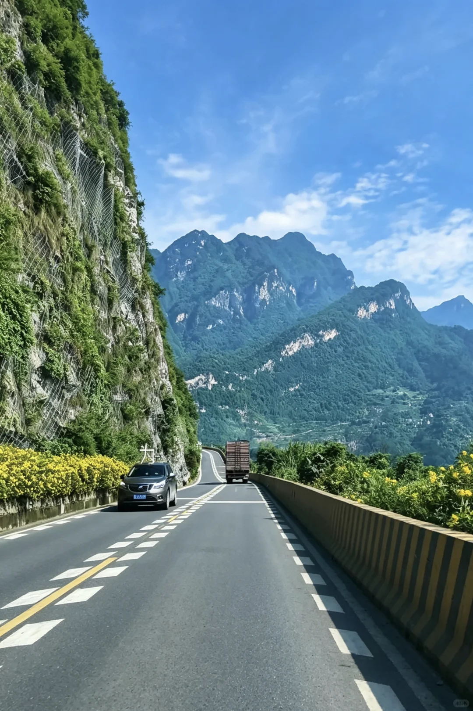
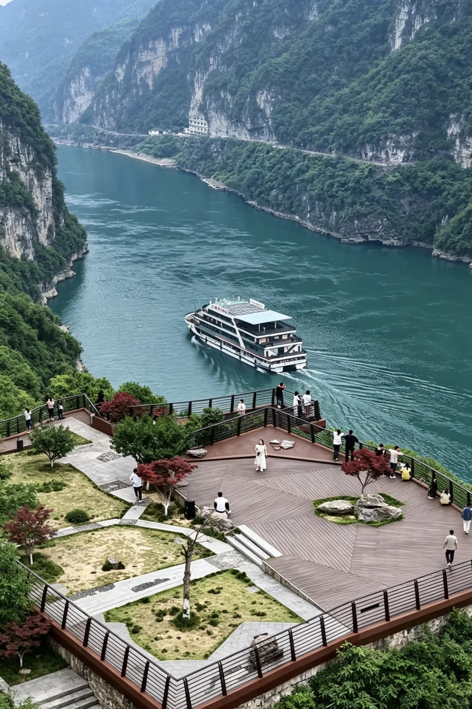

# 自驾宜昌G348详细路线直接抄📝

- 作者: 叁拾
- 👍385 · 💬45 · ⭐625 · 图 13
- feed_id: 6a69cd13000000000301f380

> [OCR] 中国地质科考路
宜昌G348
触碰亿万年的真相
武汉——大理
CHINA

> [OCR] [?]

> [OCR] [?]

> [OCR] [?][?]

> [OCR] [?]

> [OCR] 小米云

> [OCR] [?][?][?]

> [OCR] [?][?]

> [OCR] [?]

> [OCR] [?][?][?]

> [OCR] [?]

> [OCR] 大
小红书

> [OCR] [?][?][?]

## 正文
宜昌本地人私藏的自驾天花板，G348真的不是在开玩笑——全程沿西陵峡悬崖走，左手青山右手碧水，开车像在山水画里漂移。关键是全部免费，停车免费、观景台免费，掏出手机就是大片，还要什么自行车？
	
☀️ 夏天别中午去！
美是真的美，晒也是真的晒。观景台光秃秃没遮没拦，正午太阳直射到怀疑人生。要么早起8点前到，要么下午4点后再冲，运气好能蹲到橘子海日落🌅 冰袖遮阳帽水杯三件套给我焊在身上！
	
🚗 两条路线直接抄
[一R]路线一：精华快线（2-3小时）
市区→听风谷→山外山→明月台→0.618服务区→干沟子大桥→莲沱畔→三峡专用公路返程。适合时间紧、怕晒、只想刷精华的，主打一个高效不墨迹。
	
[二R]路线二：一日深度线（8-10小时）
早8点出发→听风谷→山外山→明月台→0.618服务区→干沟子大桥→莲沱畔→三峡大坝→湖北三峡移民博物馆→牛肝马肺峡→鹰嘴岩看小狗山→返程。上午冲观景台，下午钻室内博物馆，傍晚蹲日落，一天给你安排得明明白白
	
📸 重点记这些点
🌬️ 听风谷：玻璃观景台伸出山体12米，风大时山谷“呜呜”响，氛围感直接拉满。旁边还有2.5亿年前的古老岩层可以摸，亿年手感你值得拥有
	
🌙 明月台：G348门面担当！“三峡”打卡墙+圆形取景框，框住西陵峡巨幅江景，随手一按就是封面图。傍晚逆光拍剪影，人像直接镀金边
	
🧬 0.618服务区：名字听着玄乎？实际是个地质科普公园，步道按年代排列，33亿年前石头和5亿年前化石随便看，装X拍照两不误
	
🌉 干沟子大桥：70年代军工建造，新旧两桥并排站，最出片在桥底下别说我没告诉你！还能上悬索吊桥晃两下，人少景美随便拍
	
🏗️ 莲沱畔：纯白“探索风车”建筑，网友都喊它现实版纪念碑谷。江边大草坪能露营能玩水，黄昏时分往风车前那么一站，直接封神
	
🦅 鹰嘴岩：全程压轴彩蛋！站上去往下看，对面小狗山真的像一只趴着的小奶狗，萌到犯规🐶 路有点陡，建议老司机上，新手别硬冲。
	
⚠️ 避坑划重点
①导航认准G348三游洞方向，别拐进三峡专用公路
②走三峡专用公路要办通行证，小程序提前约或现场带两证办理
③弯道多车速40-60码，鹰嘴岩那段新手慎重，命重要
④防晒防晒防晒！墨镜也别忘了，不然拍照全程眯眯眼
	
来宜昌走这条线，朋友绝对夸你有品位。又美又免费，这波血赚不亏✌️
	
#自驾探索编辑部[话题]# #宜昌拍照[话题]# #宜昌[话题]# #G348国道[话题]# #西陵峡[话题]# #三峡[话题]# #三峡大坝[话题]# #自驾[话题]# #G348自驾[话题]#

---