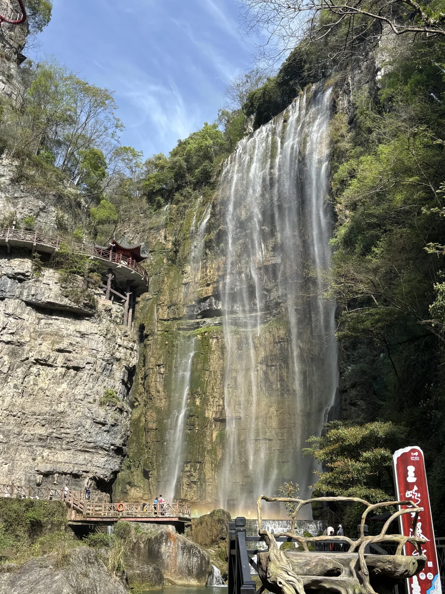
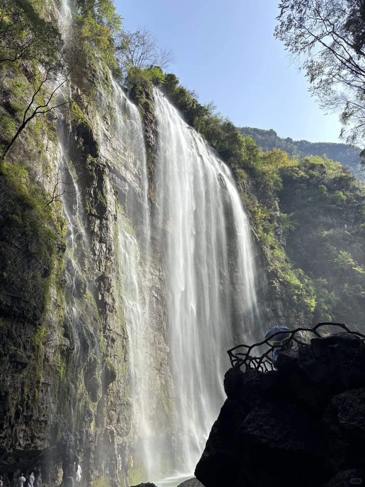
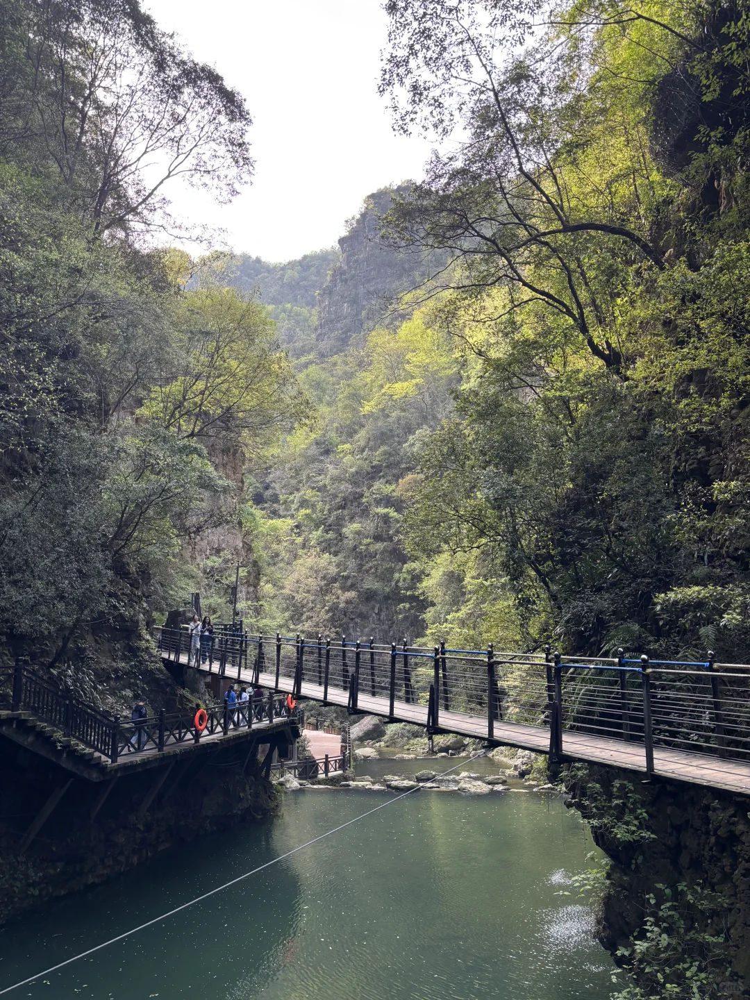
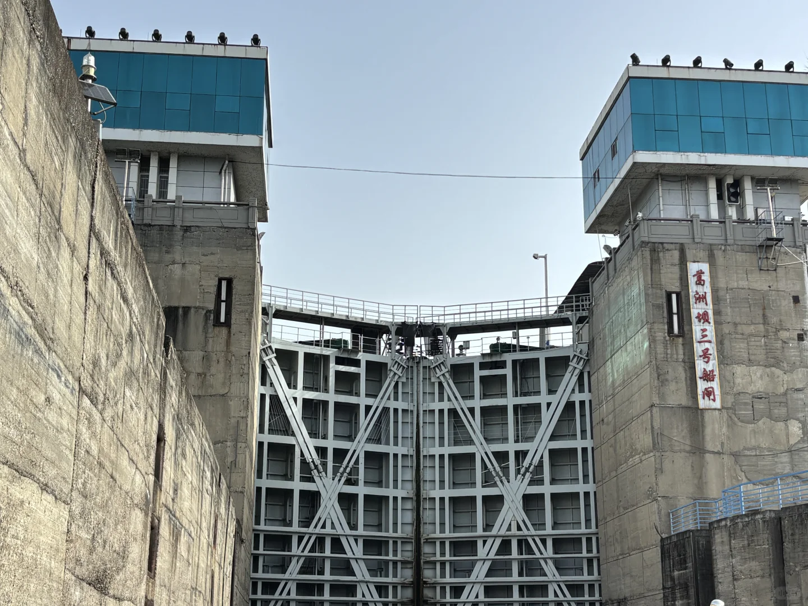
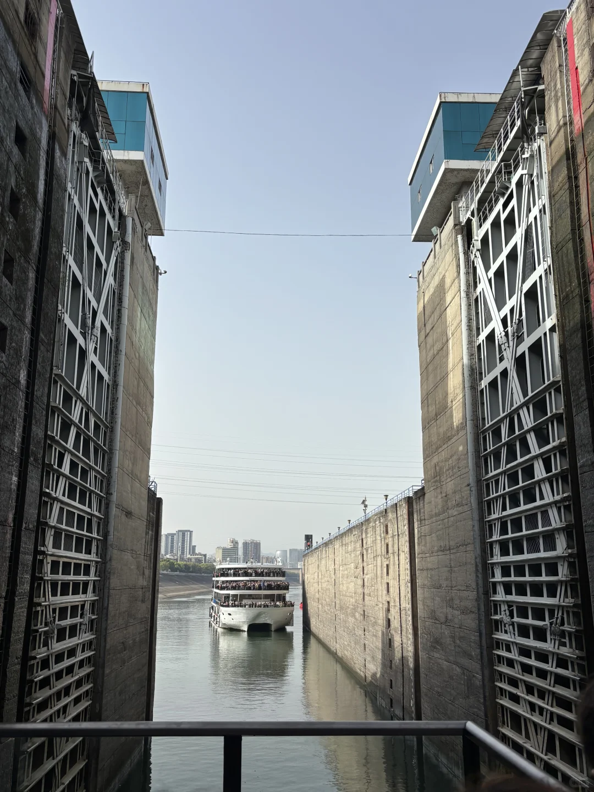
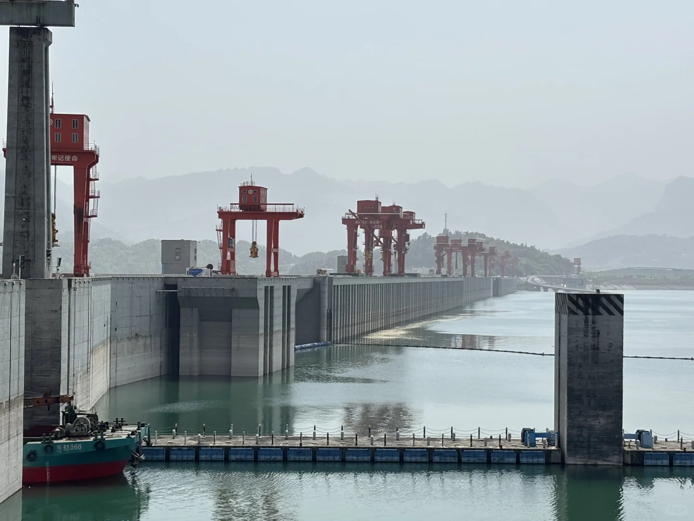
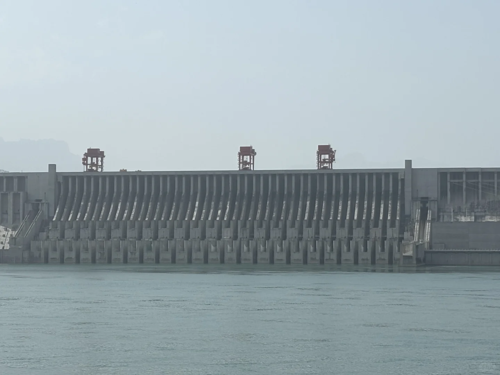
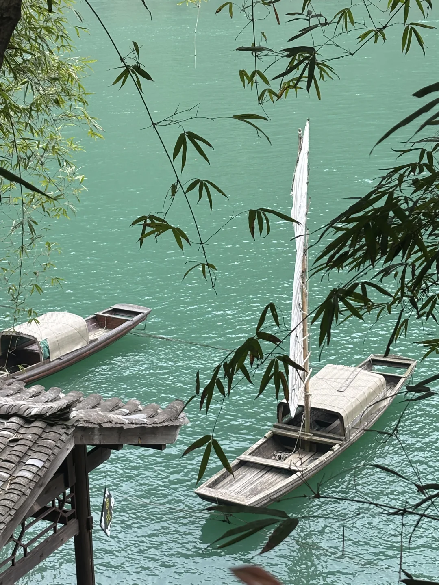
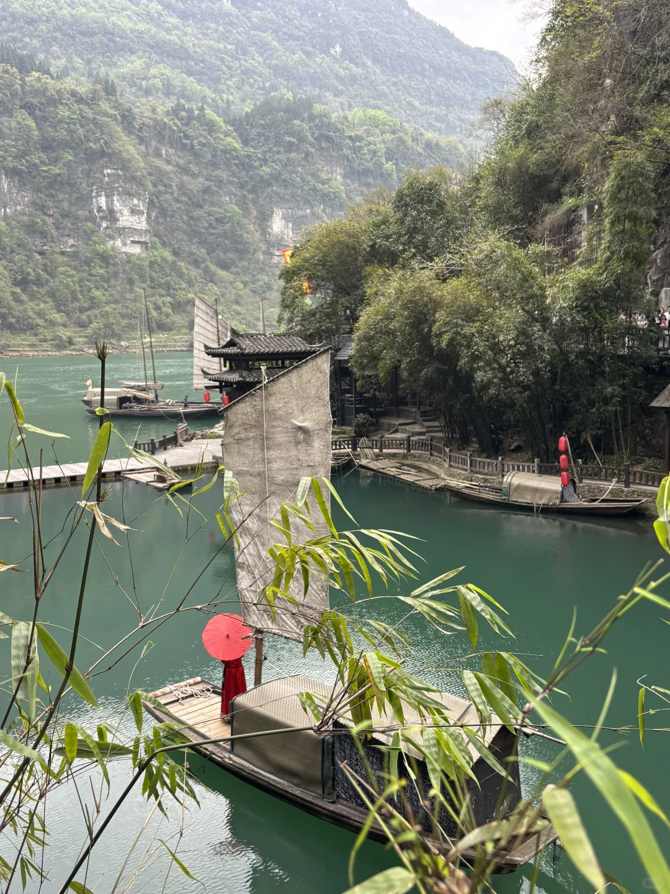
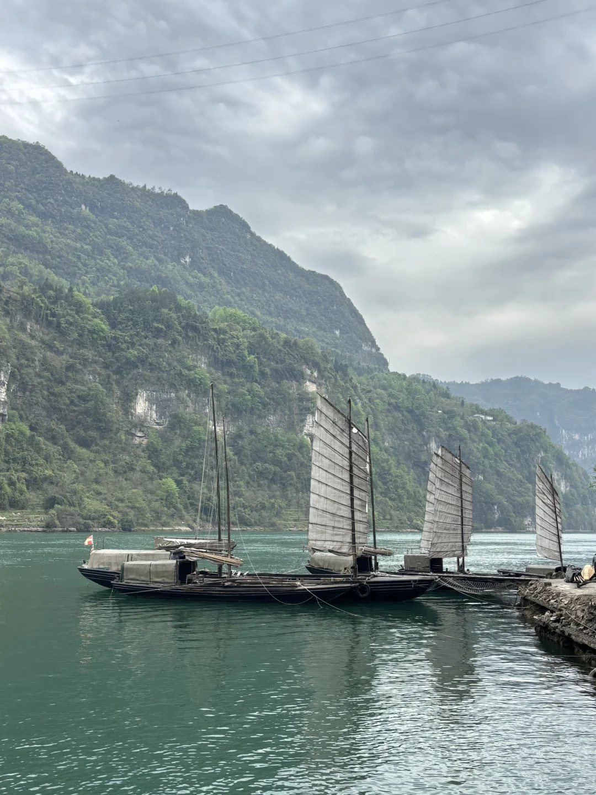

# 📍宜昌，3天2晚

- 作者: Minnie
- 👍369 · 💬27 · ⭐328 · 图 11
- feed_id: 69d4632c000000001a0308b0

> [OCR] 三峽大瀑布

> [OCR] [?]

> [OCR] [?]

> [OCR] 高洲坝三号船闸

> [OCR] 华益866

> [OCR] [?]

> [OCR] [?]

> [OCR] [?][?]

> [OCR] [?]

## 正文
行程：三峡大瀑布，两坝一峡，三峡人家
交通：武汉高铁到宜昌2小时，出站后右边有乘出租车区域，到万达17元车费。后面都是滴滴打车
住宿：伍家岗万达附近，对面就是游客中心
报团基本都是在万达跟游客中心接送
第一天：早上从汉口站出发，到达宜昌东站11点，酒店放行李后，在万达吃了午饭（鱼豆吉火锅），报了大瀑布半日游，大巴车在万达公交车站接，除了报团费用，额外会有个电瓶车20元自费。一定要买雨衣，雨鞋，穿过大瀑布会淋湿。
第二天：两坝一峡，葛洲坝，三峡大坝，西陵峡，葛洲坝看了水涨船高，西陵峡只是游船经过了下。
第三天：山峡人家，表演值得看，风景很美，就是有点费脚。也有20元自费直达电梯
报团：闲鱼，携程，美团都有
三天行程下来，老人跟小孩最喜欢三峡大瀑布，三峡人家。觉得两坝一峡不好玩。

---