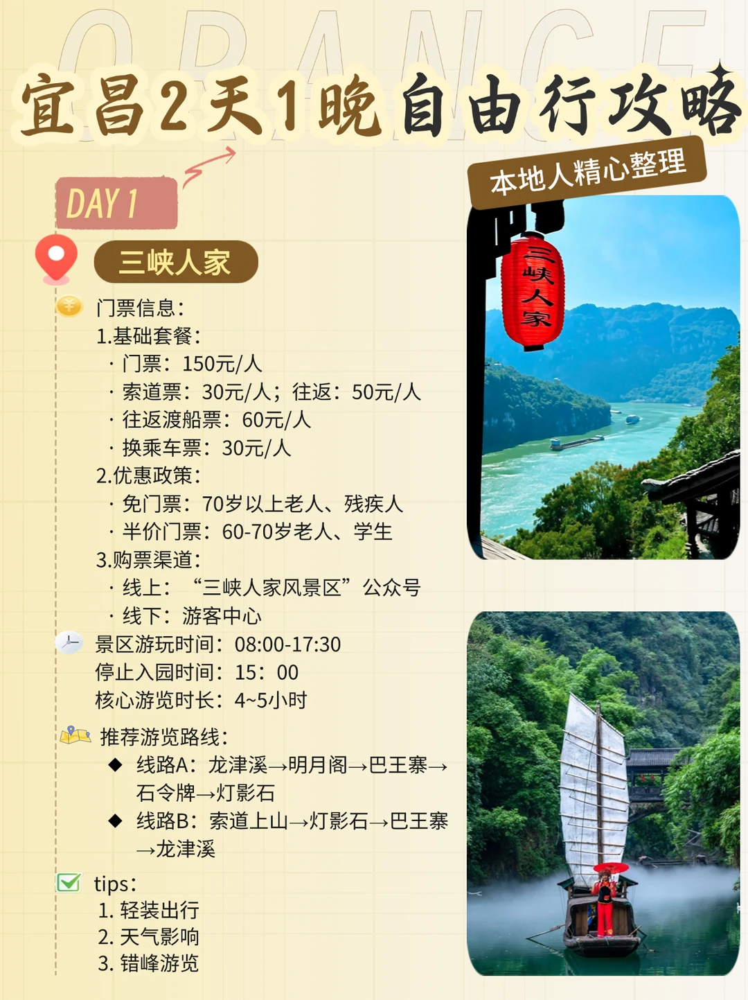
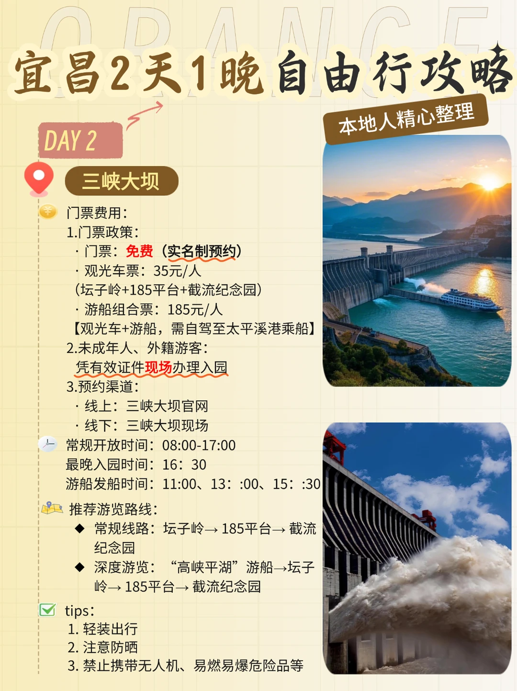
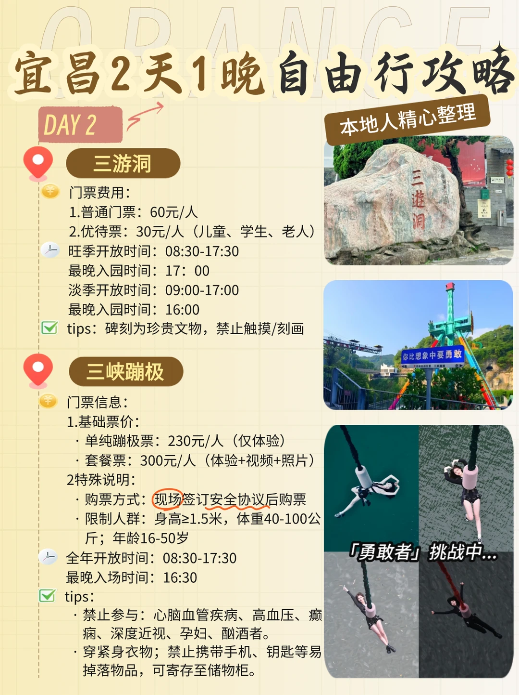
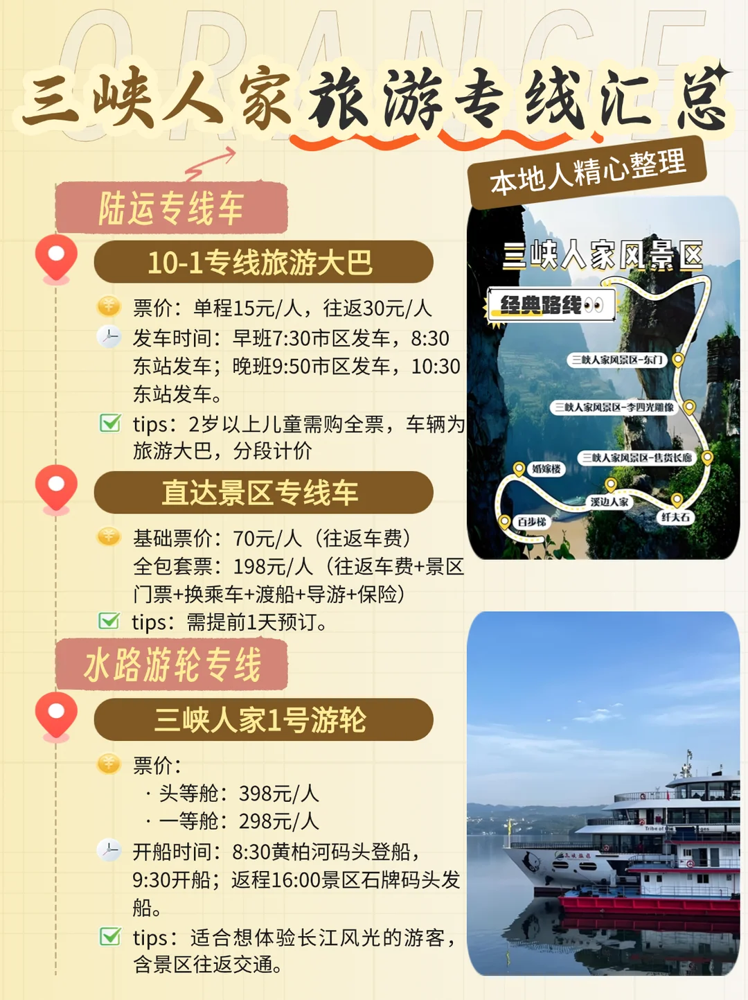

# 【宜昌48小时旅游攻略】玩转三峡！

- 作者: 橙小宜
- 👍363 · 💬7 · ⭐289 · 图 7
- feed_id: 6812f3490000000022034c67

> [OCR] 宜昌2天1晚自由行攻略
当地人精心整理

DAY 1
三峡人家

门票信息：
1.基础套餐：
· 门票：150元/人
· 索道票：30元/人；往返：50元/人
· 往返渡船票：60元/人
· 换乘车票：30元/人

2.优惠政策：
· 免门票：70岁以上老人、残疾人
· 半价门票：60-70岁老人、学生

3.购票渠道：
· 线上：“三峡人家风景区”公众号
· 线下：游客中心

景区游玩时间：08:00-17:30
停止入园时间：15:00
核心游览时长：4~5小时

推荐游览路线：
◆ 线路A：龙津溪→明月阁→巴王寨→石令牌→灯影石
◆ 线路B：索道上山→灯影石→巴王寨→龙津溪

tips：
1. 轻装出行
2. 天气影响
3. 错峰游览

> [OCR] 宜昌2天1晚自由行攻略
当地人精心整理

DAY 2
三峡大坝

门票费用：
1. 门票政策：
   - 门票：免费（实名制预约）
   - 观光车票：35元/人
     (坛子岭+185平台+截流纪念园)
   - 游船组合票：185元/人
     【观光车+游船，需自驾至太平溪港乘船】
2. 未成年人、外籍游客：
   凭有效证件现场办理入园
3. 预约渠道：
   - 线上：三峡大坝官网
   - 线下：三峡大坝现场

常规开放时间：08:00-17:00
最晚入园时间：16:30
游船发船时间：11:00、13:00、15:30

推荐游览路线：
   - 常规线路：坛子岭→185平台→截流纪念园
   - 深度游览：“高峡平湖”游船→坛子岭→185平台→截流纪念园

tips：
1. 轻装出行
2. 注意防晒
3. 禁止携带无人机、易燃易爆危险品等

> [OCR] 宜昌2天1晚自由行攻略
DAY 2
三游洞
门票费用：
1.普通门票：60元/人
2.优待票：30元/人（儿童、学生、老人）
旺季开放时间：08:30-17:30
最晚入园时间：17:00
淡季开放时间：09:00-17:00
最晚入园时间：16:00
tips：碑刻为珍贵文物，禁止触摸/刻画

三峡蹦极
门票信息：
1.基础票价：
·单纯蹦极票：230元/人（仅体验）
·套餐票：300元/人（体验+视频+照片）
2特殊说明：
·购票方式：现场签订安全协议后购票
·限制人群：身高≥1.5米，体重40-100公斤；年龄16-50岁
全年开放时间：08:30-17:30
最晚入场时间：16:30
tips：
·禁止参与：心脑血管疾病、高血压、癫痫、深度近视、孕妇、酗酒者。
·穿紧身衣物；禁止携带手机、钥匙等易掉落物品，可寄存至储物柜。

> [OCR] 三峡人家旅游专线汇总

当地人精心整理

陆运专线车

10-1专线旅游大巴
票价：单程15元/人，往返30元/人
发车时间：早班7:30市区发车，8:30东站发车；晚班9:50市区发车，10:30东站发车。
tips：2岁以上儿童需购全票，车辆为旅游大巴，分段计价

直达景区专线车
基础票价：70元/人（往返车费）
全包套票：198元/人（往返车费+景区门票+换乘车+渡船+导游+保险）
tips：需提前1天预订。

水路游轮专线

三峡人家1号游轮
票价：
·头等舱：398元/人
·一等舱：298元/人
开船时间：8:30黄柏河码头登船，9:30开船；返程16:00景区石牌码头发船。
tips：适合想体验长江风光的游客，含景区往返交通。

三峡人家风景区
经典路线
三峡人家风景区-东门
三峡人家风景区-李四光雕像
三峡人家风景区-售货长廊
婚嫁楼
溪边人家
百步梯
纤夫石

> [OCR] 一生出片!

> [OCR] 滨江公园夜游

> [OCR] 宜昌
萝卜饺子
爽口凉虾
肥鱼火锅
红油包子

## 正文
🌟 行程亮点
✅ 土家婚嫁表演当NPC新郎
✅ 185平台装长江水做纪念
✅ 免费看大坝灯光秀
✅ 夜市3元凉虾+8元红油小面吃到撑
✅ 蹦极省预算必冲（附避坑指南）
	
📅 行程安排
DAY1：三峡人家沉浸游
⏰ 08:00 宜昌东站出发
🚌 交通：B9路转三峡人家旅游专线（💰17元）或拼车（💰50元）
📸 必打卡：
👉 龙进溪：11:30婚嫁表演！抢前排能当新郎互动
👉 巴王寨：吊脚楼二楼窗边拍武侠大片
👉 明月湾：山顶俯瞰长江第一湾，全景封神机位
🌙 夜生活：陶珠路夜市（凉虾+小面人均10元）+滨江公园灯光秀
	
DAY2：大国重器+峡谷暴走
⏰ 07:30 直奔三峡大坝
🌊 大坝三件套：
🔹 坛子岭：摸万吨水轮机模型
🔹 185平台：用矿泉水瓶装长江水（本地人同款）
🔹 截流园：假装开工程车发圈“实习日记”
🚴 下午：西陵峡口骑行（砍价到15元/h）+三游洞盖限定章
	
💰 费用清单
交通：125元（公交+拼车）
门票：195元（学生证半价）
吃喝：80元（夜市+自备零食）
总花销≈400元，省下100+可冲蹦极！
	
📌 血泪避坑指南
❗️ 大坝观光车别买！景点步行15分钟全搞定
❗️ 摄影摊贴纸照：10元快洗是P图贴纸，慎拍！
❗️ 下牢溪竹筏：不如自带凉鞋踩水，免费又出片
❗️ 蹦极安全：穿紧身衣！手机钥匙提前寄存
	
📸 出片神点位
1️⃣ 三峡人家：龙进溪竹筏+巴王寨吊脚楼
2️⃣ 大坝：坛子岭俯拍+185平台平视合影
3️⃣ 西陵峡：三游洞摩崖石刻+下牢溪吊桥
	
🛠️ 特种兵装备
🎒 折叠水杯（景区免费接水）
🧦 防滑袜（替代溯溪鞋，踩水不滑）
👟 运动鞋（暴走2万步保命）
	
🍀 隐藏彩蛋
💡 青旅厨房煮泡面，省饭钱多玩一个项目！
💡 蹦极选早晨，人少+设备状态最佳！
#宜昌[话题]# #宜昌旅游[话题]#  #宜昌旅游攻略[话题]##三峡人家[话题]# #三峡大坝[话题]#  #三峡蹦极[话题]# #城市达人计划[话题]# #先出发再说[话题]##旅游万粉扶持计划[话题]#  #深度游攻略[话题]#
@宜昌文旅

---