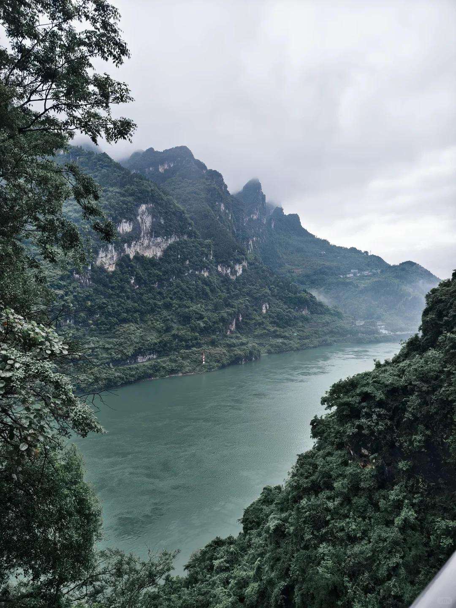
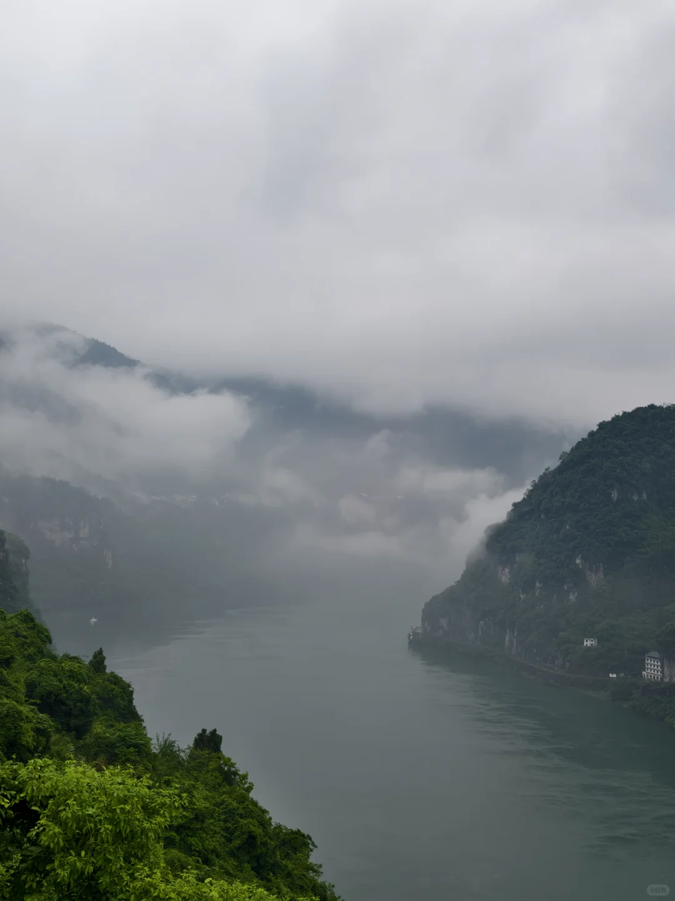
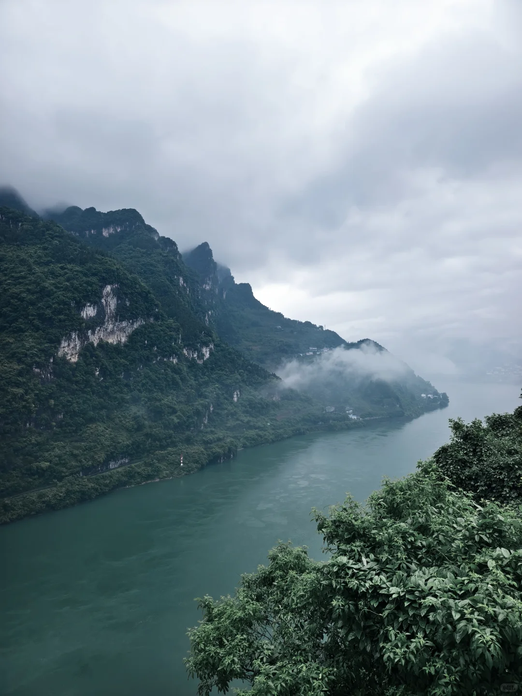
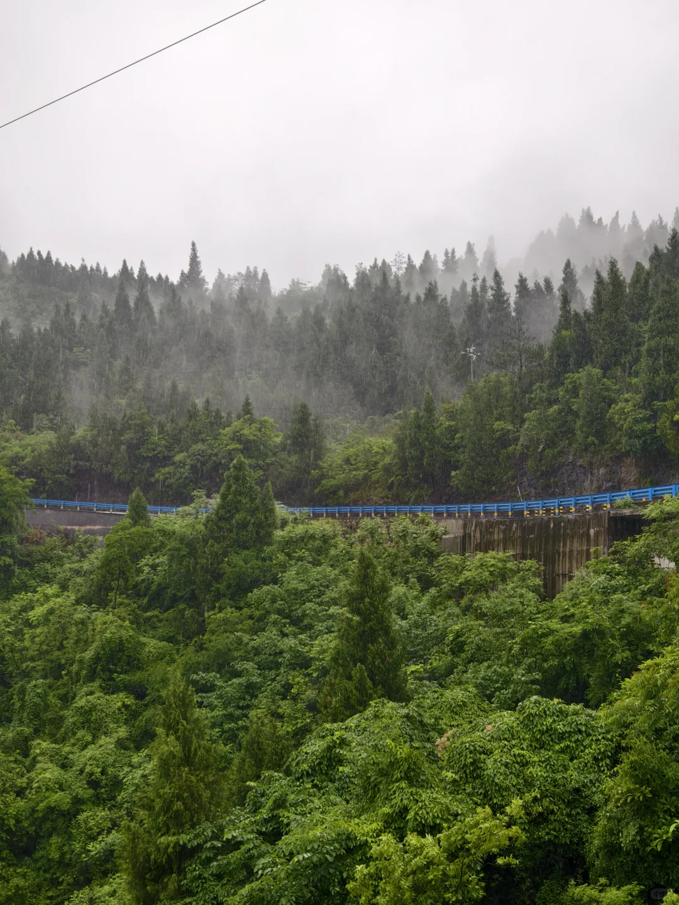
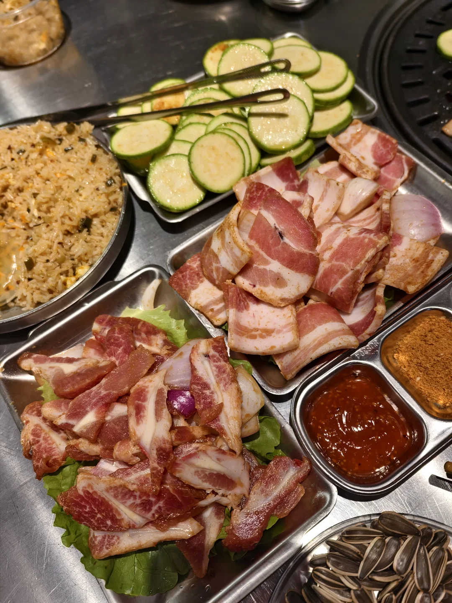
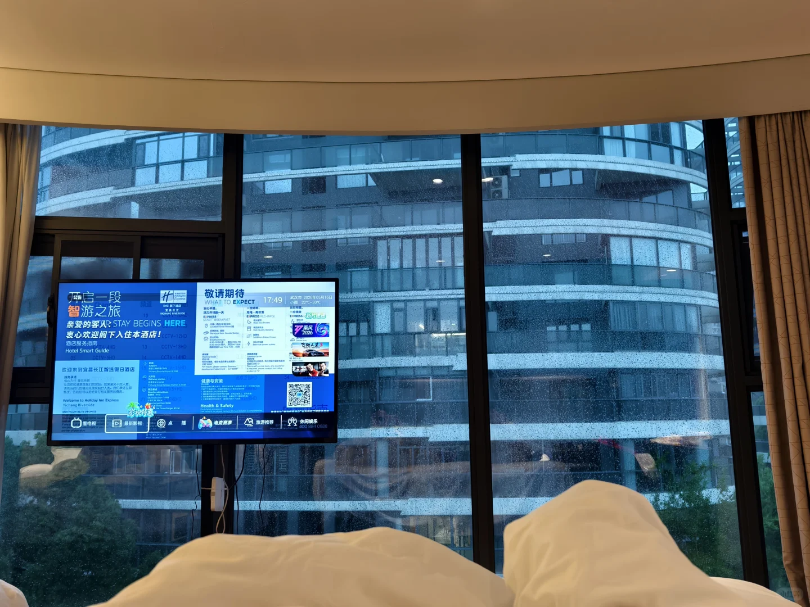
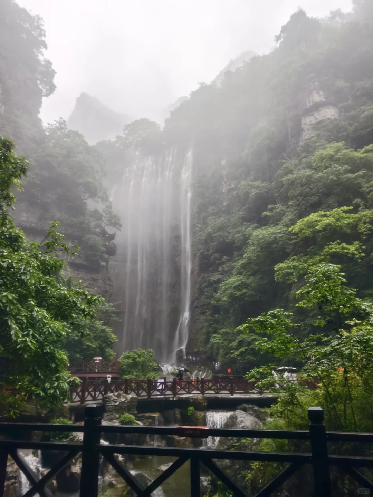
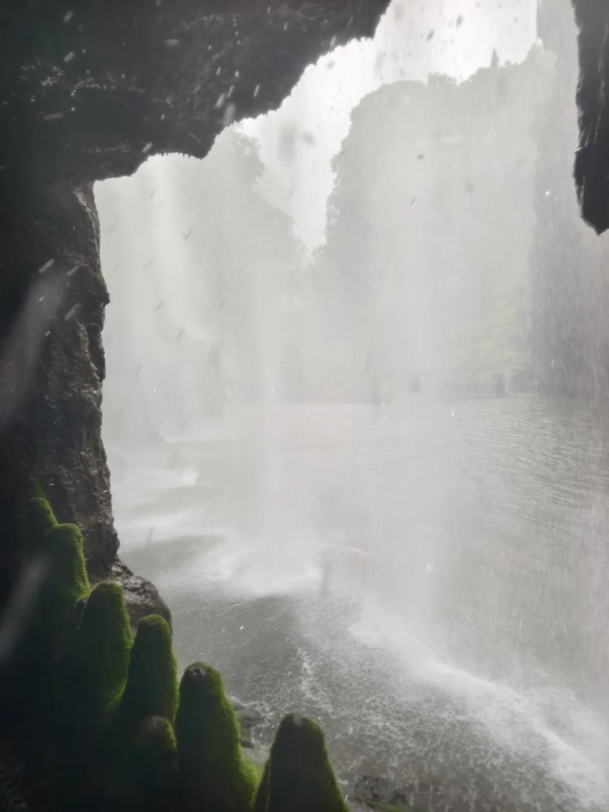
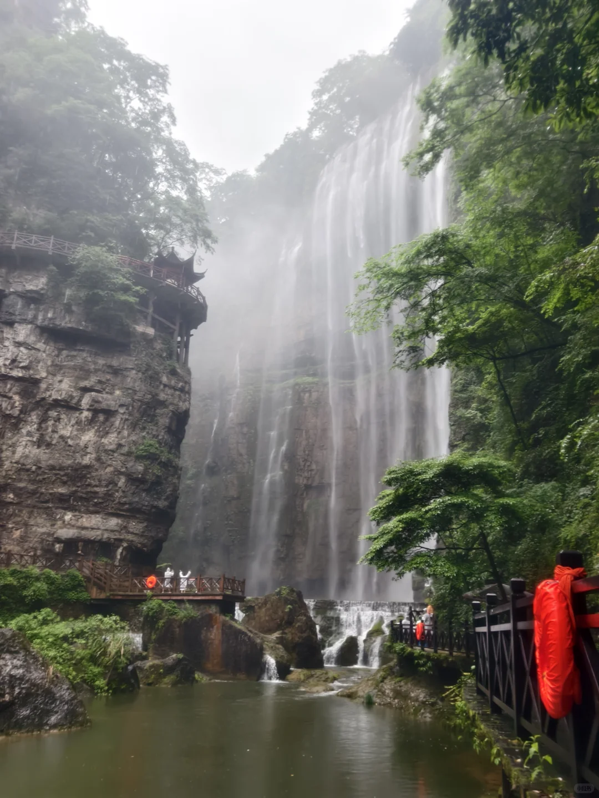

# 大学生宜昌两天一夜避雷安利攻略贴

- 作者: 绝望老奶
- 👍354 · 💬95 · ⭐235 · 图 9
- feed_id: 6a0bfe82000000003701e758

> [OCR] [?]

> [OCR] [?]

> [OCR] INSET.

> [OCR] 中图网

> [OCR] FUSSABO

> [OCR] 开启一段智游之旅
亲爱的客人 STAY BEGINS HERE!
衷心欢迎阁下入住本酒店！
Hotel Smart Guide

敬请期待
WHAT TO EXPECT 17:49
武汉2020年10月18日
温度：20℃-30℃
[?]
健康与安全
Health & Safety

> [OCR] [?]

> [OCR] system

> [OCR] [?][?]

## 正文
[爆炸R]先说避雷！
1️⃣吃的油饼很普通，一般的地方都有（至少湖南这边），然后网上很多人推荐的孙氏烤肉，我去的东站店，不建议人少去，p5分量比较大，肉品质好就比较贵，蔬菜很便宜，但是两个人不方便点，点了根本吃不完还全部一个味道
2️⃣不要把不可控行程放最后一个！我们当时玩完318秭归博物馆去三斗坪坐船，旅游团超级多，因为天气原因船晚了一个多小时才到，导致我们根本没敢坐船，直接打车回去赶火车
3️⃣三峡大瀑布外面雨衣的比里面的贵！
[点赞R]安利贴
1️⃣我们住的地方是长江假日酒店，滨江公园旁边，去其他地方都比较远，但是环境和景色都很好，不在意路程比较远不方便点外卖的推荐住。
2️⃣肥鱼一鱼两吃超级好吃！我们去的小雨天，肥鱼没有什么刺，吃完之后那个汤拿来煮白菜超级甜，就喜欢这种甜甜的，没什么刺的鱼
三峡大瀑布和348公路都特别好看，雨天拥有不一样的美，非常有烟雨江南的感觉，期待下一次晴天再去，把剩下的景点逛完
[玫瑰R]攻略
1️⃣住万达附近最方便，不管是打车还是坐旅游景点大巴都很好
2️⃣有时间的话去两坝一峡游船可以车去船回，可以顺带把348公路和秭归博物馆游览一下
3️⃣去三峡大瀑布可以预约顺风车，价格比旅游大巴便宜，而且游玩时间更长，当时去的提前预约，回来的我们玩完之后再约车都很快。
推荐带个帽子去拍，水量超级大，一定要买手机防水套，旁边有寄存包的地方，少量东西只要五元，可以先存包再去穿瀑布，再回来拿东西再去烘干
4️⃣有时间可以在滨江公园或者西坝走走，空气很好，而且很漂亮
5️⃣两坝一峡游船下午坐船一定要提前去，一点半左右，会陆陆续续的来很多旅游团，几分钟就排满了
[樱花R]感觉宜昌景色对我的眼睛很好，而且街道非常干净，就是有点美食荒漠#武夷山旅游[话题]# #宜昌[话题]# #宜昌旅游[话题]# #三峡大坝[话题]# #宜昌旅游攻略[话题]# #宜昌348公路[话题]# #秭归博物馆[话题]#

---