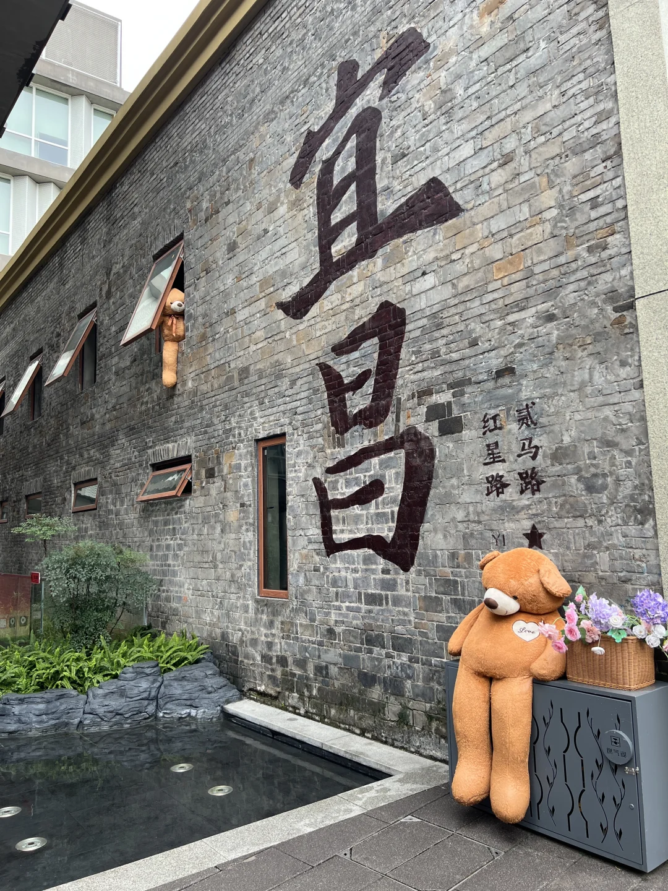
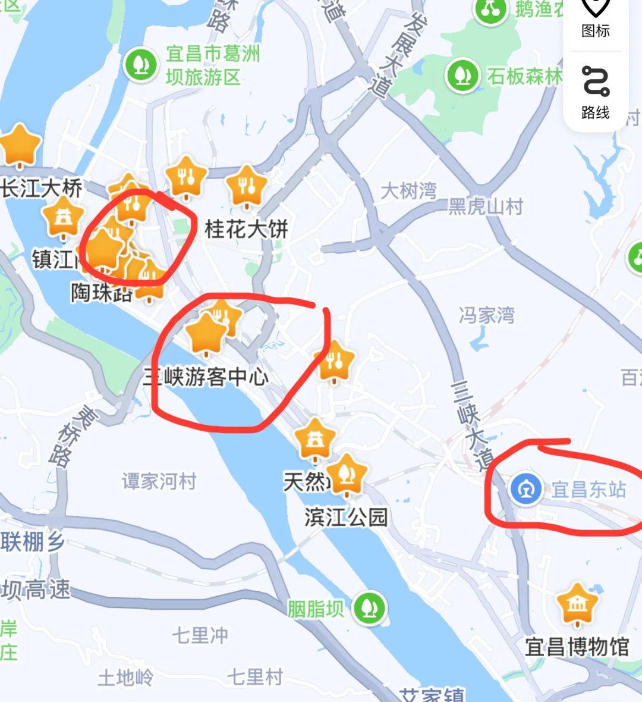
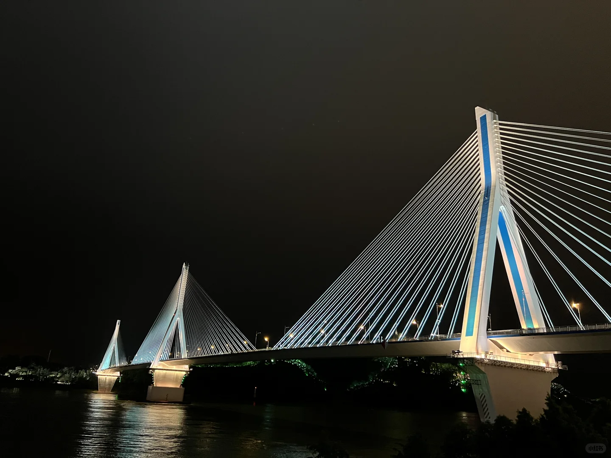
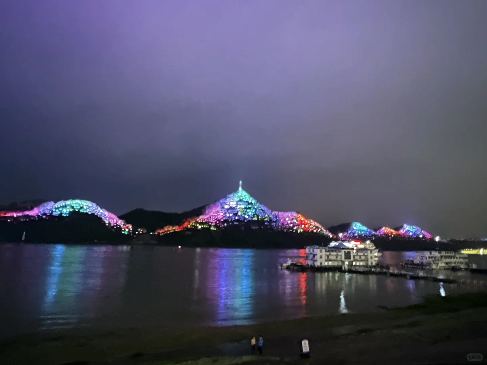

# 宜昌旅游住宿推荐

- 作者: 宁久宸
- 👍316 · 💬42 · ⭐220 · 图 4
- feed_id: 68c014da000000001d03763d

> [OCR] 直昌
红星路
贰马路
YI

> [OCR] 长江大桥
镇江
陶珠路
宜昌市葛洲
坝旅游区
桂花大饼
三峡游客中心
天然
滨江公园
宜昌东站
宜昌博物馆
大树湾
黑虎山村
冯家湾
三峡大道
[?]联棚乡
[?]坝高速
[?]岸庄
[?]七里冲
[?]土地岭
[?]七里村
[?]艾家镇

> [OCR] 小红书

> [OCR] 小红书

## 正文
宜昌住宿大体分为三个范围（图2）：高铁站（宜昌东站）、三峡游客中心（万达广场）、老城区（解放路附近）。
对于非自驾游客，最推荐住三峡游客中心附近，对面就是万达广场，吃饭很方便，大众点评必吃榜很多家在万达广场附近都有店。万达广场有ABC三栋写字楼，楼上有很多酒店，可选择性很大。报名一日游、或者是游轮登船都可以在三峡游客中心出发，非常方便。而且紧邻长江，傍晚沿滨江公园散步，或者夜晚看两岸灯光秀都是不错的选择（图3图4）。
#宜昌旅游[话题]# #宜昌旅游住宿[话题]# #宜昌旅游住宿推荐[话题]#

---