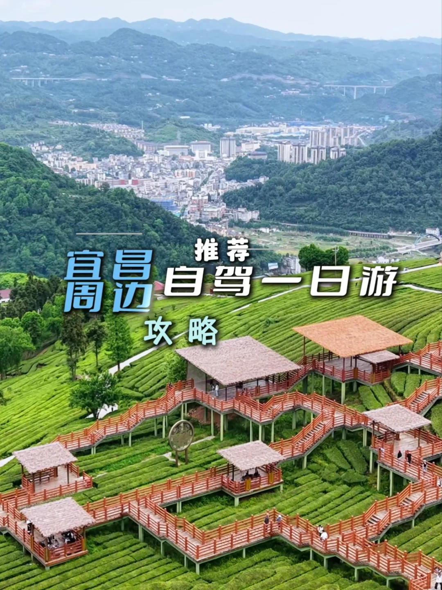

# 应该很多人都还不知道这！

- 作者: 🌸肥朵朵🌸
- 👍312 · 💬6 · ⭐405 · 图 1
- feed_id: 6a1079c000000000070237a8

> [OCR] 宜昌周边推荐自驾一日游攻略

## 正文
✅推荐一个宜昌周边自驾一日游，从山顶到峡谷，从地理到人文，一天可免费打卡四个地方。
	
第1️⃣站:
🔍导航：武陵山（湖北）野生动植物标本馆。
🍀这是一座藏在鄂西深山的“自然百科全书”，也是了解武陵山区生态的绝佳窗口。从大地文脉走进万物生灵，藏满山野自然故事。
	
第2️⃣站：
🔍高德导航:青岗岭。
🍀离标本馆约七八分钟车程，一路沿着茶园丛中蜿蜒而上，走进近万亩的梯田茶海，有多个观景台，可赏四周环绕的群山，漫步打卡拍照也是非常出片，这里也是宜昌五峰毛尖、宜红茶的主产地之一。
	
第3️⃣站：
🔍导航:五峰非遗馆。
🍀这里展示了过去茶厂车间制茶设备，还有土家族非遗项目展示，有光电多媒体技术呈现的名俗风情，也有像头发丝一样细的竹丝编织的文字和画像。
	
第4️⃣站：
🔍导航:蝴蝶谷农家乐方向。
🍀进入峡谷之后，沿路有很多处玩水的地方，有深水区也有浅水区，您根据自己的喜欢选择平台停车，推荐附近有农家乐的，借用厕所会比较方便。
	
🌸再继续往前开就是柴埠溪大峡谷风景区梯子口索道，如果有兴趣的也可以去看看。
	
#宜昌[话题]# #宜昌游玩推荐[话题]# #旅行推荐官[话题]# #自驾游[话题]# #周末去哪玩[话题]# #亲子游玩好去处[话题]# #宜昌游玩攻略[话题]# #夏季玩水[话题]#

---