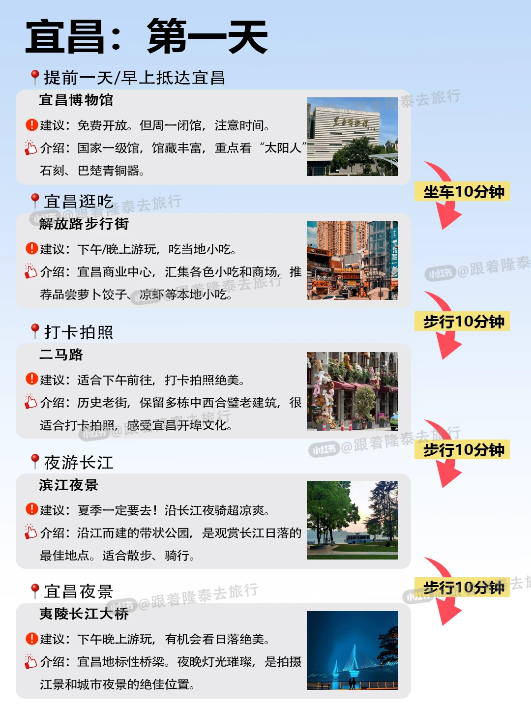
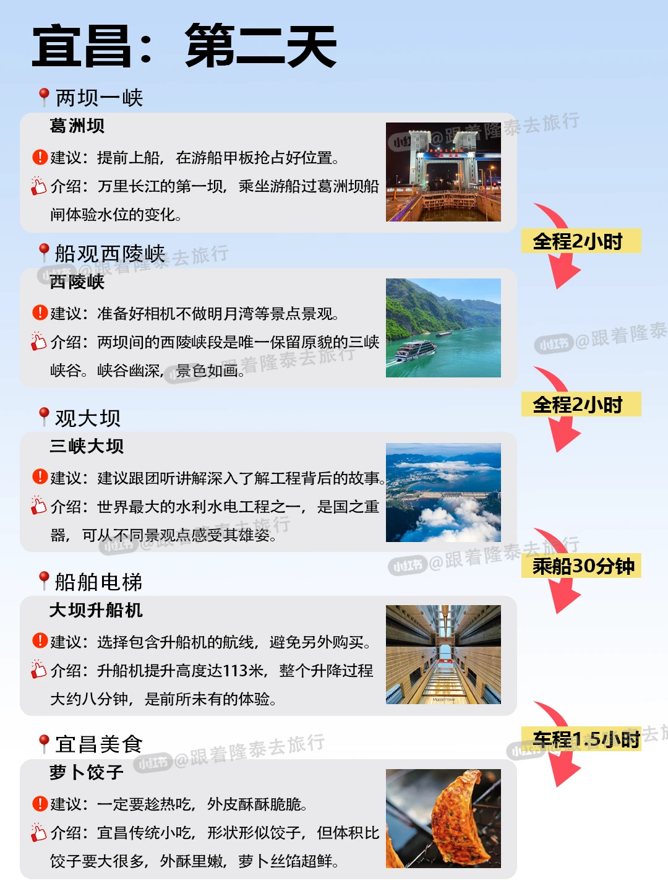
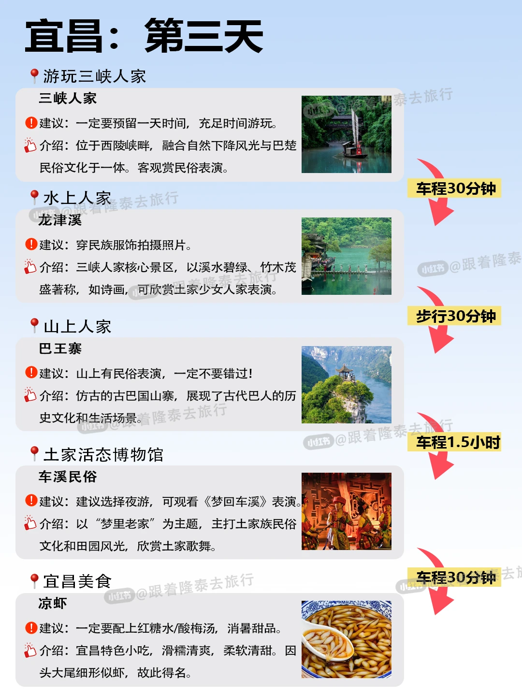
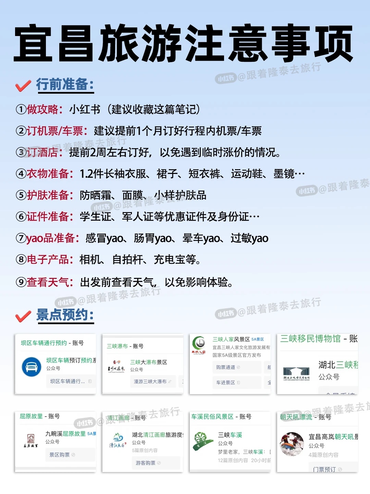
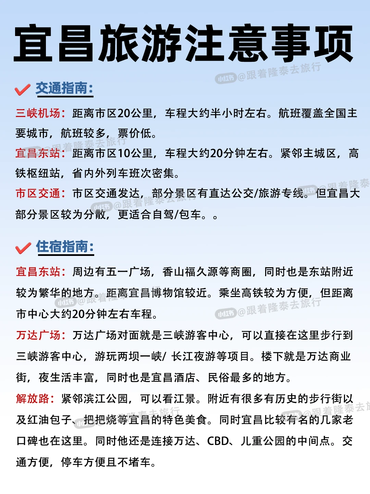

# 淡季去宜昌city walk路线🚶放心码

- 作者: 跟着楚渝行去旅行
- 👍309 · 💬3 · ⭐321 · 图 5
- feed_id: 68bbfd0c000000001c0302e5

> [OCR] 宜昌：第一天

提前一天/早上抵达宜昌

宜昌博物馆
建议：免费开放。但周一闭馆，注意时间。
介绍：国家一级馆，馆藏丰富，重点看“太阳人”石刻、巴楚青铜器。

宜昌逛吃
解放路步行街
建议：下午/晚上游玩，吃当地小吃。
介绍：宜昌商业中心，汇集各色小吃和商场，推荐品尝萝卜饺子、凉虾等本地小吃。

打卡拍照
二马路
建议：适合下午前往，打卡拍照绝美。
介绍：历史老街，保留多栋中西合璧老建筑，很适合打卡拍照，感受宜昌开埠文化。

夜游长江
滨江夜景
建议：夏季一定要去！沿长江夜骑超凉爽。
介绍：沿江而建的带状公园，是观赏长江日落的最佳地点。适合散步、骑行。

宜昌夜景
夷陵长江大桥
建议：下午晚上游玩，有机会看日落绝美。
介绍：宜昌地标性桥梁。夜晚灯光璀璨，是拍摄江景和城市夜景的绝佳位置。

> [OCR] 宜昌：第二天

• 两坝一峡

葛洲坝
建议：提前上船，在游船甲板抢占好位置。
介绍：万里长江的第一坝，乘坐游船过葛洲坝船闸体验水位的变化。

• 船观西陵峡

西陵峡
建议：准备好相机不做明月湾等景点景观。
介绍：两坝间的西陵峡段是唯一保留原貌的三峡峡谷。峡谷幽深，景色如画。

• 观大坝

三峡大坝
建议：建议跟团听讲解深入了解工程背后的故事。
介绍：世界最大的水利水电工程之一，是国之重器，可从不同景观点感受其雄姿。

• 船舶电梯

大坝升船机
建议：选择包含升船机的航线，避免另外购买。
介绍：升船机提升高度达113米，整个升降过程大约八分钟，是前所未有的体验。

• 宜昌美食

萝卜饺子
建议：一定要趁热吃，外皮酥酥脆脆。
介绍：宜昌传统小吃，形状形似饺子，但体积比饺子要大很多，外酥里嫩，萝卜丝馅超鲜。

> [OCR] 宜昌：第三天

游玩三峡人家

三峡人家
建议：一定要预留一天时间，充足时间游玩。
介绍：位于西陵峡畔，融合自然风光与巴楚民俗文化于一体。客观赏民俗表演。

水上人家
龙津溪
建议：穿民族服饰拍摄照片。
介绍：三峡人家核心景区，以溪水碧绿、竹木茂盛著称，如诗画，可欣赏土家少女人家表演。

山上人家
巴王寨
建议：山上有民俗表演，一定不要错过！
介绍：仿古的古巴国山寨，展现了古代巴人的历史文化和生活场景。

土家活态博物馆
车溪民俗
建议：选择夜游，可观看《梦回车溪》表演。
介绍：以“梦里老家”为主题，主打土家族民俗文化和田园风光，欣赏土家歌舞。

宜昌美食
凉虾
建议：一定要配上红糖水/酸梅汤，消暑甜品。
介绍：宜昌特色小吃，滑糯清爽，柔软清甜。因头大尾细形似虾，故此得名。

> [OCR] 宜昌旅游注意事项

✅ 行前准备：
① 做攻略：小红书（建议收藏这篇笔记）
② 订机票/车票：建议提前1个月订好行程内机票/车票
③ 订酒店：提前2周左右订好，以免遇到临时涨价的情况。
④ 衣物准备：1.2件长袖衣服、裙子、短衣裤、运动鞋、墨镜…
⑤ 护肤准备：防晒霜、面膜、小样护肤品
⑥ 证件准备：学生证、军人证等优惠证件及身份证…
⑦ 药品准备：感冒药、肠胃药、晕车药、过敏药
⑧ 电子产品：相机、自拍杆、充电宝等。
⑨ 查看天气：出发前查看天气，以免影响体验。

✅ 景点预约：
坝区车辆通行预约 - 账号
三峡大瀑布 - 账号
三峡人家风景区5A景区
三峡移民博物馆 - 账号
屈原故里 - 账号
清江画廊 - 账号
车溪民俗风景区 - 账号
朝天吼漂流 - 账号

> [OCR] 宜昌旅游注意事项

✅ 交通指南：
三峡机场：距离市区20公里，车程大约半小时左右。航班覆盖全国主要城市，航班较多，票价低。
宜昌东站：距离市区10公里，车程大约20分钟左右。紧邻主城区，高铁枢纽站，省内外列车班次密集。
市区交通：市区交通发达，部分景区有直达公交/旅游专线。但宜昌大部分景区较为分散，更适合自驾/包车。

✅ 住宿指南：
宜昌东站：周边有五一广场、香山福久源等商圈，同时也是东站附近较为繁华的地方。距离宜昌博物馆较近。乘坐高铁较为方便，但距离市中心大约20分钟左右车程。
万达广场：万达广场对面就是三峡游客中心，可以直接在这里步行到三峡游客中心，游玩两坝一峡/长江夜游等项目。楼下就是万达商业街，夜生活丰富，同时也是宜昌酒店、民俗最多的地方。
解放路：紧邻滨江公园，可以看江景。附近有很多有历史的步行街以及红油包子、把把烧等宜昌的特色美食。同时宜昌比较有名的几家老口碑也在这里。同时他还是连接万达、CBD、儿童公园的中间点。交通方便，停车方便且不堵车。

## 正文
📌行程亮点
▪️ 一天逛遍城市精华地标
▪️ 一天体验世纪工程震撼
▪️ 一天感受原味土家民俗
适合时间紧又想玩透宜昌的你！
.
🚗交通贴士
1️⃣ 市区景点打车10r内搞定
2️⃣ 两坝一峡建议提前订票
3️⃣ 三峡人家包车更方便
.
🏨住宿推荐
✔️ 住夷陵广场或万达附近
✔️ 交通便利美食多
✔️ 提前订房省一半
.
🍜美食必吃
✅ 程记酸辣粉：加虎皮蛋绝了
✅ 胡记萝卜饺子：下午2点开卖
✅ 土家腊肉：车溪的最正宗
✅ 江鱼火锅：滨江公园附近多
.
💡行程安排
DAY1️⃣：🌆城市文化探索
✅上午：宜昌博物馆🏛️
‼️重点看：巴楚文物厅+三峡工程厅
🌄：解放路吃小吃+二马路拍老建筑
🌃：滨江公园看夜景+夷陵大桥散步
.
DAY2️⃣：🚢两坝一峡震撼体验
✅必体验：葛洲坝过闸水位降20米❗️
🌟必看：西陵峡风光+三峡大坝近观
📌tips：带零食！行程4小时
.
DAY3️⃣：民俗风情体验
🌇上午：三峡人家（看龙津溪婚嫁表演）
🌄下午：车溪民俗区体验打铁+皮影戏+手工榨油
🌃晚上：梦回车溪演出
.
💰省钱技巧
1️⃣ 学生证景点优惠价
2️⃣ 提前网上买票更便宜
.
⚠️重要提醒
▪️ 一定带身份证！
▪️ 穿舒服的鞋子
▪️ 备好防晒和雨具
▪️ 景区餐饮贵，自带零食
.
📸拍照建议
✅ 博物馆拍文物
✅ 夷陵大桥拍江景
✅ 两坝一峡拍船闸
✅ 车溪拍民俗表演
.
✨"宜昌的美，需要慢慢品味"
📌关注我，解锁更多实用攻略！
#旅游攻略[话题]# #旅行推荐官[话题]# #湖北周边游[话题]# #游玩攻略[话题]# #本地人做的攻略[话题]# #宜昌[话题]# #宜昌旅游[话题]# #三峡大坝[话题]# #三峡人家[话题]# #车溪民俗[话题]#

---