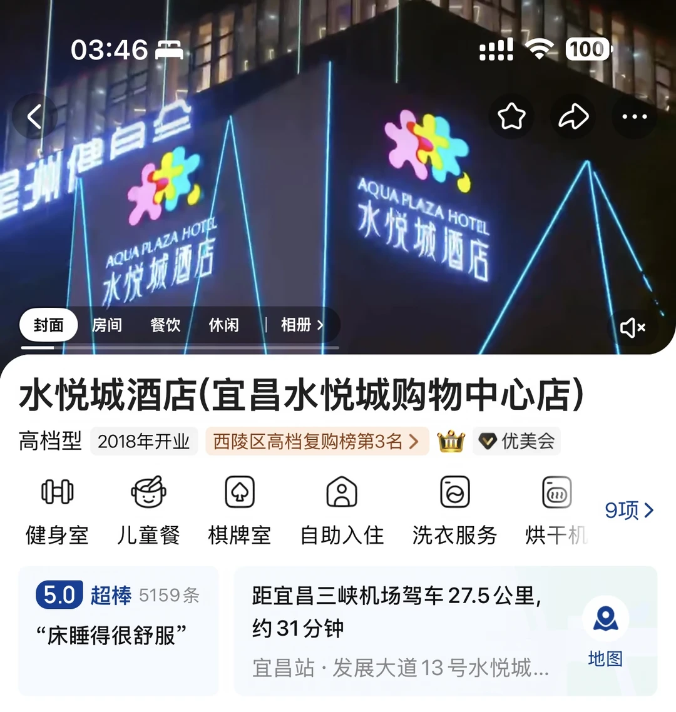
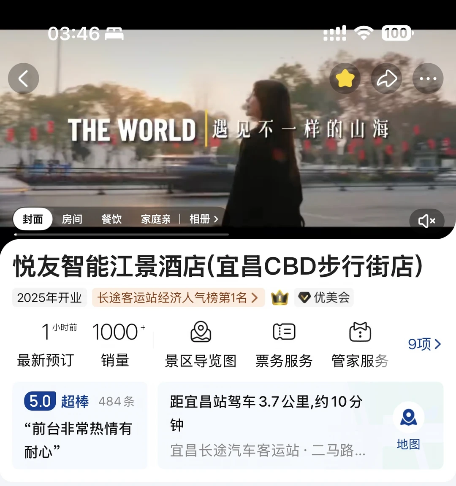
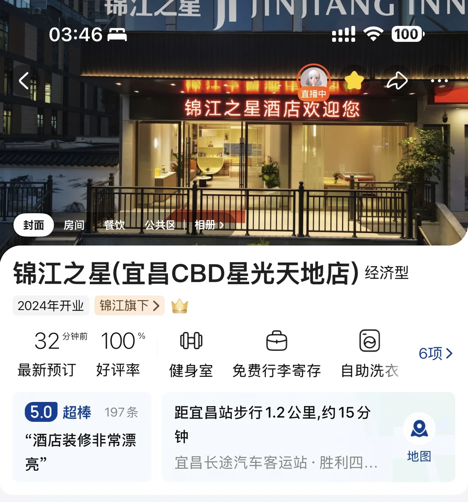
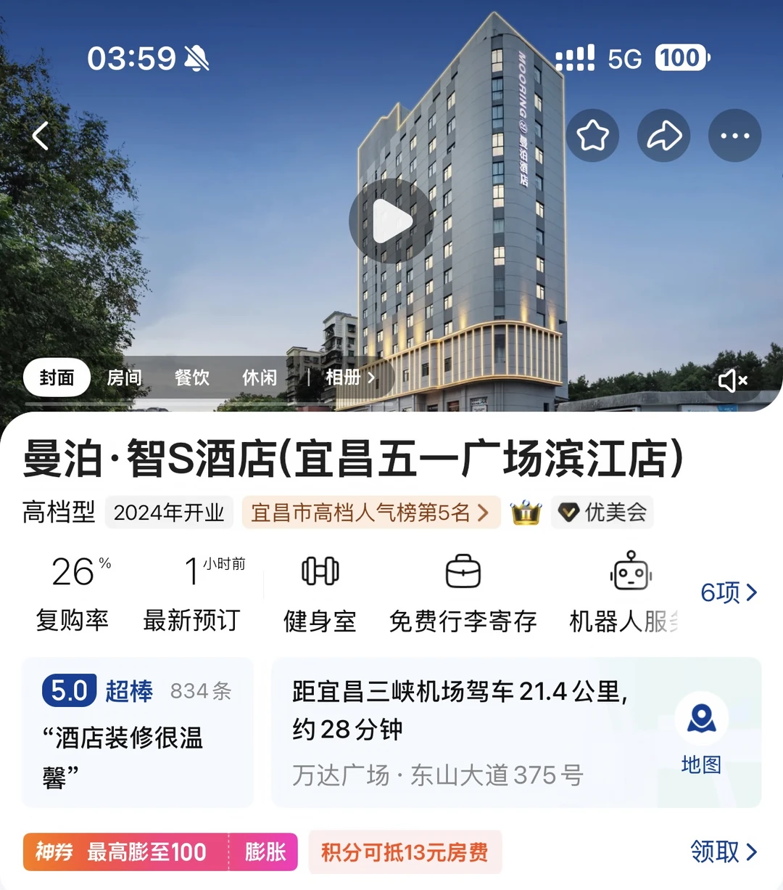

# 宜昌旅游酒店推荐

- 作者: 名字太长就会有美女跟着念
- 👍299 · 💬76 · ⭐199 · 图 5
- feed_id: 685ef932000000001703646e

> [OCR] 宜昌酒店
旅游住宿
推荐

> [OCR] 03:46
< 100
星洲健白金
AQUA PLAZA HOTEL
水悦城酒店
封面 房间 餐饮 休闲 | 相册 >
水悦城酒店(宜昌水悦城购物中心店)
高档型 2018年开业 西陵区高档复购榜第3名 > 优美会
健身室 儿童餐 棋牌室 自助入住 洗衣服务 烘干机
9项 >
5.0 超棒 5159条 “床睡得很舒服”
距宜昌三峡机场驾车27.5公里,
约31分钟
宜昌站·发展大道13号水悦城...
地图

> [OCR] 03:46
THE WORLD 遇见不一样的山海

封面 房间 餐饮 家庭亲 | 相册>

悦友智能江景酒店(宜昌CBD步行街店)
2025年开业 长途客运站经济人气榜第1名>
[?] 优美会

最新预订
1小时前 1000+
销量 景区导览图 票务服务 管家服务
9项>

5.0 超棒 484条
“前台非常热情有耐心”
距宜昌站驾车3.7公里,约10分钟
宜昌长途汽车客运站·二马路...
地图

> [OCR] 锦江之星
JI JINJIANG INN

03:46 🚗
直播中
锦江之星酒店欢迎您

封面 房间 餐饮 公共区 相册>

锦江之星(宜昌CBD星光天地店) 经济型
2024年开业 锦江旗下 > 皇冠

32 分钟前 100%
最新预订 好评率 健身室 免费行李寄存 自助洗衣

5.0 超棒 197条
“酒店装修非常漂亮”

距宜昌站步行1.2公里,约15分钟
宜昌长途汽车客运站·胜利四...

地图

> [OCR] 03:59
曼泊·智S酒店(宜昌五一广场滨江店)
高档型 2024年开业 宜昌市高档人气榜第5名 > 优美会
复购率 最新预订 健身室 免费行李寄存 机器人服务
6项 >
5.0 超棒 834条 “酒店装修很温馨”
距宜昌三峡机场驾车21.4公里, 约28分钟
万达广场·东山大道375号
神券 最高膨至100 膨胀 积分可抵13元房费 领取 >

## 正文
有没有宝宝可以推荐一下宜昌的酒店呀？打算住几天的，计划只去两峡一坝和三峡人家，主要是干净以及安静就好了！！#出去玩住哪里[话题]# #宜昌[话题]# #宜昌旅游[话题]# #宜昌酒店推荐[话题]#

---