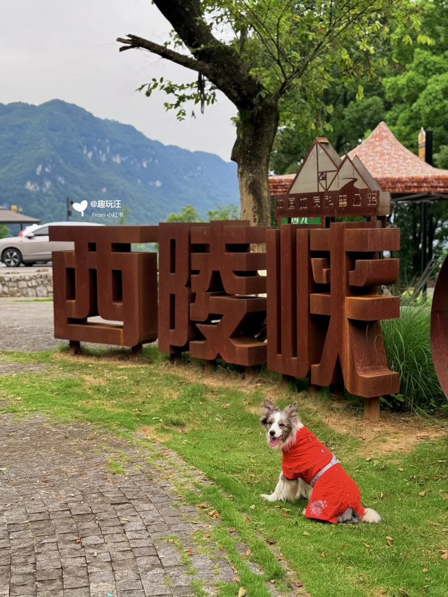
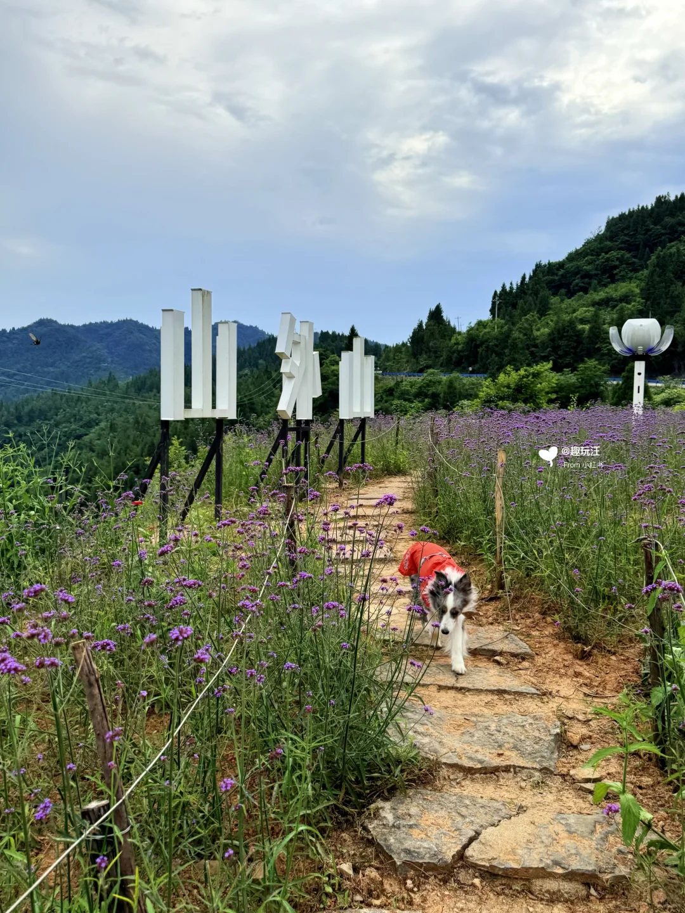
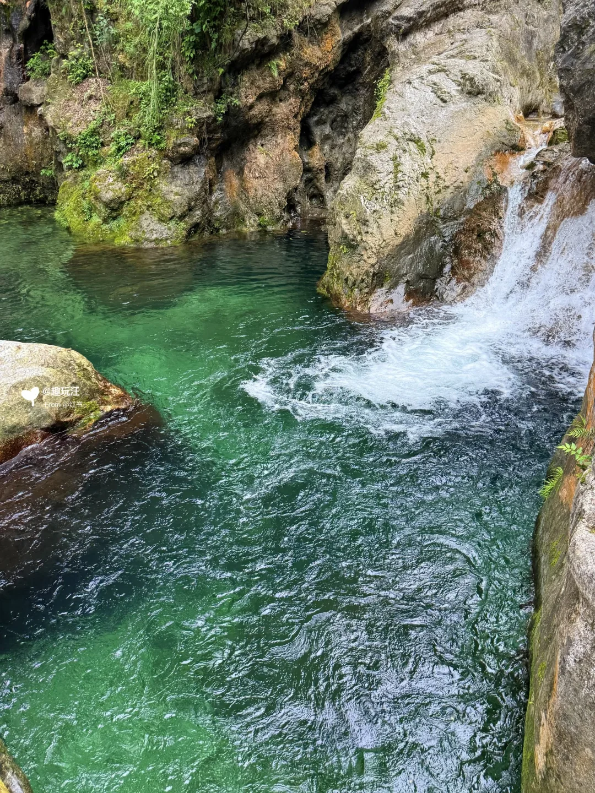
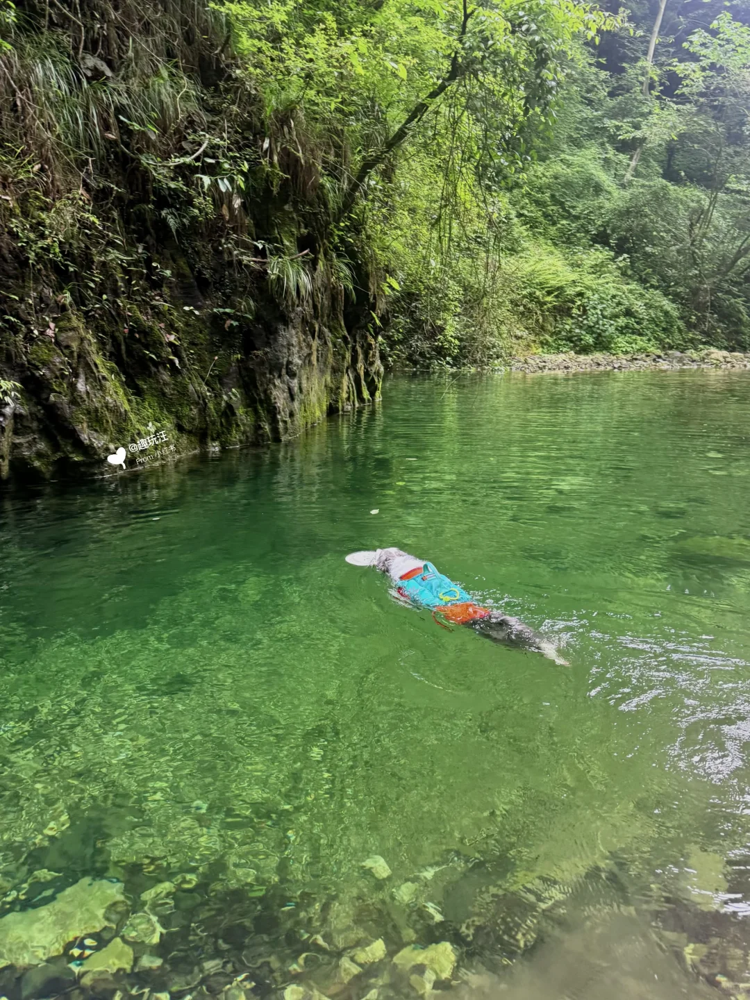
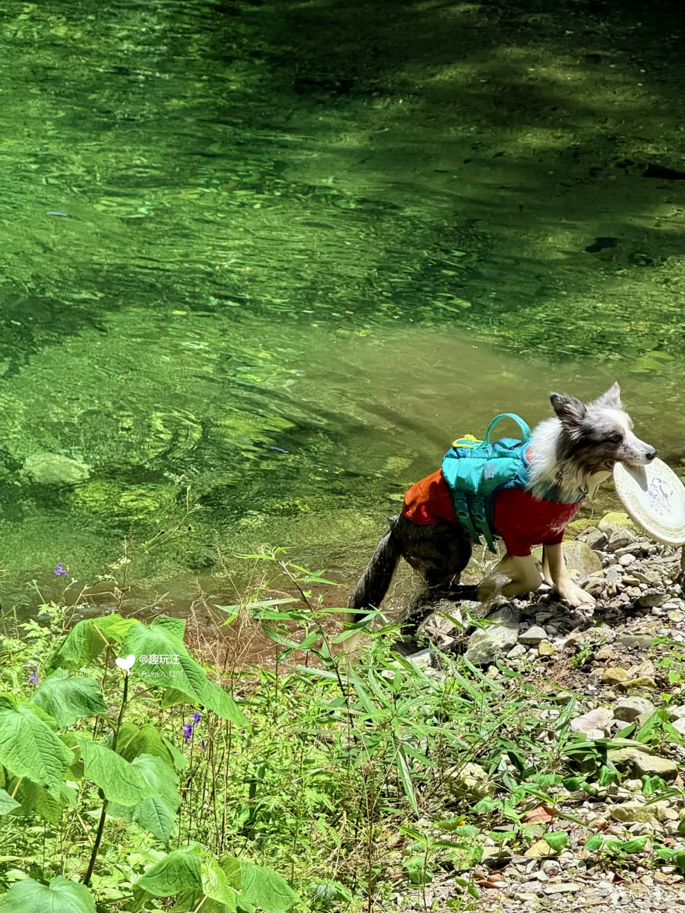

# 🐶自驾宜昌G348｜39.6km精华🆚避坑路线攻略

- 作者: 趣玩汪
- 👍286 · 💬38 · ⭐521 · 图 11
- feed_id: 6a3cfff40000000016027c6c

> [OCR] 宜昌G348自驾从夯到拉实测
路线攻略 & 景点

> [OCR] @趣玩汪
From 小红书

> [OCR] @趣玩汪
From 小红书

> [OCR] @趣玩汪
From 小红书

> [OCR] @趣玩汪
From 小红书

> [OCR] @趣玩汪
From 小红书

> [OCR] 西陵峡天
@趣玩汪
From 小红书

> [OCR] @趣玩汪
from 小红书

> [OCR] @趣玩汪
from 小红书

> [OCR] @趣玩汪
从[?]小红书

> [OCR] @趣玩汪
From小红书

## 正文
去宜昌自驾游一定不要错过G348❗️
这是一条从宜昌城区到三峡坝区的39.6km国家级风景道～
路况好、风景顶级、不收费、好停车🅿️
	
边欣赏西陵峡的壮阔，边一路向西到三峡大坝
沿路10个点如何取舍❓如何安排路线更顺❓
点赞收藏[红色心形R][星R]攻略，直接抄作业❗️
	
[一R]导航🧭
从东向西：📍听风谷观景台➡️📍柏树亭观景台➡️📍山外山观景台➡️📍明月台观景台➡️📍西陵峡0.618服务区➡️📍G348星空停车区➡️📍莲沱畔服务区➡️📍牛肝马肺峡观景台➡️📍神鱼台➡️📍鹰嘴岩
	
[二R]优缺点✅❌
👇是沿路所有点的实测评价，按需取舍：
1️⃣听风谷观景台[星R][星R]
✅G348起点🈶悬空观景台
❌人多车多商贩多
	
2️⃣柏树亭观景台[星R][星R][星R]
✅人少车少、苍绿柏树背景📷
❌风景较单一
	
3️⃣山外山观景台[星R][星R][星R][星R][星R]
✅必停必去👍
✅🈶马鞭草、🈶散步道、🈶悬空观景台
	
4️⃣明月台观景台[星R][星R][星R][星R][星R]
✅风景超赞👍必停必去
✅看长江大拐弯、三峡崖刻
✅🈶大草坪、🈶超大露台观景台
	
5️⃣西陵峡0.618服务区[星R][星R]
✅🉑去🉑不去
	
6️⃣G348星空停车区[星R][星R][星R][星R]
✅干沟子大桥最佳观景位
✅吊桥超出片
	
7️⃣莲沱畔服务区[星R][星R][星R][星R][星R][星R]
✅风景绝了，必停必去👍房车党、露营党冲❗️
✅平视长江大拐弯，🈶超大草坪
	
8️⃣牛肝马肺峡观景台[星R][星R][星R][星R][星R]
✅平视小狗山最佳视角
✅下车就能打卡小狗山，超方便
	
9️⃣神鱼台[星R]
❌台阶超多，不推荐
	
🔟鹰嘴岩[星R][星R][星R][星R][星R]
✅俯视小狗山最佳点位
✅看长江大拐弯，超出片📷
	
[三R]行程安排🕰️
✔️不建议一天跑完G348，推荐在中间点0.618旁🏨歇一晚
✔️边走边玩，不错过沿途景点的精华玩法：
D1 听风谷➡️山外山➡️明月台➡️住西陵峡
D2 南津关大峡谷💦➡️星空➡️莲沱畔⛺️or住秭归县城
D3 三峡移民博物馆➡️牛肝马肺峡➡️鹰嘴岩
	
[四R]TIPS⚠️
莲沱畔➡️秭归县城，需要走三峡翻坝公路，提前一天申请🚘三峡大坝通行证（免费🆓）
	
[五R]强烈安利[星R][星R][星R][星R][星R]
风景超绝的风景公路，此生必驾❗️自驾党、房车党、跑山党、摩托骑行党一定不要错过❗️
	
#干啥都顺旅行季[话题]# #带狗出游[话题]# #宜昌周边游[话题]# #自驾探索编辑部[话题]# #湖北旅游[话题]# #溯溪[话题]#  #玩水[话题]#  #三峡[话题]# #宜昌旅游[话题]# #暑假去哪儿[话题]# @生活薯 @户外薯 @城市情报官 @宠物薯 @土拨薯

---