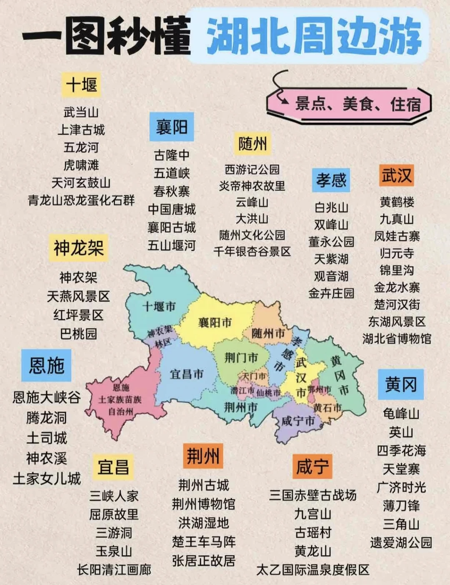

# 

- 作者: 98年的小覃
- 👍282 · 💬34 · ⭐226 · 图 1
- feed_id: 6a62c2a10000000001033098

> [OCR] 一图秒懂 湖北周边游

十堰
武当山
上津古城
五龙河
虎啸滩
天河玄鼓山
青龙山恐龙蛋化石群

襄阳
古隆中
五道峡
春秋寨
中国唐城
襄阳古城
五山堰河

随州
西游记公园
炎帝神农故里
云峰山
大洪山
随州文化公园
千年银杏谷景区

孝感
白兆山
双峰山
董永公园
天紫湖
观音湖
金卉庄园

武汉
黄鹤楼
九真山
凤娃古寨
归元寺
锦里沟
金龙水寨
楚河汉街
东湖风景区
湖北省博物馆

神农架
神农架
天燕风景区
红坪景区
巴桃园

恩施
恩施大峡谷
腾龙洞
土司城
神农溪
土家女儿城

宜昌
三峡人家
屈原故里
三游洞
玉泉山
长阳清江画廊

荆州
荆州古城
荆州博物馆
洪湖湿地
楚王车马阵
张居正故居

咸宁
三国赤壁古战场
九宫山
古瑶村
黄龙山
太乙国际温泉度假区

黄冈
龟峰山
英山
四季花海
天堂寨
广济时光
薄刀锋
三角山
遗爱湖公园

## 正文
#湖北[话题]# #必去的地方[话题]# #旅游推荐[话题]# #大众旅游地[话题]# #历史人文旅游[话题]# #城市文化和旅游[话题]# #宜昌旅游[话题]# #神农架旅游[话题]# #恩施旅游[话题]# #十堰旅游[话题]#

---