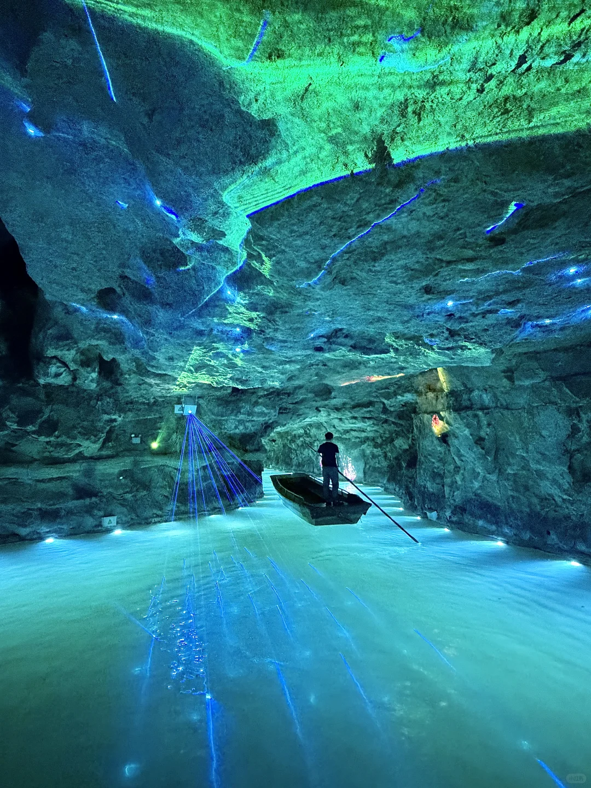
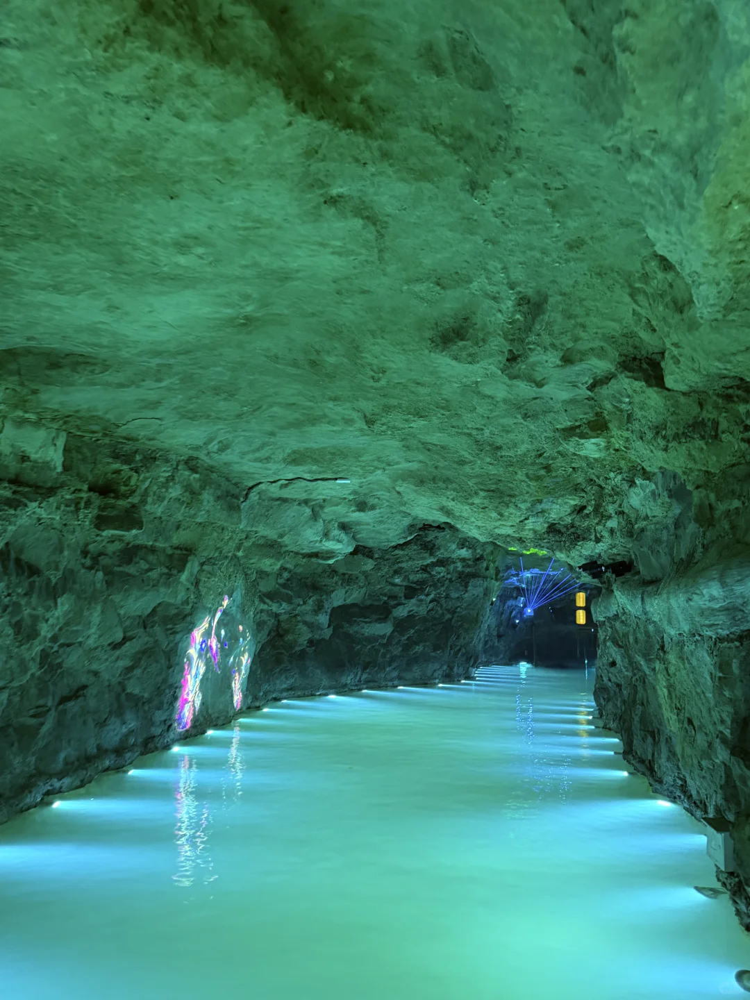
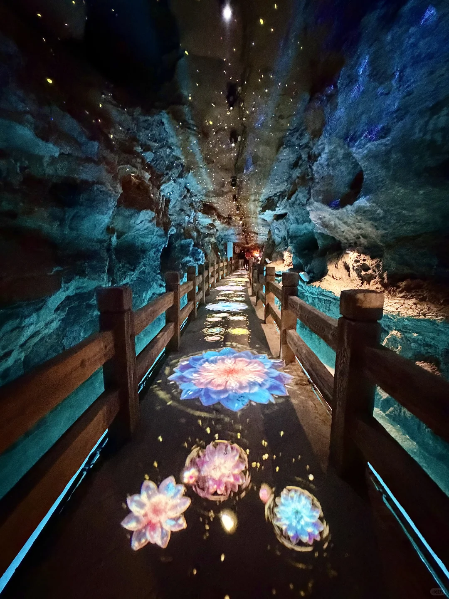
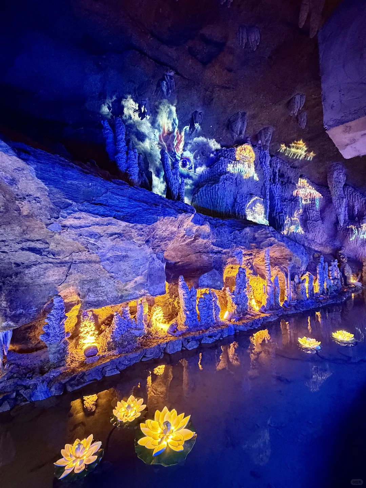
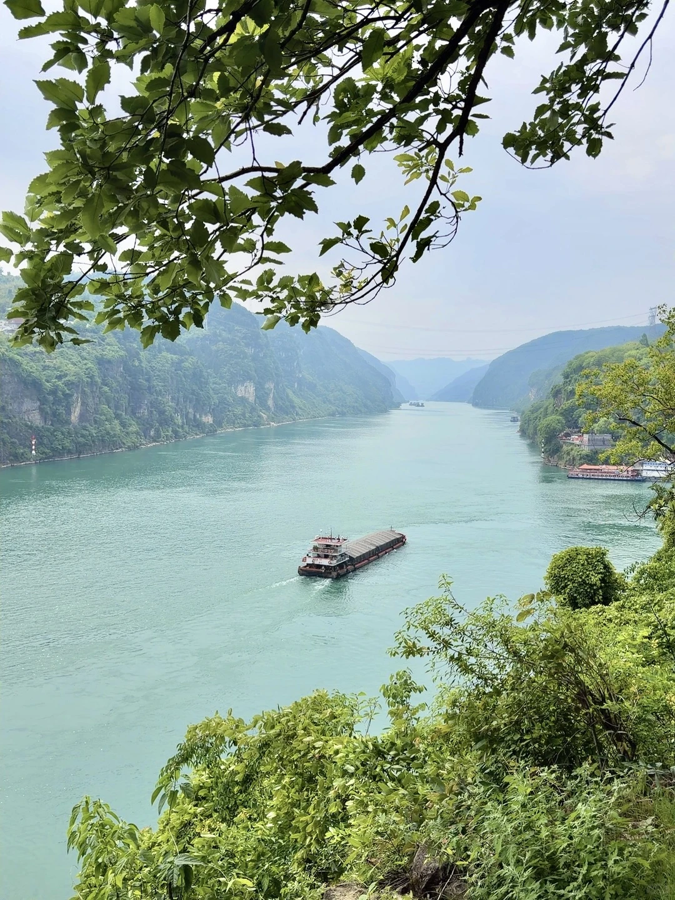
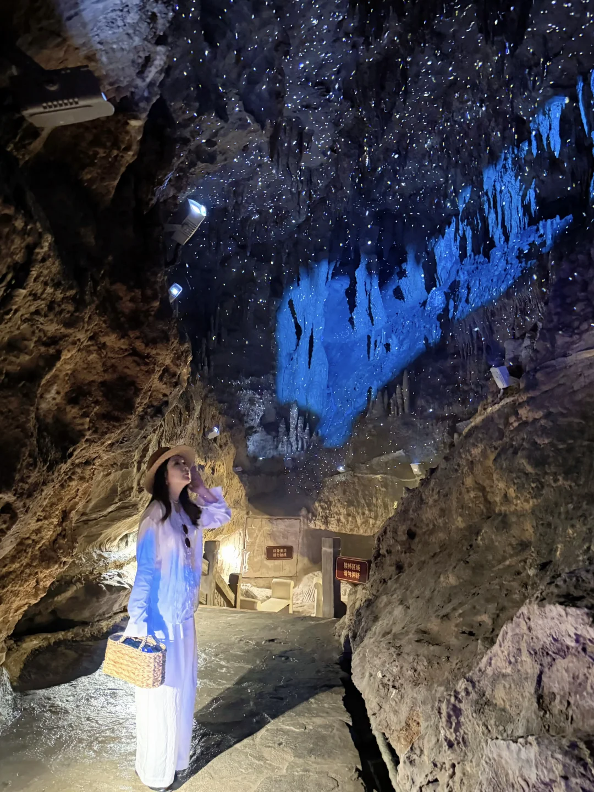
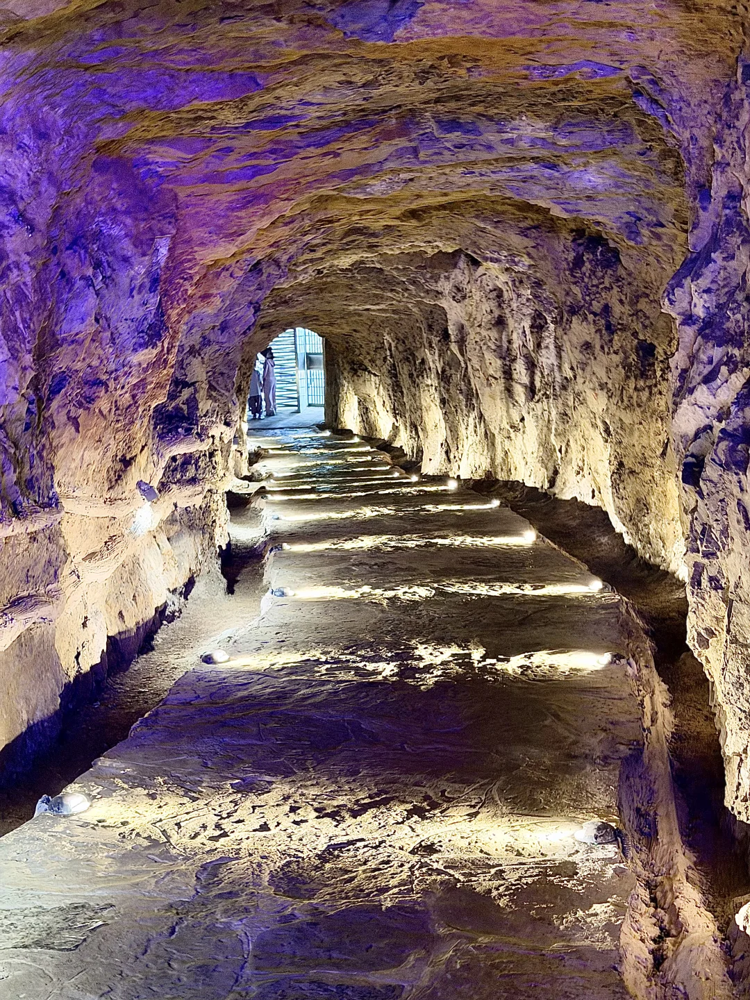
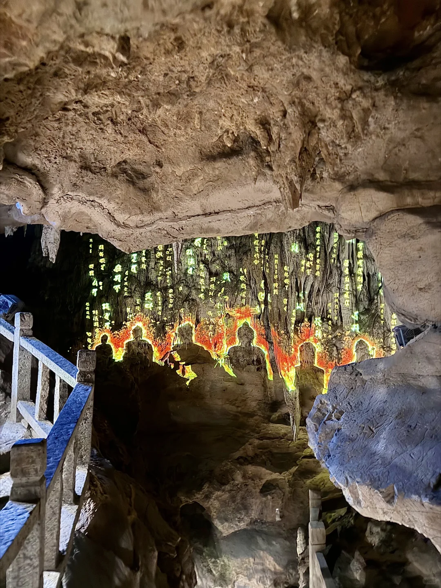

# 不是贵州…真的是宜昌…！！！！

- 作者: 金金有味🍒
- 👍253 · 💬39 · ⭐175 · 图 9
- feed_id: 69f739d4000000003701c569

> [OCR] system

> [OCR] [?]

> [OCR] [?]

> [OCR] INIES

> [OCR] [?]

> [OCR] 设备使用
请勿触摸

接待区域
请勿拥挤

> [OCR] system

> [OCR] [?]

## 正文
迄今为止，宜昌最让人惊喜的景区出现了
审美真的太绝了，无论是灯光还是人物设定
都非常的好看，有趣…！！！
溶洞结合的是西游中白龙马的故事
户外能看到长江三峡，西陵峡的风光
绿水青山的，天晴拍照非常好看📷📷
划船进溶洞，沿途都有光影特效，故事导览
很适合带小朋友一起来玩，全程不累
	
#宜昌[话题]##宜昌旅游[话题]##宜昌景区[话题]# #宜昌周边游[话题]##宜昌旅行[话题]# #小众旅游胜地[话题]##值得n刷的宝藏出游地[话题]# #避开人潮去这里[话题]# #藏在大山里的世外桃源[话题]#

---