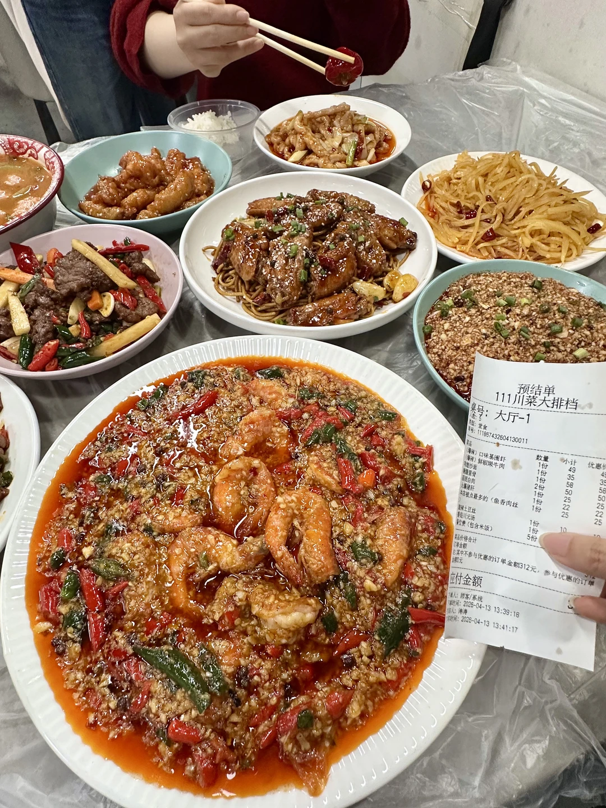
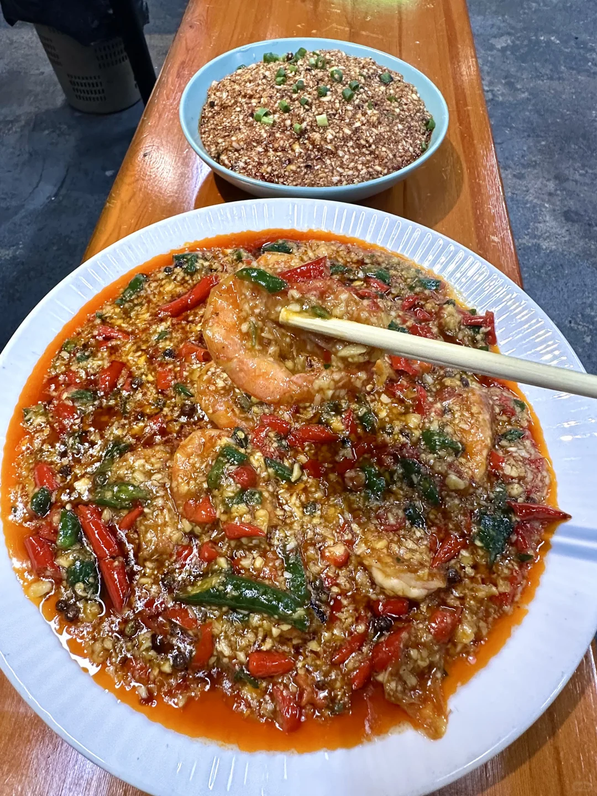
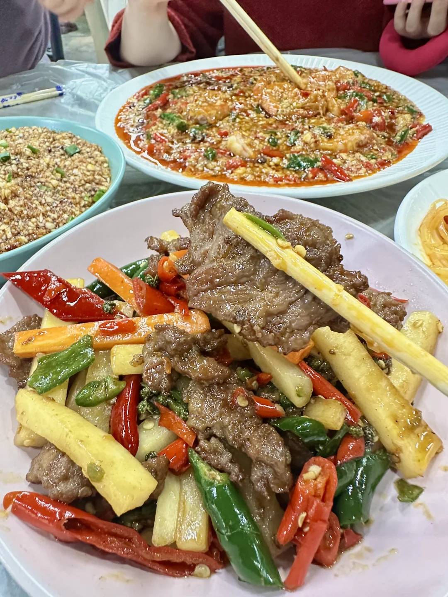
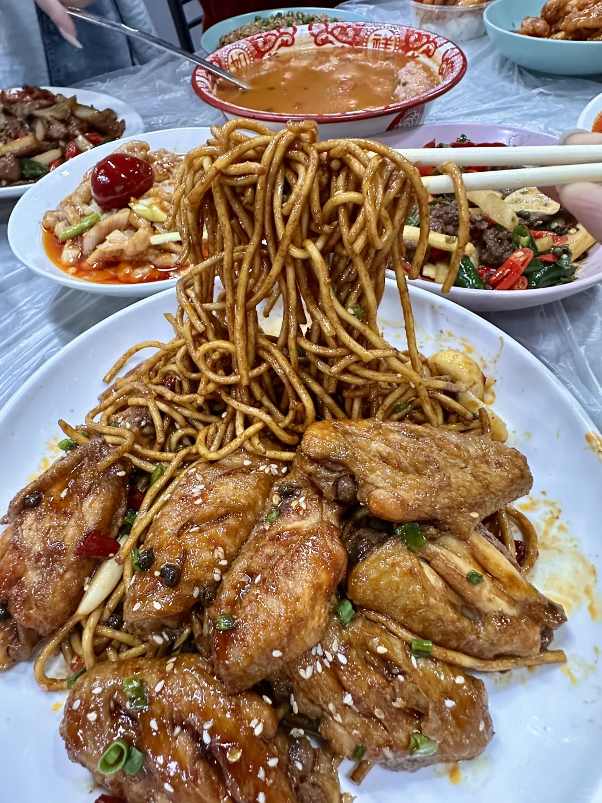
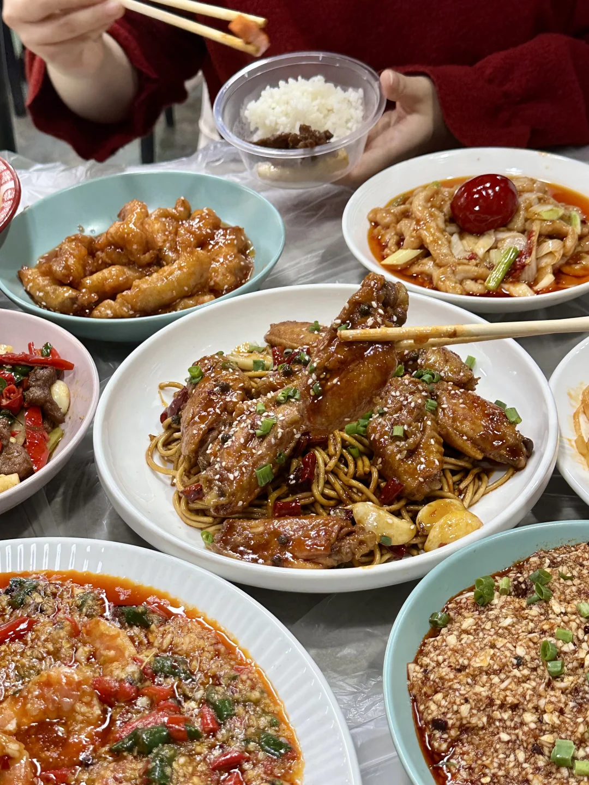
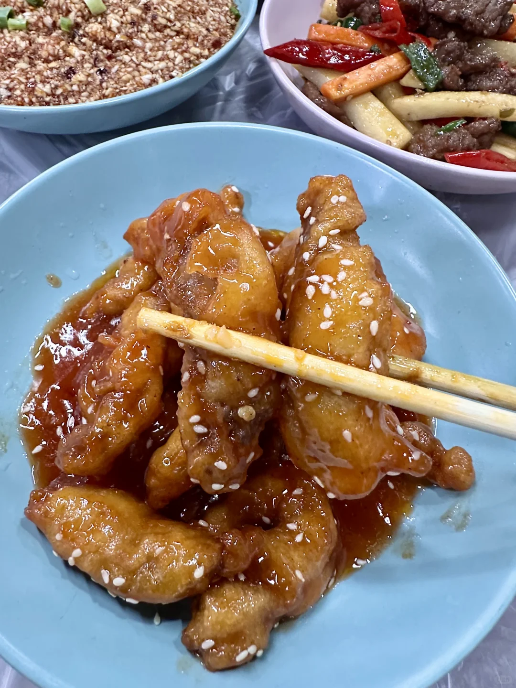
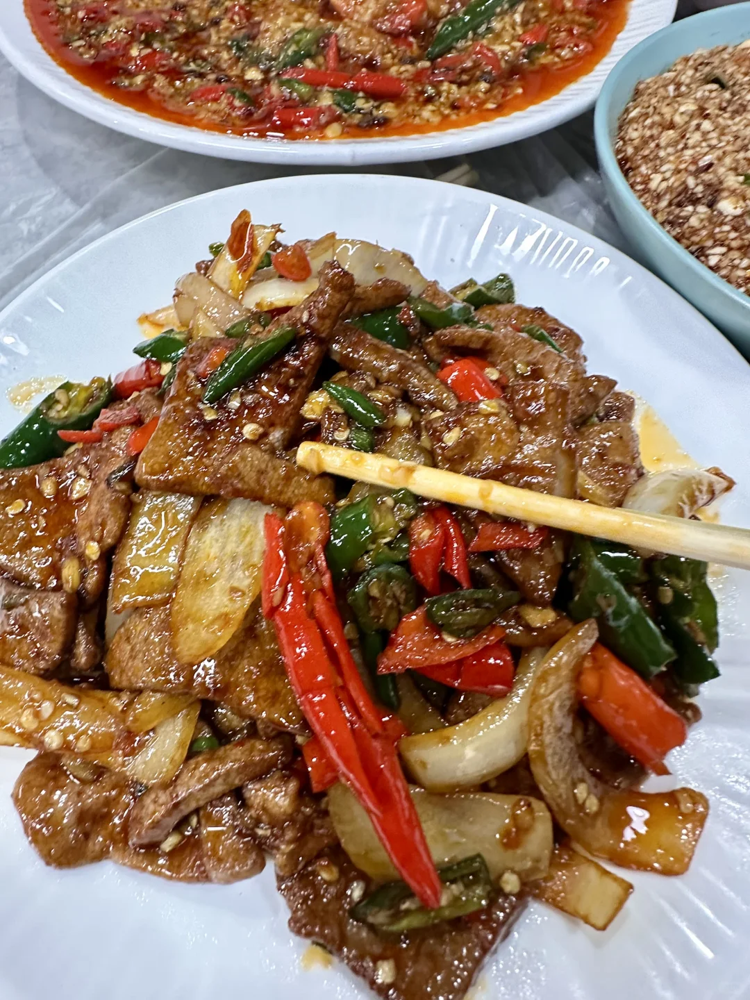
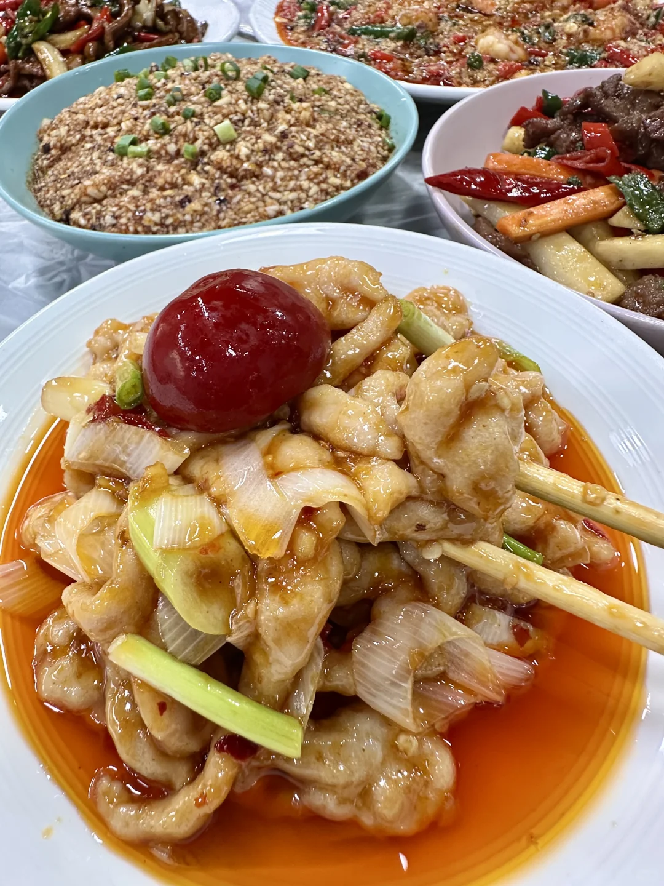
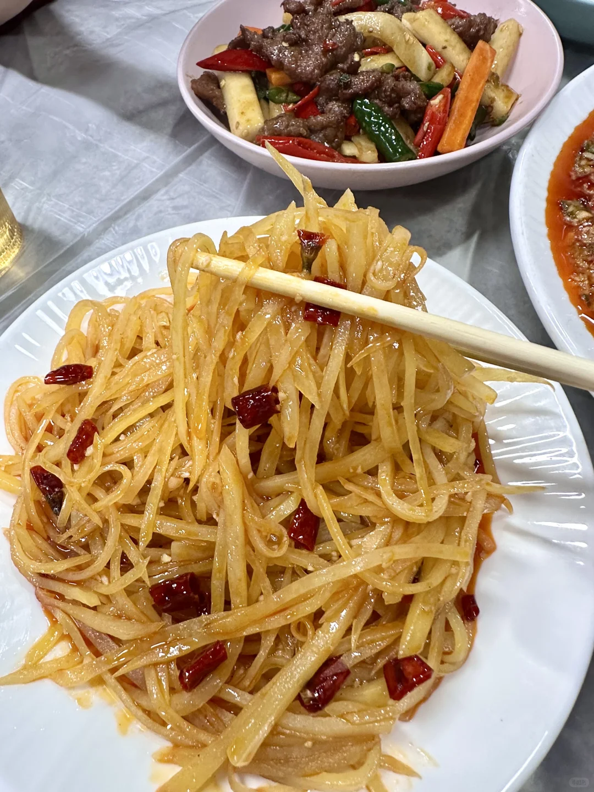

# 宜昌慕名而来的。。。。。太nb了卧槽。。。

- 作者: 酱酱橙
- 👍242 · 💬11 · ⭐137 · 图 9
- feed_id: 69df70b3000000001b001ff1

> [OCR] 预结单
111川菜大排档
桌号：大厅-1

数量  小计   优惠
口味基围虾    49     [?]
鲜椒嫩牛肉    58     [?]
炒腰肝        25     [?]
鱼香肉丝      25     [?]
鱼香肉丝（包含米饭）10     [?]

应付金额

> [OCR] [?]

> [OCR] system

> [OCR] [?]

> [OCR] [?]

> [OCR] Laziness

> [OCR] [?]

> [OCR] [?]

## 正文
藏在cbd巷子里的苍蝇馆子 比较难找
菜品就点这几样 都很经典！
超级下饭的那种！！
#宜昌[话题]# #宜昌吃喝玩乐[话题]# #宜昌同城[话题]# #本地人爱吃的店[话题]# #宜昌苍蝇馆子[话题]# #宜昌cbd美食[话题]##宜昌cbd小吃街[话题]#

---