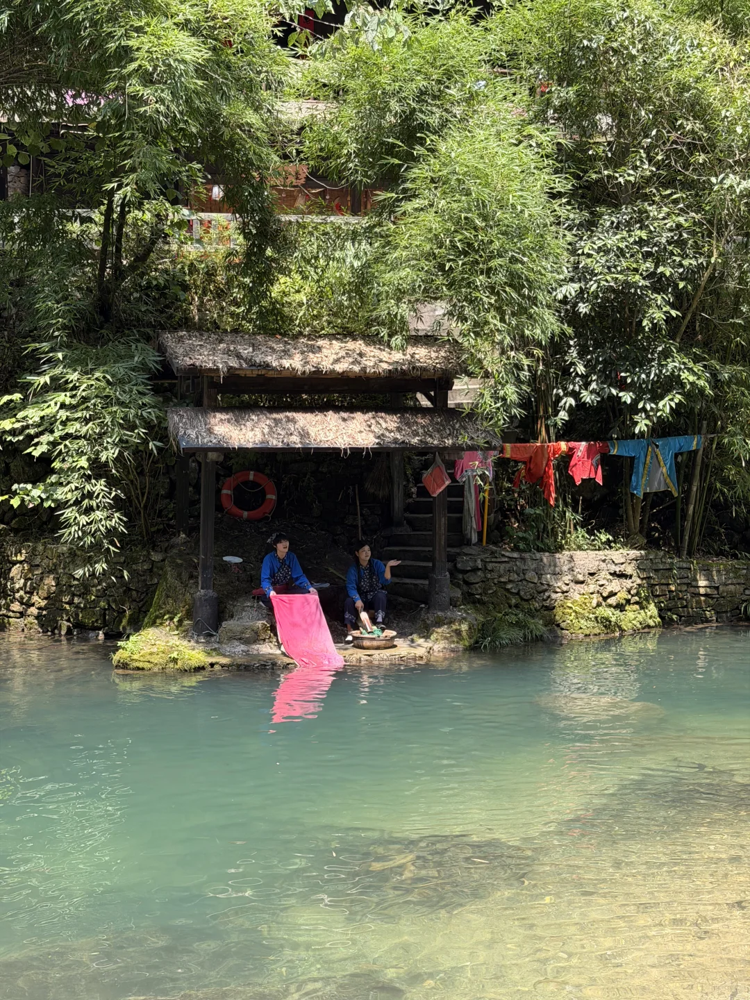
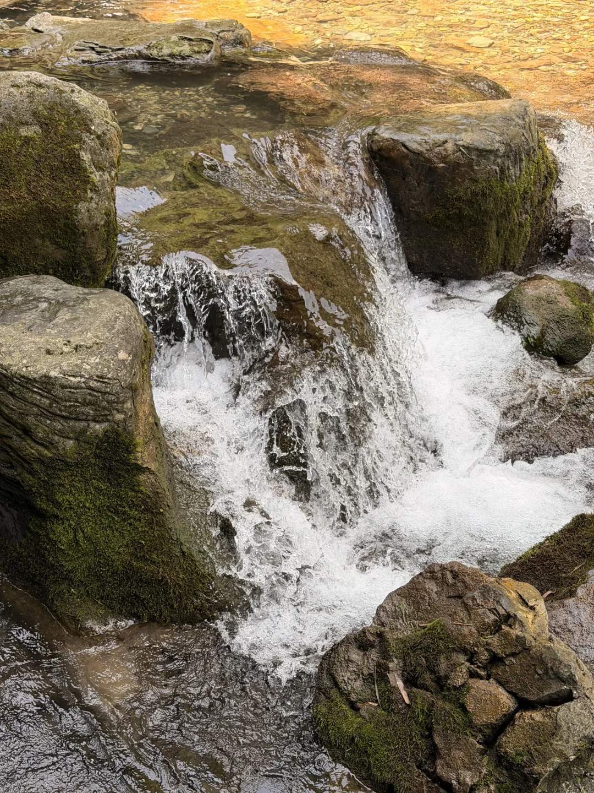
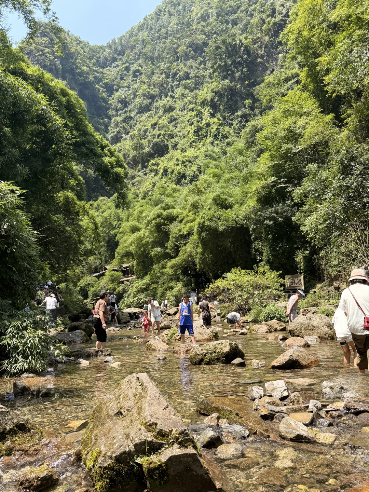
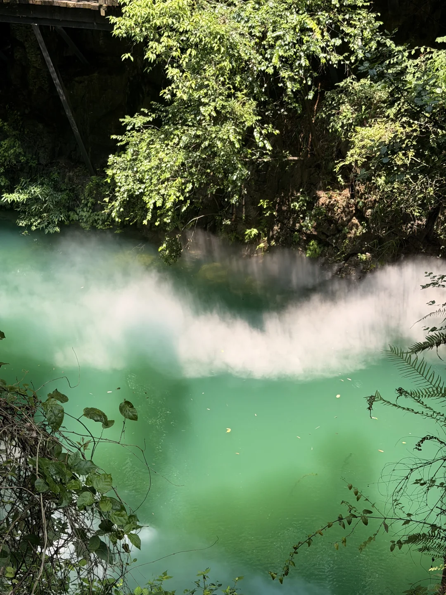
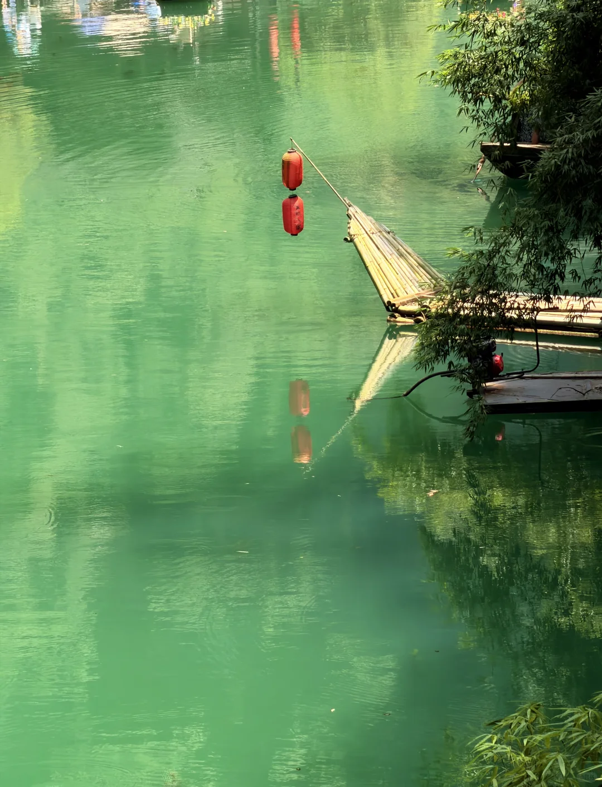
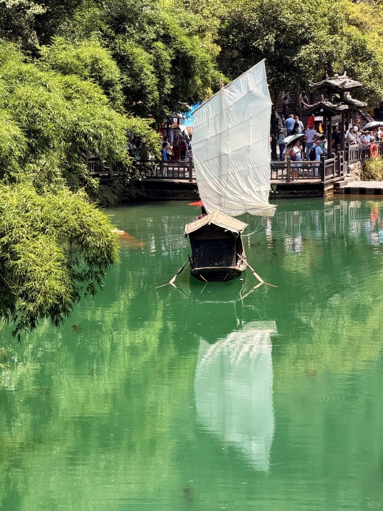
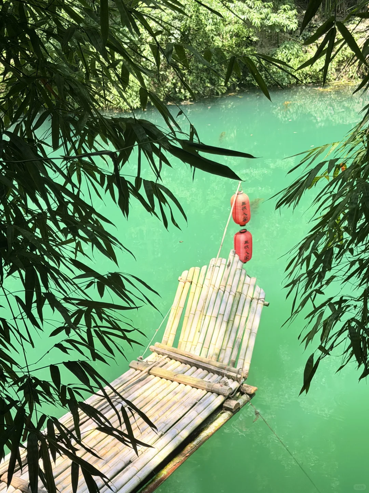

# 三峡人家血泪帖！！！！

- 作者: 小胖墩
- 👍239 · 💬112 · ⭐147 · 图 7
- feed_id: 6a607823000000001002a7a0

> [OCR] [?]

> [OCR] [?]

> [OCR] system

> [OCR] [?][?]

> [OCR] 三伏人家

## 正文
三峡人家玩完了家人们
真心劝所有普通人
怕热怕累星人
暑假期间千万不要
走巴王寨！！！！！
千万别坐景区扶梯！！！！
三十块钱三段电扶梯
纯纯交智商税！！！！！！！
超级短！！！超级不值得！！！！
（非常后悔之感觉自己是冤种）
我傻傻跟着常规路线走
巴王寨→龙津溪
开局直接暴击！！
巴王寨全程暴晒爬坡和楼梯
大太阳底下毫无遮挡
又热又累又耗体力
爬到一半整个人累炸了
完全没游玩心情！！！！！！
大热天的巴王寨其实可以不逛！！！
我觉得根本没必要！
真正舒服、值得玩的只有
龙津溪！！！！！！
可以玩水、踩溪水、抓鱼、寻宝
所以带！！！玩水抓鱼装备吧！！
喂喂小鱼 看看小猴子
带水就可以了！！！！！
上面有15块钱一位的简单自助餐
烤肠也是10块钱3根！！！！
水一般是3块一瓶！！！！#美在山水春色间[话题]# #青山绿水美景如画[话题]# #山清水秀好风光[话题]# #山水[话题]# #行走在山水间[话题]# #山水人间值得热爱[话题]# #三峡人家[话题]##武昌一日游[话题]#

---