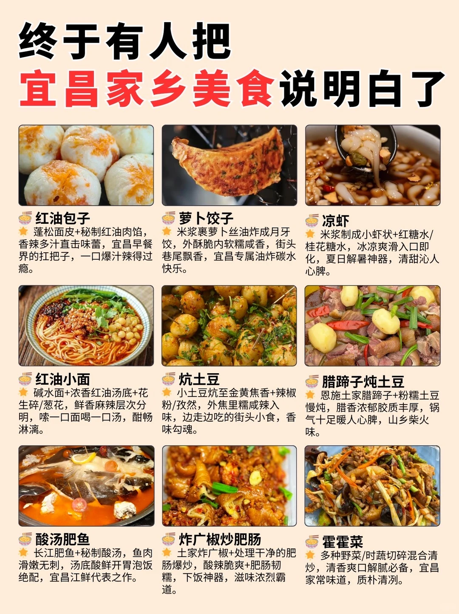
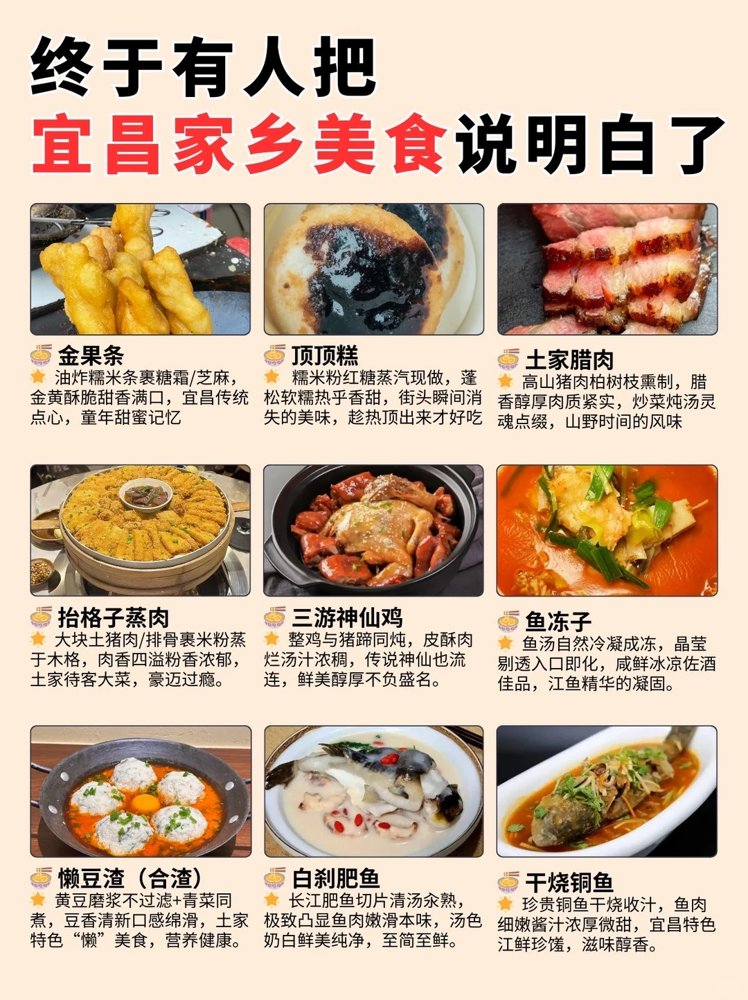
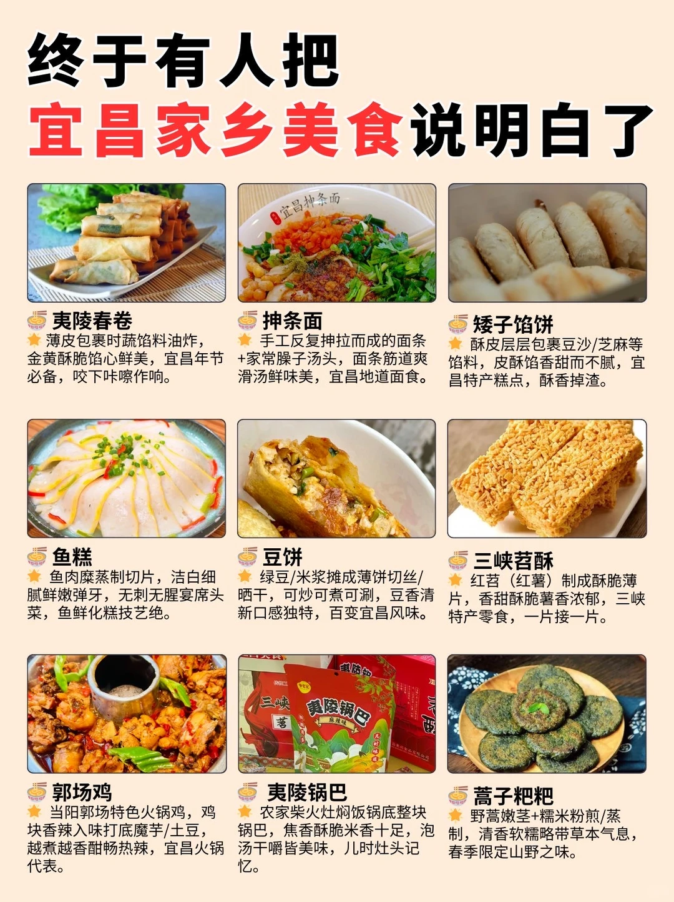

# 

- 作者: 芋泥啵啵冰
- 👍237 · 💬3 · ⭐217 · 图 3
- feed_id: 69c148f4000000001a0373f6

> [OCR] 终于有人把
宜昌家乡美食说明白了

红油包子
蓬松面皮+秘制红油肉馅，
香辣多汁直击味蕾，宜昌早餐
界的扛把子，一口爆汁辣得过瘾。

萝卜饺子
米浆裹萝卜丝油炸成月牙饺，
外酥脆内软糯咸香，街头巷尾飘香，
宜昌专属油炸碳水快乐。

凉虾
米浆制成小虾状+红糖水/
桂花糖水，冰凉爽滑入口即化，
夏日解暑神器，清甜沁人心脾。

红油小面
碱水面+浓香红油汤底+花生碎/葱花，
鲜香麻辣层次分明，嗦一口面喝一口汤，
酣畅淋漓。

炕土豆
小土豆炕至金黄焦香+辣椒粉/孜然，
外焦里糯咸辣入味，边走边吃的街头小食，
香味勾魂。

腊蹄子炖土豆
恩施土家腊蹄子+粉糯土豆慢炖，
腊香浓郁胶质丰厚，锅气十足暖人心脾，
山乡柴火味。

酸汤肥鱼
长江肥鱼+秘制酸汤，鱼肉滑嫩无刺，
汤底酸鲜开胃泡饭绝配，宜昌江鲜代表之作。

炸广椒炒肥肠
土家炸广椒+处理干净的肥肠爆炒，
酸辣脆爽+肥肠韧糯，下饭神器，
滋味浓烈霸道。

霍霍菜
多种野菜/时蔬切碎混合清炒，
清香爽口解腻必备，宜昌家常味道，
质朴清冽。

> [OCR] 终于有人把
宜昌家乡美食说明白了

金果条
油炸糯米条裹糖霜/芝麻，
金黄酥脆甜香满口，宜昌传统点心，童年甜蜜记忆

顶顶糕
糯米粉红糖蒸汽现做，蓬松软糯热乎香甜，街头瞬间消失的美味，趁热顶出来才好吃

土家腊肉
高山猪肉柏树枝熏制，腊香醇厚肉质紧实，炒菜炖汤灵魂点缀，山野时间的风味

抬格子蒸肉
大块土猪肉/排骨裹米粉蒸于木格，肉香四溢粉香浓郁，
土家待客大菜，豪迈过瘾。

三游神仙鸡
整鸡与猪蹄同炖，皮酥肉烂汤汁浓稠，传说神仙也流连，鲜美醇厚不负盛名。

鱼冻子
鱼汤自然冷凝成冻，晶莹剔透入口即化，咸鲜冰凉佐酒佳品，江鱼精华的凝固。

懒豆渣（合渣）
黄豆磨浆不过滤+青菜同煮，豆香清新口感绵滑，
土家特色“懒”美食，营养健康。

白剁肥鱼
长江肥鱼切片清汤氽熟，
极致凸显鱼肉嫩滑本味，汤色奶白鲜美纯净，至简至鲜。

干烧铜鱼
珍贵铜鱼干烧收汁，鱼肉细嫩酱汁浓厚微甜，
宜昌特色江鲜珍馐，滋味醇香。

> [OCR] 终于有人把
宜昌家乡美食说明白了

夷陵春卷
薄皮包裹时蔬馅料油炸，
金黄酥脆馅心鲜美，宜昌年节
必备，咬下咔嚓作响。

抻条面
手工反复抻拉而成的面条
+家常臊子汤头，面条筋道爽
滑汤鲜味美，宜昌地道面食。

矮子馅饼
酥皮层层包裹豆沙/芝麻等
馅料，皮酥馅香甜而不腻，宜
昌特产糕点，酥香掉渣。

鱼糕
鱼肉糜蒸制切片，洁白细
腻鲜嫩弹牙，无刺无腥宴席头
菜，鱼鲜化糕技艺绝。

豆饼
绿豆/米浆摊成薄饼切丝/
晒干，可炒可煮可涮，豆香清
新口感独特，百变宜昌风味。

三峡苕酥
红苕（红薯）制成酥脆薄
片，香甜酥脆薯香浓郁，三峡
特产零食，一片接一片。

郭场鸡
当阳郭场特色火锅鸡，鸡
块香辣入味打底魔芋/土豆，
越煮越香酣畅热辣，宜昌火锅
代表。

夷陵锅巴
农家柴火灶焖饭锅底整块
锅巴，焦香酥脆米香十足，泡
汤干嚼皆美味，儿时灶头记
忆。

蒿子粑粑
野蒿嫩茎+糯米粉煎/蒸
制，清香软糯略带草本气息，
春季限定山野之味。

## 正文
来宜昌你吃过这些特色美食吗#城市特色美食[话题]# #本地人带你吃[话题]#

---