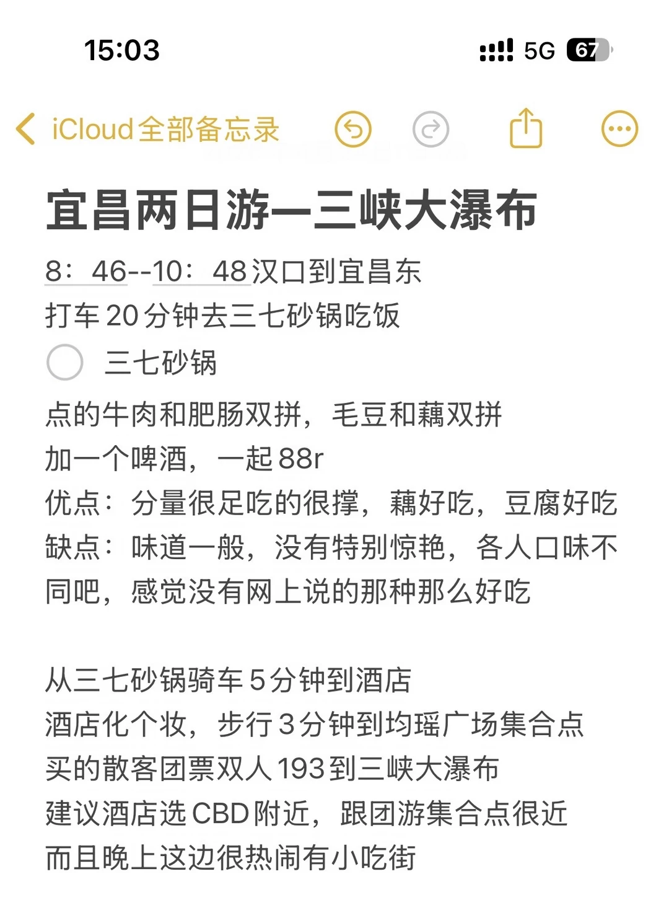
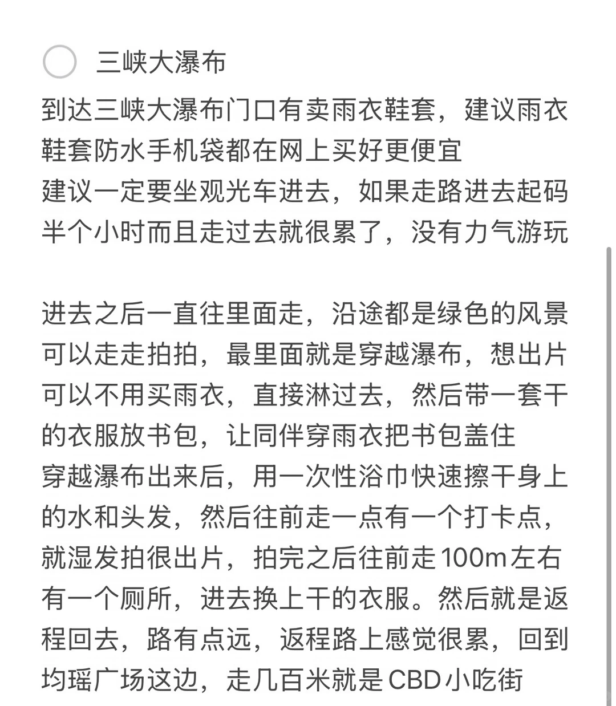
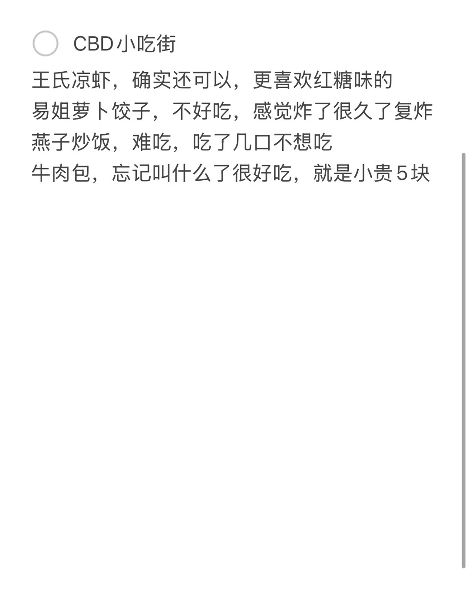
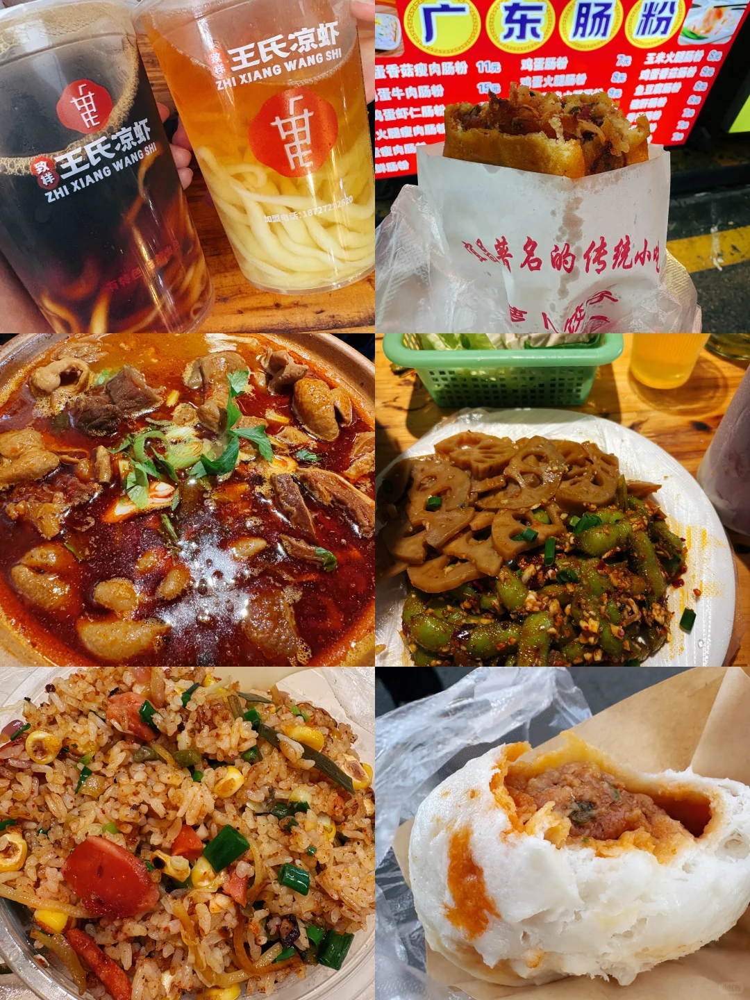

# 武汉-宜昌旅游超详细攻略，第一天三峡大瀑布

- 作者: 冲冲冲呀
- 👍235 · 💬30 · ⭐198 · 图 4
- feed_id: 69eb17d60000000012012808

> [OCR] 15:03
iCloud 全部备忘录

宜昌两日游—三峡大瀑布

8：46--10：48 汉口到宜昌东
打车 20 分钟去三七砂锅吃饭

三七砂锅
点的牛肉和肥肠双拼，毛豆和藕双拼加一个啤酒，一起 88r
优点：分量很足吃的很撑，藕好吃，豆腐好吃
缺点：味道一般，没有特别惊艳，各人口味不同吧，感觉没有网上说的那种那么好吃

从三七砂锅骑车5分钟到酒店
酒店化个妆，步行3分钟到均瑶广场集合点
买的散客团票双人 193 到三峡大瀑布
建议酒店选 CBD 附近，跟团游集合点很近
而且晚上这边很热闹有小吃街

> [OCR] 三峡大瀑布

到达三峡大瀑布门口有卖雨衣鞋套，建议雨衣
鞋套防水手机袋都在网上买好更便宜
建议一定要坐观光车进去，如果走路进去起码
半个小时而且走过去就很累了，没有力气游玩

进去之后一直往里面走，沿途都是绿色的风景
可以走走拍拍，最里面就是穿越瀑布，想出片
可以不用买雨衣，直接淋过去，然后带一套干
的衣服放书包，让同伴穿雨衣把书包盖住
穿越瀑布出来后，用一次性浴巾快速擦干身上的水和头发，
然后往前走一点有一个打卡点，
就湿发拍很出片，拍完之后往前走100m左右
有一个厕所，进去换上干的衣服。然后就是返程回去，路有点远，返程路上感觉很累，回到
均瑶广场这边，走几百米就是CBD小吃街

> [OCR] CBD小吃街

王氏凉虾，确实还可以，更喜欢红糖味的
易姐萝卜饺子，不好吃，感觉炸了很久了复炸
燕子炒饭，难吃，吃了几口不想吃
牛肉包，忘记叫什么了很好吃，就是小贵5块

> [OCR] 王氏凉虾
ZHI XIANG WANG SHI
加盟电话：18727212600

广东肠粉
蛋香薯瘦肉肠粉 11元
鸡蛋肠粉
玉米牛肉肠粉
鱼豆肠粉
鸡丝肠粉
火腿瘦肉肠粉
玉米文蛤肠粉
鱼豆文蛤肠粉

著名的小吃

红烧牛腩
[?]名的传统小吃

## 正文
第二天在三峡人家的旅游攻略，请看主页的宜昌旅游第二天笔记。#一万种旅行howto[话题]# #howto反向旅游[话题]# #宜昌旅游[话题]# #旅游攻略[话题]# #三峡大瀑布[话题]#

---