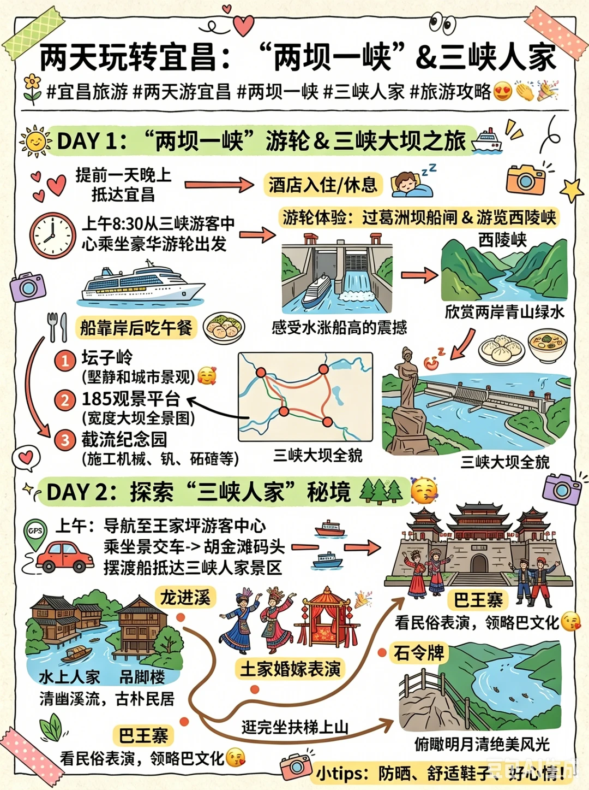

# 

- 作者: 小红薯64AB2733
- 👍202 · 💬16 · ⭐306 · 图 1
- feed_id: 6a33aebe00000000070208ae

> [OCR] 两天玩转宜昌：“两坝一峡”&三峡人家

#宜昌旅游 #两天游宜昌 #两坝一峡 #三峡人家 #旅游攻略😍👏🎉

DAY 1: “两坝一峡”游轮&三峡大坝之旅ruise

提前一天晚上抵达宜昌
上午8:30从三峡游客中心乘坐豪华游轮出发
船靠岸后吃午餐
坛子岭(壑静和城市景观)
185观景平台(宽度大坝全景图)
截流纪念园(施工机械、钒、砾碴等)

游轮体验：过葛洲坝船闸&游览西陵峡
西陵峡
欣赏两岸青山绿水

感受水涨船高的震撼

三峡大坝全貌

三峡大坝全旅

DAY 2: 探索“三峡人家”秘境🌳😊

上午：导航至王家坪游客中心
乘坐景交车->胡金滩码头摆渡船抵达三峡人家景区

龙进溪
水上人家吊脚楼
清幽溪流，古朴民居
土家婚嫁表演
巴王寨看民俗表演，领略巴文化😄
石令牌
逛完坐扶梯上山
俯瞰明月清绝美风光

小tips: 防晒、舒适鞋子、好心情！

## 正文
两天玩转宜昌！两坝一峡+ 三峡人家攻略来啦😍
宝子们，要是你第一次来宜昌，只有两天时间，那 “两坝一峡” 和三峡人家可一定不能错过👏！今天就给大家安排上超正确的游玩顺序。
如果时间充裕，建议提前一天晚上到宜昌。第二天早上直接冲三峡游客中心，八点半豪华游轮准时开航🚢。大概半小时就能过葛洲坝船闸，体验一把水涨船高的震撼，这感觉太绝啦！接着沉浸式游览西陵峡，两岸青山连绵，江水碧绿，每一步都是不一样的风景，美到让人窒息🥰。
船靠岸后先去干饭，吃饱了才有劲继续玩。然后前往三峡大坝，按坛子岭、185 观景平台、截流纪念园的顺序，全方位欣赏大坝的雄伟壮观。
第二天上午去三峡人家，直接导航王家坪游客中心。先坐景交车到胡金滩码头，再坐摆渡船去龙进溪，在这里能看到水上人家、吊脚楼，还有超有意思的土家婚嫁表演🎉。逛完坐扶梯上山，到巴王寨看民俗表演，再去石令牌，站在高处俯瞰明月湾，景色美到爆！
玩完这一趟，就可以结束愉快的宜昌之旅，回家啦🥳。要是你计划来宜昌旅游，还没规划好路线，就在评论区留下出行人数和时间，我来帮你量身定制路线哦😘。
#宜昌旅游[话题]# #两天游宜昌[话题]# #两坝一峡[话题]# #三峡人家[话题]# #旅游攻略[话题]#

---