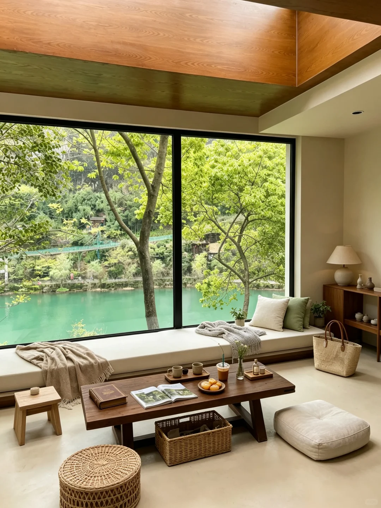
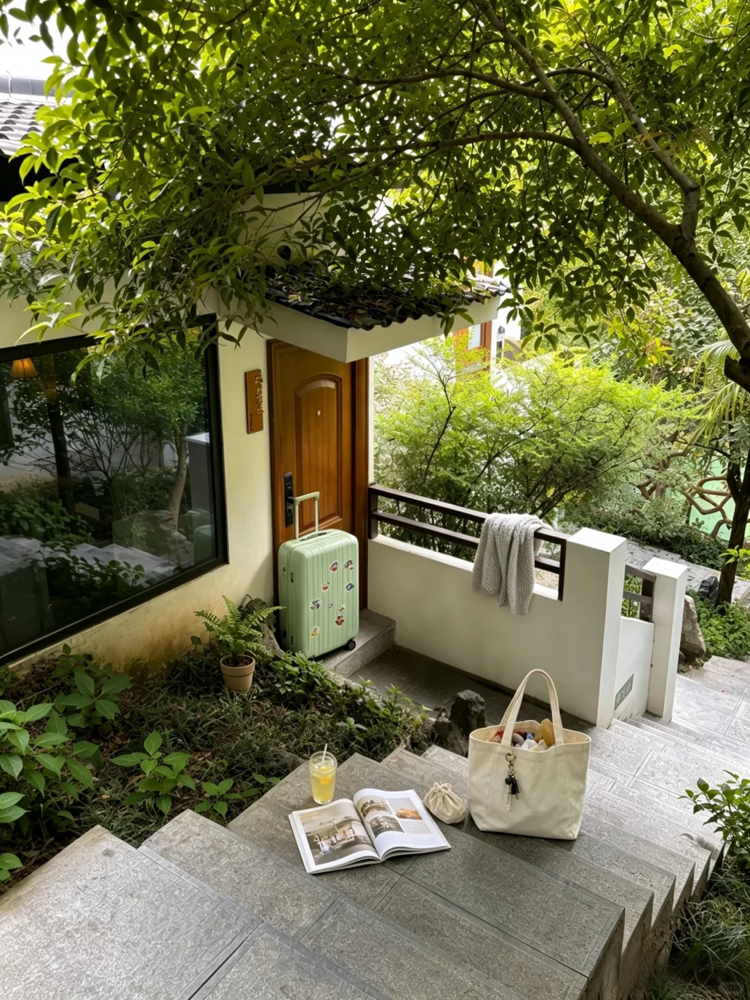
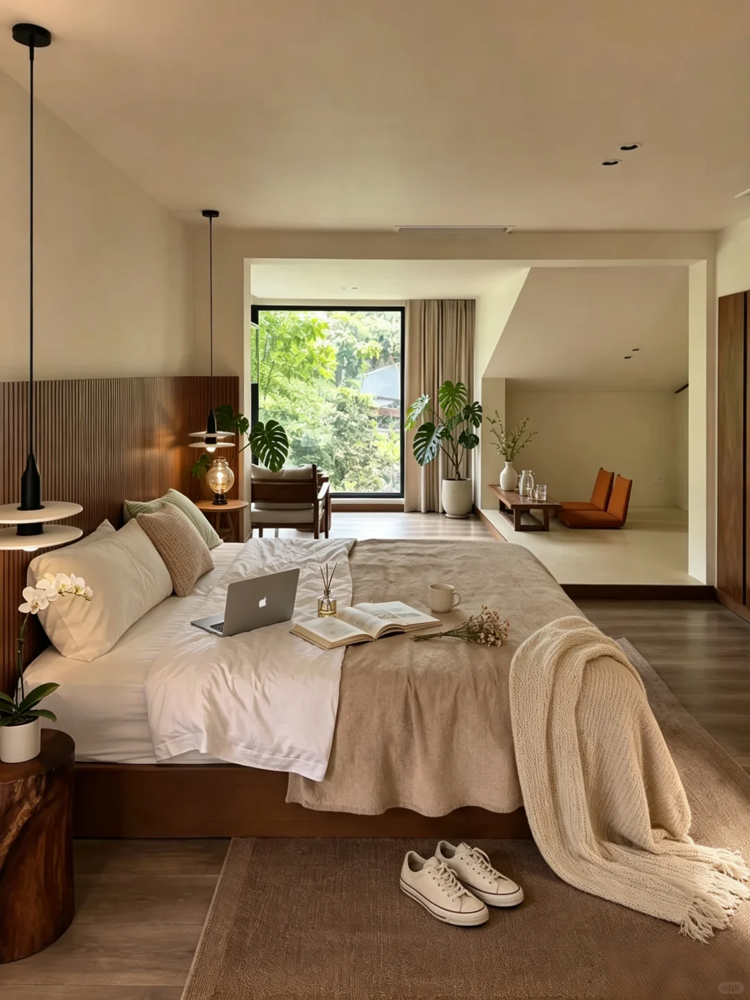
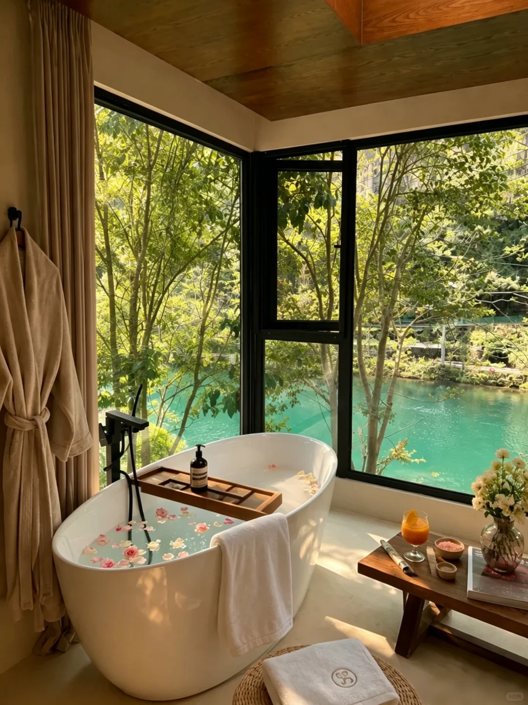
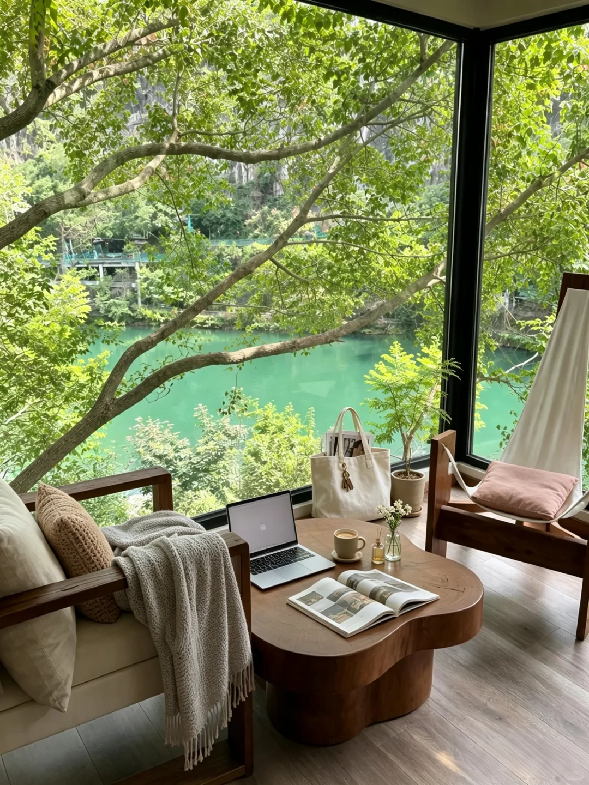
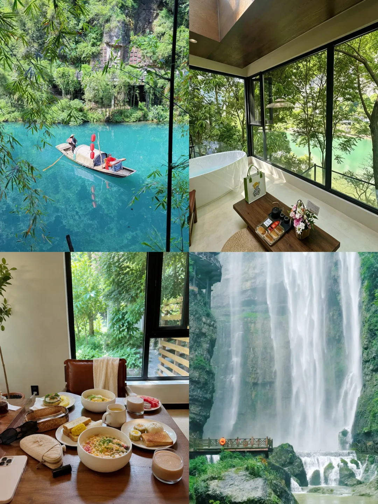

# 宜昌三峡！200💰俩人躺看青山绿水！

- 作者: 吃一个小团子
- 👍193 · 💬42 · ⭐103 · 图 6
- feed_id: 6a5899570000000013024ba0

> [OCR] [?]

> [OCR] [?]

> [OCR] [?]

> [OCR] Apple

> [OCR] [?]

## 正文
听我的！周末来宜昌别再挤市区酒店了！ 我随手盲选的这家小院，直接给我带来了本周最大的惊喜😭
	
本来只是想找个清静地方躺平，结果一开门就被这扇窗拿捏了！ 满眼的青山绿水，下过雨之后的绿更是清透得像加了滤镜，连空气都带着草木的味道，适合暑假来，炒鸡清新凉快！
	
而且！这里居然可以带毛孩子！ 我家狗子在小院里撒欢，我在窗边泡澡看风景，这才是周末该有的样子啊！ 设施也很贴心，浴缸、空调都很给力，洗漱用品也不是敷衍的那种，细节感拉满。 离市区不远，对面就是悬崖餐厅，出行也很方便
	
去周边玩也很省心，白马洞、三游洞、三峡蹦极都在旁边
	
#G348[话题]##三峡人家[话题]##三峡蹦极[话题]##宜昌酒店[话题]##宜昌民宿[话题]##宜昌旅游[话题]# #小众避世酒店[话题]# #住进风景里太美了[话题]# #住进了风景里[话题]# #宜昌旅游攻略[话题]#

---