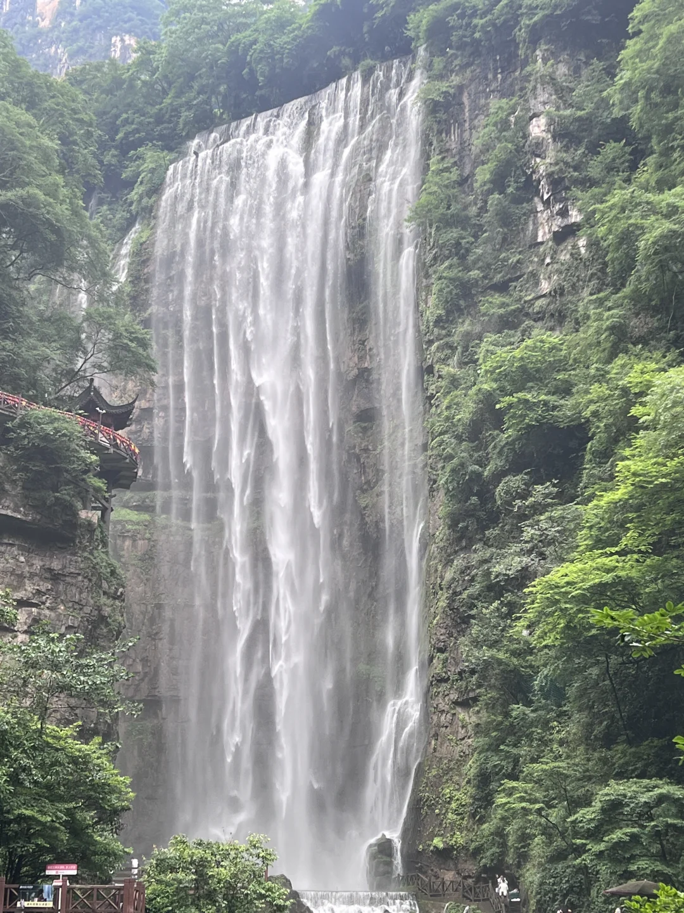
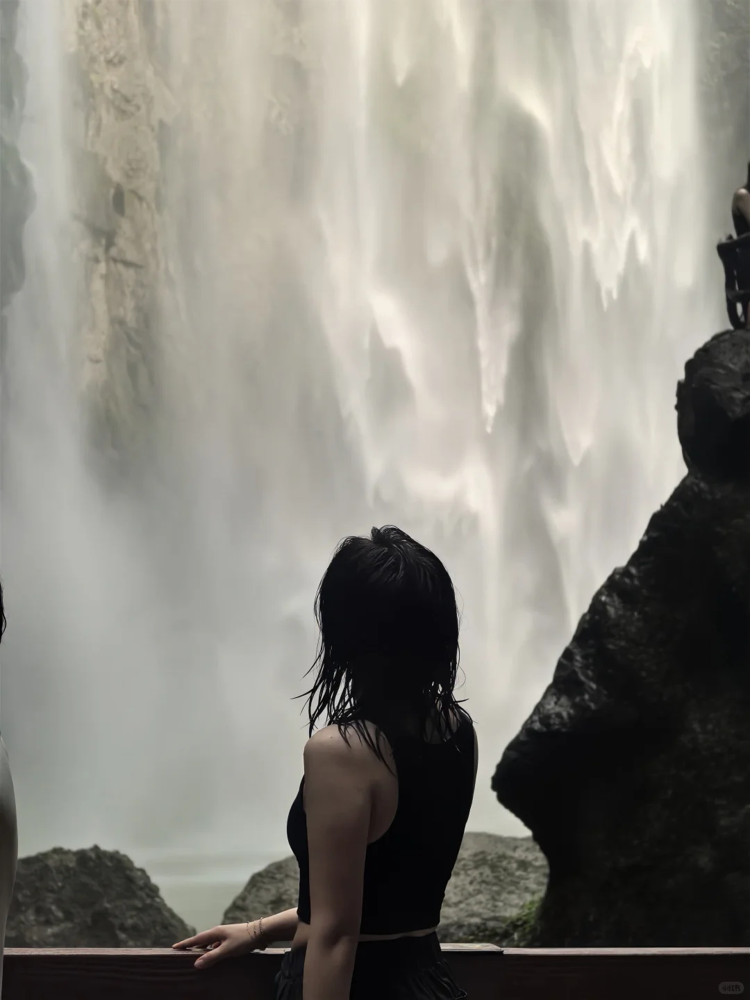
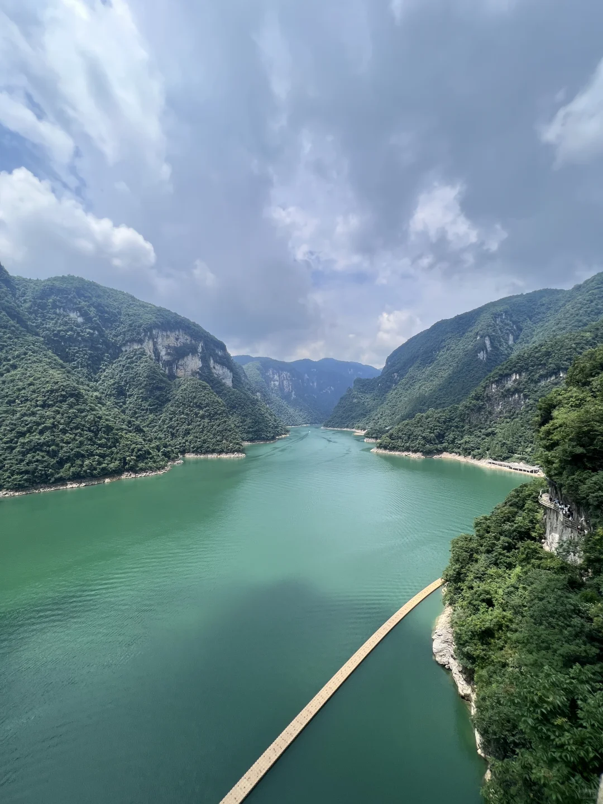
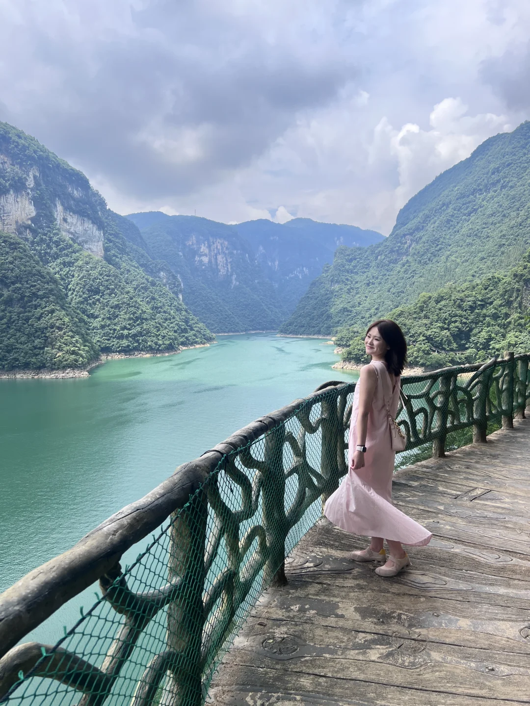
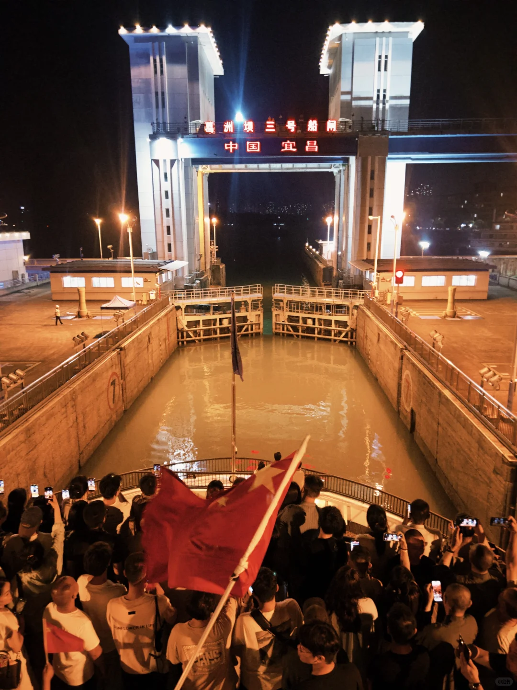
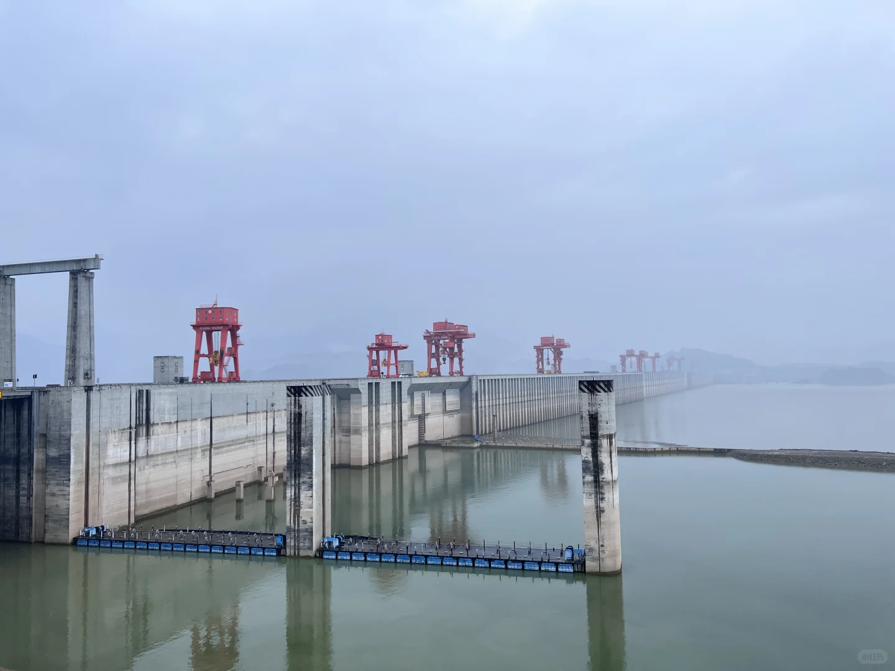

# 宜昌3天2晚旅行记录

- 作者: 添加一个名字
- 👍190 · 💬35 · ⭐297 · 图 6
- feed_id: 6a3f73e2000000000701352f

> [OCR] [?]

> [OCR] OUTS

> [OCR] [?]

> [OCR] [?]

> [OCR] 葛洲坝三号船闸
中国宜昌

> [OCR] 小三峡

## 正文
终于把宜昌的山水和夜景都打卡圆满了！
自然山水+大国工程+长江夜景全部体验到
🗓️Day1 抵达宜昌｜清凉峡谷初体验
中午抵达宜昌，吃饱喝足正式开启旅程✨
下午直奔【三峡大瀑布】
真的太适合夏天！！
102米超大瀑布扑面而来
水雾凉凉的超级治愈💦
一定要体验穿过水帘洞的快乐
沉浸式被山水包围，随手拍都是治愈系风景
晚上就在市区闲逛休整，养足精神迎接第二天的行程～
🗓️Day2 诗画山水｜绝美清江+长江夜游
全天留给「八百里清江美如画」的【清江画廊】
坐船漫游清江两岸，青山碧水连绵不绝
山水清幽、空气清新，每一幕都像水墨画卷🌿
远离城市喧嚣，氛围感直接拉满
重头戏是晚上的【长江夜游游轮】🚢
傍晚登船，吹着温柔江风看宜昌夜景渐亮
最震撼的就是葛洲坝水涨船高全过程！
亲眼看见轮船升降过闸
真切感受到水利工程的震撼与浪漫
夜景、江风、灯光，氛围感直接封神
🗓️Day3 大国重器｜三峡大坝圆满收官
上午打车直达三峡大坝游客换乘中心
开启最后一站硬核旅程🏗️
游玩顺序超顺畅不绕路：
坛子岭→185观景台→三峡工程博物馆→截流纪念园
登顶坛子岭俯瞰大坝全景、五级船闸
185平台平视坝体，近距离感受磅礴气势
重点！三峡工程博物馆和截流纪念园紧挨在一起
可以一次性逛完，了解三峡建设历史，拍照也很出片
心满意足返程🔚
✨三天两晚总结
一天峡谷治愈、一天山水仙境、一天大国工程
自然风光+人文底蕴+绝美夜景全部集齐
#宜昌三天两晚[话题]# #三峡大瀑布[话题]# #清江画廊[话题]# #宜昌长江夜游[话题]# #葛洲坝夜游[话题]# #三峡大坝攻略[话题]# #宜昌自由行[话题]# #湖北旅游[话题]# #周末短途旅行[话题]#

---