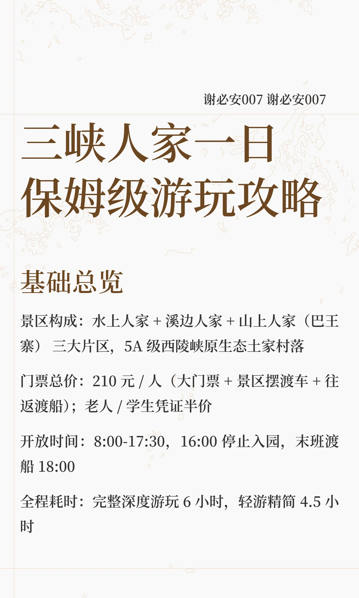
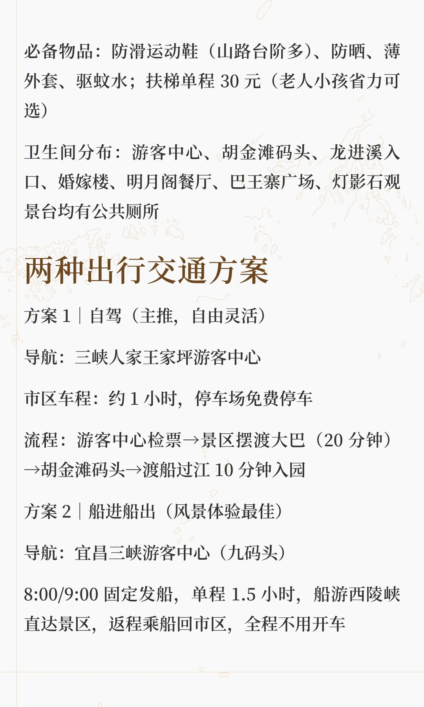
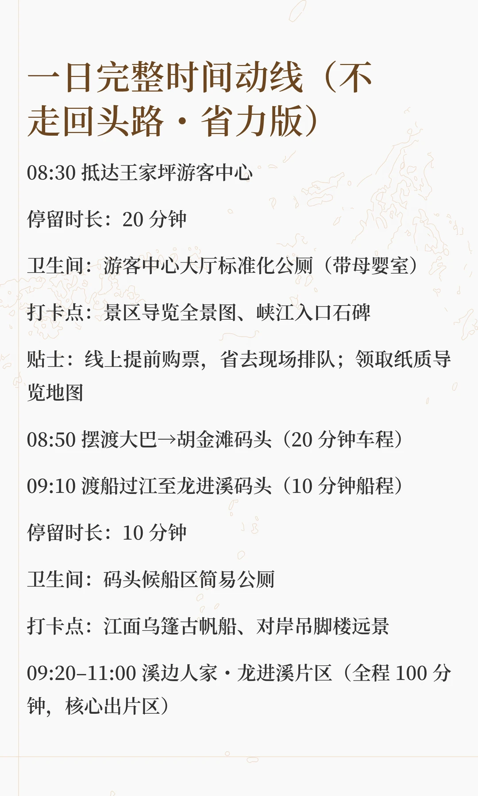
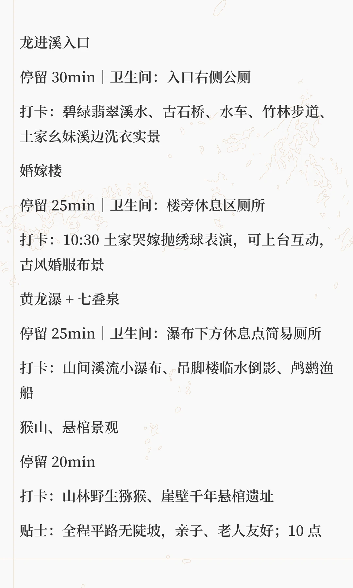
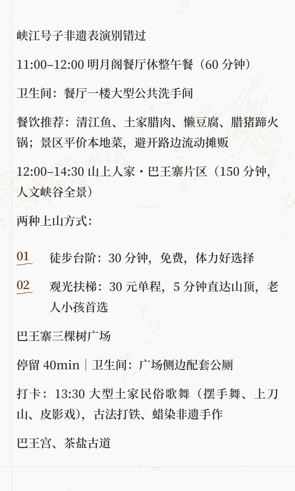
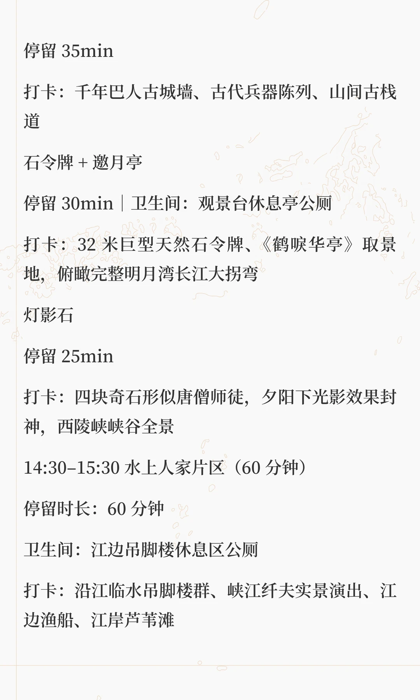
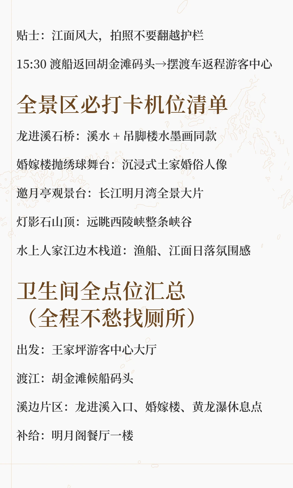
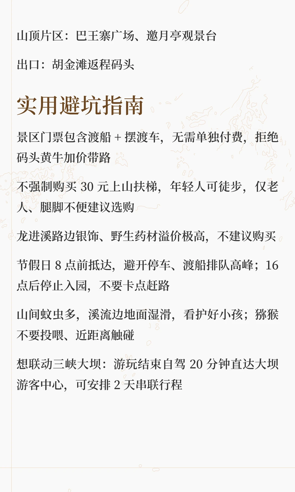

# 三峡人家一日保姆级游玩攻略

- 作者: 宜昌阿峡
- 👍188 · 💬44 · ⭐300 · 图 8
- feed_id: 6a3ce9a2000000002200b66d

> [OCR] 谢必安007 谢必安007
三峡人家一日
保姆级游玩攻略

基础总览

景区构成：水上人家 + 溪边人家 + 山上人家（巴王寨）三大片区，5A 级西陵峡原生态土家村落
门票总价：210 元 / 人 (大门票 + 景区摆渡车 + 往返渡船)；老人/学生凭证半价

开放时间：8:00-17:30，16:00 停止入园，末班渡
船 18:00

全程耗时：完整深度游玩 6 小时，轻游精简 4.5 小时

> [OCR] 必备物品：防滑运动鞋（山路台阶多）、防晒、薄外套、驱蚊水；扶梯单程 30 元（老人小孩省力可选）

卫生间分布：游客中心、胡金滩码头、龙进溪入口、婚嫁楼、明月阁餐厅、巴王寨广场、灯影石观景台均有公共厕所

两种出行交通方案
方案1 | 自驾（主推，自由灵活）
导航：三峡人家王家坪游客中心
市区车程：约 1 小时，停车场免费停车
流程：游客中心检票→景区摆渡大巴（20 分钟）→胡金滩码头→渡船过江 10 分钟入园

方案2 | 船进船出（风景体验最佳）
导航：宜昌三峡游客中心（九码头）
8:00/9:00 固定发船，单程 1.5 小时，船游西陵峡直达景区，返程乘船回市区，全程不用开车

> [OCR] 一日完整时间动线（不走回头路·省力版）

08:30 抵达王家坪游客中心

停留时长：20 分钟

卫生间：游客中心大厅标准化公厕（带母婴室）

打卡点：景区导览全景图、峡江入口石碑

贴士：线上提前购票，省去现场排队；领取纸质导览地图

08:50 摆渡大巴→胡金滩码头（20 分钟车程）

09:10 渡船过江至龙进溪码头（10 分钟船程）

停留时长：10 分钟

卫生间：码头候船区简易公厕

打卡点：江面乌篷古帆船、对岸吊脚楼远景

09:20-11:00 溪边人家·龙进溪片区（全程 100 分钟，核心出片区）

> [OCR] 龙进溪入口

停留 30min | 卫生间：入口右侧公厕

打卡：碧绿翡翠溪水、古石桥、水车、竹林步道、土家幺妹溪边洗衣实景

婚嫁楼

停留 25min | 卫生间：楼旁休息区厕所

打卡：10:30 土家哭嫁抛绣球表演，可上台互动，古风婚服布景

黄龙瀑 + 七叠泉

停留 25min | 卫生间：瀑布下方休息点简易厕所

打卡：山间溪流小瀑布、吊脚楼临水倒影、鸬鹚渔船

猴山、悬棺景观

停留 20min

打卡：山林野生猕猴、崖壁千年悬棺遗址

贴士：全程平路无陡坡，亲子、老人友好；10点

> [OCR] 峡江号子非遗表演别错过

11:00-12:00 明月阁餐厅休整午餐（60分钟）
卫生间：餐厅一楼大型公共洗手间
餐饮推荐：清江鱼、土家腊肉、懒豆腐、腊猪蹄火锅；景区平价本地菜，避开路边流动摊贩

12:00-14:30 山上人家·巴王寨片区（150分钟，人文峡谷全景）

两种上山方式：
01 徒步台阶：30分钟，免费，体力好选择
02 观光扶梯：30元单程，5分钟直达山顶，老人小孩首选

巴王寨三棵树广场
停留 40min | 卫生间：广场侧边配套公厕
打卡：13:30 大型土家民俗歌舞（摆手舞、上刀山、皮影戏），古法打铁、蜡染非遗手作

巴王宫、茶盐古道

> [OCR] 停留 35min

打卡：千年巴人古城墙、古代兵器陈列、山间古栈道

石令牌 + 邀月亭

停留 30min | 卫生间：观景台休息亭公厕

打卡：32米巨型天然石令牌、《鹤唳华亭》取景地，俯瞰完整明月湾长江大拐弯

灯影石

停留 25min

打卡：四块奇石形似唐僧师徒，夕阳下光影效果封神，西陵峡峡谷全景

14:30-15:30 水上人家片区（60分钟）

停留时长：60 分钟

卫生间：江边吊脚楼休息区公厕

打卡：沿江临水吊脚楼群、峡江纤夫实景演出、江边渔船、江岸芦苇滩

> [OCR] 贴士：江面风大，拍照不要翻越护栏

15:30 渡船返回胡金滩码头→摆渡车返程游客中心

全景区必打卡机位清单
龙进溪石桥：溪水+吊脚楼水墨画同款
婚嫁楼抛绣球舞台：沉浸式土家婚俗人像
邀月亭观景台：长江明月湾全景大片
灯影石山顶：远眺西陵峡整条峡谷
水上人家江边木栈道：渔船、江面日落氛围感

卫生间全点位汇总
（全程不愁找厕所）
出发：王家坪游客中心大厅
渡江：胡金滩候船码头
溪边片区：龙进溪入口、婚嫁楼、黄龙瀑休息点
补给：明月阁餐厅一楼

> [OCR] 山顶片区：巴王寨广场、邀月亭观景台

出口：胡金滩返程码头

实用避坑指南

景区门票包含渡船 + 摆渡车，无需单独付费，拒绝码头黄牛加价带路

不强制购买 30 元上山扶梯，年轻人可徒步，仅老人、腿脚不便建议选购

龙进溪路边银饰、野生药材溢价极高，不建议购买

节假日 8 点前抵达，避开停车、渡船排队高峰；16
点后停止入园，不要卡点赶路

山间蚊虫多，溪流边地面湿滑，看护好小孩；猕猴
不要投喂、近距离触碰

想联动三峡大坝：游玩结束自驾 20 分钟直达大坝游客中心，可安排 2 天串联行程

## 正文
#旅游攻略[话题]# #游玩攻略[话题]# #本地人带你玩[话题]# #攻略[话题]# #本地人做的攻略[话题]# #人生一串大赏[话题]# #湖北周边游[话题]##宜昌旅游攻略[话题]##三峡人家[话题]# #奕起解锁黄金假日[话题]#

---