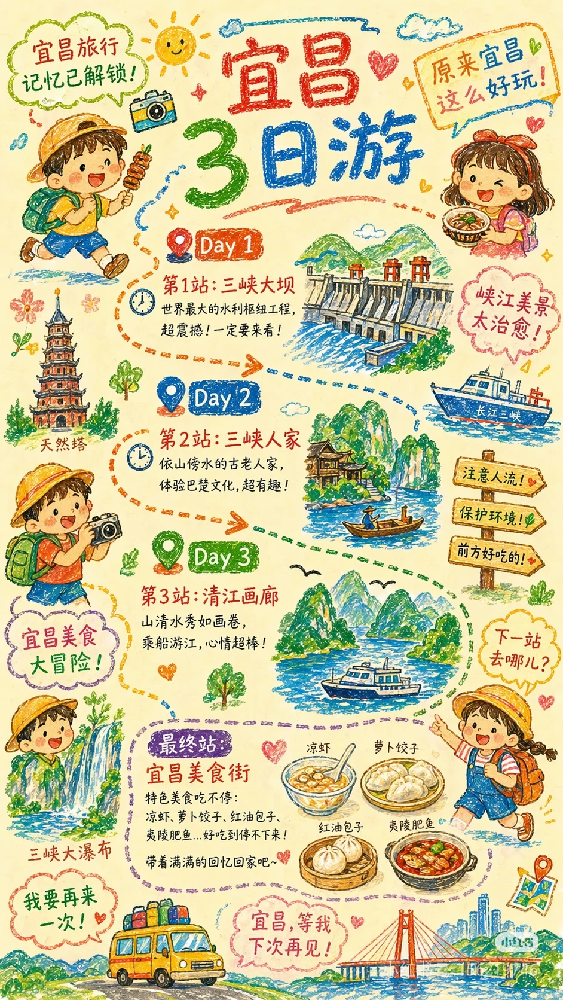

# 

- 作者: 初爱雪
- 👍181 · 💬5 · ⭐136 · 图 1
- feed_id: 6a2105830000000008024a6f

> [OCR] 宜昌旅行
记忆已解锁!
宜昌
3日游
原来宜昌
这么好玩!

Day 1
第1站:三峡大坝
世界最大的水利枢纽工程,
超震撼!一定要来看!
峡江美景太治愈!

天然塔

Day 2
第2站:三峡人家
依山傍水的古老人家,
体验巴楚文化,超有趣!

长江三峡

注意人流!
保护环境!
前方好吃的!

宜昌美食大冒险!

Day 3
第3站:清江画廊
山清水秀如画卷,
乘船游江,心情超棒!

下一站去哪儿?

最终站:
宜昌美食街
特色美食吃不停:
凉虾、萝卜饺子、红油包子、
夷陵肥鱼...好吃到停不下来!
带着满满的回忆回家吧~

我要再来一次!
宜昌,等我下次再见!

## 正文
宜昌旅游攻略

---