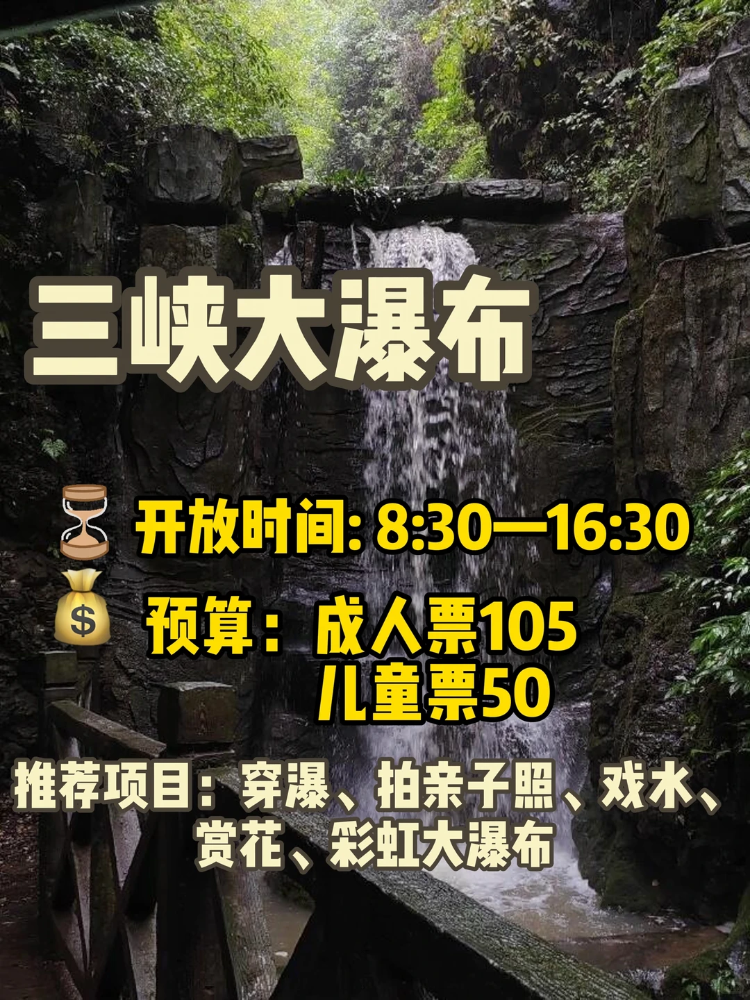
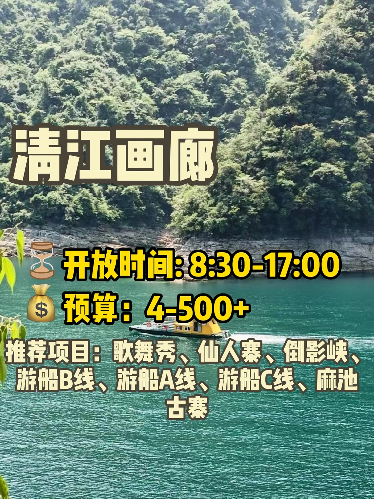
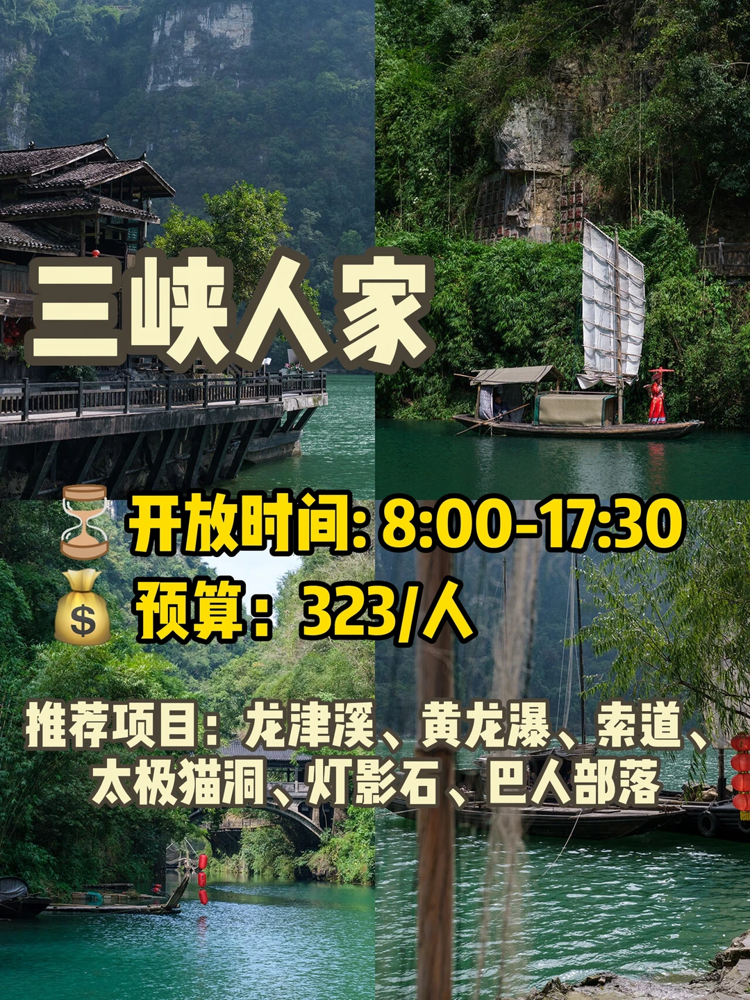
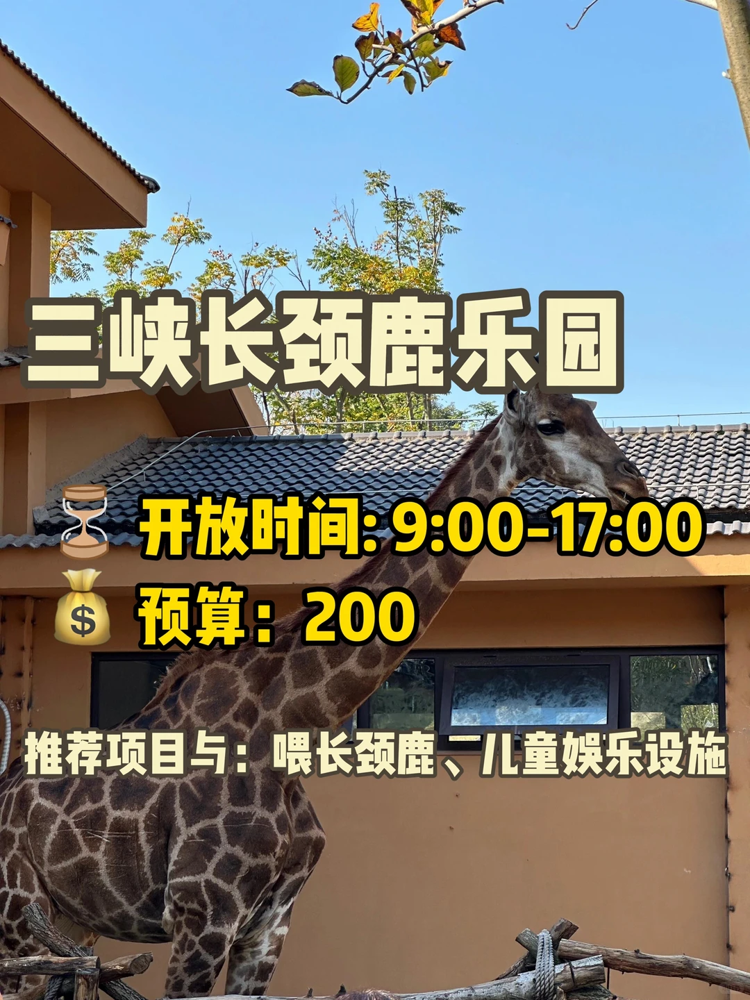
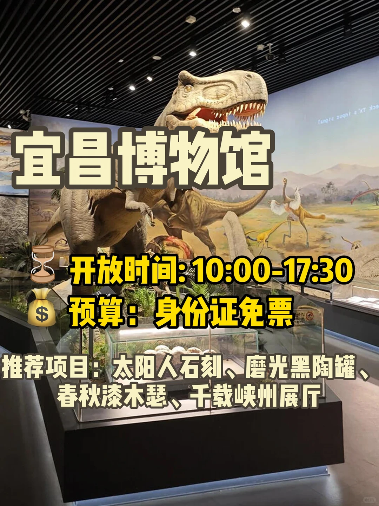
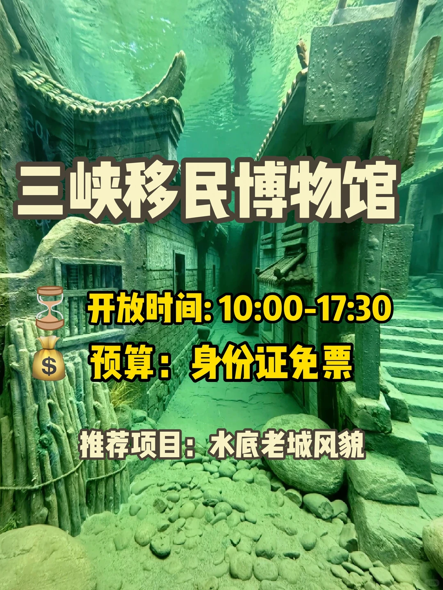

# 带娃宜昌游玩攻略！✅

- 作者: l 夷陵人文刘老师
- 👍175 · 💬4 · ⭐90 · 图 11
- feed_id: 6808c576000000001d03af86

> [OCR] 宜昌五一假期
10个
带娃好去处
把爱留在清江画廊
LOVE YOU
SANXIA ROMANCE PARK
三峡长颈鹿乐园
宜昌博物馆

> [OCR] 儿童公园

开放时间: 全天
预算：300+

推荐项目：旋转木马、儿童跳楼机、小火车、摩天轮、碰碰车

> [OCR] 三峡大瀑布

开放时间: 8:30—16:30
预算：成人票105
儿童票50

推荐项目：穿瀑、拍亲子照、戏水、
赏花、彩虹大瀑布

> [OCR] 三峡大坝

开放时间: 8:00—17:00
预算：车票35

推荐项目：踏青赏花、坛子岭、
185观景平台、高峡平湖游船

> [OCR] 清江画廊

开放时间: 8:30-17:00
预算: 4-500+

推荐项目：歌舞秀、仙人寨、倒影峡、游船B线、游船A线、游船C线、麻池古寨

> [OCR] 三峡人家

开放时间: 8:00-17:30
预算：323/人

推荐项目：龙津溪、黄龙瀑、索道、
太极猫洞、灯影石、巴人部落

> [OCR] 三峡长颈鹿乐园
开放时间: 9:00-17:00
预算：200
推荐项目与：喂长颈鹿、儿童娱乐设施

> [OCR] 三峡千古情

开放时间: 10:00-17:30
预算: 198/人（贵宾票）

推荐项目：情歌舞剧、穿越快闪、绣球招婿、郑和下西洋主题馆

> [OCR] 宜昌博物馆
开放时间:10:00-17:30
预算：身份证免票
推荐项目：太阳人石刻、磨光黑陶罐、春秋漆木瑟、千载峡州展厅

> [OCR] 卷桥河湿地公园

开放时间: 全天
预算：无需门票

推荐项目：散步、喂野鸭子、露营野餐、草地运动

> [OCR] 三峡移民博物馆

开放时间: 10:00-17:30
预算：身份证免票
推荐项目：水底老城风貌

## 正文
#适合亲子旅游的地方[话题]# #带娃去哪儿玩[话题]# #一定要带孩子去旅游[话题]# #小众遛娃地[话题]# #遛娃好去处[话题]# #游玩攻略[话题]#

---