# 三峡人家船进船出路线🍃美到失语

- 作者: 暴龙今天又出门了
- 👍159 · 💬28 · ⭐142 · 图 11
- feed_id: 6a6b38340000000028008db5

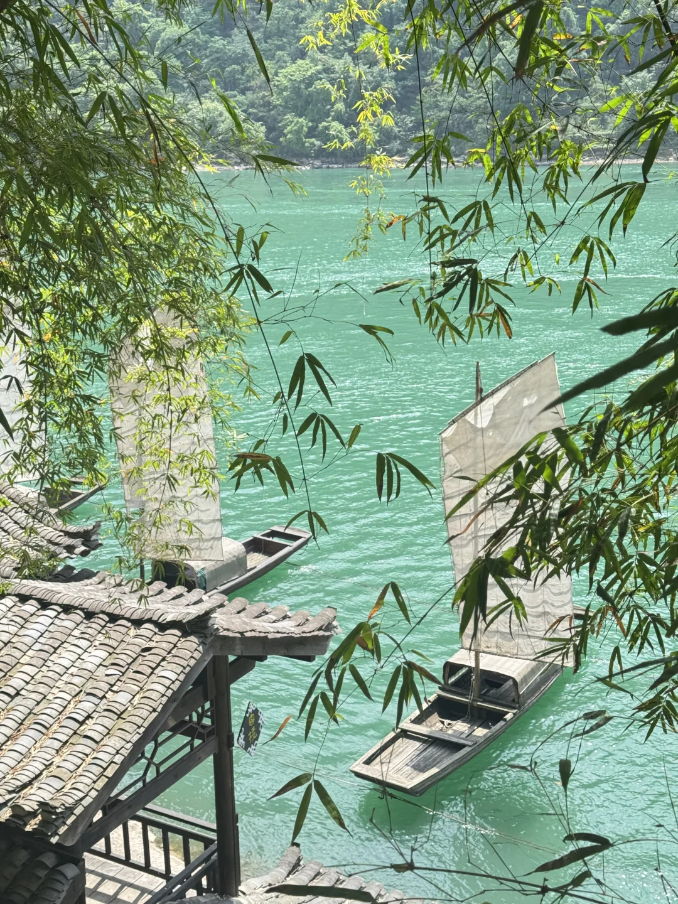
> [OCR] [?]
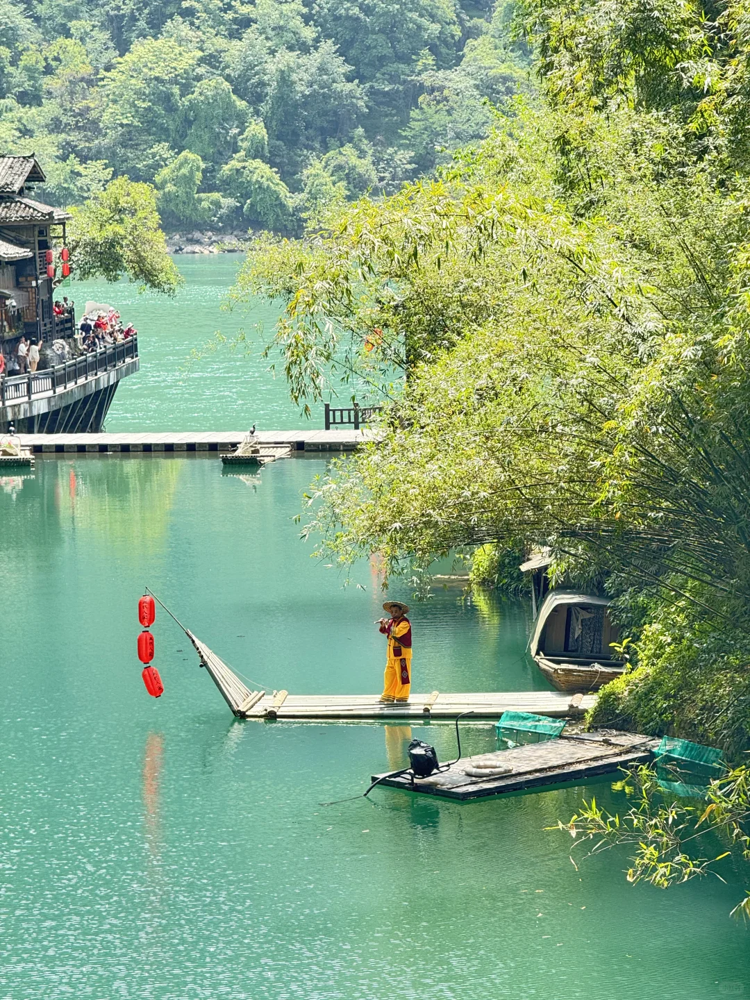
> [OCR] [?]
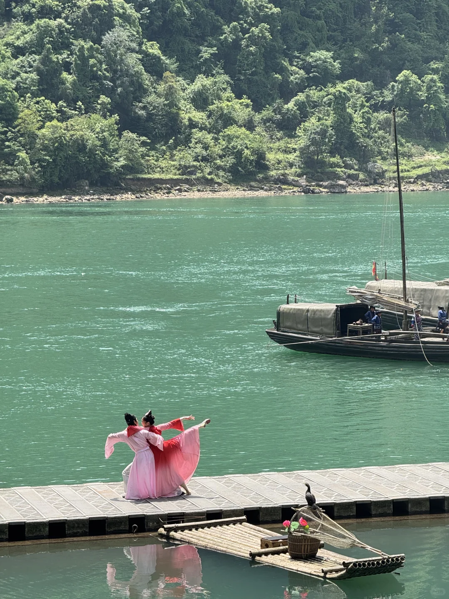
> [OCR] [?]
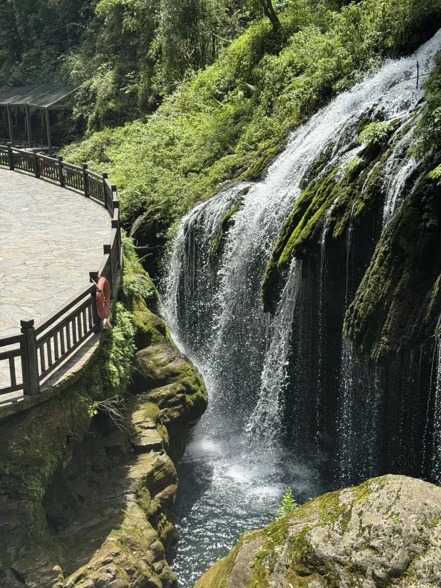
> [OCR] [?]
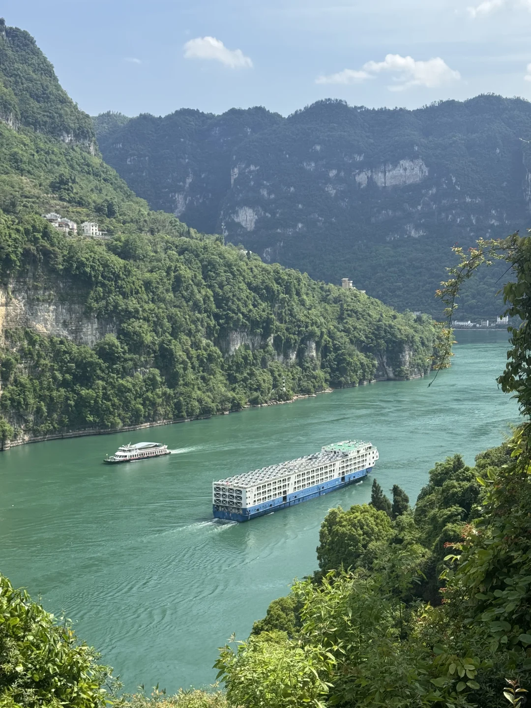
> [OCR] [?]
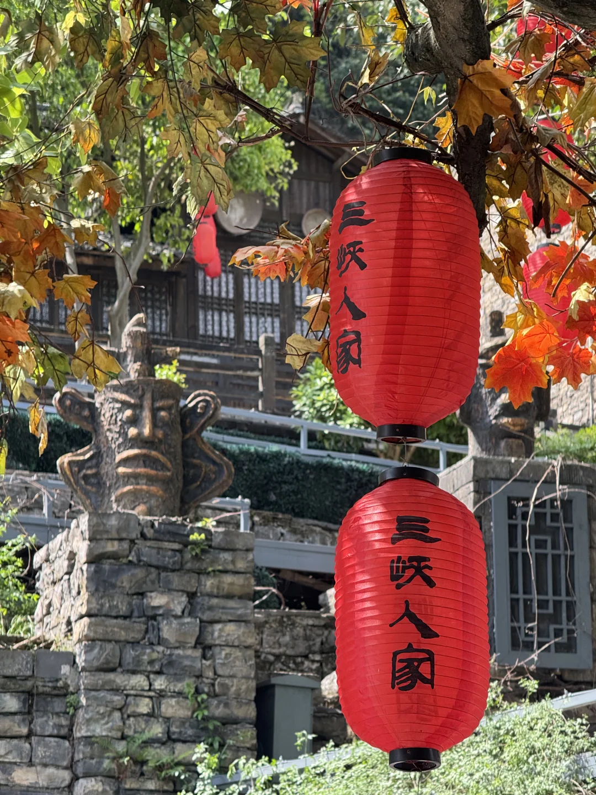
> [OCR] 三峽人家
三峽人家
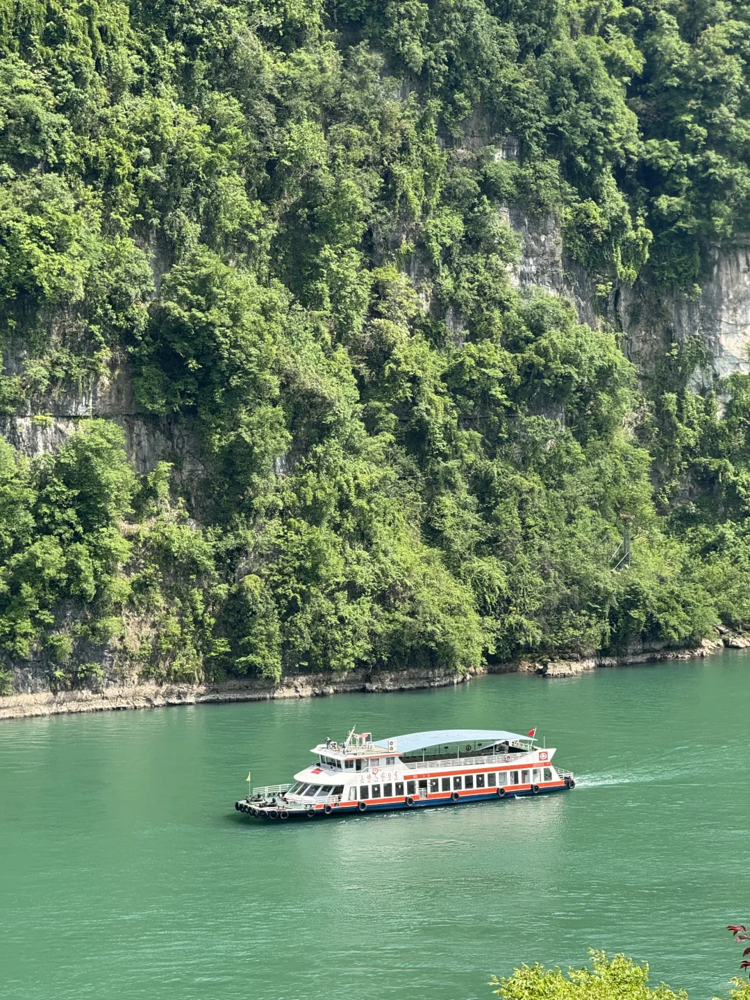
> [OCR] [?][?][?]
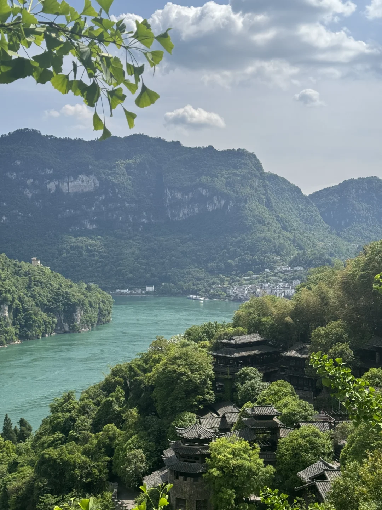
> [OCR] [?]
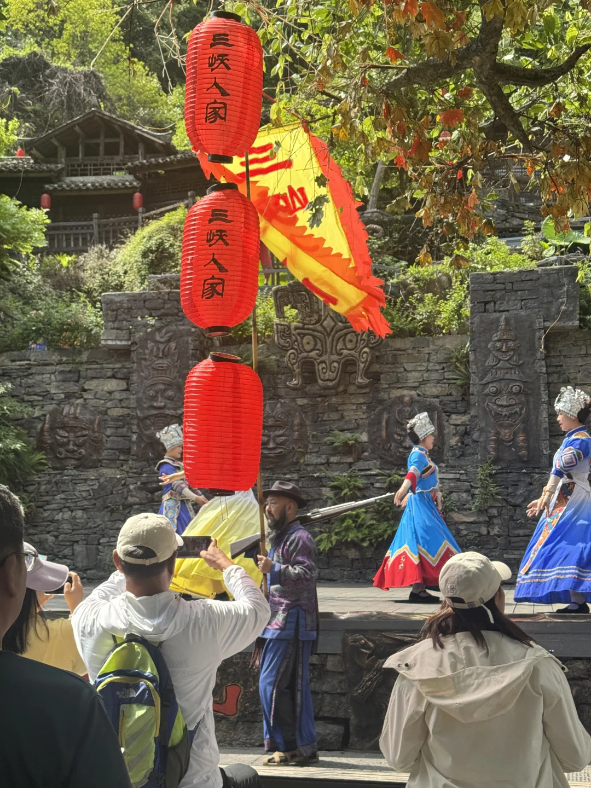
> [OCR] 三峽人家
三峽人家
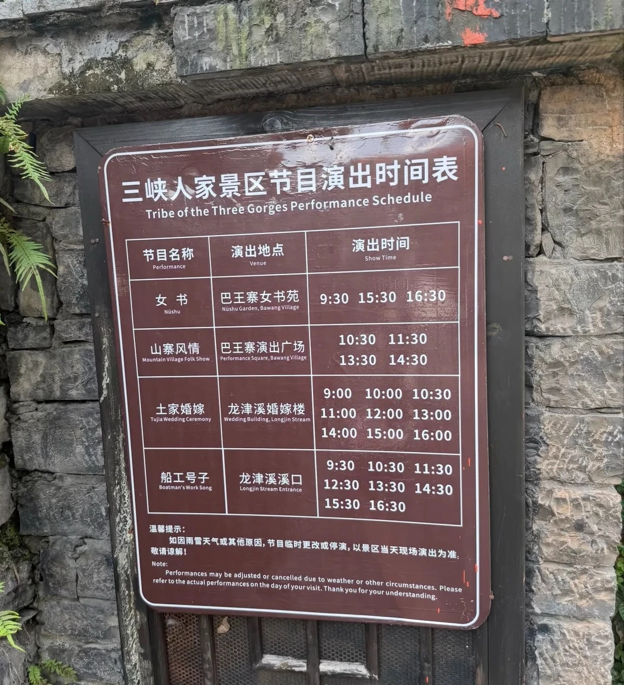
> [OCR] 三峡人家景区节目演出时间表
Tribe of the Three Gorges Performance Schedule

| 节目名称 | 演出地点 | 演出时间 |
| --- | --- | --- |
| Performance | Venue | Show Time |
| 女书 | 巴王寨女书苑 | 9:30 15:30 16:30 |
| Nushu | Nushu Garden, Bawang Village |
| 山寨风情 | 巴王寨演出广场 | 10:30 11:30 |
| Mountain Village Folk Show | Performance Square, Bawang Village | 13:30 14:30 |
| 土家婚嫁 | 龙津溪婚嫁楼 | 9:00 10:00 10:30 |
| Tujia Wedding Ceremony | Wedding Building, Longjin Stream | 11:00 12:00 13:00 |
| 船工号子 | 龙津溪溪口 | 9:30 10:30 11:30 |
| Boatman's Work Song | Longjin Stream Entrance | 12:30 13:30 14:30 |
|  |  | 15:30 16:30 |

温馨提示：
如因雨雪天气或其他原因，节目临时更改或停演，以景区当天现场演出为准。
敬请谅解！

Note:
Performances may be adjusted or cancelled due to weather or other circumstances. Please refer to the actual performances on the day of your visit. Thank you for your understanding.
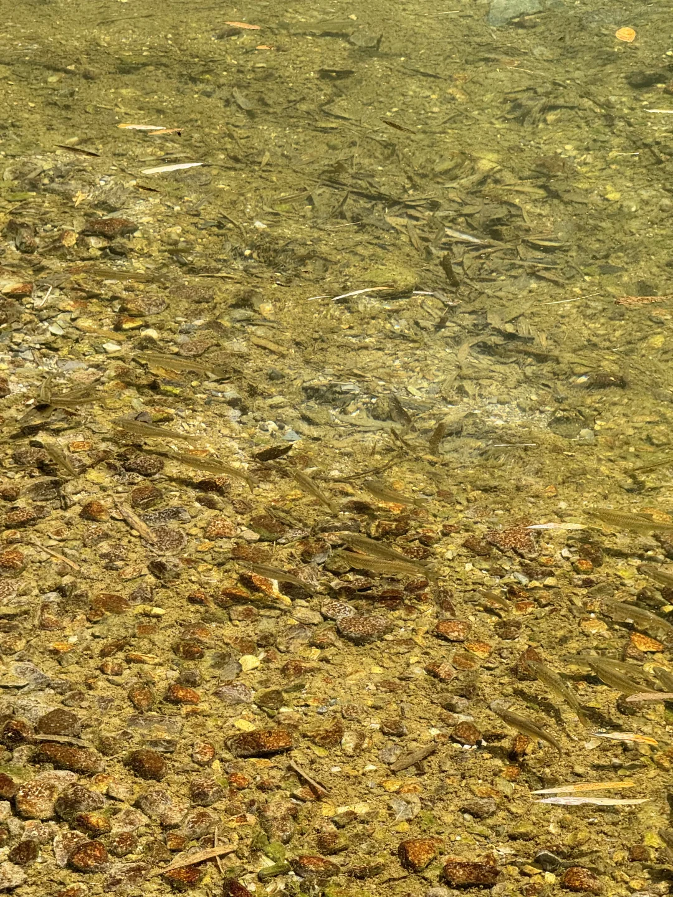
> [OCR] system

## 正文
到底是哪个天才找到图一这个角度啊！太好看了😭
	
因为做攻略看到车进车出路线山路十八弯，容易晕车，所以走的是船进船出🚢的路线。🐟上买的票便宜点，相当于跟团了，想单独活动的朋友们，可以签一个协议就可以自由活动了。我们是一大早在葛洲坝码头边集合，进去安检的地方有收费的行李存放柜，抵达三峡人家大概要一个钟～
	
三峡人家分为三个部分：洪荒时代（没去）、巴人部落、龙溪神韵（绝美必去[赞R]）
	
游玩路线（🈚️索道🈚️电梯）：三峡人家➡️龙津溪溪口➡️婚嫁楼➡️猴山➡️黄龙瀑➡️原路返回到龙津溪起点，坐船回到石牌码头或者灯影阁停靠点（半个钟一班）➡️巴王寨（⚠️一定要注意不要走错不要坐电梯）➡️太极猫洞➡️返回石牌码头返程
	
可以和旅游团错峰，先去龙津溪，这个时候龙津溪一般人会稍微少点，容易出片。图1️⃣就是去往龙津溪的路上拍的，疯狂拍照📷真的是美疯了，原图实拍。
	
抵达龙溪溪溪口有船工号子和其他表演（P3），婚嫁楼有婚嫁表演。龙津溪登上猴山一路上非常好看（P1-4），有很多小鱼（P11），小物钓爱好者DNA动了[偷笑R]一路会碰到非常多的演出人员，但是在猴山没有看到一只猴子🐒返程的路上看到了悬棺。
	
⚠️巴王寨上去不要坐电梯！不要坐电梯！不要坐电梯！就是景区来坑钱的，真就是几步路的事！不过我当时走错路了，走到徒步起点上去了，走了野坡岭、孤亭那条路，台阶高得很[哭惹R]爬得累死了，直接爬上巴王宫了，路上一个人都没。巴王寨的山寨风情表演（P9）也能看看吧，赶的14:30最后一场，看完刚好返程～下山的途中也有看到三峡的景色，有邮轮🚢经过也挺美的（P7-8）
	
🍝整个景区物价不会很高，还都算挺实惠的，可以在景区内解决午饭。
	
🎤不同表演有不同的时间安排，表演时间（P10）合理规划时间，最晚是15:30要返回码头到原来登上的船返程❗️
	
希望我的笔记对你有帮助，🦖暴龙一直在路上～
	
#三峡人家[话题]# #三峡[话题]# #三峡游轮[话题]# #夏日避暑好去处[话题]# #宜昌[话题]# #宜昌旅游[话题]# #宜昌约拍[话题]# #三峡旅游[话题]# #人在画中游[话题]# #舟行碧波上人在画中游[话题]#

---