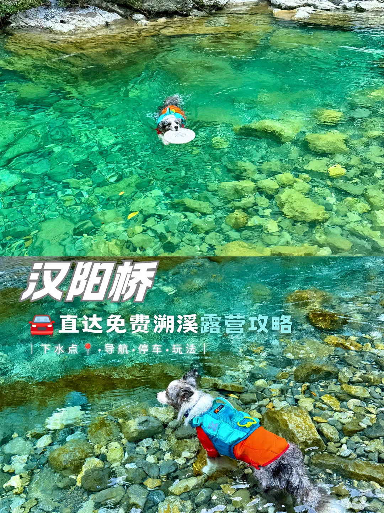

# 天啦噜❗️这宝石溪水也太绝了叭❗️

- 作者: 趣玩汪
- 👍158 · 💬17 · ⭐165 · 图 1
- feed_id: 6a4398b0000000001503e630

> [OCR] 汉阳桥
🚗直达免费溯溪露营攻略
| 下水点 ·导航·停车·玩法 |

## 正文
这是哪里呀，梦幻的宝石潭小溪❓
水清地好像🐶在陆地上，水底五彩石子清晰可见
深一点的水潭，又泛着淡淡的蓝绿色的宝石光
	
[一R]🧭导航：📍汉阳桥（宜昌五峰）
左拐走几十米，看到石拱桥就可以靠边停🅿️
	
[二R]玩耍重点📝
▪️汉阳桥🌉
✔️这可是清同治年修建，万里茶道的重要通路
✔️往前走是当年运送鄂西宜红茶的茶道
✔️小狗很喜欢石板路上丰富的气味
	
▪️柴埠溪💦
✔️沿着石桥台阶走几步，就到了溪边
✔️溪水很清很凉爽🧊
✔️水不是很深，湍急处🉑窝囊漂也很安全👌
✔️水深一点的水潭，就是宝石蓝绿色
	
[三R]宠物友好[心心眼R]
野位置，带狗随便耍
	
[四R]TIPS⚠️
这条水线超长，继续往前开，沿路都有下水点，暑假也不怕人多
	
[五R]强烈安利🌟🌟🌟🌟🌟
非常推荐夏天来宜昌五峰避暑玩水，这里的溪流是清江的上游支流，比一级水质清江还清透、还清凉~
	
#带狗出游[话题]# #湖北旅游[话题]# #自驾探索编辑部[话题]# #玩水[话题]# #溯溪[话题]# #暑假去哪儿[话题]# #适合暑假旅行的冷门城市[话题]# #避暑[话题]# #宜昌旅游[话题]# #户外玩水[话题]# @户外薯 @生活薯 @宠物薯 @城市情报官 @本地薯 @走走薯 @土拨薯 @薯队长

---