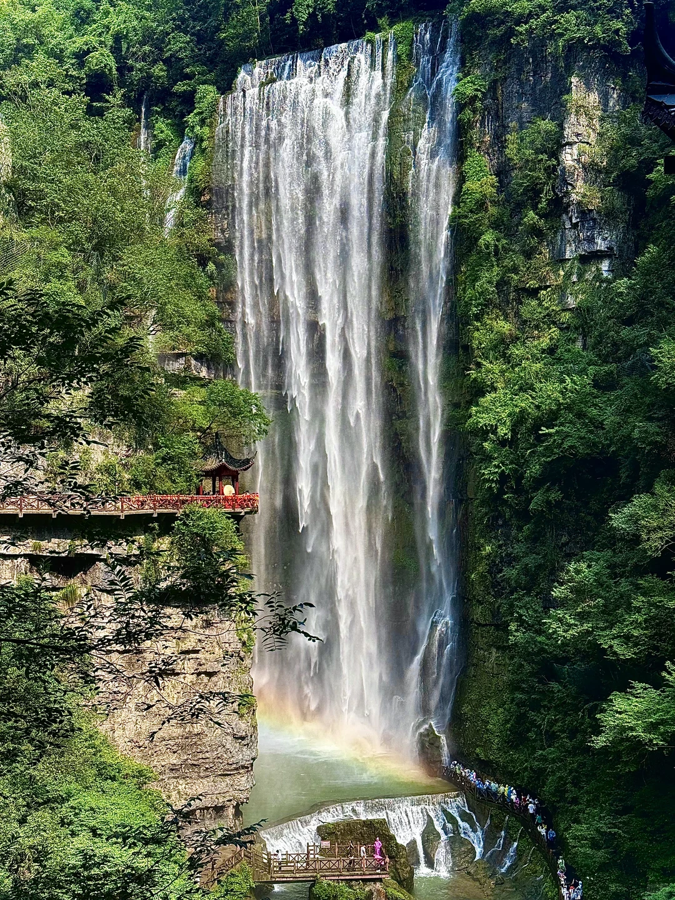
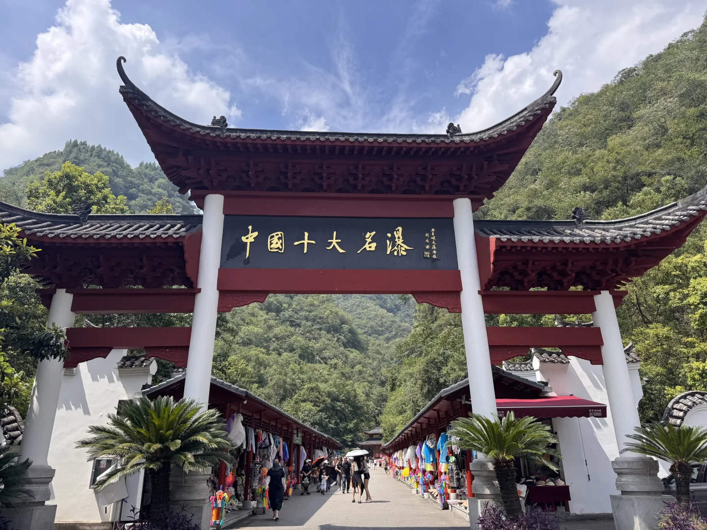
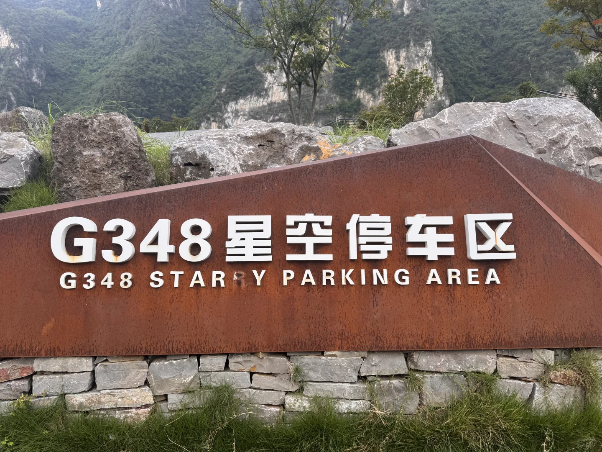
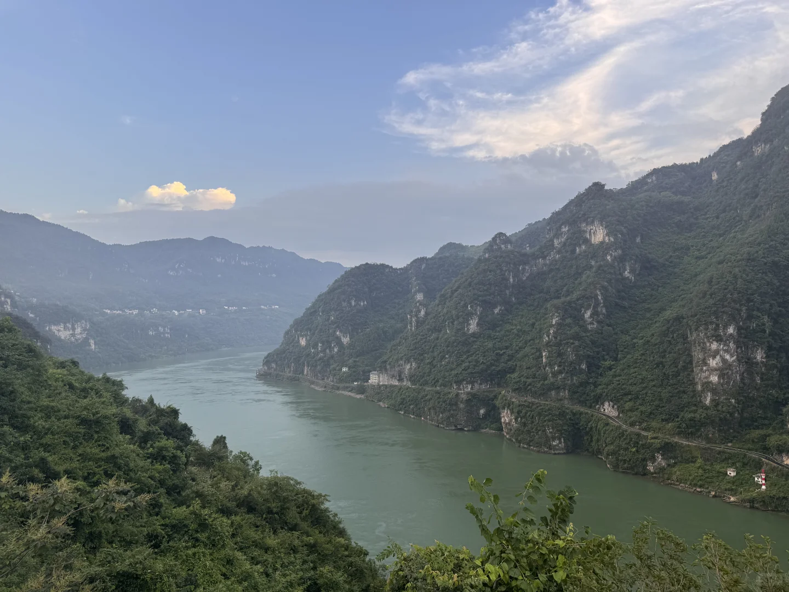
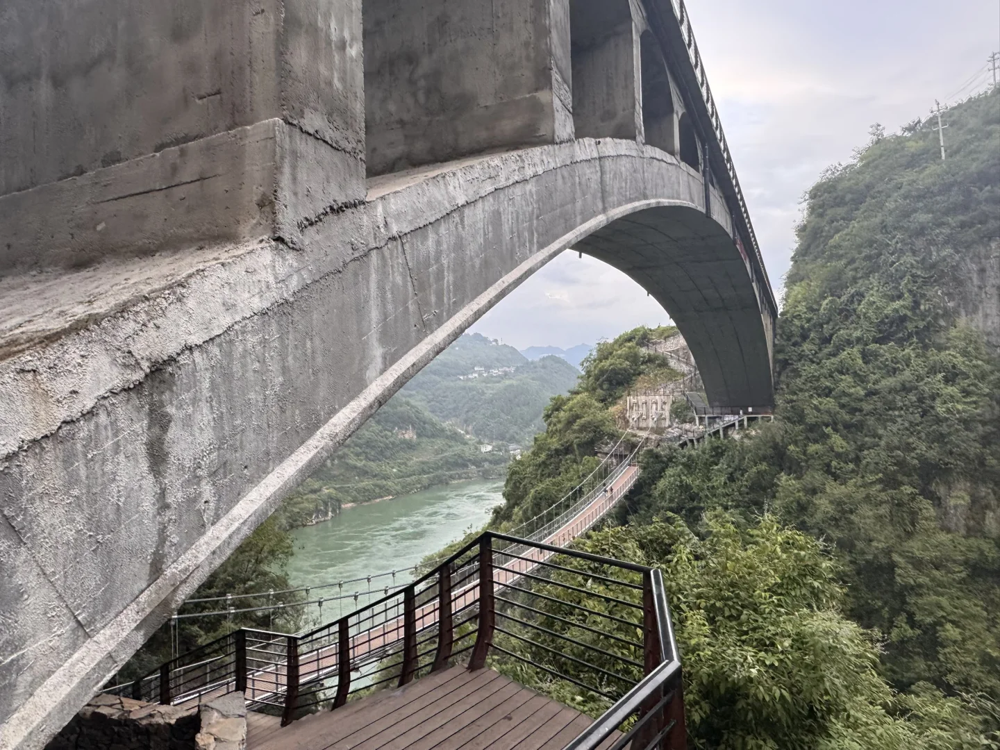
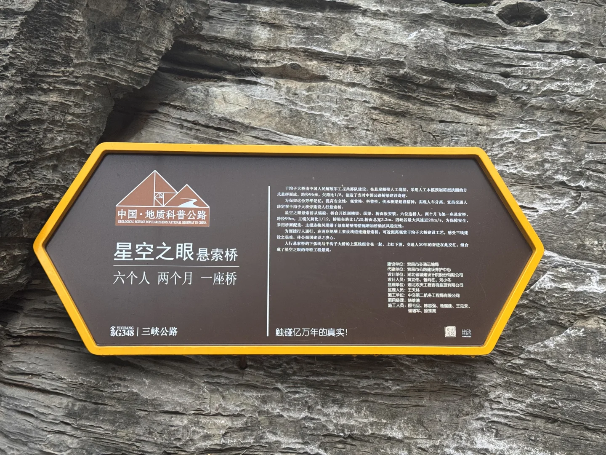
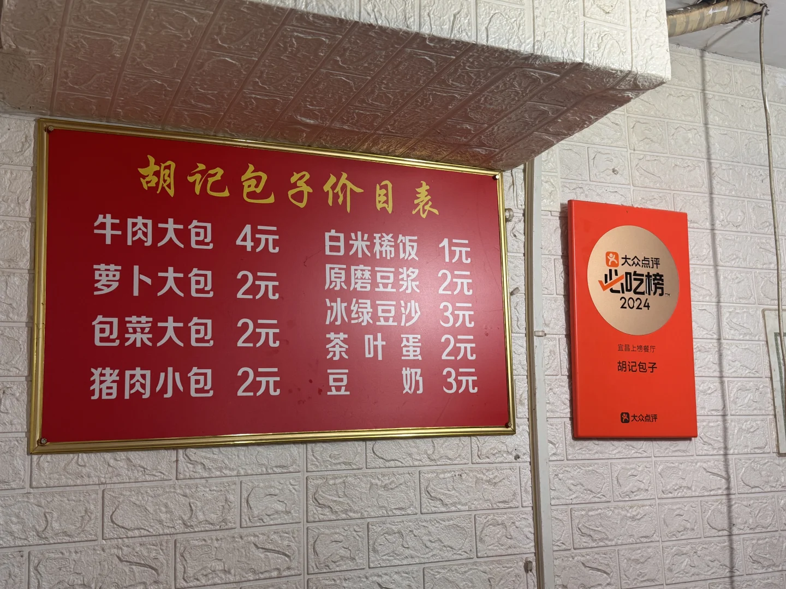
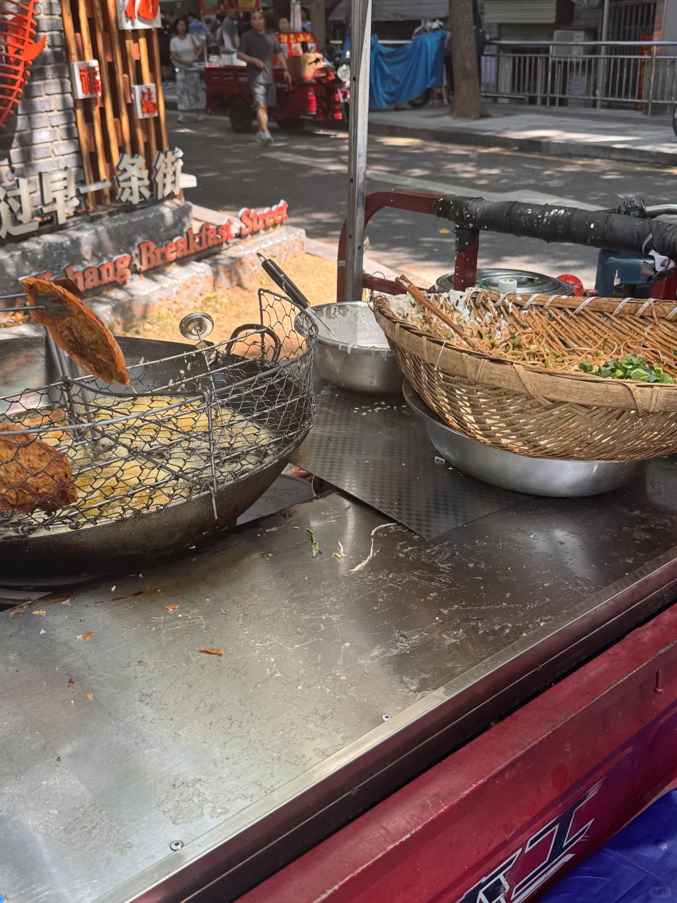
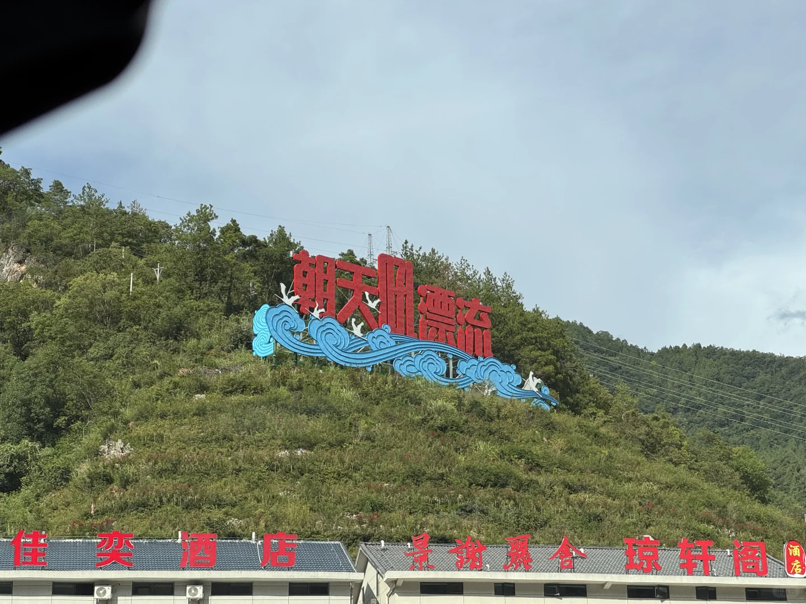

# 📍武汉→宜昌48小时逃离计划

- 作者: Alvtel
- 👍151 · 💬7 · ⭐188 · 图 12
- feed_id: 68ae6d03000000001d0378bc

> [OCR] [?]

> [OCR] 中国十大名瀑

> [OCR] G348星空停车区
G348 STAR Y PARKING AREA

> [OCR] [?]

> [OCR] [?]

> [OCR] 中国·地质科普公路
星空之眼悬索桥
六个人 两个月 一座桥
宜昌G348 | 三峡公路
触碰亿万年的真实！

> [OCR] [?]

> [OCR] 胡记包子价目表
牛肉大包 4元 白米稀饭 1元
萝卜大包 2元 原磨豆浆 2元
包菜大包 2元 冰绿豆沙 3元
猪肉小包 2元 茶叶蛋 2元
豆奶 3元

> [OCR] 牛肉大包

> [OCR] 干麻牛肉面

> [OCR] 福
过早一条街
Chang Breakfast Street

> [OCR] 朝天门漂流
佳奕酒店 景谢聚舍琼轩阁 酒店

## 正文
武汉→宜昌48小时逃离计划｜瀑布爽飞+G348网红公路9连拍+水悦城躺平，2天1夜人均不到800！
⚡️一句话总结
9点武汉出发→自带面包直奔三峡大瀑布→下午G348一口气刷爆9个机位→水悦城酒店200+→豆浆肥鱼吃到扶墙→第二天碳水早餐+朝天吼→漂完直接回武汉！不排队、不踩雷，收藏就能直接抄！
——— 01 / 时间轴 ———
D1｜武汉➜三峡大瀑布➜G348 9连拍➜水悦城酒店
D2｜水悦城碳水早餐➜朝天吼漂流➜武汉
——— 02 / 详细行程 ———
🕘 Day1  瀑布+G348
09:00  武汉市区出发
🚗 导航「三峡大瀑布景区 3 号停车场」
13:00-16:00  三峡大瀑布
💦 穿瀑+景观电梯，天气好可以双彩虹
🚗瀑布结束就是最美公路了
📸 导航途经点顺序：三游洞→听风谷→山外山→明月台→西陵 0.618服务区→干沟子大桥→莲沱畔大桥
🏨 返回市区后入住酒店：宜昌水悦城酒店，提前抢房200+，地下停车免费
🐟 晚餐：水悦城5楼「豆浆肥鱼」
🕖 Day2  碳水早餐+上午开漂
10:30  酒店打车碳水三连
🥟 胡记包子（俩人买了 6 个牛肉大包），路边萝卜饺子尝鲜
🍜 方妈面馆干麻牛肉面
12:00 酒店退房后直奔朝天吼漂流
🚗 沪蓉高速→高岚出口 110 km 1.5h
17:00  返程武汉
🛣️ 高岚→沪蓉→武荆 390 km 4h
——— 03 / 费用参考 ———
高速费  往返≈¥300
油费   来回约700km，约 400
门票   三峡大瀑布115（惠民卡免费）  朝天吼180
住宿   水悦城酒店200+
——— 04 / 必带清单 ———
✅ 身份证、驾驶证
✅ 防水手机袋、3 套换洗衣物、防晒SPF50+
✅ 一次性雨衣（景区5元/件）
✅ 充电宝（拍照+导航耗电快）
——— 05 / 避坑Tips ———
1.  G348观景台限时停车15分钟，节假日早点去！
2.  莲沱畔继续往前5km需办通行证，直接原路返回！
3.  朝天吼上午场10:00最后放行，提前1天网上锁票！
4.  水悦城酒店提前抢房，周末会涨到400+！
#宜昌自驾[话题]# #武汉周边游[话题]# #G348最美公路[话题]# #朝天吼漂流[话题]# #三峡大瀑布[话题]# #水悦城酒店[话题]#

---