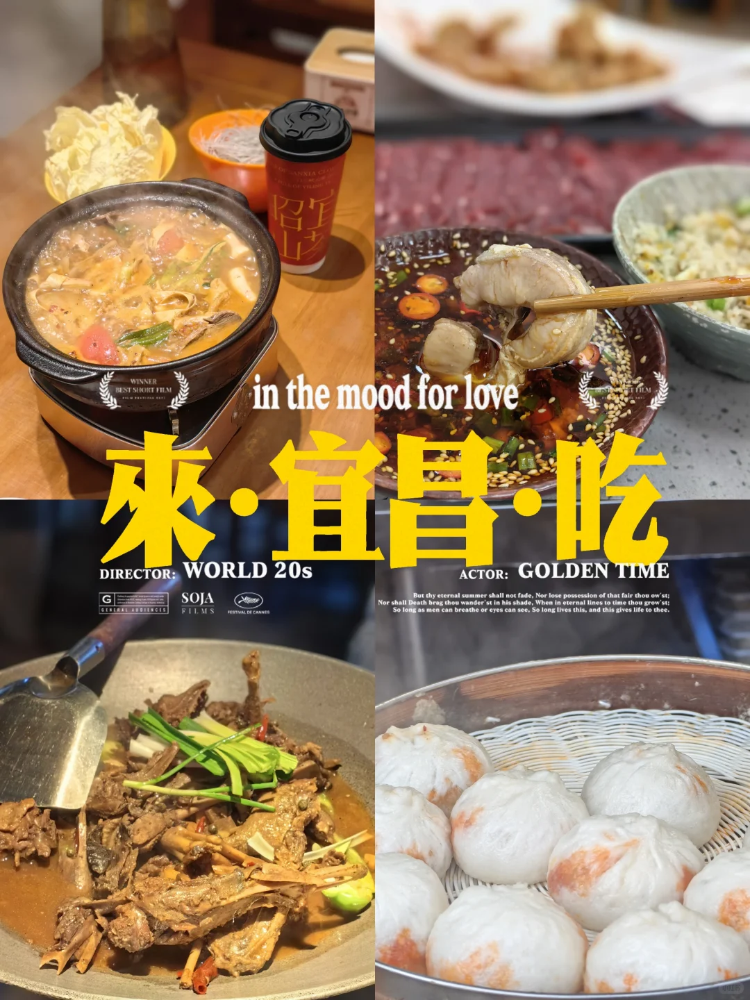
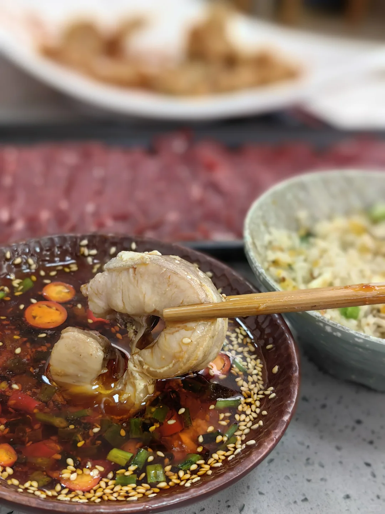
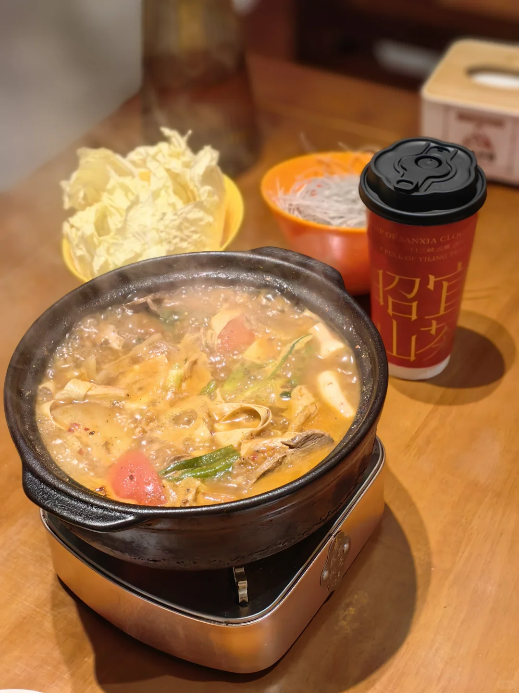
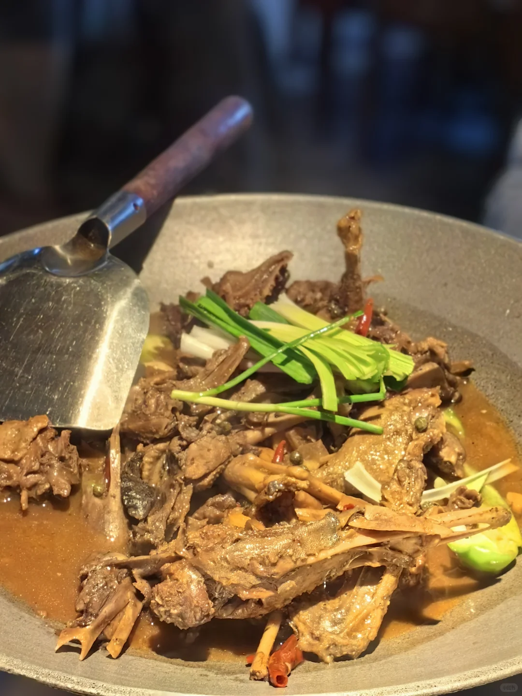
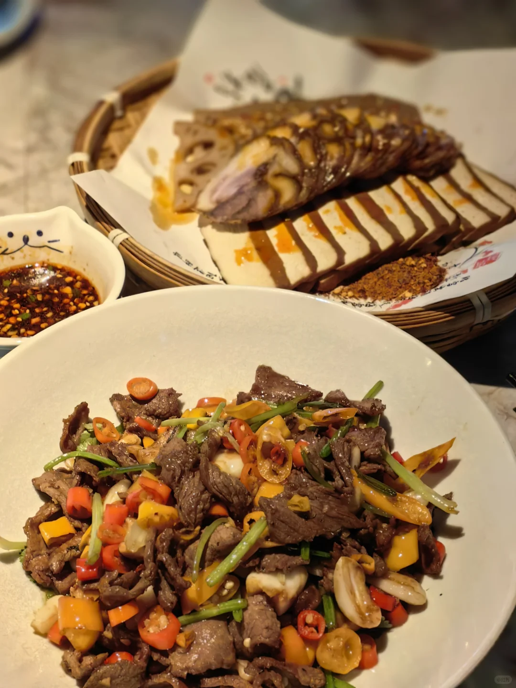
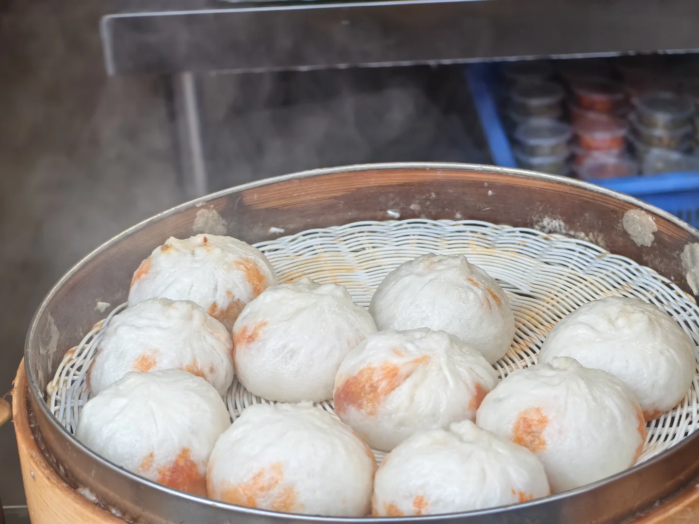
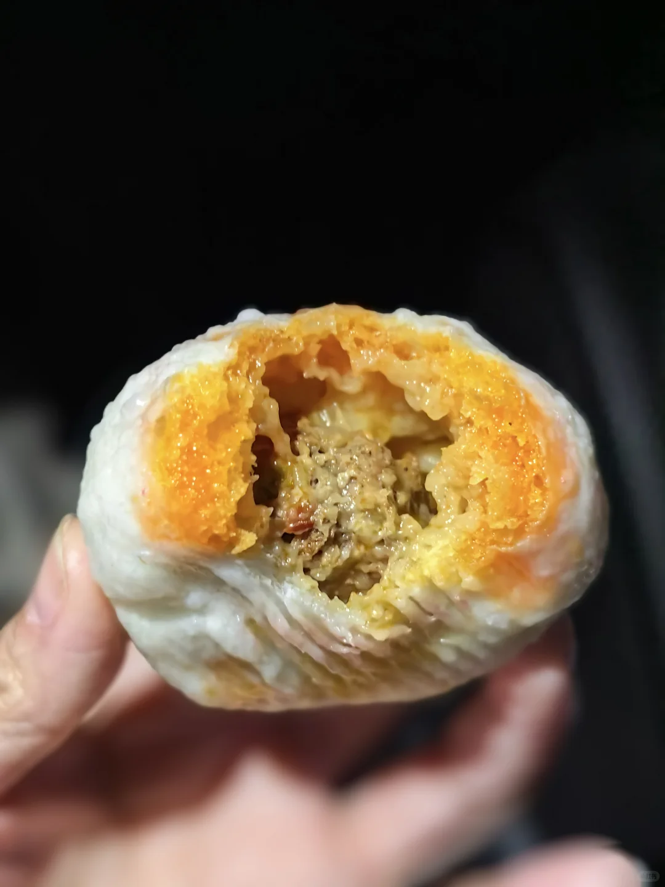
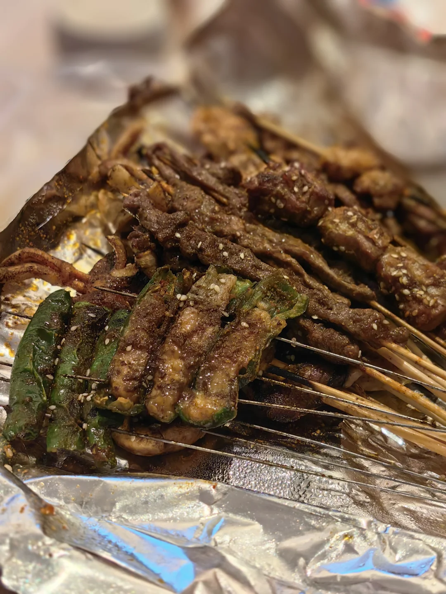
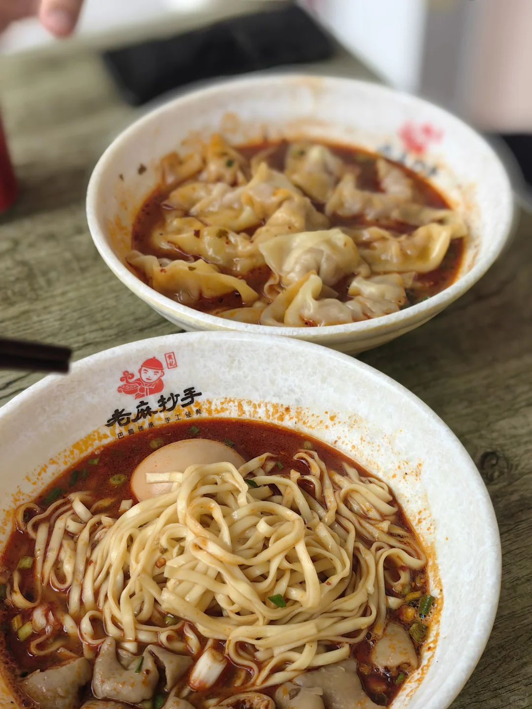
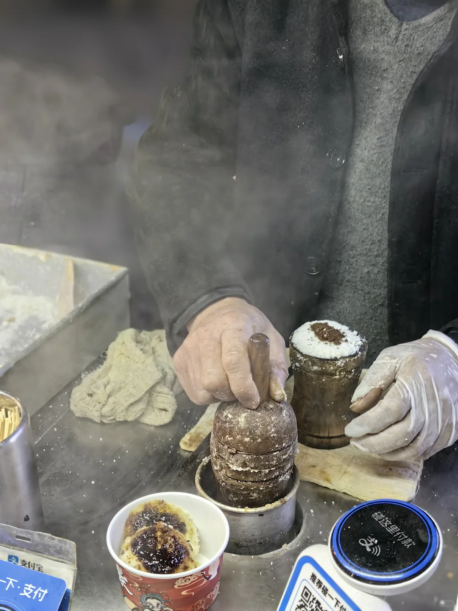

# 来宜昌一定要一次吃够啊！

- 作者: 大号文77
- 👍148 · 💬1 · ⭐135 · 图 10
- feed_id: 69e5f7af000000001f007894

> [OCR] WINNER BEST SHORT FILM
昭宝山
in the mood for love
來·宜昌·吃
DIRECTOR: WORLD 20s
ACTOR: GOLDEN TIME
G
GENERAL AUDIENCES
SOJA
FILMS
Festival de Cannes
But thy eternal summer shall not fade. Nor lose possession of that fair thou ow'st;
Nor shall Death brag thou wander'st in his shade; When in eternal lines to time thou grow'st;
So long as men can breathe or eyes can see, So long lives this, and gives life to thee.

> [OCR] [?]

> [OCR] IP OF SANXIA CLOUD
?[?
?

> [OCR] [?]

> [OCR] 小红书

> [OCR] [?]

> [OCR] system

> [OCR] 老麻抄手
巴蜀传承 手工经典

> [OCR] 支付宝
支付
这里付款
推荐碰一下·支付

## 正文
[一R]憨哥鱼庄·肥鱼火锅
[猪头R]属于是火锅🥘＋鱼的选择，来了宜昌当然是选择肥鱼啦[赞R]原本我以为宜昌肥鱼是一道菜，原来就是鱼，各家有各家的做法。这家在我看来就更偏原味一点，直接煮。火锅和重庆的比没有那么辣，我觉得比较好接受[害羞R]
	
[二R]欢奇砂锅
[猪头R]就在步行街上，厨师就在餐桌后面大火爆炒，锅气十足[赞R]套餐很划算。店旁边就是#昭宜山茶，招牌就很好喝
	
[三R]自己人·宜昌菜
[猪头R]有个招牌叫【煮熟的鸭子】值得一点[点赞R]他们家的各种小炒肉也好吃，我认为是几乎盲点都不会出错的店，而且！分量超大！都好下饭，根本吃不完[笑哭R]
	
[四R]胡记包子
[猪头R]红油包子就是牛肉馅的！麻麻辣辣口味，好像在吃重庆火锅包子。唯一要注意的，就是不要一次性吃多了
	
[五R]满湘烧烤
[猪头R]在憨哥鱼庄边上，鱿鱼居然只要6块！和江苏吃到的烧烤不一样，口味鲜辣很特别，夜宵点回来追剧吃，太满足了。(好奇点了烤皮蛋，吃不惯[捂脸R]）
	
[六R]路边随便找的重庆面馆(因为马上要去重庆啦）
[猪头R]应该是根据宜昌口味改良过的，用的面是扁扁的面条🍜
#宜昌[话题]# #宜昌美食[话题]# #宜昌旅游[话题]# #宜昌吃什么[话题]# #肥鱼[话题]#

---